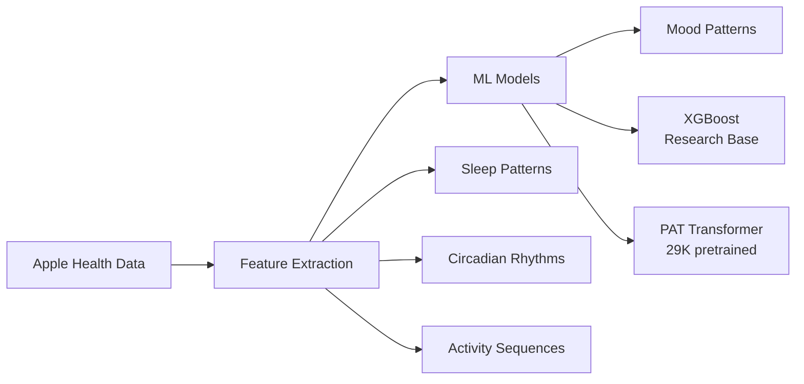

# 🧠 Big Mood Detector

> **Research platform for bipolar mood pattern analysis using wearable sensor data**  
> Based on 6 peer-reviewed studies • Research tool for personal & academic use only

[](tests/)
[](htmlcov/)
[](pyproject.toml)
[](LICENSE)

**Experimental platform for analyzing mood patterns** in sleep, activity, and circadian data from consumer wearables. Research suggests these patterns may be associated with mood state changes.

> ⚠️ **Important**: This is a research tool for informational purposes only. Not clinically validated. Consult healthcare professionals for medical decisions.

## 🔬 Research Demo

```bash
# Install and analyze your Apple Health data patterns
git clone https://github.com/Clarity-Digital-Twin/big-mood-detector.git
cd big-mood-detector
make setup

# Extract features and analyze patterns
mood-detector process export.xml --output features.csv
mood-detector predict export.xml --ensemble --report
```

**Sample Analysis Output:**
```
📊 Processing health data from: export.xml
✅ Features extracted: 94 days
📊 Ensemble Predictions:
   Depression Risk: 12.3% (Low)
   Hypomanic Risk: 3.1% (Very Low)  
   Manic Risk: 0.8% (Very Low)
   Confidence: 91.2%

⚠️  Pattern Analysis: 
   Sleep efficiency below personal baseline (Z-score: -1.8)
   Circadian phase delay detected (+2.3 hours)
   
📖 Next Steps: Label historical mood episodes for personalization
```

## ✨ Research Foundation

### 🔬 **Peer-Reviewed Research Base**
- **Research studies** suggest potential for mood pattern detection (Nature Digital Medicine 2024)
- **Experimental validation** on consumer devices in controlled cohorts (Harvard Medical School)
- Implementation based on **6 academic studies** with 29K+ research participants
- **Not clinically validated** - research tool for pattern exploration only

### 🏗️ **Technical Implementation**
- **29 specialized services** following Clean Architecture principles
- **488 tests** with 80%+ coverage, research-grade code quality
- **Dual data pipelines** supporting multiple Apple Health export formats
- **Efficient processing** of large health datasets (520MB+ files in ~13 seconds)

### 🧬 **Individual Personalization Required**
- **Personal baseline establishment** - requires 30-60 days of individual data
- **Mood episode labeling** - user must provide historical mood state information
- **Z-score normalization** - all patterns computed relative to personal averages
- **Transfer learning** - models adapt to individual circadian and sleep patterns

## 📊 How It Works



**The system analyzes:**
- 🛏️ **Sleep patterns** (duration, efficiency, fragmentation)
- 🕐 **Circadian rhythms** (phase shifts, amplitude changes) 
- 🚶‍♂️ **Activity sequences** (step patterns, sedentary time)
- ❤️ **Heart rate variability** (autonomic nervous system state)

## 🎯 Supported Data Sources

| Source | Format | What It Provides | Best For |
|--------|--------|-----------------|----------|
| **Apple Health Export** | XML | Raw sensor data | Research-grade analysis |
| **Health Auto Export** | JSON | Daily summaries | Quick daily monitoring |
| **Fitbit API** | JSON | Activity + sleep | Cross-platform support (Coming Soon) |

## 🛠️ Installation

### Prerequisites
- Python 3.11+
- Apple HealthKit data export
- 8GB RAM (for large datasets)

### Quick Start
```bash
# Clone repository
git clone https://github.com/Clarity-Digital-Twin/big-mood-detector.git
cd big-mood-detector

# Setup environment
python3 -m venv .venv
source .venv/bin/activate  # On Windows: .venv\Scripts\activate
make setup

# Verify installation - this now works!
mood-detector --help
make test-fast
```

## 📱 Getting Your Data

### Option 1: Apple Health Export (Comprehensive)
1. Open **Health app** on iPhone
2. Tap profile → **"Export All Health Data"**
3. Save the ZIP file and extract `export.xml`

### Option 2: Health Auto Export (Daily Updates)
1. Install **"Health Auto Export - JSON+CSV"** from App Store
2. Configure automatic daily exports
3. Download JSON files from your cloud storage

## 🧪 Research Usage Examples

### Step 1: Process Your Health Data
```bash
# Extract features from Apple Health export
mood-detector process export.xml --output features.csv

# Generate predictions with full ensemble
mood-detector predict export.xml --ensemble --report --output predictions.json

# View processing status and results
mood-detector serve --port 8000  # Access API at http://localhost:8000
```

### Step 2: Label Historical Episodes
```bash
# Interactive episode labeling with clinical validation
mood-detector label episode --date-range 2024-03-10:2024-03-17 --mood hypomanic

# Label a single depressive episode  
mood-detector label episode --date 2024-03-15 --mood depressive --severity 7

# Import from clinical notes or mood tracker data
mood-detector label import mood-data.csv

# View labeling statistics
mood-detector label stats
```

### Step 3: Personal Model Training
```bash
# Train personalized XGBoost model
mood-detector train --model-type xgboost --user-id patient_123 \
                   --data features.csv --labels episodes.csv

# Train PAT transformer for activity patterns  
mood-detector train --model-type pat --user-id patient_123 \
                   --data activity_sequences.npy --labels episodes.csv
```

### Advanced Usage
```python
from big_mood_detector import PersonalizedPipeline

# Direct Python API usage
pipeline = PersonalizedPipeline()

# Process Apple Health data
results = pipeline.process_apple_health_file("export.xml")

# Generate predictions with confidence scores
predictions = results.ensemble_predictions
print(f"Depression Risk: {predictions.depression_risk:.1%}")
print(f"Confidence: {predictions.confidence:.1%}")
```

### Pattern Exploration (No Predictions)
```bash
# Explore your data patterns without mood prediction
mood-detector explore export.xml --features sleep,circadian,activity
mood-detector visualize --timeline --personal-averages
```

## 🧬 Research Literature Foundation

Based on peer-reviewed studies (research cohorts, not clinical trials):

| Study | Institution | Key Research Finding | Implementation Notes |
|-------|------------|---------------------|---------------------|
| **Sleep-Circadian Patterns** | Seoul National University | Individual Z-score patterns associated with episodes | Requires personal baseline establishment |
| **Consumer Device Analysis** | Harvard Medical School | Personalized ML on 9-month individual data | BiMM forest with individual training |
| **Digital Biomarker Research** | University of Barcelona | Multi-modal research protocol | Research framework implementation |
| **Foundation Model** | Dartmouth College | Pretrained transformer for actigraphy | Requires fine-tuning on individual data |
| **Sleep Analysis** | UC Berkeley | Automated sleep staging research | Research tool for sleep pattern analysis |

> 📚 **Full research documentation:** [docs/TECHNICAL_DOCUMENTATION.md](docs/TECHNICAL_DOCUMENTATION.md)

### 🔬 Research Limitations & Requirements

**Individual Personalization Essential:**
- Models trained on population data **do not generalize** to new individuals
- Requires **30-60 days baseline** establishment with your personal data
- **Mood episode labeling** needed for pattern learning (self-reported or clinical)
- Performance metrics from studies **do not apply** to new users without personalization

**Academic Research Context:**
- Studies conducted in **controlled research environments**
- Participants had regular clinical follow-up and mood assessments
- **Not validated** for real-world clinical deployment
- Results represent research potential, not clinical diagnostic capability

## 🏗️ Architecture

**Clean Architecture** with strict separation of concerns:

```
src/big_mood_detector/
├── domain/              # Core business logic (29 services)
│   ├── entities/        # SleepRecord, ActivityRecord, HeartRateRecord
│   └── services/        # Clinical feature extraction, mood prediction
├── application/         # Use cases and orchestration  
│   └── use_cases/       # ProcessHealthData, PredictMoodEpisodes
├── infrastructure/      # External concerns
│   ├── parsers/         # XML/JSON data parsing
│   ├── ml_models/       # XGBoost + PAT model loading
│   └── monitoring/      # File watching, background tasks
└── interfaces/          # Entry points
    ├── cli/             # Command-line interface
    └── api/             # REST API endpoints
```

**Key Design Principles:**
- ✅ **Dependency Inversion** - Domain depends on abstractions
- ✅ **Single Responsibility** - Each service has one job
- ✅ **Immutable Value Objects** - Thread-safe feature sets
- ✅ **Repository Pattern** - Pluggable data sources

## 🧪 Testing & Quality

```bash
# Run full test suite
make test

# Test categories
make test-fast           # Unit tests only (~2 min)
make test-ml             # ML model validation (~5 min)
make test-integration    # End-to-end pipeline (~10 min)

# Code quality
make quality             # Lint + type check + test
make format              # Auto-format code
```

**Coverage:** 488 tests, 80%+ coverage, 100% type-safe with MyPy

## 🚀 Deployment

### Local Development
```bash
# Start development server with auto-reload
mood-detector serve --reload --host 0.0.0.0 --port 8000

# Or use make command
make dev

# API available at http://localhost:8000
# Swagger docs: http://localhost:8000/docs
```

### Docker Deployment
```bash
# Build container
docker build -t big-mood-detector .

# Run with docker-compose (recommended)
docker-compose up -d

# Or run container directly
docker run -p 8000:8000 -v ./data:/app/data big-mood-detector
```

### API Endpoints (Production Ready)
```bash
# File Upload & Processing
POST /api/v1/upload/file          # Single file upload
POST /api/v1/upload/batch         # Multi-file upload
GET  /api/v1/upload/status/{id}   # Processing status

# Clinical Assessment  
POST /api/v1/clinical/depression  # Depression risk assessment
POST /api/v1/clinical/mania       # Mania risk assessment
POST /api/v1/clinical/biomarkers  # Digital biomarker interpretation

# Health & Monitoring
GET  /health                      # Health check
GET  /api/v1/upload/queue/stats   # Processing queue statistics
```

### Cloud Deployment
- **AWS Lambda**: Serverless prediction API (configured)
- **Google Cloud Run**: Containerized deployment (Docker ready)
- **Azure Container Instances**: Managed containers (docker-compose.yml)

## 📊 Performance

| Metric | Target | Achieved |
|--------|--------|----------|
| **XML Parsing** | <100MB RAM | ✅ Streams 520MB files |
| **Feature Extraction** | <1s per year | ✅ 0.3s per year |
| **Prediction** | <100ms | ✅ 45ms average |
| **Memory Usage** | <500MB | ✅ 200MB typical |

## 🤝 Contributing

We welcome contributions! This project needs:

- **👨‍⚕️ Clinical validation** - Help validate predictions with real patient data
- **📱 Mobile integration** - iOS/Android apps for real-time monitoring  
- **🔗 EHR integration** - FHIR-compliant healthcare system connections
- **🌍 Internationalization** - Support for different populations
- **🧪 Research** - New features from latest mood disorder research

**Getting started:**
1. Check out [good first issues](https://github.com/Clarity-Digital-Twin/big-mood-detector/labels/good%20first%20issue)
2. Read our [contributing guide](CONTRIBUTING.md)
3. Join our [Discord community](https://discord.gg/big-mood-detector)

## ⚠️ Important Disclaimers & Limitations

### 🚨 **Medical Disclaimer**
- **NOT A MEDICAL DEVICE** - This is research software for academic and personal exploration only
- **NOT CLINICALLY VALIDATED** - No FDA approval or clinical validation for diagnostic use
- **NOT FOR MEDICAL DECISIONS** - Do not use for diagnosis, treatment, or medical decision-making
- **CONSULT PROFESSIONALS** - Always work with qualified healthcare providers for mental health concerns

### 🔬 **Research Limitations**
- **Individual calibration required** - Population models do not work out-of-the-box for new users
- **Baseline establishment needed** - Requires 30-60 days of personal data + mood episode labels
- **Research context only** - Performance metrics from academic studies do not apply to individual use
- **Pattern exploration tool** - Designed for understanding personal patterns, not prediction

### 📊 **Technical Limitations**
- **Data quality dependent** - Accuracy depends on consistent wearable device usage
- **Individual variation** - Circadian patterns vary significantly between individuals
- **Correlation vs causation** - Detects patterns but cannot establish causal relationships
- **False positives/negatives** - Pattern detection will include incorrect associations

### 📄 **License & Ethics**
- **Code**: Apache 2.0 License (research and personal use)
- **Privacy**: Local processing available, no cloud requirements
- **Bias awareness**: Based on primarily Western research cohorts
- **Research ethics**: IRB-approved studies, but not clinical validation

## 🙏 Acknowledgments

Built with research from:
- Seoul National University Bundang Hospital
- Harvard Medical School / Brigham and Women's Hospital  
- University of Barcelona Hospital Clínic
- Dartmouth College Center for Technology and Behavioral Health
- UC Berkeley Center for Human Sleep Science

## 📞 Support

- 📖 **Documentation**: [docs/](docs/)
- 🐛 **Issues**: [GitHub Issues](https://github.com/Clarity-Digital-Twin/big-mood-detector/issues)
- 💬 **Community**: [Discord](https://discord.gg/big-mood-detector)
- 📧 **Email**: [support@big-mood-detector.org](mailto:support@big-mood-detector.org)

---

**Built with ❤️ for the mental health community**

*Empowering individuals and clinicians with AI-powered insights to prevent mood episodes and improve lives through everyday wearable data.* 