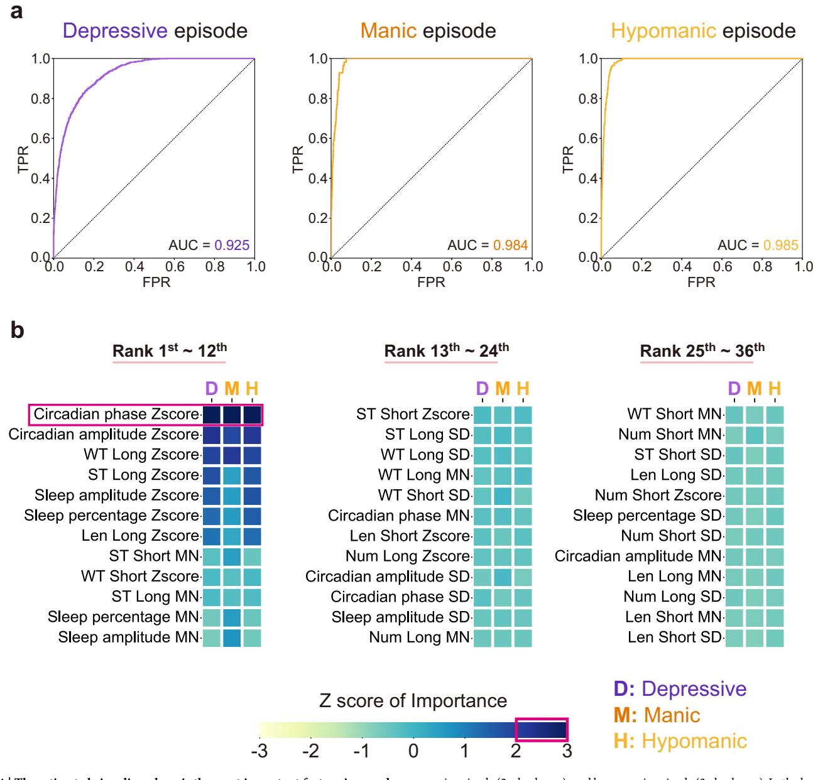

Published in partnership with Seoul National University Bundang Hospital

https://doi.org/10.1038/s41746-024-01333-z

# Accurately predicting mood episodes in mood disorder patients using wearable sleep and circadian rhythm featur[es](http://crossmark.crossref.org/dialog/?doi=10.1038/s41746-024-01333-z&domain=pdf)

[Check for updates](http://crossmark.crossref.org/dialog/?doi=10.1038/s41746-024-01333-z&domain=pdf)

Dongju Lim1,2,7, Jaegwon Jeong3,4,7, Yun Min Song1,2, Chul-Hyun Ch[o](http://orcid.org/0000-0002-1663-9680) [3](http://orcid.org/0000-0002-1663-9680),4, Ji Won Yeom3,4, Taek Lee5 , Jung-Been Lee5 , Heon-Jeong Lee [3](http://orcid.org/0000-0002-9560-2383),4 & Jae Kyoung Ki[m](http://orcid.org/0000-0001-7842-2172) [1](http://orcid.org/0000-0001-7842-2172),2,6

Wearable devices enable passive collection of sleep, heart rate, and step-count data, offering potential for mood episode prediction in mood disorder patients. However, current models often require various data types, limiting real-world application. Here, we develop models that predict future episodes using only sleep-wake data, easily gathered through smartphones and wearables when trained on an individual's sleep-wake history and past mood episodes. Using mathematical modeling to longitudinal data from 168 patients (587 days average clinical follow-up, 267 days wearable data), we derived 36 sleep and circadian rhythm features. These features enabled accurate next-day predictions for depressive, manic, and hypomanic episodes (AUCs: 0.80, 0.98, 0.95). Notably, daily circadian phase shifts were the most significant predictors: delays linked to depressive episodes, advances to manic episodes. This prospective observational cohort study (ClinicalTrials.gov: NCT03088657, 2017-3-23) shows sleep-wake data, combined with prior mood episode history, can effectively predict mood episodes, enhancing mood disorder management.

Disruptions in sleep and activity patterns have been observed in individuals diagnosed with mood disorders, including major depressive disorder (MDD[\)1,2](#page-10-0) and bipolar disorder (BD[\)3](#page-10-0)–[5](#page-10-0) . To gain a deeper understanding of these mood-related patterns, sensors in smartphones and wearable devices, such as accelerometers, Global Positioning System sensors (GPS), and light sensors[6](#page-10-0)–[9](#page-10-0) , have been employed to noninvasively and passively collect data within individuals' real-life environments. This approach allows for longterm, objective assessment of a patient's physiological and behavioral status, providing a valuable complement to conventional psychiatric assessments that rely on subjective patient recall through clinical scales or interviews[10,11.](#page-10-0)

Numerous studies have leveraged these data from smartphones and wearable devices to classify individuals with and without depression using machine learning models, which are particularly adept at handling large datasets[12](#page-10-0)–[14](#page-10-0). These approaches have shown promising results, as highlighted by a recent systematic review of 54 studies[12,](#page-10-0) when using various data from wearables and smartphones. For example, data from wearable devices, such as sleep-wake patterns, step count, and heart rate data were used to develop machine-learning models classifying individuals with and without a risk of depressio[n15](#page-10-0). In addition, data collected from smartphones including phone usage and GPS mobility were utilized to classify a depressed group and a non-depressed grou[p16](#page-10-0).

Another promising, but more challenging application of this approach, combining machine learning with wearable technology, is real-time symptom evaluatio[n13,17](#page-10-0), particularly in predicting daily mood states or impending mood episodes in patients with mood disorders. One study, for example, used sleep/wake patterns, the number of locations visited, and step counts to predict daily emotional states in patients with mental disorder[s18](#page-10-0). Similarly, another study employed a variety of data types, including sleep/ wake patterns, step counts, and light exposure, to accurately predict impending mood episodes of MDD and BD patient[s19,20](#page-10-0). While these models make accurate predictions, however, they require the collection of various types of data, such as sleep, heart rate, light exposure, phone usage, and GPS mobility, which limits their application in real life.

In this study, we developed a mood episode prediction model that relies on individuals' past mood episode history and sleep-wake data, which can be collected passively by widespread commercial wearable devices or smartphones. Specifically, by applying a mathematical model to the sleepwake time series from 168 mood disorder patients (429 days on average)

1 Department of Mathematical Sciences, KAIST, Daejeon, Republic of Korea. 2 Biomedical Mathematics Group, Pioneer Research Center for Mathematical and Computational Sciences, Institute for Basic Science, Daejeon, Republic of Korea. 3 Department of Psychiatry, Korea University College of Medicine, Seoul, Republic of Korea. 4 Chronobiology Institute, Korea University, Seoul, Republic of Korea. 5 Division of Computer Science and Engineering, Sun Moon University, Asan, Republic of Korea. 6 Department of Medicine, College of Medicine, Korea University, Seoul, Republic of Korea. 7 These authors contributed equally: Dongju Lim, Jaegwon Jeong. e-mail: [leehjeong@korea.ac.kr;](mailto:leehjeong@korea.ac.kr) [jaekkim@kaist.ac.kr](mailto:jaekkim@kaist.ac.kr)

Fig. 1 | Study framework for predicting mood episodes from sleep pattern information using machine learning (ML) classification algorithm. a Sleep-wake pattern data and mood episode period data were collected from 168 patients with mood disorders. b The sleep-wake pattern data were processed to derive indexes that capture quantity-related features of the sleep-wake patterns and estimated circadian

Fig. 2 | Flow diagram detailing subject inclusion. Among 495 patients who were initially enrolled in the original cohort study, 168 patients were included in our study.

(Fig. 1a), we obtained 36 sleep and circadian rhythm features (Fig. 1b). The significant relationships between these features and mood episodes enabled us to accurately predict depressive, manic, and hypomanic episodes for the following day (Fig. 1c), achieving AUC values of 0.80, 0.98, and 0.95, respectively. Additionally, we found that the circadian phase had the most pronounced impact on mood episodes: delays and advances in the estimated circadian phase contributed to depressive and manic episodes, respectively. Our finding provides new insights into more effective diagnosis and treatment, and sheds light on the intricate relationship between sleep, circadian rhythm, and mood episodes in mood disorder patients.

#### Results

#### Data description

The study included sleep data collected between September 2014 and May 2021 from 168 patients with a minimum of 30 days of complete sleep

rhythms. c These indexes were then utilized as inputs for the ML classification algorithm, which aimed to classify normal periods and mood episodes. This allowed us to identify the dependence of mood episodes on sleep and estimated circadian rhythms.

records during the clinical follow-up (Fig. 2). Of these 168 patients, 57 (34%) were diagnosed with MDD, 42 (25%) with BD1, and 69 (41%) with BD2. The study sample had an age range of 18 to 35 years, including 93 (55%) females. There were no significant differences in most demographic and clinical characteristics observed between sexes; however, the prevalence of eating disorders was higher among females (Supplementary Table 1). Comorbidities included 8 patients with substance-related disorder, 46 patients with anxiety disorder, 17 patients with obsessive-compulsive disorder, and 7 patients with post-traumatic stress disorder. The patients received treatment as usual, and out of 168, 67 patients received antidepressants, 68 patients received lithium, and 106 patients received antipsychotics, and some were co-medicated with anticonvulsants, anxiolytics, or hypnotics. Only 8 patients were being observed without medication.

Their mean Montgomery-Asberg Depression Rating Scale (MADRS) was 15( ± 11), mean Young Mania Rating Scale (YMRS) was 2( ± 3), mean Composite Scale ofMorningness (CSM) was 29.5( ± 7.50), and mean Global Seasonality Score (GSS) was 5.86 ( ± 4.83) for all patients at baseline. During the clinical follow-up (mean length 587 ± 374 days), 108 (64%) patients experienced mood episode recurrences including 175 depressive episodes, 39 hypomanic episodes, and 21 manic episodes. Comparison between patients with and without recurrences is summarized in Table [1.](#page-2-0) The annualized relapse rate by season for each mood episodes are presented in Supplementary Table 2. There was no statistically significant uneven seasonal distribution for any mood episode recurrence (for depressive episodes, χ2 = 5.46, df = 3, p-value = 0.14, for manic episodes, χ 2 = 0.93, df = 3, pvalue = 0.82, and for hypomanic episodes, χ2 = 5.26, df = 3, p-value = 0.15). Patientswith andwithout recurrence didnot differin sex, age at baseline, age of onset, diagnosis of MDD, BD1, or BD2, baseline clinical scales, and comorbidities. However, patients with recurrences did have a significantly longer follow-up duration.

#### Calculation of comprehensive indexes describing sleep and circadian rhythms

Sleep-wake status time series (Fig. [3a](#page-4-0) (i)) with an average length of 429 days (267 days excluding missing data) were collected from 168 mood disorder patients. From the time series, various daily indexes capturing sleep features (sleep indexes) were extracted following a previous study by ref. [21.](#page-10-0) These

#### Table 1 | Demographic and baseline clinical characteristics of patients

| Characteristic                                      | Patients with recurrences | Patients without recurrences | p-value |
|-----------------------------------------------------|------------------------------|---------------------------------|---------|
| N (%)                                               | 108 (64%)                    | 60 (36%)                        |         |
| Sex, female (n, %)                                  | 61 (56%)                     | 32 (53%)                        | 0.69    |
| Ethnicity                                           |                              |                                 |         |
| Korean (n, %)                                       | 108 (100%)                   | 60 (100%)                       |         |
| Age at baseline, years (mean, SD)                | 23.2 (3.38)                  | 24.3 (4.24)                     | 0.081   |
| Age of onset, years (mean, SD)                   | 17.3 (4.87)                  | 18.8 (5.19)                     | 0.072   |
| Durations of clinical follow-up, d (mean, SD) | 640 (369)                    | 490 (365)                       | 0.012*  |
| Diagnosis (n, %)                                    |                              |                                 | 0.076   |
| MDD                                                 | 30 (28%)                     | 27 (45%)                        |         |
| BD1                                                 | 29 (27%)                     | 13 (22%)                        |         |
| BD2                                                 | 49 (45%)                     | 20 (33%)                        |         |
| MADRS at baseline (mean, SD)                     | 16.4 (11.1)                  | 13.0 (10.5)                     | 0.054   |
| YMRS at baseline (mean, SD)                      | 2.56 (3.29)                  | 2.08 (3.10)                     | 0.36    |
| CSM at baseline (mean, SD)                       | 28.8 (7.05)                  | 30.6 (8.16)                     | 0.14    |
| GSS at baseline (mean, SD)                       | 6.31 (5.13)                  | 5.07 (4.16)                     | 0.092   |
| Comorbidities                                       |                              |                                 |         |
| Substance use disorders                          | 6 (5.6%)                     | 2 (3.3%)                        | 0.71    |
| Anxiety disorders                                   | 31 (29%)                     | 15 (25%)                        | 0.74    |
| OC related disorders                             | 14 (13%)                     | 3 (5.0%)                        | 0.12    |
| PTSD                                                | 6 (5.6%)                     | 1 (1.7%)                        | 0.42    |
| Eating disorder                                     | 8 (7.4%)                     | 1 (1.7%)                        | 0.16    |
| Somatic symptom and related disorder             | 2 (1.9%)                     | 2 (3.3%)                        | 0.62    |

Data are expressed as mean (standard deviation). The p-values are results of two-sample t-test for two groups comparison, and chi-squared test or fisher's exact test for sex, diagnosis, and comorbidities.

MDD major depressive disorder, BD1 bipolar I disorder, BD2 bipolar II disorder, MADRS Montgomery–Åsberg Depression Rating Scale, YMRS Young Mania Rating Scale, CSM Composite Scale of Morningness, GSS Global Seasonality Score, OC obsessive-compulsive, PTSD posttraumatic stress disorder. \* p-value < 0.05.

indexes enable the quantification of various sleep structures, such as total sleep amount, wakefulness after sleep onset, and sleep fragmentation. Specifically, to quantify the depth of sleep, the coefficient of variation of the wake amounts at every 10-min interval (sleep amplitude) was calculated (Fig. [3](#page-4-0)a (i)). Then, to capture the overall sleep experience, the percentage of total sleep time (sleep percentage) was calculated (Fig. [3a](#page-4-0) (ii)). Additionally, to consider detailed quantitative features of sleep beyond the total amount, a sleep window was introduced (Fig. [3](#page-4-0)a (ii) and Supplementary Fig. 1). This window was constructed by aggregating sleep periods less than an hour apart while disregarding awakenings and sleep durations under 10 min, and then categorized as either long or short based on a threshold length of 3.75 h (Supplementary Fig. 1). This allowed for an effective description of daily sleep structure by analyzing the number and length of these windows (Long and Short Num/Len). Furthermore, the actual sleep time (ST) and wake time (WT) within each window were calculated to evaluate sleep quality (Long and Short ST/WT). Using these sleep indexes, traditional sleep features like total sleep time (TST) and sleep efficiency can be derived, making explicit incorporation unnecessary.

In addition to the sleep indexes, Katori et al[.21](#page-10-0) introduced a circadian rhythm-related index to capture the inter-daily rhythmic pattern of sleep. In this study, circadian indexes were obtained by fitting a fixed circadian rhythm trajectory to activity or sleep–wake time series. However, this method for obtaining daily circadian indexes utilizes daily sleep-wake pattern data separately, overlooking the effect of accumulated sleep patterns on the circadian rhyth[m22](#page-10-0). To capture the cumulative changes in the circadian rhythm, we utilized a circadian pacemaker model incorporating sleep information in the form of a light profile (Fig. [3a](#page-4-0) (iii)) following previous studies[23](#page-10-0)–[25](#page-10-0). This circadian pacemaker model enabled the simulation of the circadian rhythm of core body temperature (CBT) (Fig. [3a](#page-4-0) (iv)). The amplitude of the simulated CBT circadian rhythm referred to as the circadian amplitude, was calculated to express the strength of the circadian rhythm. Additionally, we estimated the Dim Light Melatonin Onset (DLMO), a gold standard biomarker of the circadian phase, by subtracting 7 h from the minimum point of the CBT circadian rhythm (CBTmin), which gives an accurate estimation of DLMO even for shift worker[s22](#page-10-0). This mathematical modeling approach is considered the superior method among various computational approaches for estimating the circadian phase, including multiple linear regression models and artificial neural network[s26](#page-10-0). As a result, we extracted 10 sleep and 2 circadian indexes to identify sleep and circadian rhythm features relevant to mood episodes. Furthermore, we calculated the mean, standard deviation, and Z-score of each index for each patient to express the inter-daily variation in sleep and circadian rhythm features for each individual more accurately (Fig. [3b](#page-4-0)). Thus, in total 36 features were extracted to predict mood episodes (Fig. [3](#page-4-0)c). Descriptive statistics for all 36 features are provided in Supplementary Table 3.

### Circadian phase Z score is the most significant feature influencing the mood episodes

Out of the 44,787 days, mood episodes occurred during 6955 days. In our study, episodes were classified into three types: depressive episodes (major depressive episode, minor depressive episode, or brief depressive episode), accounting for 12.33% of all observation days; manic episodes, accounting for 0.63% of all observation days; and hypomanic episodes, accounting for 2.57% of all observation days (Fig. [3](#page-4-0)b). To check if these three types of episodes could be predicted using sleep and circadian indexes, we first analyzed relationships between sleep, circadian rhythms, and mood episodes by using machine-learning algorithms. We developed three distinct models to predict each of the three episode types based on Extreme Gradient Boosting (XGBoost) (Fig. [3](#page-4-0)b), which has demonstrated its effectiveness in various medical field[s19,27](#page-10-0)–[29](#page-10-0). The XGBoost classifier was trained on the randomly sampled 80% of the entire dataset to avoid biased results specific to certain subgroups within the total dataset and tested on the remaining 20% of the data. This approach yielded the AUCs of 0.925, 0.984, and 0.985, for predicting depressive, manic, and hypomanic episodes, respectively, indicating a robust dependence of mood episodes on sleep and circadian rhythm.

To gain deeper insights into this dependency, we conducted an analysis to identify the most crucial features for mood prediction from the pool of 36 sleep and circadian features. To do this, the feature importance was evaluated for the prediction model of each episode type (see Methods for details), and visualized as a heatmap (Fig. [4\)](#page-5-0). In this heatmap, the 36 features were ranked based on the z-score of the importance in average of all three (depressive, manic, and hypomanic) episode prediction models, and sorted by highest rank. The top-ranked features included the Circadian phase Z score,Circadian amplitude Z score, and theWT Long Z score. This indicates that individual-level variation of estimated circadian phase, estimated circadian amplitude, and wake time during a long sleep window is important for predicting daily mood episodes. In particular, only the Circadian phase Z score consistently exhibited z-scores of importance above 3 in all episodes. This indicates that the estimated circadian phase is the most critical factor for predicting mood episodes. The importance of the circadian phase was consistent across 10 repeated random sampling trials (Supplementary Figs. 2, 3, and 4).

**Daily mood episodes**

#### SHAP value analysis reveals the different dependency of depressive and manic episodes on circadian phase

The feature importance analysis revealed the significant role of Circadian phase Z score, highlighting its critical contribution to mood episodes. This finding aligns with previous research that identified the circadian phase as a major cause of mood chang[e30](#page-10-0). Motivated by these insights, we investigated how circadian phase impacts mood episodes, specifically using the Shapley additive explanation (SHAP) value[31](#page-10-0) (see "Methods" for details). In the depressive episode model (Fig. [5a](#page-6-0), 1st column), a large SHAP value was linked to delayed circadian phase estimates, suggesting that depressive episodes aremore likely to occurwhen the estimated circadian phase is more delayed than usual (Fig. [5](#page-6-0)b). These patterns are clear in MDD (1st raw) and BD1 (2nd raw) patients while the pattern was less clear in BD2 (3rd raw) patients. In the manic episode model (Fig. [5a](#page-6-0), 2nd column), a large SHAP Fig. 3 | Schematic diagrams for feature extraction and data processing. a (i) From the sleep/wake time series (blue line) collected from mood disorder patients, the wake amount for every 10 min (w) was obtained. The coefficient of variation of w (sleep amplitude) was calculated to express the depth of daily sleep. (ii) Using the sleep/wake time series, the daily fraction of the sleep period (sleep percentage) was computed. Wake and sleep periods shorter than 10 min were disregarded, and the remaining sleep periods within 1 h intervals were grouped to form sleep windows (Supplementary Fig. 1). Each sleep window was classified into long (blue shaded region) and short (green shaded region) sleep windows based on a length of 3.75 h (Supplementary Fig. 1). For the long and short sleep windows within each day, various metrics were calculated, including the number (Num), total length (Len), sleep time (ST), and wake time (WT). (iii) As the presence of artificial light exposure allowed us to assume light profile regardless of day and night time zone, the sleep/

value was linked to advanced circadian phase estimates, implying that patients face a high risk of experiencing manic episodes when their estimated circadian phase is more advanced than usual (Fig. [5](#page-6-0)b). However, in the hypomanic episode model (Fig. [5](#page-6-0)a, 3rd column), no distinct pattern was evident. We speculate that this stems from the potential non-monotonic relationship between the circadian phase and the recurrence of hypomanic episodes (see Discussion for details).

#### Mood episodes can be accurately predicted with sleep and circadian rhythm features

Using feature importance analysis and SHAP value analysis, we confirmed a strong correlation between sleep/circadian indexes and mood episodes. Based on this impact, we aimed to determine whether predicting future episodes using patients' past sleep and circadian rhythm information is possible. To do this, we selected a specific 60-day range for each patient where half of the range represented episodic days, included this range of data in the training set, and used the data following the training range for testing.

Using the training data consisting of the 60-day ranges, we achieved AUCs of 0.80, 0.98, and 0.95 for predicting depressive, manic, and hypomanic episodes, respectively (Fig. [6](#page-7-0)a). These promising results encouraged us to reduce the training set to 30 days. With this reduced training data, we obtained AUC values of 0.75, 0.98, and 0.95 for depressive, manic, and hypomanic episodes, respectively (Fig. [6](#page-7-0)b). While the AUCs for manic and hypomanic episodes remained high, the substantial decrease in the AUC for depressive episode prediction (from 0.80 to 0.75) highlights that our model's accuracy depends on having sufficient training data. Taken together, by analyzing sufficient sleep/wake patterns around the time of a patient's first mood episode occurrence, subsequent mood episodes can be predicted by using our models.

#### The accuracy of prediction models is not due to the medicationinduced changes in circadian phase

The predictability of mood episodes is likely due to their strong dependency on daily changes in the circadian phase. These changes could be induced by alterations in medications[32](#page-10-0)–[35](#page-11-0). For instance, once patients change their medication types or dose levels to alleviate the severity of mood episodes, these changes may also affect their circadian phase. If this medicationinduced change in circadian phase played a significant role in the accuracy of our prediction models, then digital phenotyping based on sleep-wake data is meaningless and not applicable to patients who do not use or change medications upon the onset of mood episodes.

To assess the impact of medication changes on our mood episode prediction models, we tested our model with a new testing set. Specifically, we constructed testing sets containing data from the patients who did not change their medication types and dosages after the episode onset. (see Supplementary Table 4 for more details). In this analysis, we focused on depressive episodes, as most manic and hypomanic episodes typically coincidewithmedication changes;for manic and hypomanic episode, only 1 and 8 episodes belonged to patients who had no medication changes, respectively.

wake time series was converted to a light profile (according to refs. [24,25\)](#page-10-0), which works by assuming light exposure (light) during wake time and no-light exposure (dark) during sleep time. (iv) This light profile was utilized as an input signal for a circadian pacemaker model, which simulates the rhythmic behavior of core body temperature (CBT, blue line in the box). The amplitude of the simulated CBT (circadian amplitude) was calculated to represent the strength of the estimated circadian rhythm. In addition, by subtracting 7 h from the minimum point of the CBT, the Dim Light Melatonin Onset (DLMO; Circadian phase in the figure), a gold standard biomarker of the circadian phase was estimated. b The mean (MN), standard deviation (SD), and Z-scores were calculated for each of 12 daily sleep and circadian features to account for individual variability. c Consequently, 36 features were extracted and used to predict daily depressive, manic, and hypomanic episodes via the XGBoost classification algorithm.

When this new testing set was used to validate our prediction model trained using 60-day ranges (Fig. [6](#page-7-0)a) and 30-day ranges (Fig. [6](#page-7-0)b), the AUC value was 0.90 and 0.91, respectively (Supplementary Fig. 5). This high AUC value demonstrates that the accuracy of our prediction model is not due to the medication-induced changes in circadian phase.

## Discussion

While numerous studies have developed mood prediction models using various real-world data measuredfrom digital devices, their applicability has been limited as they required extensive cost and effort to collect the various types of data, including phone usage, GPS, heart rate, step count, and light exposure. To overcome this limitation, we developed models that predict mood episodes only from sleep-wake pattern data. From the sleep-wake time series of 168 mood disorder patients spanning a total of 44,787 days, we employed validated sleep indexes capable of expressing various sleep pattern[s21](#page-10-0) and calculated circadian indexes using a mathematical modeling methodology renowned for its precise circadian phase estimation, even among shift workers. By utilizing these methods, we acquired comprehensive and accurate information on the sleep and circadian rhythms of mood disorder patients. The robust relationship between these features and mood episodes allowed us to accurately predict depressive, manic, and hypomanic episodes with AUCs of 0.80, 0.98, and 0.95, respectively. Furthermore, we found that the circadian phase was the most significant factor influencing mood episodes. Specifically, depressive episodes occurred more frequently if the estimated circadian phases were more delayed than usual, and manic episodes occurred more frequently if the estimated circadian phases were more advanced than usual.

In our analysis, the circadian phase was identified as the most crucial feature in predicting mood episodes through feature analysis. Additive SHAP value analysis revealed that a delayed phase was associated with depressive episodes, and advanced phase was associated with manic episodes. This was also shown in the average value of Circadian phase Zscore across different episode types (Supplementary Table 5). Mood disorders, includingMDD and BD, arewidely acknowledged to be strongly linked with abnormal sleep and circadian rhythms[36](#page-11-0). Among various types of circadian rhythm disruption, phase alteration has been reported to be associated with mood episodes in previous studies. For instance, abrupt changes in sleep timing resulting from long distance flights can trigger mood episode[s37,38](#page-11-0). Seasonal changes, accompanied by alterations in sunrise time resulting in circadian phase shifts, are also known to be associated with the clinical course, including recurrence of mood episodes in both MDD[39](#page-11-0) and B[D40,41](#page-11-0). Furthermore, patients with BD exhibit hypersensitivity to nocturnal light, which causes a greater delay in slee[p42](#page-11-0).

The influence of circadian rhythm on mood disorders has also been identified at the molecular level. Genome-wide association studies have revealed the association between MDD and BD with clock genes including NR1D1 encoding REV-ERB alpha[43.](#page-11-0) Interestingly, recent experimental studies employing knock-out mice have identified that the circadian nuclear receptor REV-ERB alpha serves as a crucial modulator of mood-related behaviors by regulating dopaminergic and serotonergic levels in the

Fig. 4 | The estimated circadian phase is the most important feature in mood episode prediction. a ROC curves of the XGBoost models in predicting depressive episode (left), manic episode (middle), and hypomanic episode (right). The trained models predicted the depressive, manic, and hypomanic episode with the AUC values of 0.925, 0.984, and 0.985, respectively. bA heat map visualizing the Z-score of feature importance for the prediction models of the depressive episode (1st column),

manic episode (2nd column), and hypomanic episode (3rd column). In the heatmap, 36 features were ranked based on the Z-scores of importance, and sorted by highest rank. Among the 36 features, Circadian phase Z score was found to be the most important feature across all three (depressive, manic, and hypomanic) models with a Z-score of importance higher than 2 (i.e. the colors marked with pink boxes).

midbrain and dorsal raphe, respectivel[y44](#page-11-0)–[46.](#page-11-0) Abnormalities in serotonin mechanisms among depressed patients are supported by substantial evidence, despite the recent controversie[s47](#page-11-0),[48](#page-11-0). Furthermore, the dopamine hypothesis has long been a key theory of the pathophysiology of bipolar disorde[r49](#page-11-0). Taken together, alterations in the circadian rhythm may result in abnormalities in serotonergic and dopaminergic circuits through alterations in rhythms of REV-ERB alpha, which play a pivotal role in development of depressive and manic episode[s47](#page-11-0)–[49.](#page-11-0)

Notably, the circadian phase utilized in the model was the Z-score of each individual's estimated circadian phase distribution. This suggests that our results reflect within-individual variation in the estimated circadian phase relative to each patient's usual phase. Thus, the SHAP value analysis of the estimated circadian phase (Fig. [5\)](#page-6-0) implies that a delayed or advanced circadian phase estimate compared to a patient's usual circadian phase estimates is associated with depressive or manic episode, respectively. Consistent with our findings, an association between depression and delayed phase of sleep and circadian rhythms has been reported. Patients with depression have delayed circadian rhythms, which are reversed in recover[y50,51](#page-11-0). Bright light therapy in the early morning to advance circadian phase is the most widely used treatment for seasonal depression, as studies have shown that the majority of patients with seasonal depression tends to be phase delayed[52.](#page-11-0) A noteworthy study measuring rhythms of circadian gene expression and salivary cortisol in patients with bipolar disorder revealed 4–5 h delayed rhythms during their depressive episode, and 7 h advanced rhythms during manic episode[s53](#page-11-0). Together, these findings provide new evidence for an association between circadian phase alterations at

**b**

Fig. 5 | Depressive and manic episodes are associated with delayed and advanced circadian phase estimates, respectively. a Shapley additive explanation (SHAP) values of the Circadian phase Z score. Each dot in the plot represents a daily sample, with red and blue colors indicating high and low values of the Circadian phase Z score (i.e. delayed and advanced circadian phase estimates than usual), respectively. A higher SHAP value indicates a greater probability of mood episode occurrence. Major depressive disorder (MDD; 1st row) and bipolar-I disorder (BD1; 2nd row)

patients face a higher risk of experiencing depressive episodes (the 1st column) when their estimated circadian phase is delayed more than their own standards. Conversely, BD1 patients tend to experience manic episodes (the 2nd column) when they exhibit advanced circadian phase estimates compared to their own standards. b Schematic figure summarizing the dependency of mood episode on the estimated circadian phase. Delayed and advanced daily circadian phase estimates are linked with daily depressive and manic episodes.

the within-individual level and mood episodes, specifically, delayed circadian phase with depression and advanced circadian phase with mania.

Even though our analysis manifests the contribution of circadian phase on depressive and manic episodes, the patterns observed in the SHAP value analysis for hypomanic episodes were less clear despite the high AUC value in predicting hypomanic episodes. This suggests the presence of a nonmonotonic relationship between hypomanic episodes and the circadian phase, considering that SHAP value analysis tends to highlight monotonic relationships as observed in depressive and manic episodes, while the XGBoost can detect non-monotonic relationships and incorporate them in the prediction. This non-monotonic relationship may originate from the fact that the relationship with circadian phase disturbances can be different depending on the types of hypomanic episodes, which include classic hypomania and mixed hypomania. Classic hypomania is traditionally

Fig. 6 | The models can accurately predict mood episodes given sufficient training data. ROC curves of XGBoost models trained with a specific 60-day or 30 day range. a Using the training data consisting of 60 days of data for each patient, we achieved AUCs of 0.80, 0.98, and 0.95 for depressive, manic, and hypomanic

episodes, respectively. b With the training data consisting of 30 days of data for each patient, we achieved AUCs of 0.75, 0.98, and 0.95 for depressive, manic, and hypomanic episodes, respectively.

characterized by a state of euphoric overactivity[54](#page-11-0), in contrast, several studies on the clinical course of BD2 patients have documented atypical forms of hypomania, referred to by various terms such as dysphoric hypomania[55](#page-11-0), mixed hypomania[56](#page-11-0), and depressive mixed states[57](#page-11-0). These atypical presentations of hypomania share diagnostic criteria with classic euphoric hypomania, but manifest with contrasting symptoms[58.](#page-11-0) Depending on the specific definitions used in these studies, the frequency of atypical hypomania has been reported to range from 17%[58](#page-11-0) to 57%[56](#page-11-0). Indeed, 20 out of the total 39 hypomanic episodes within our sample were diagnosed with mixed specifier. This potentially leads to a relatively high heterogeneity in circadian phase during hypomanic episodes, as demonstrated by the interquartile range of estimated circadian phases: 2.5 h for depressive episodes, 2.3 h for manic episodes, 5.1 h for hypomanic episodes, and 2.3 h for inter-episode periods. Therefore, varied diagnostic characteristics of hypomania may distort the monotonic relationship between the circadian phase and hypomanic episodes, consequently blurring the pattern of the SHAP values of the hypomanic episode prediction model (Fig. [5](#page-6-0)a). Nonetheless, further evidence on circadian rhythm disturbances in hypomanic episodes is necessary to support this interpretation convincingly.

Our prediction models based on comprehensive sleep and circadian indexes provide a new direction in the diagnosis and treatment of mood episodes. Previously, mood states of both MDD and BD patients have been

[npj Digital Medicine](www.nature.com/npjdigitalmed) | (2024) 7:324 8

predicted using various features from digital devices, including sleep, heart rate, light exposure, phone usage, and GPS dat[a16,19](#page-10-0)[,59](#page-11-0)–[65.](#page-11-0) However, some types of data, such as phone usage or GPS data can raise a privacy issue, as they are private dat[a66.](#page-11-0) Furthermore, the large volume of collected data may present a challenge for secure storage, statistical analysis, and clinical applicatio[n67](#page-11-0). Instead, our models only require sleep-wake pattern data, which can be collected passively and easily through smartphones or wearable devices. We speculate that this difference stems from our approach to calculating predictors (i.e. sleep and circadian indexes). Previously, sleeprelated predictors were usually simple features of sleep, such as length and efficiency, which cannot fully capture the individual's sleep phenotype. Instead, we used comprehensive sleep features that demonstrated its ability to classify various sleep phenotype[s21.](#page-10-0) In addition, by utilizing the mathematical model, we could successfully estimate the circadian rhythm only from the binary sleep data, while circadian rhythms have been primarily estimated by fitting additional continuous data, such as heart rate and step count. As a result, our model requires only sleep-wake data to predict the mood episodes, enhancing its applicability in real life. For example, as we can track our sleep records through smartphones or wearable devices, the appropriate sleep pattern for an individual to avoid mood episode occurrence can be recommended by the smartphone application (app). Indeed, the recommendation of sleep patterns, which aims to increase alertness during daytime activities, has been made possible by analyzing sleep-wake pattern data on a smartphone ap[p25.](#page-10-0) Similarly, if we can develop an app that recommends sleep patterns to avoid mood episode[s68](#page-11-0), then mood disorder treatments without hospitalization are made feasible by leveraging sleep pattern information.

Despite the novelty of our model, there are some limitations. One constraint of our mood episode prediction models is their reliance on sleep patterns a mere day in advance, which leads to the allocation of a single day to prepare for impending mood episodes. Although one day may be a short period for thorough and effective preparation, our models can still assist in patient treatment. Specifically, as our models predict the probability of mood episodes every day (Supplementary Fig. 6), we can apply digital therapeutics to evaluate the daily risk of mood episode relapse and give daily reminders of healthy sleep-wake cycles and circadian rhythms in a continuous routine, consequently enhancing the effective prevention and management of mood disorders. Despite this effectiveness, another limitation of our model comes from the fact that we overlooked individual variability in the dependency of mood episode on sleep and circadian rhythm. For example, while for a majority of patients' mood episodes strongly depend on circadian phase, for some patients mood episodes depend on other sleep features, such as sleep duration or sleep window number. To address this limitation, future studies that investigate the individualized dependency of mood episodes on sleep and circadian rhythm are needed. This approach may lead to the development of more precise prediction models tailored to the individual thereby enhancing the efficiency of mood episode monitoring. Lastly, circadian variables, including circadian phase and circadian amplitude, were not experimentally measured, but derived from the estimated circadian rhythm, which was simulated using the mathematical model. This method is acknowledged as the most effective approach among various computational approaches for estimating circadian phase in field setting[s26,](#page-10-0) such as multiple linear regression models and artificial neural networks, and has been widely accepted in previous studie[s22,25](#page-10-0)[,69](#page-11-0)–[73.](#page-11-0) Despite this effectiveness, it inherently introduces the estimation error. This error could potentially reduce the accuracy of our model and disrupt the robust analysis of the interplay between mood episodes and circadian rhythms. Therefore, future studies employing more accurate circadian variables have the potential to improve our prediction models and strengthen the analysis of the intricate relationship between mood episodes and circadian rhythms.

Additionally, it is important to recognize other limitations present in our study methodologies. Firstly, only a subset of patients with high compliance to wearable devices was included in the analysis, which may have limited the representativeness of the sample. Furthermore, as this study was observational in nature, the relationship between sleep/circadian rhythms and mood episode relapse cannot exclude the influence of medication use. Considering that the use of medication may affect the circadian rhythm and trigger mood change as well[32](#page-10-0)–[35](#page-11-0), further research controlling for the effects of medication is needed to elucidate the relationship between sleep/circadian rhythm and mood episodes observed in this study. Lastly, the device used for sleep measurement in this study, Fitbit, is known to overestimate the TST and underestimate the wake-after-sleep onset (WASO) in its older generation compared to polysomnography (PSG[\)74,75,](#page-11-0) which is considered the gold standardfor sleepmeasurement. However, recent validation studies with newer generation models of Fitbit, including the model we utilized, have reported considerable accuracy for measuring TST, WASO, and sleep efficiency compared to PSG, despite the underestimation of sleep onset latency (SOL[\)76](#page-11-0)–[78](#page-12-0) and imprecise detection of daytime nap[s79](#page-12-0). Importantly, PSG can only measure one night's sleep in the sleep laboratory and is costly, whereas wearable devices like Fitbit can longitudinally measure full daily sleep patterns including daytime sleep, over several years. Therefore, the utilization of wearable devices such as Fitbit was inevitable considering that the objective of this study was to predict mood episodes using longitudinal sleep data measured through cost-effective and readily accessible devices suitable for clinical settings. Nonetheless, additional validation of sleep measurement accuracy in current Fitbit models within the psychiatric patient population is warranted. Furthermore, enhancing the accuracy of mood episode prediction models with more accurate measurements of sleep, such as a precise detection of daytime naps offers a promising avenue for future research.

# Methods

#### Study cohort

The data for this study was acquired from the Mood Disorder Cohort Research Consortium (MDCRC), a multicenter prospective observational cohort study (ClinicalTrials.gov, NCT03088657, 2017-3-23[\)80](#page-12-0). In the original cohort, 495 patients diagnosed with mood disorders (MDD = 166, BD1 = 149, BD2 = 180) according to Diagnostic and Statistical Manual of Mental Disorders, Fifth Edition (DSM-5) were recruited from March 2015 to April 2019 in South Korea. All participants were of Korean ethnicity. The inclusion criteria for this study was defined as individuals under age of 35 who had been treated for less than two years for mood disorders (MDD, BDI, and BDII), or individuals under the age of 25 who had been diagnosed with mood disorders. Exclusion criteria included evidence of intellectual disabilities, organic brain injury, or difficulties with the Korean language. The main purpose of the MDCRC study was to investigate clinical characteristics, course, and prognosis, as well as assess the risk factors or preventive factors associated with relapse or recovery or diagnostic conversion from unipolar depressive disorder to bipolar targeting early-onset mood disorders. To achieve this objective, the study was designed to recruit patients in the early stages of mood disorders, as outlined in the inclusion criteria above. The observation period of the study was intended to be as long as possible, rather than being predetermined. Patients were receiving treatment as usual, with a majority on medications, and this study did not affect their ongoing treatment. The study was approved by the Institutional Review Boards of all participating hospitals: Korea University Hospital, Seoul National University Hospital, Seoul National University Bundang Hospital, Samsung Medical Center, Severance Hospital, Pusan National University Hospital, Gyeongsang National University Hospital, Cheonnam National University Hospital, and the National Center for Mental Health (2015AN0239), and was conducted in accordance with the Declaration of Helsinki. Written informed consent was obtained from all participating patients prior to enrollment, after receiving full explanations of the study.

#### Assessment

In the MDCRC study, patient assessments were conducted at the initial recruitment and every 12 weeks thereafter. At baseline, patients were diagnosed by a psychiatrist using the Mini-International Nueropsychiatric Interview (MINI), and their baseline depressive and manic symptoms are assessed through MADRS and Young Mania Rating Scale (YMRS), respectively. The baseline circadian preference and seasonality of patients was assessed through Composite Scale of Morningness (CSM) and Seasonal Pattern Assessment Questionnaire (SPAQ). Global seasonality score (GSS), included in SPAQ, is a screening toolfor seasonality, with a cutoff point of 11 or highe[r81](#page-12-0). Follow-up assessments were scheduled every 12 weeks from the baseline assessment. During the follow-up assessment, the medications that patients were taking at the time were recorded, and a trained psychiatrist assessed the presence of mood episode recurrence in the inter-visit period. Mood episodes are classified as major depressive episode, minor depressive episode (depressive episode with insufficient symptoms in DSM-5[\)82](#page-12-0), brief depressive episode (short-duration depressive episode in DSM-5)[82,](#page-12-0) manic episode, and hypomanic episode. Following the remission of an episode, the onset and offset of each mood episode are documented. Furthermore, participants in the optional wearable device study (Fitbit Charge HR, 2 or 3, Fitbit Inc.) were requested to wear the device on their non-dominant wrist throughout the follow-up period.

#### Participants

Out of the 495 patients initially included in the MDCRC study, 425 patients participated in an optional add-on study with a wearable device (Fitbit Charge HR, 2 or 3, Fitbit Inc.), and 169 patients had a complete sleep record of more than 30 days during their clinical follow-up. One patient was excluded due to a change in diagnosis to psychotic disorder during the

#### Sleep and circadian indexes extraction

The sleep indexes were calculated from the sleep periods detected by Fitbit's algorithm, which automatically records the sleep periods longer than an hour while necessitating the manual recording for daytime naps shorter than an hour. From these sleep records, we quantified the comprehensive information on sleep patterns. Specifically, we calculated sleep indexes referred to Katori et al[.21](#page-10-0). Calculation of sleep indexes starts with defining the sleep windows, which represent the comprehensive sleep period (Supplementary Fig. 1a). These sleep windows were constructed by changing wake and sleep episodes with a duration of less than 10 min to sleep and wake, respectively (Supplementary Fig. 1a). Additionally, if the time between two sleep windows is less than 1 h, two windows were aggregated to form a more comprehensive sleep window (Supplementary Fig. 1a). These sleep windows were then categorized as either long or short based on the threshold length of 3.75 h. The threshold length (i.e. 3.75 h) was determined considering the bimodal distribution of the length of the sleep windows (Supplementary Fig. 1b). By calculating the number and the length of sleep windows for each day, we can make an effective description of daily sleep structure. However, because the main sleep at night time spans two days, we need to assign a date to each sleep window (Supplementary Fig. 1c). Here, it was defined based on the nearest midnight of the midpoint of the sleep window. For example, if the midpoint is 9 A.M. on January 1st, the date of this sleep window was considered as January 1st. On the other hand, if the midpoint is 9 P.M. on January 1st, the date of this sleep window was considered as January 2nd.

To extract the circadian rhythm information, we employed the mathematical model which simulates the circadian rhythm of the core body temperature in response to the light input. It is recognized that this mathematical modeling approach can estimate the circadian phase accurately, even for shift workers. To do this, we inferred the light information by sleepwake time series data. In our study, the light profile was assumed to be 250 lux when awake and 0 lux when sleeping, as in previous studies[24,](#page-10-0)[83.](#page-12-0) As this light profile is primarily affected by the artificial light in modern society, a seasonal pattern was not found in the estimated circadian phase (Supplementary Table 6).

#### Training process of the XGBoost prediction model

For the feature analyses (i.e. feature importance analysis and SHAP value analysis), prediction model was trained with 80% of the data and tested with 20% of the data. Here, the dataset contains samples of all patients (i.e. we aggregated the data of 168 patients). This data was split so that the training and test sets have the same proportions of mood episodes. Training of the XGBoost model requires various hyperparameters including a maximum of depth and number of the trees. Considering the impacts of these hyperparameters on the performance of the trained model, it is crucial to carefully choose these hyperparameters. To do this, we utilized Bayesian optimization, which suggests a set of hyperparameters iteratively, to optimize the objective functio[n84](#page-12-0). In our study, the objective function was AUC, the performance measure which was used to test the model. AUC values for each corresponding hyperparameter set were fivefold cross-validated. Specifically, the training data was split into five different subsets. These subsets were used to form five different train-test pairs, with each of the five subsets serving as the test set once. Then, from these five train-test pairs, the average AUC values were calculated. Depending on these average AUC values, we selected the best combination of hyperparameters (i.e. the combination with the highest AUC value) among 30 different combinations, and this combination of the hyperparameters was utilized to train the final XGBoost model with 80% of the data. This final model was tested with the remaining 20% of the data, which was not used to train the model. Hyperparameters used to train the models are provided in Supplementary Table 7.

#### Feature importance analysis

To identify the most criticalfeatures to predict mood episodes, we harnessed the inherent capability of XGBoost to determine feature importance during the training process. As a tree-based model, XGBoost progressively divides the training data based on different features and assigns values to each data subgroup. As a result, certain features are frequently utilized to split the data, while others are rarely employed. Although continuous features are generally favored over discrete features in this proces[s85](#page-12-0), it's important to note that the majority of the features in our study are continuous (excluding the sleep window number). Therefore, the most frequently usedfeature can be seen as the most importantfeaturefor predicting episodes. Considering this, we used the "weight,"which denotes the number of times a feature splits the data, to evaluate feature importance.

#### SHAP value analysis

To gain deeper insight into the dependence of mood episode on sleep and estimated circadian rhythm, we checked the importance of each feature on mood episode prediction. Even though we found that the circadian phase is the most important feature in predicting mood episodes, it is still unclear whether the delayed or advanced circadian phase contributes to the occurrence of mood episodes. To address this problem, we employed SHAP value analysi[s31](#page-10-0). The SHAP value measures the impact of a particular feature value on the model output by using a game theoretical approach. By comparing the model output with and without a particular feature, the impact of that particular feature can be quantified. For example, we can predict the mood episode with the 'ST Short MN' feature, and without the 'ST Short MN' feature. If the difference between the two predictions is high, it means that the 'ST short MN' feature has a high impact on the model output. Considering the change of this difference depending on the combination of other variables (i.e. all variables except ST Short MN), the SHAP value represents these differences in the average of possible combinations of remaining variables. In our case, higher SHAP values indicate a greater probability of episode occurrence. Thus, by analyzing the connection between SHAP values and feature values, we could investigate whether increases in feature values positively or negatively affect mood episode occurrence.

#### Making training sets consists of 60-day or 30-day ranges

While feature analyses were conducted using models trained on a randomly sampled 80% of the entire dataset, prediction accuracy was assessed using models trained on a more targeted training set consisting of a specific 60-day or 30-day range for each patient. This range was selected to ensure that half of the period occurred during a mood episode. Specifically, we identified the first point where the 60-day (or 30-day) window included 30 (or 15) episode days by moving the window forward from the start of the data. If no such point existed, we used the 60-day (or 30-day) window with the highest number of episode days. By aggregating these windows across all patients, we compiled the final training set. The training process for the XGBoost model was identical to that of the random split approach. The trainedmodel was tested on the dataset containing data collected after the specific range used in the training set.

### Quantification and statistical analysis

Two-sample t-test and Chi-squared test on demographic and clinical characteristics were conducted by R version 4.2.2. We calculated annualized relapse rate for each season with counts of relapses as numerator and season-specific person-years of observation as denominator and 95% confidence interval for depressive, manic, and hypomanic episodes with the Poisson distribution. To analyze the seasonal patterns in mood episode recurrences, comparison between the observed and expected numbers of relapses for each season was conducted through the Chi-squared test. The expected numbers of relapses defined as ∑relapses × yseason/∑ yseasonwhere yseason is the annualized observation time in each season. The meteorological seasons were defined as follows: spring (March–May), summer (June–August), fall (September–November), and winter (December–February), given that South Korea is located in the Northern hemisphere.

All the sleep indexes were calculated by R version 4.2.1. The simulation of the mathematical model, which is necessary to estimate the circadian phase, was simulated by an ode15s solver in MATLAB. Split of train and test data was performed by the "train\_test\_split" package for Python. Training and testing of the XGBoost model and feature importance analysis were performed by the "xgboost" package for Python. Tuning of the hyperparameter of the XGBoost was performed by 'bayes\_opt' package for Python. SHAP value analysis was performed by "shap" package for Python.

# Data availability

The MDCRC data are not deposited into a public repository due to multisite partnership agreements and conditions for Institutional Review Board approval. The MDCRC data are routinely made available through submission and approval from the cohort executive committee. The access to the data was facilitated by one of the corresponding authors of this study, HJ Lee, who served as a principal investigator of the MDCRC study.

# Code availability

The trained XGBoost models and code for implementing these models are publicly available at GitHub [\(https://github.com/mcqeen1207/mood\\_](https://github.com/mcqeen1207/mood_ml.git) [ml.git](https://github.com/mcqeen1207/mood_ml.git)).

Received: 19 June 2024; Accepted: 9 November 2024;

# References

- 1. Germain, A. & Kupfer, D. J. Circadian rhythm disturbances in depression. Hum. Psychopharmacol. 23, 571–585 (2008).
- 2. Monteleone, P. & Maj, M. The circadian basis of mood disorders: recent developments and treatment implications. Eur. Neuropsychopharmacol. 18, 701–711 (2008).
- 3. Walker, W. H. 2nd, Walton, J. C., DeVries, A. C. & Nelson, R. J. Circadian rhythm disruption and mental health. Transl. Psychiatry 10, 28 (2020).
- 4. Takaesu, Y. Circadian rhythm in bipolar disorder: a review of the literature. Psychiatry Clin. Neurosci. 72, 673–682 (2018).
- 5. Crouse, J. J. et al. Circadian rhythm sleep-wake disturbances and depression in young people: implications for prevention and early intervention. Lancet Psychiatry 8, 813–823 (2021).
- 6. Panchal, P. et al. Toward a digital future in bipolar disorder assessment: a systematic review of disruptions in the rest-activity cycle as measured by actigraphy. Front. Psychiatry 13, 780726 (2022).
- 7. Rohani, D. A., Faurholt-Jepsen, M., Kessing, L. V. & Bardram, J. E. Correlations between objective behavioral features collected from mobile and wearable devices and depressive mood symptoms in patients with affective disorders: systematic review. JMIR Mhealth Uhealth 6, e165 (2018).
- 8. Colombo, D. et al. Current state and future directions of technologybased ecological momentary assessment and intervention for major depressive disorder: a systematic review. J. Clin. Med. 8, 465 (2019).
- 9. Walsh, A. E. L. et al. A collaborative realist review of remote measurement technologies for depression in young people. Nat. Hum. Behav. 8, 480–492 (2024).
- 10. Hsin, H. et al. Transforming psychiatry into data-driven medicine with digital measurement tools. NPJ Digit. Med. 1, 37 (2018).
- 11. Fedor, S. et al. Wearable technology in clinical practice for depressive disorder. N. Engl. J. Med. 389, 2457–2466 (2023).
- 12. Abd-Alrazaq, A. et al. Systematic review and meta-analysis of performance of wearable artificial intelligence in detecting and predicting depression. NPJ Digit. Med. 6, 84 (2023).

- 13. Lee, S., Kim, H., Park, M. J. & Jeon, H. J. Current advances in wearable devices and their sensors in patients with depression. Front. Psychiatry 12, 672347 (2021).
- 14. Choi, A., Ooi, A. & Lottridge, D. Digital phenotyping for stress, anxiety, and mild depression: systematic literature review. JMIR Mhealth Uhealth 12, e40689 (2024).
- 15. Rykov, Y., Thach, T. Q., Bojic, I., Christopoulos, G. & Car, J. Digital biomarkers for depression screening with wearable devices: crosssectional study with machine learning modeling. JMIR Mhealth Uhealth 9, e24872 (2021).
- 16. Asare, K. O. et al. Mood ratings and digital biomarkers from smartphone and wearable data differentiates and predicts depression status: a longitudinal data analysis. Pervasive Mob. Comput. 83, 101621 (2022).
- 17. Goodday, S. M., Karlin, D. R. & Friend, S. H. The digital redesign of mental health: leveraging connected digital technologies for agencydriven patient-focused care. Br. J. Psychiatry 222, 51–53 (2023).
- 18. Sukei, E., Norbury, A., Perez-Rodriguez, M. M., Olmos, P. M. & Artes, A. Predicting emotional states using behavioral markers derived from passively sensed data: data-driven machine learning approach. JMIR Mhealth Uhealth 9, e24465 (2021).
- 19. Lee, H. J. et al. Prediction of impending mood episode recurrence using real-time digital phenotypes in major depression and bipolar disorders in South Korea: a prospective nationwide cohort study. Psychol. Med. 53, 5636–5644 (2023).
- 20. Cho, C. H. et al. Mood prediction of patients with mood disorders by machine learning using passive digital phenotypes based on the circadian rhythm: prospective observational cohort study. J. Med Internet Res. 21, e11029 (2019).
- 21. Katori, M., Shi, S., Ode, K. L., Tomita, Y. & Ueda, H. R. The 103,200 arm acceleration dataset in the UK Biobank revealed a landscape of human sleep phenotypes. Proc. Natl Acad. Sci. USA 119, e2116729119 (2022).
- 22. Huang, Y. et al. Predicting circadian phase across populations: a comparison of mathematical models and wearable devices. Sleep 44, zsab126 (2021).
- 23. Forger, D. B., Jewett, M. E. & Kronauer, R. E. A simpler model of the human circadian pacemaker. J. Biol. Rhythms 14, 532–537 (1999).
- 24. Hong, J. et al. Personalized sleep-wake patterns aligned with circadian rhythm relieve daytime sleepiness. iScience 24, 103129 (2021).
- 25. Song, Y. M. et al. A real-time, personalized sleep intervention using mathematical modeling and wearable devices. Sleep 46, zsad179 (2023).
- 26. Stone, J. E., Postnova, S., Sletten, T. L., Rajaratnam, S. M. W. & Phillips, A. J. K. Computational approaches for individual circadian phase prediction in field settings. Curr. Opin. Syst. Biol. 22, 39–51 (2020).
- 27. Jo, H. et al. Data-driven shortened Insomnia Severity Index (ISI): a machine learning approach. Sleep Breath. 28, 1819–1830 (2024).
- 28. Ha, S. et al. Predicting the risk of sleep disorders using a machine learning-based simple questionnaire: development and validation study. J. Med. Internet Res. 25, e46520 (2023).
- 29. Zhang, J. et al. Prediction of individual COVID-19 diagnosis using baseline demographics and lab data. Sci. Rep. 11, 13913 (2021).
- 30. Song, Y. M. et al. Causal dynamics of sleep, circadian rhythm, and mood symptoms in patients with major depression and bipolar disorder: insights from longitudinal wearable device data. EBioMedicine 103, 105094 (2024).
- 31. Shapley, L. S. Stochastic games. Proc. Natl. Acad. Sci. USA 39, 1095–1100 (1953).
- 32. Moreira, J. & Geoffroy, P. A. Lithium and bipolar disorder: Impacts from molecular to behavioural circadian rhythms. Chronobiol. Int. 33, 351–373 (2016).
- 33. Moon, E., Lavin, P., Storch, K. F. & Linnaranta, O. Effects of antipsychotics on circadian rhythms in humans: a systematic review and meta-analysis. Prog. Neuropsychopharmacol. Biol. Psychiatry 108, 110162 (2021).

- 34. Silva, S., Bicker, J., Falcao, A. & Fortuna, A. Antidepressants and circadian rhythm: exploring their bidirectional interaction for the treatment of depression. Pharmaceutics 13, 1975 (2021).
- 35. Federoff, M. et al. Correction of depression-associated circadian rhythm abnormalities is associated with lithium response in bipolar disorder. Bipolar Disord. 24, 521–529 (2022).
- 36. Dollish, H. K., Tsyglakova, M. & McClung, C. A. Circadian rhythms and mood disorders: time to see the light. Neuron 112, 25–40 (2023).
- 37. Katz, G., Knobler, H. Y., Laibel, Z., Strauss, Z. & Durst, R. Time zone change and major psychiatric morbidity: the results of a 6-year study in Jerusalem. Compr. Psychiatry 43, 37–40 (2002).
- 38. Inder, M. L., Crowe, M. T. & Porter, R. Effect of transmeridian travel and jetlag on mood disorders: evidence and implications. Aust. N.Z. J. Psychiatry 50, 220–227 (2016).
- 39. Traffanstedt, M. K., Mehta, S. & LoBello, S. G. Major depression with seasonal variation: is it a valid construct? Clin. Psychol. Sci. 4, 825–834 (2016).
- 40. Geoffroy, P. A. et al. Bipolar disorder with seasonal pattern: clinical characteristics and gender influences. Chronobiol. Int. 30, 1101–1107 (2013).
- 41. Geoffroy, P. A., Bellivier, F., Scott, J. & Etain, B. Seasonality and bipolar disorder: a systematic review, from admission rates to seasonality of symptoms. J. Affect. Disord. 168, 210–223 (2014).
- 42. McCarthy, M. J. et al. Neurobiological and behavioral mechanisms of circadian rhythm disruption in bipolar disorder: a critical multidisciplinary literature review and agenda for future research from the ISBD task force on chronobiology.Bipolar Disord. 24, 232–263 (2022).
- 43. McCarthy, M. J., Nievergelt, C. M., Kelsoe, J. R. & Welsh, D. K. A survey of genomic studies supports association of circadian clock genes with bipolar disorder spectrum illnesses and lithium response. PLoS One 7, e32091 (2012).
- 44. Chung, S. et al. Impact of circadian nuclear receptor REV-ERBalpha on midbrain dopamine production and mood regulation. Cell 157, 858–868 (2014).
- 45. Jang, S. et al. Impact of the circadian nuclear receptor REV-ERBalpha in dorsal raphe 5-HT neurons on social interaction behavior, especially social preference. Exp. Mol. Med. 55, 1806–1819 (2023).
- 46. Otsuka, T. et al. Deficiency of the circadian clock gene Rev-erbalpha induces mood disorder-like behaviours and dysregulation of the serotonergic system in mice. Physiol. Behav. 256, 113960 (2022).
- 47. Moncrieff, J. et al. The serotonin theory of depression: a systematic umbrella review of the evidence. Mol. Psychiatry 28, 3243–3256 (2023).
- 48. Jauhar, S., Cowen, P. J. & Browning, M. Fifty years on: Serotonin and depression. J. Psychopharmacol. 37, 237–241 (2023).
- 49. Ashok, A. H. et al. The dopamine hypothesis of bipolar affective disorder: the state of the art and implications for treatment. Mol. Psychiatry 22, 666–679 (2017).
- 50. Pandi-Perumal, S. R. et al. Clarifying the role of sleep in depression: a narrative review. Psychiatry Res. 291, 113239 (2020).
- 51. Emens, J., Lewy, A., Kinzie, J. M., Arntz, D. & Rough, J. Circadian misalignment in major depressive disorder. Psychiatry Res. 168, 259–261 (2009).
- 52. Partonen, T. Effects of morning light treatment on subjective sleepiness and mood in winter depression. J. Affect Disord. 30, 99–108 (1994).
- 53. Moon, J. H. et al. Advanced circadian phase in mania and delayed circadian phase in mixed mania and depression returned to normal after treatment of bipolar disorder. EBioMedicine 11, 285–295 (2016).
- 54. Kraepelin, E. Manic-Depressive Insanity and Paranoia, (E. & S. Livingstone, 1921).
- 55. Akiskal, H. S. & Benazzi, F. Toward a clinical delineation of dysphoric hypomania - operational and conceptual dilemmas. Bipolar Disord. 7, 456–464 (2005).

- 56. Suppes, T. et al. Mixed hypomania in 908 patients with bipolar disorder evaluated prospectively in the Stanley Foundation Bipolar Treatment Network: a sex-specific phenomenon. Arch. Gen. Psychiatry 62, 1089–1096 (2005).
- 57. Benazzi, F. Mixed states in bipolar II disorder: should full hypomania always be required? Psychiatry Res. 127, 247–257 (2004).
- 58. Benazzi, F. Delineation of the clinical picture of dysphoric/mixed hypomania. Prog. Neuropsychopharmacol. Biol. Psychiatry 31, 944–951 (2007).
- 59. Mullick, T., Radovic, A., Shaaban, S. & Doryab, A. Predicting depression in adolescents using mobile and wearable sensors: multimodal machine learning-based exploratory study. JMIR Form. Res 6, e35807 (2022).
- 60. Cuesta-Frau, D. et al. Classification of actigraphy records from bipolar disorder patients using slope entropy: a feasibility study. Entropy 22, 1243 (2020).
- 61. Palmius, N. et al. Group-personalized regression models for predicting mental health scores from objective mobile phone data streams: observational study. J. Med. Internet Res. 20, e10194 (2018).
- 62. Moshe, I. et al. Predicting symptoms of depression and anxiety using smartphone and wearable data. Front. Psychiatry 12, 625247 (2021).
- 63. Sun, S. et al. Challenges in using mHealth data from smartphones and wearable devices to predict depression symptom severity: retrospective analysis. J. Med. Internet Res. 25, e45233 (2023).
- 64. Shah, R. V. et al. Personalized machine learning of depressed mood using wearables. Transl. Psychiatry 11, 338 (2021).
- 65. Bai, R. et al. Tracking and monitoring mood stability of patients with major depressive disorder by machine learning models using passive digital data: prospective naturalistic multicenter study. JMIR Mhealth Uhealth 9, e24365 (2021).
- 66. Torous, J. & Roberts, L.W. The ethical use of mobile health technology in clinical psychiatry. J. Nerv. Ment. Dis. 205, 4–8 (2017).
- 67. Cornet, V. P. & Holden, R. J. Systematic review of smartphone-based passive sensing for health and wellbeing. J. Biomed. Inf. 77, 120–132 (2018).
- 68. Cho, C. H. et al. Effectiveness of a smartphone app with a wearable activity tracker in preventing the recurrence of mood disorders: prospective case-control study. JMIR Ment. Health 7, e21283 (2020).
- 69. Postnova, S., Postnov, D. D., Seneviratne, M. & Robinson, P. A. Effects of rotation interval on sleepiness and circadian dynamics on forward rotating 3-shift systems. J. Biol. Rhythms 29, 60–70 (2014).
- 70. Kim, D. W., Zavala, E. & Kim, J. K. Wearable technology and systems modeling for personalized chronotherapy. Curr. Opin. Syst. Biol. 21, 9–15 (2020).
- 71. Woelders, T., Beersma, D. G. M., Gordijn, M. C. M., Hut, R. A. & Wams, E. J. Daily light exposure patterns reveal phase and period of the human circadian clock. J. Biol. Rhythms 32, 274–286 (2017).
- 72. Knock, S. A. et al. Prediction of shiftworker alertness, sleep, and circadian phase using a model of arousal dynamics constrained by shift schedules and light exposure. Sleep 44, zsab146 (2021).
- 73. Cheng, P. et al. Predicting circadian misalignment with wearable technology: validation of wrist-worn actigraphy and photometry in night shift workers. Sleep 44, zsab146 (2021).
- 74. Hakim, M. et al. Comparison of the Fitbit(R) charge and polysomnography for measuring sleep quality in children with sleepdisordered breathing. Minerva Pediatr. 74, 259–263 (2022).
- 75. Cook, J. D., Prairie, M. L. & Plante, D. T. Utility of the Fitbit Flex to evaluate sleep in major depressive disorder: a comparison against polysomnography and wrist-worn actigraphy. J. Affect. Disord. 217, 299–305 (2017).
- 76. Eylon, G., Tikotzky, L. & Dinstein, I. Performance evaluation of Fitbit Charge 3 and actigraphy vs. polysomnography: sensitivity, specificity, and reliability across participants and nights. Sleep. Health 9, 407–416 (2023).

- 77. Cook, J. D., Eftekari, S. C., Dallmann, E., Sippy, M. & Plante, D. T. Ability of the Fitbit Alta HR to quantify and classify sleep in patients with suspected central disorders of hypersomnolence: a comparison against polysomnography. J. Sleep. Res. 28, e12789 (2019).
- 78. Dong, X. et al. Validation of Fitbit Charge 4 for assessing sleep in Chinese patients with chronic insomnia: a comparison against polysomnography and actigraphy. PLoS One 17, e0275287 (2022).
- 79. Sargent, C. et al. How well does a commercially available wearable device measure sleep in young athletes? Chronobiol. Int. 35, 754–758 (2018).
- 80. Cho, C. H. et al. Design and Methods of the Mood Disorder Cohort Research Consortium (MDCRC) study. Psychiatry Investig. 14, 100–106 (2017).
- 81. Kasper, S., Wehr, T. A., Bartko, J. J., Gaist, P. A. & Rosenthal, N. E. Epidemiological findings of seasonal changes in mood and behavior. A telephone survey of Montgomery County, Maryland. Arch. Gen. Psychiatry 46, 823–833 (1989).
- 82. American Psychiatric Association, D. & Association, A.P. Diagnostic and Statistical Manual of Mental Disorders: DSM-5, (American Psychiatric Association Washington, DC, 2013).
- 83. Choi, S. J. & Joo, E. Y. Light exposure and sleep-wake pattern in rapidly rotating shift nurses. J. Sleep. Med. 13, 8–14 (2016).
- 84. Brochu, E., Cora, V. M. & De Freitas, N. A tutorial on Bayesian optimization of expensive cost functions, with application to active user modeling and hierarchical reinforcement learning. arXiv preprint arXiv:1012.2599 (2010).
- 85. Shi, X., Wong, Y. D., Li, M. Z., Palanisamy, C. & Chai, C. A feature learning approach based on XGBoost for driving assessment and risk prediction. Accid. Anal. Prev. 129, 170–179 (2019).

# Acknowledgements

This study was funded by Institute for Basic Science (IBS-R029-C3) (J.K.K.), the Human Frontiers Science Program Organization (RGY0063/2017) (J.K.K.), the National Research Foundation of Korea (2019R1A2C2084158) (H.J.L.), the Ministry of Health & Welfare (HI22C1472) (H.J.L.), and the Bio&Medical Technology Development Program of the National Research Foundation of Korea (MSIT) (No. RS-2024-00440371) (H.J.L.). The funder played no role in study design, data collection, analysis and interpretation of data, or the writing of this manuscript. We thank Helen Pickersgill in the Life Science Editors Foundation for assistance in English language improvement.

# Author contributions

Concept and design by H.J.L. and J. K. K. Recruitment of participants and data collection by H.J.L., C.H.C., J.W.Y, T.L., and J.B.L. Development of algorithm by D.L. and J.K.K. Analysis of data by D.L., Y.M.S., J.J., H.J.L., and J.K.K. Drafting of the initial manuscript by D.L., J.J., Y.M.S., H.J.L., and J.K.K. Critical revision of the manuscript for important intellectual content by D.L., Y.M.S., J.J., H.J.L., and J.K.K. All authors read and approved the manuscript.

# Competing interests

The authors declare no competing interests.

# Additional information

Supplementary information The online version contains supplementary material available at <https://doi.org/10.1038/s41746-024-01333-z>.

Correspondence and requests for materials should be addressed to Heon-Jeong Lee or Jae Kyoung Kim.

Reprints and permissions information is available at <http://www.nature.com/reprints>

Publisher's note Springer Nature remains neutral with regard to jurisdictional claims in published maps and institutional affiliations.

Open Access This article is licensed under a Creative Commons Attribution-NonCommercial-NoDerivatives 4.0 International License, which permits any non-commercial use, sharing, distribution and reproduction in any medium or format, as long as you give appropriate credit to the original author(s) and the source, provide a link to the Creative Commons licence, and indicate if you modified the licensed material. You do not have permission under this licence to share adapted material derived from this article or parts of it. The images or other third party material in this article are included in the article's Creative Commons licence, unless indicated otherwise in a credit line to the material. If material is not included in the article's Creative Commons licence and your intended use is not permitted by statutory regulation or exceeds the permitted use, you will need to obtain permission directly from the copyright holder. To view a copy of this licence, visit [http://creativecommons.org/licenses/by](http://creativecommons.org/licenses/by-nc-nd/4.0/)[nc-nd/4.0/](http://creativecommons.org/licenses/by-nc-nd/4.0/).

© The Author(s) 2024