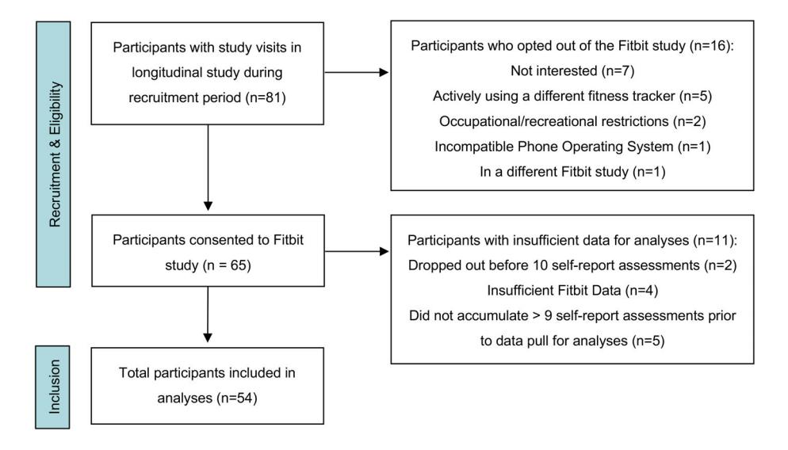
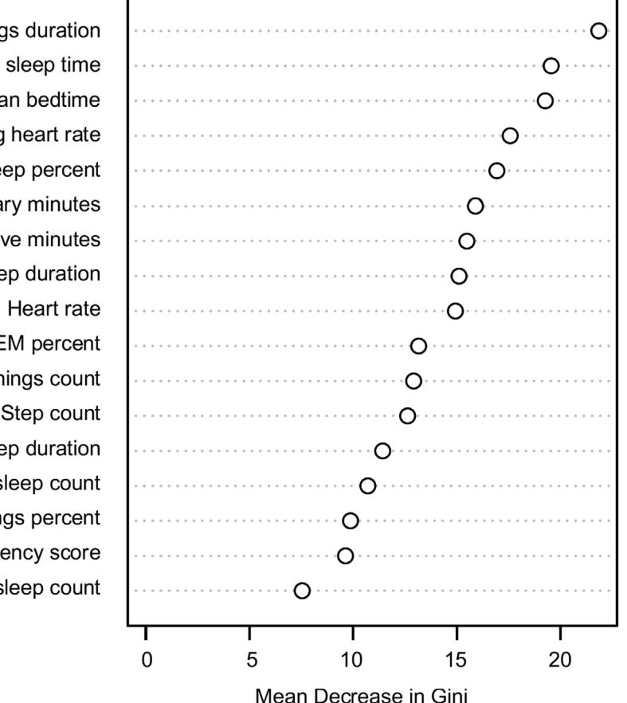
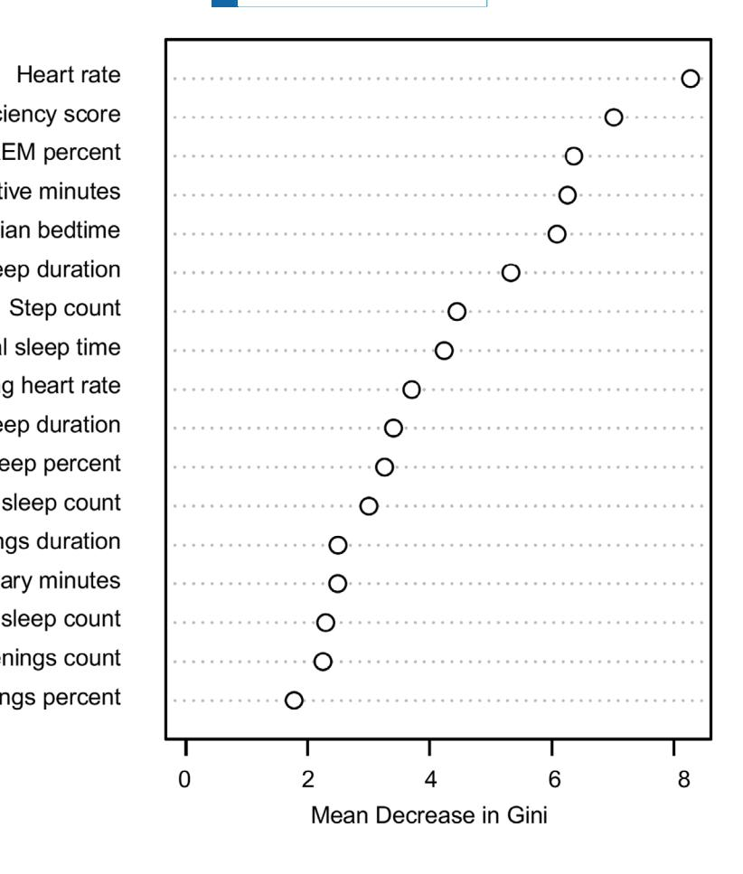

### ORIGINAL ARTICLE

# Digital phenotyping in bipolar disorder: Using longitudinal Fitbit data and personalized machine learning to predict mood symptomatology

Jessica M. Lipschitz1,2 | Sidian Lin3,4 | Soroush Saghafian4 | Chelsea K. Pike1 | Katherine E. Burdick1,2

1 Department of Psychiatry, Brigham and Women's Hospital, Boston, Massachusetts, USA 2 Department of Psychiatry, Harvard Medical School, Boston, Massachusetts, USA 3 Graduate School of Arts and Sciences, Harvard University, Cambridge, Massachusetts, USA 4 Harvard Kennedy School, Cambridge, Massachusetts, USA

### Correspondence

Jessica M. Lipschitz, Department of Psychiatry, Brigham and Women's Hospital, 221 Longwood Avenue, Boston, MA 02115, USA. Email: [jessica.lipschitz@bwh.harvard.edu](mailto:jessica.lipschitz@bwh.harvard.edu)

### Funding information

Brain and Behavior Research Foundation; Baszucki Brain Research Fund; Harvard Brain Initiative Bipolar Disorder Seed Grant Program; National Institute of Mental Health; Harvard University Middle East Initiative Kuwait Science Program; Alkermes, Inc.

### Abstract

Background: Effective treatment of bipolar disorder (BD) requires prompt response to mood episodes. Preliminary studies suggest that predictions based on passive sensor data from personal digital devices can accurately detect mood episodes (e.g., between routine care appointments), but studies to date do not use methods designed for broad application. This study evaluated whether a novel, personalized machine learning approach, trained entirely on passive Fitbit data, with limited data filtering could accurately detect mood symptomatology in BD patients.

Methods: We analyzed data from 54 adults with BD, who wore Fitbits and completed bi-weekly self-report measures for 9 months. We applied machine learning (ML) models to Fitbit data aggregated over two-week observation windows to detect occurrences of depressive and (hypo)manic symptomatology, which were defined as two-week windows with scores above established clinical cutoffs for the Patient Health Questionnaire-8 (PHQ-8) and Altman Self-Rating Mania Scale (ASRM) respectively.

Results: As hypothesized, among several ML algorithms, Binary Mixed Model (BiMM) forest achieved the highest area under the receiver operating curve (ROC-AUC) in the validation process. In the testing set, the ROC-AUC was 86.0% for depression and 85.2% for (hypo)mania. Using optimized thresholds calculated with Youden's J statistic, predictive accuracy was 80.1% for depression (sensitivity of 71.2% and specificity of 85.6%) and 89.1% for (hypo)mania (sensitivity of 80.0% and specificity of 90.1%).

Conclusion: We achieved sound performance in detecting mood symptomatology in BD patients using methods designed for broad application. Findings expand upon evidence that Fitbit data can produce accurate mood symptomatology predictions. Additionally, to the best of our knowledge, this represents the first application of BiMM forest for mood symptomatology prediction. Overall, results move the field a step toward personalized algorithms suitable for the full population of patients, rather than only those with high compliance, access to specialized devices, or willingness to share invasive data.

### KEYWORDS

bipolar disorder, digital phenotyping, machine learning, prediction, wearable devices

# 1 | INTRODUCTION

Bipolar Disorder (BD) is a chronic, severe psychiatric disorder that causes extreme mood swings. Typically, patients with BD see periods of remission followed by onset of new mood episodes (depression, hypomania, or mania).[1,2](#page-10-0) Most BD patients experience changes in symptom severity or polarity at least 3 times per year.3[–](#page-10-0)5 BD treatment focuses on limiting occurrence and severity of mood episodes,[6,7](#page-10-0) as these episodes cause significant emotional suffering and are often detrimental to patients' relationships, work, and health.7[–](#page-10-0)9 The rate of mood episode recurrence (e.g., the number of mood episodes over the course of illness) is associated with declining cognitive and functional trajectories.[10](#page-10-0)–13 Additionally, rapid cycling (four or more episodes of depression or mania in 1 year) is underrecognized[14](#page-11-0) and associated with worse functional trajectory.[15](#page-11-0) Accurate mood episode detection tools could be used to inform personalized interventions aimed at limiting episode severity and duration to improve functional trajectory.

Digital phenotyping—defined as "the momentby-moment quantification of the individual-level human phenotype in situ using data from personal digital devices" [16](#page-11-0)—offers a potential avenue for early detection of mood episodes in BD patients. Given the increasing use of personal digital devices, such as smartphones and smartwatches, it is now feasible to seamlessly collect and communicate biobehavioral information on a variety of indicators of mood episodes, such as sleep patterns, daily activity, and heart rate.[17](#page-11-0)

Digital phenotyping research in BD is a relatively young field: initial findings are promising, but they need to be replicated and methodological challenges need to be addressed.[18](#page-11-0) To date, many studies on bipolar disorder have found that a wide array of passively collected data such as data on movement, sleep, heart rate, geolocation, electrodermal activity, voice features, and keyboard metadata—are meaningfully associated with BD symptoms and diagnosis.18–[21](#page-11-0) To date these studies suggest that passive sensor data can be used to identify individuals with BD (as opposed to major depressive disorder and healthy controls),[22](#page-11-0)–32 to characterize differences

### Significant outcomes

- Using noninvasive data from Fitbit devices and a low rate of data filtering, occurrence of clinically-significant depression could be detected with 80.1% accuracy and occurrence of clinically-significant manic symptoms could be detected with 89.1% accuracy.
- The BiMM forest machine learning algorithm, which is designed for applications in precision medicine, outperformed other common machine learning approaches to mood symptomatology prediction.

### Limitations

- While our dataset was a reasonable size given comparative studies in the literature, replications with larger datasets and other methods of testing internal and external validity are important.
- As with any outcome variables (PHQ-8 and ASRM) carry their own error rate. Much like the application of these measures in routine care, our predictions would be a signal of utility of follow-up rather than a definitive diagnostic tool.
- Despite the use of sophisticated imputation methods to reduce data filtering, we still had to exclude 11 participants from our sample owing to dropping out or insufficient data. This is a much lower rate of filtering than other similar studies, but creative approaches to further limiting filtering will be important.

between different mood states within BD[,31,33](#page-11-0) and to predict mood state (i.e., occurrence of clinically significant mood symptomatology).[26,32,34](#page-11-0)–40

Among the research focused on detecting mood state using passively collected wearable and smartphone data, several methodological challenges have been barriers to in-clinic application.[18,41](#page-11-0) First, monitoring periods have typically been on the order of weeks rather than months[42](#page-12-0) and sample sizes have been small, risking overfitting and poor replication in clinical samples.[21,41](#page-11-0) Second, many studies involve using "active" data—selfreport questions filled out by patients typically on a daily basis—as input to enhance accuracy of predictions. Requiring active data for predictions increases patient burden and, therefore, reduces the feasibility of applying these methods in real-world clinical settings. Third, many studies involve invasive types of passive sensor data, such as data that requires permissions to a patient's smartphone or involves voice features, smartphone keyboard interaction dynamics, and geolocation. Privacy concerns have often been noted as a major drawback to adopting patient-facing, digital, clinical tools.[43](#page-12-0)–45 Thus, algorithms with this type of data may be infeasible to implement in actual treatment settings. Finally, many of the above referenced digital phenotyping studies utilized wearable devices that are uncomfortable or unfashionable to wear (e.g., chest straps) or prohibitively expensive (e.g., Empatica E4). These types of devices are not designed to be appealing for users to wear on a daily basis over years of treatment. While predictions based on these data sources may be accurate, implementation of mood prediction algorithms that require these types of devices are not likely to be acceptable to patients.

Among the most promising digital phenotyping studies for predicting mood state—those with long monitoring periods; adequate sample sizes; no active input data included in predictive algorithms; noninvasive data; mainstream data collection devices; and high accuracy practices for handling missing data have been an issue. For example, Cho et al.[38](#page-11-0) used only days with complete data in their predictions, which translated to filtering out over 88% of their data. Lee et al[.39](#page-11-0) utilized imputation methods to reduce data filtering, but still excluded almost half (45.5%) of their sample owing to insufficient data. While both studies represent important progress in the application of digital phenotyping to mood disorders, methods that rely on a level of data capture that cannot be met in half of patients have limited real-world utility and resulting algorithms produced may be biased toward compliant patients.

In this study, we aimed to evaluate whether noninvasive, entirely passive data streams collected from widely-used, commercially-available Fitbit devices could be used to accurately detect mood episodes in BD based on 9 months of monitoring. To this end, we focused on data features related to sleep, physical movement, and heart rate. We employed imputation methods to manage missing data to limit data filtering. We then evaluated the performance of advanced machine learning (ML) algorithms aimed at detecting clinically significant symptoms of depression and mania/hypomania in twoweek intervals over a 9-month monitoring period.

# 2 | MATERIALS AND METHODS

# 2.1 | Participants and recruitment

For this cohort study, participants were recruited from an ongoing longitudinal study of cognitive and psychosocial functioning in BD approved by Brigham and Women's Hospital's Institutional Review Board. Participants for the longitudinal study were recruited via hospital listservs, patient registries, and other ongoing studies of BD. All participants enrolled in the longitudinal study between November 1, 2020 and June 12, 2023 were invited to participate in the digital phenotyping investigation and the study team obtained informed consent from interested participants.

Detailed eligibility criteria are provided in Table 1. Of note, the longitudinal study from which participants for this investigation were recruited, the parent study,

TABLE 1 Eligibility criteria for parent study.

| Inclusion criteria                                                                        | Exclusion criteria                                                                                                                                         |
|-------------------------------------------------------------------------------------------|------------------------------------------------------------------------------------------------------------------------------------------------------------|
| 1. Age 18–68                                                                              | 1. History of central nervous system trauma (including concussion with known loss of consciousness >1 minute)                                     |
| 2. BD I or II diagnosis per the Structured Clinical Interview for DSM-5 (SCID-5) | 2. Any diagnosed neurological disorder                                                                                                                  |
|                                                                                           | 3. Attention deficit hyperactivity disorder that was diagnosed and treated in childhood (prior to onset of BD) or known learning disability |
|                                                                                           | 4. Current diagnosis of mild cognitive impairment or dementia                                                                                        |
|                                                                                           | 5. Substance use disorder (per SCID-5) within 3 months                                                                                                  |
|                                                                                           | 6. Active, unstable medical problem that may interfere with cognition                                                                                |
|                                                                                           | 7. Electroconvulsive therapy in the past year                                                                                                           |

Abbreviation: DSM-5, diagnostic and statistical manual of mental disorders, Fifth Edition.

FIGURE 1 Study sample flowchart.

# 16000447, 0, Downloaded from https://onlinelibrary.wiley.com/doi/10.1111/acps.13765 by Harvard University Harvard Lib, Wiley Online Library on [14/10/2024]. See the Terms and Conditions (https://onlinelibrary.wiley.com/terms-and-conditions) on Wiley Online Library for rules of use; OA articles are governed by the applicable Creative Commons License

involved evaluation of cognitive functioning in BD and this goal is reflected in the eligibility criteria. The parent study entailed study visits every 9 months. Participants were enrolled in the Fitbit sub-study at either baseline-, 9-month- or 18-month- study visits for the parent study. Figure 1 provides details on enrollment, including reasons for not enrolling and reasons for not being included in the final data analysis.

### 2.2 | Procedures

Participants opting to engage in the digital phenotyping study were given a Fitbit device to wear continuously for 9 months. Fitbit devices were used owing to high practicality for implementation in routine care and previously documented validity across key metrics of interest (defined in Table [2\)](#page-4-0).46–[48](#page-12-0) Additionally, since we were primarily interested in intra-individual variation, biological accuracy of metrics offered by Fitbit were less important than consistency in terms of how these metrics were generated. Participants were also asked to complete selfreport measures via REDCap on a bi-weekly basis during the 9-month monitoring period. These included the Patient Health Questionnaire-8 (PHQ-8),[49](#page-12-0) which measures severity of depression symptoms, and the Altman Self-Rating Mania Scale (ASRM),[50](#page-12-0) which measures severity of manic symptoms. Participants were reimbursed up to \$10 per week for compliance with the study protocol, including wearing the charged Fitbit >75% of the time and completing assigned self-report measures.

### 2.3 | Outcomes

We focused on predicting clinically significant symptoms of depression and mania as determined by self-report data collected at bi-weekly intervals. Binary variables were created for each timepoint, based on whether a participant's score on the PHQ-8 and ASRM respectively was over established clinical cutoff values. Cutoff values were PHQ-8 ≥ 10 (indicating probable depressive episode at that timepoint)[51](#page-12-0) and ASRM ≥ 6 (indicating probable manic or hypomanic episode at that timepoint, hereafter referred to as (hypo)mania).[50](#page-12-0)

### 2.4 | Features for the prediction model

The Fitbit Inspire was used to collect sleep, activity, and heart rate data continuously during the monitoring period. Fitbits collect a wide range of data on these constructs, but only a select set of features expected to have predictive utility were included in our prediction models. These features are labeled and defined in Table [2](#page-4-0).

### 2.5 | Data Preprocessing

We sought to include all participants who had been enrolled in the study long enough to complete at least 24 weeks of their monitoring period at the time of the data pull (N = 65). As indicated in Figure 1, we applied limited filtering criteria to exclude participants with insufficient data. Specifically, we excluded two participants who dropped out of the study. We also excluded participants who had completed fewer than 10 self-report assessments at the time of data extraction (n = 5). Finally, we excluded participants with no data at all on more than 65% of the days in the Fitbit monitoring window (n = 4).

Among the 54 patients included in analyses, we imputed values for missing Fitbit data. Missingness was defined by the presence of missing intervals ≥1 h in the

| TABLE 2 Summary of Fitbit data input features included in prediction models. |                                                                                                                   |                   |  |  |
|---------------------------------------------------------------------------------|-------------------------------------------------------------------------------------------------------------------|-------------------|--|--|
| Feature label                                                                   | Description                                                                                                       | Mean (SD)         |  |  |
| Step count                                                                      | Average number of steps taken per day during the observation window.                                              | 6631.75 (3585.15) |  |  |
| Sedentary minutes                                                            | Average number of minutes spent sedentary per day during the observation window.                                  | 727.38 (182.38)   |  |  |
| Very active minutes                                                          | Average number of minutes with a metabolic equivalent of task (MET) > 6 per day during the observation window. | 14.92 (17.50)     |  |  |
| Heart rate                                                                      | Daily heart rate value averaged over the observation window.                                                      | 78.42 (7.62)      |  |  |
|                                                                                 |                                                                                                                   |                   |  |  |

| minutes                      |                                                                                                                                                                                              |                |
|------------------------------|----------------------------------------------------------------------------------------------------------------------------------------------------------------------------------------------|----------------|
| Very active minutes       | Average number of minutes with a metabolic equivalent of task (MET) > 6 per day during the observation window.                                                                            | 14.92 (17.50)  |
| Heart rate                   | Daily heart rate value averaged over the observation window.                                                                                                                                 | 78.42 (7.62)   |
| Resting heart rate        | Daily resting heart rate value averaged over the observation window.                                                                                                                         | 69.38 (7.96)   |
| Total sleep time          | Total number of minutes classified as being asleep per night averaged over the observation window excluding nights without sleep. This metric does not include nights without any sleep.  | 430.95 (81.10) |
| Sleep efficiency score | 100 * [minutes asleep/(time in bed  minutes after waking up before user changes their device out of sleep mode)] per night averaged over the observation window.                          | 92.27 (7.13)   |
| Deep sleep count          | Number of distinct periods of deep sleep each night averaged over the observation window.                                                                                                    | 3.61 (0.83)    |
| Deep sleep duration       | Number of minutes classified as being in deep sleep each night averaged over the observation window.                                                                                      | 72.80 (19.37)  |
| Deep sleep percent        | Percent of total sleep time (from falling asleep at the beginning of the night to waking up at the end of the night) spent in deep sleep each night averaged over the observation window. | 0.17 (0.04)    |
| REM sleep count           | Number of distinct REM periods each night averaged over the observation window.                                                                                                              | 6.79 (2.08)    |
| REM sleep duration        | Number of minutes classified as being in REM sleep each night averaged over the observation window.                                                                                       | 88.83 (23.93)  |
| REM percent                  | Percent of total sleep time (from falling asleep at the beginning of the night to waking up at the end of the night) spent in REM sleep each night averaged over the observation window.  | 0.20 (0.04)    |
| Awakenings count          | Number of distinct awake periods during the sleep stages record each night averaged over the observation window.                                                                          | 22.82 (6.64)   |
| Awakenings duration       | Number of minutes classified as being awake during the sleep stages record each night averaged over the observation window.                                                               | 57.11 (17.15)  |
| Awakenings percent        | Percent of total sleep time (from falling asleep at the beginning of the night to waking up at the end of the night) spent awake each night averaged over the observation window.         | 0.11 (0.02)    |
| Median bedtime            | Median bedtime during the observation window. Bedtime was recoded such that 6 pm = 0 and 10 am the next morning = 16. Thus a value of 5 indicates an 11 pm bedtime.                       | 5.53 (1.62)    |

Note: All sleep values include sleep recorded between 6 pm on the day of and 10 am the next day. All other values account for one calendar day from 12:00 am to 11:59 pm.

heart rate data. Imputation was performed at the smallest possible interval. That is, where minute-level data were available, imputations were done at the minute level and aggregated across intervals of missingness. The rate of data sampling for each input variable is specified in Table 2.

Missing data were replaced using the random forest imputation method, which has advantages over parametric multivariate imputation by chained equations (MICE)[52](#page-12-0) insofar as it accommodates nonlinearities and interactions.[53](#page-12-0) Imputation was only performed for data features used for prediction (i.e., Fitbit data) because this is the data that would be required to implement predictive modeling in routine care to include patients with a wide array of Fitbit protocol compliance. We did not impute self-report data, as this was not used as input data for our algorithm. Thus, if the predictive algorithm were implemented in routine care, self-report data would not be needed.

Full or partial data imputation was performed on 620 study days (out of 14,406 total days across all participants in the study). This translates to 4.3% of Fitbit data days (a mean of 11 days per participant). Across participants, days with imputed data ranged from 0% to 34%.

## 2.6 | Machine learning algorithms

Our hypothesis was that the BiMM forest ML algorithm[54](#page-12-0) would outperform other standard approaches. BiMM forest is a longitudinal model that allows for working with clustered binary outcomes, for example, in longitudinal studies where patients' measurements are correlated over time. This method can be considered as an extension of generalized linear mixed models (GLMMs), where (a) the fixed covariates are not assumed to be linearly associated with the link function of the outcome, and (b) interactions do not need to be pre-specified. BiMM forest combines random forest and GLMM methodology, where using random forest also allows for an interpretable representation of the role of the predictor variables. A Bayesian implementation of GLMM is used in BiMM forest to improve performance and avoid convergence issues that exist in traditional GLMMs.

To test this hypothesis in our training data, we compared results generated using BiMM forest with six commonly-used ML algorithms: logistic regression,[55](#page-12-0) regularized logistic regression,[56](#page-12-0) support vector machine (SVM),[57](#page-12-0) eXtreme Gradient Boosting (XGBoost),[58,59](#page-12-0) random forest,[60,61](#page-12-0) and regularized random forest.62–[64](#page-12-0) The regularized methods were added due to concerns related to overfitting, which can arise in datasets with a high ratio of predictors to subjects.

Classification models based on these seven machine learning algorithms were built using R, version 4.1.0, and several R packages, including tidyverse, lubridate, glmnet, randomForest, RRF, e1071, xgboost, BiMM, pROC, and iml.

## 2.7 | Training, validation, and testing

Given the longitudinal nature of our dataset, we first organized the data chronologically and split it into training and testing subsets in a temporal fashion. Specifically, we trained our prediction models on the earliest 80% of observations for each participant (rounded up to the next integer), and left the rest for testing the best performing model. Due to the discrete number of observations, which varied by participant, ultimately 84% of the collected data was used for training.

To evaluate the relative performance of the ML algorithms using this 84% of our dataset (hereafter referred to as the training data), we employed a time series split cross-validation process.[65](#page-12-0) Specifically, within the training data, we utilized the initial 70% of the training data to predict the period following the 70% mark, then the first 80% to predict the period after 80%, and then the first 90% to predict the period after 90% for each patient. This approach accounts for the longitudinal nature of the data and involves intentionally overlapping analyses. As such, it is beneficial for several reasons. First, it ensures that the model is always validated on data points that follow the training data in time, preserving the temporal order and mimicking a real-world scenario where past data is used to predict future outcomes. Second, by validating the model on multiple overlapping subsets, the method helps ensure that the model is robust and generalizes well across different time periods within the training data. Third, this method provides a more comprehensive validation of the model's performance, as it evaluates the model on different segments of the data, ensuring that the model is not overfitting to a specific portion of the training data.

During this validation process, we performed hyperparameter optimization for each method (except logistic regression) using a grid-based tuning method to systematically search for the optimal parameters. The primary goal in the validation process was to compare different models and develop methodologies for predicting new data. Reported test results are averaged over these three different test/training splits and the model with the highest ROC-AUC was selected as the best model.

After identifying the best model, we retrained it on the entire 84% of the dataset using the hyper-parameters obtained from the validation process and then tested the model's performance using the untouched 16% of the data. This test data was not used in the validation process, so as to disentangle model selection and model testing processes.

### 3 | RESULTS

After applying filtering criteria, our sample included 54 unique participants. Across these 54 participants, we did not have self-report data for 39 observation windows (546 days of data), which meant that these observation windows could not be included in prediction modeling. We were able to use 13,860 days of data (consisting of 990, 2-week observation windows). In total, PHQ-8 scores over the clinical cutoff for probable depression occurred in 43 participants in 404 of the 990 (41%) included observation windows. ASRM scores over the clinical cutoff for probable (hypo)mania occurred in 30 participants in 148 of the 990 (15%) included observation windows.

The training data consisted of a total of 834 observation windows. Of these, there were 345 observation windows with depressive symptomatology over established clinical cutoffs and 133 observation windows with (hypo) manic symptomatology over established clinical cutoffs. The test data consisted of a total of 156 observation windows. Of these, there were 59 observation windows with depressive symptomatology over established clinical cutoffs and 15 observation windows with (hypo)manic symptomatology over established clinical cutoffs. Additional details on frequency of mood symptoms above established clinical cutoffs in the full dataset can be found in Supplemental Table [1.](#page-13-0)

Of the 54 participants included in analyses, Mean age was 40.3 (SD = 13.9) and the sample was 74.1% (n = 40) female and 77.8% (n = 42) white. Per the Structured Clinical Interview for DSM-5 (SCID-5), 75.9% (n = 41) of the sample was diagnosed with BD I, and 24.1% (n = 13) was diagnosed with BD II. The mean age of onset was 17.9 (SD = 6.1) years old. Mean baseline Hamilton Depression Rating Scale (HDRS) score was 8.9 (SD = 8.5, Range = 0–37), and mean baseline Young Mania Rating Scale (YMRS) score was 1.9 (SD = 2.9, Range = 0–15). On average, participants included in the analysis were compliant with the Fitbit protocol 87.8% of weeks.

### 3.1 | Predicting mood symptomatology

Receiver operating characteristic (ROC) curves from the validation process of the seven ML models tested are shown in Figure 2. Values for all models were above typically acceptable levels,[66](#page-12-0) exhibiting high power for predicting severity of mood symptomatology. In the validation process, the BiMM forest method outperformed other ML algorithms, achieving an AUC of 0.847 for predicting depressive symptomatology over clinical cutoffs and 0.829 for predicting (hypo)manic symptomatology over clinical cutoffs.

Given its superior performance, we used BiMM forest as the final model to predict mood symptomatology over clinical cutoffs and conducted an analysis of predictive power based on this model in the test data. In the test data, BiMM forest achieved an AUC of 0.860 for predicting depressive symptomatology over clinical cutoffs and 0.852 for predicting (hypo)manic symptomatology over clinical cutoffs. The prediction accuracy was 80.1% for depressive symptomatology (sensitivity of 71.2% [95% CI, 59.3%–83.1%] and specificity of 85.6% [95% CI, 78.4%– 92.8%]) and 89.1% for (hypo)manic symptomatology (sensitivity of 80.0% [95% CI, 60.0%–100%] and a specificity of 90.1% [95% CI, 85.1%–94.3%]). Of note, these predictions (sensitivity, specificity, and accuracy) utilized optimized prediction thresholds of 0.536 for depression and 0.340 for (hypo)mania. Optimized thresholds were calculated using Youden's J statistic.[67](#page-12-0)

FIGURE 2 ROC curves for detecting mood episodes in BD patients in training data. BiMM Forest, binary mixed model forest; Elastic Net, regularized (via Elastic Net) logistic regression; LR, logistic regression.; RF,random forest; ROC,receiver operating characteristic; RRF, regularized random forest; SVM, support vector machine; Xgboost, eXtreme gradient boosting. Values in parentheses are the ROC-AUC values.

# 3.2 | Variable importance in prediction model

To understand the contribution of each feature to mood symptomatology predictions, we made use of the random forest portion in the BiMM forest algorithm. Figures [3](#page-7-0) and [4](#page-8-0) depict the importance of each variable in predicting symptomatology over clinical cutoffs for depression and

FIGURE 3 Variable importance for predicting depression based on mean decrease in Gini index. All variables specified are defined in Table [2](#page-4-0).

(hypo)mania, respectively. Specifically, these figures display each variable's contribution to the prediction task as measured via the mean decrease in Gini across all trees in the random forest algorithm. The magnitude of contribution is represented by the distance between the y-axis and the corresponding dot for each variable. Of note, the mean decrease in Gini reflects the magnitude of the effect of contribution to the prediction task, but not directionality or effect size.

For depression, the five variables that contributed most to our predictions were duration of awakenings, total sleep time, median bedtime, resting heart rate, and percentage of sleep spent in deep sleep (see Figure 3). For (hypo)mania, the five variables that contributed most to our predictions were heart rate, sleep efficiency, percentage of sleep spent in REM sleep, number of very active minutes, and median bedtime (see Figure [4](#page-8-0)).

## 4 | DISCUSSION

In this study, we evaluated the degree to which ML algorithms utilizing noninvasive, passively-collected data from a mainstream wearable device (Fitbit), and limited data filtering could predict occurrence of mood symptomatology over clinical cutoffs in patients with BD. We were interested in whether, under these constraints, predictive accuracy would be high enough to meaningfully inform treatment, such as triggering outreach between scheduled appointments.

Using BiMM forest, we achieved predictive accuracy of 80.1% for depression (with a sensitivity of 71.2% and specificity of 85.6%) and 89.1% for (hypo)mania (with a sensitivity of sensitivity of 80.0% and a specificity of 90.1%). These results are similar to those achieved by Cho et al.[38](#page-11-0) in patients with BD I (the diagnosis of 76% of our sample). Specifically, in BD I patients, Cho et al. achieved 83.1% accuracy detecting depressive episodes and 88.3% accuracy detecting manic episodes. Our similar accuracy suggests promising proof-of-concept that passively collected data from Fitbits could be useful in treatment of BD. If a clinician was aware of an 89% likelihood their patient was experiencing a manic episode and did not have a near-term appointment scheduled, outreach would most certainly be warranted.

To the best of our knowledge, this is the first application of BiMM forest for predicting occurrence of mood symptomatology over clinical cutoffs in BD. In our data, BiMM forest outperformed other machine learning algorithms, including random forest, which is the most

FIGURE 4 Variable importance for predicting (hypo)mania based on mean decrease in Gini index. All variables specified are defined in Table [2.](#page-4-0)

commonly applied modeling approach in psychiatric digital phenotyping to date. BiMM forest offers a personalized approach insofar as it makes use of mixed effects to allow the option of using patient-specific covariates for each participant (via its generalized linear mixed model component). Past digital phenotyping research has found that personalized models that benefit from each individual patient's characteristics outperform general models that utilize data of the other partcipants.[38,68,69](#page-11-0) Our results further support the importance of using personalized approaches in digital phenotyping research and suggest that BiMM forest is a promising analytic approach. In addition to personalization, BiMM forest also allows for both nonlinear effects and inclusion of interactions among predictors that are not pre-specified (via its random forest component).

Our findings are particularly noteworthy because all input was passively collected, none of the metrics utilized were invasive in terms of privacy, we used mainstream consumer devices, and our methods did not demand high levels of Fitbit compliance. Other researchers have achieved more accurate mood predictions with more invasive data collection protocols that use data like geolocation[36](#page-11-0) and voice features,[37](#page-11-0) which may raise privacy concerns, and textile wearables,[34](#page-11-0) which may feel restrictive to patients. Similarly, some recent studies using passively collected, Fitbit data have achieved greater accuracy, but these studies involved heavy filtering such that only 11% of observation days were used[38](#page-11-0) or data from 46% of participants were excluded.[39](#page-11-0) Thus, predictions were only fit for highly compliant patients, which is unlikely to be the majority of a routine outpatient sample. In contrast, our methods utilized 83.1% of participants and 95.3% of those participants' observation windows. We argue, therefore, that our methods are an important next step toward a digital phenotyping approach that could be feasibly and broadly implemented across BD patients in routine care.

The relative importance of variables in our prediction model lends insight into which Fitbit data features contributed most to our predictive models (Figures [3](#page-7-0) and 4). Median bedtime was among the five most important variables for predicting both depressive symptomatology and (hypo)manic symptomatology. Additionally, deep sleeprelated variables were high in variable importance for depression symptomatology prediction, whereas REM sleep-related variables were high in importance for (hypo)mania symptomatology prediction. The importance of heart rate metrics in prediction of both depression and (hypo)mania symptomatology, corroborates prior research that supports a link between heart rate metrics and mood state.[31,33,34,38,70,71](#page-11-0) Of note, heart rate was particularly heavily weighted in (hypo)mania prediction, whereas resting heart rate was particularly heavily weighted in depression prediction. Variable importance findings are presented to open the black box of machine learning. They should not be interpreted as having clinical significance in their own right. Rather, these results can help others exploring digital phenotyping to determine which biobehavioral data may be particularly important to collect and use in future applications of machine learning to understand mood episode status. Further investigation of variable importance is required to determine the extent to which the most important variables observed in the models in this study generalize to other settings with different preprocessing procedures, models, and participants.

### 4.1 | Limitations

Our study had several limitations. First, while the duration of monitoring and size of our dataset were on the high end for digital phenotyping studies of BD, the amount of training data available was low for applications of machine learning. More training data (a larger sample or even longer monitoring period) would allow evaluation of differences in predictive accuracy across diagnostic and demographic subgroups and may improve predictive accuracy. Second, owing to our focus on approaches to digital phenotyping that are feasible to utilize in routine care, we used the PHQ-8 and ASRM to determine severity of depressive and (hypo)manic symptoms. These measures are feasible to administer at clinics that may want to train models based on each individual patient's data in routine care, but they carry their own error rates. Third, the majority of our sample carried a diagnosis of BD I. Further evaluation of predictive accuracy in a sample more heavily weighted toward BD II patients is warranted. Fourth, Fitbit data features rely on Fitbit algorithms, which have been well-studied and validated,46–[48](#page-12-0) but are less precise than, for example, polysomnography when measuring sleep. Thus, these findings should not be interpreted as precise scientific relationships between biobehavioral variables and mood episodes. Rather, they should be interpreted with an eye to how a commercially available, user-friendly device can be used to predict mood symptomatology. Fifth, while we utilized a random forest imputation method to limit the frequency of discarding observation windows, we did have to exclude 11 patients (though only 4 owing to insufficient compliance with the Fitbit protocol). Still, we were able to include 83% of enrolled patients in our prediction modeling, which we argue would be enough for clinical utility. Finally, Fitbit compliance in this study was nearly 88%, which is slightly higher than has been observed in other Fitbit studies of BD (e.g., 77.8% compliance in Van Til et al.[72\)](#page-12-0) The reasons for this are not known, but lower compliance would make applying such machine learning in routine care less widely applicable. Follow-up studies evaluating acceptability and feasibility in routine care settings will be essential to understanding the viability of these methods for improving treatment of BD. Finally, given that Fitbit only incorporated heart rate variability into its API after this study was already underway, this variable was not captured in our dataset. Recent research suggests that heart rate variability may differ across mood states in BD,[31,33,70,71](#page-11-0) so future studies expanding our algorithm to include heart rate variability as an input variable may have greater accuracy.

## 5 | FUTURE DIRECTIONS

Data from Fitbit devices can be used to detect clinically significant mood symptoms in patients with BD with high accuracy. Findings warrant several directions for future studies that have the potential to transform BD care paradigms and improve treatment precision. Most immediately, future work extending findings to unipolar depression and utilizing larger samples such that we can evaluate differences in predictive accuracy across diagnostic and demographic subgroups will be important. Additionally, studies evaluating implementation challenges in routine care will shed further light on the viability of utilizing these methods. Finally, with the core biology of BD (and most other neuropsychiatric illnesses) being largely unknown,[73,74](#page-12-0) findings suggest there may be merit in exploring the utility of digital, biobehavioral, signals as a biomarker for BD and perhaps mood disorders more generally.

### AUTHOR CONTRIBUTIONS

Jessica M. Lipschitz, Chelsea K. Pike and Katherine E. Burdick were primarily responsible for study design and/or data acquisition, whereas SS and SL were primarily responsible for planning and conducting data analysis. Jessica M. Lipschitz was primarily responsible for drafting the manuscript and all other authors—Soroush Saghafian, Sidian Lin, Chelsea K. Pike and Katherine E. Burdick—were involved in interpretation of findings and critical revision of the manuscript and approval of

16000447, 0, Downloaded from https://onlinelibrary.wiley.com/doi/10.1111/acps.13765 by Harvard University Harvard Lib, Wiley Online Library on [14/10/2024]. See the Terms and Conditions (https://onlinelibrary.wiley.com/terms-and-conditions) on Wiley Online Library for rules of use; OA articles are governed by the applicable Creative Commons License

the final submission. Jessica M. Lipschitz, Chelsea K. Pike and Katherine E. Burdick had full access to all the data in the study and all authors had access to deidentified data included in analyses. Jessica M. Lipschitz and Katherine E. Burdick take responsibility for the integrity of the data and SS and SL take responsibility for the accuracy of the data analysis.

## FUNDING INFORMATION

This research was supported by a Young Investigator Grant from the Brian & Behavior Research Foundation (#28537; to JML), a grant from the Harvard Brain Science Initiative Bipolar Disorder Seed Grant Program, and a Pathways Research Award from Alkermes, Inc. The data collection for the longitudinal study was supported in part by the Baszucki Brain Research Fund (to KEB) and the Harvard Brain Science Initiative Bipolar Disorder Seed Grant Program (to KEB). Additionally, Dr. Lipschitz's time was partially supported by the National Institute of Mental Health (NIMH) Grant MH120324. Dr. Saghafian's time was partially supported through a grant from Harvard's Middle East Initiative Kuwait Science Program, which is aimed at improving population health via machine learning and AI-enabled mobile health interventions. The funding organizations played no role in study design, data collection, analysis and interpretation of data, or the writing of this manuscript.

## CONFLICT OF INTEREST STATEMENT

Dr. Burdick serves as the Chair of the steering committee and as the Scientific Director for the Integrated Network of the non-profit foundation, Breakthrough Discoveries for thriving with Bipolar Disorder (BD^2) and receives grant funding and honoraria in this capacity and also received honorarium as a scientific advisory board member for Merck in the past 12 months, but declares no financial competing interests. Dr. Lipschitz is a consultant to Solara Health Inc., but declares no financial competing interests. All other authors declare no financial or non-financial competing interests.

## PEER REVIEW

The peer review history for this article is available at [https://www.webofscience.com/api/gateway/wos/peer](https://www.webofscience.com/api/gateway/wos/peer-review/10.1111/acps.13765)[review/10.1111/acps.13765](https://www.webofscience.com/api/gateway/wos/peer-review/10.1111/acps.13765).

## DATA AVAILABILITY STATEMENT

We are not currently able to share data because data collection is still ongoing (findings presented are based on interim analyses) and the study is not yet federally funded. The informed consent used in this study allows for data sharing and we do expect to share our data once data collection is complete and a data repository is in place.

# CODE AVAILABILITY

The code used to produce this analysis can be provided upon request.

# ORCID

Jessica M. Lipschitz [https://orcid.org/0000-0002-4085-](https://orcid.org/0000-0002-4085-0507) [0507](https://orcid.org/0000-0002-4085-0507)

## REFERENCES

- 1. Gitlin MJ, Swendsen J, Heller TL, Hammen C. Relapse and impairment in bipolar disorder. Am J Psychiatry. 1995;152: 1635-1640. doi[:10.1176/ajp.152.11.1635](info:doi/10.1176/ajp.152.11.1635)
- 2. Perlis RH, Ostacher MJ, Patel JK, et al. Predictors of recurrence in bipolar disorder: primary outcomes from the systematic treatment enhancement program for bipolar disorder (STEP-BD). Am J Psychiatry. 2006;163(2):217-224. doi[:10.1176/](info:doi/10.1176/appi.ajp.163.2.217) [appi.ajp.163.2.217](info:doi/10.1176/appi.ajp.163.2.217)
- 3. Judd LL, Akiskal HS, Schettler PJ, et al. The long-term natural history of the weekly symptomatic status of bipolar I disorder. Arch Gen Psychiatry. 2002;59(6):530-537. doi:[10.1001/archpsyc.](info:doi/10.1001/archpsyc.59.6.530) [59.6.530](info:doi/10.1001/archpsyc.59.6.530)
- 4. Judd LL, Akiskal HS, Schettler PJ, et al. A prospective investigation of the natural history of the long-term weekly symptomatic status of bipolar II disorder. Arch Gen Psychiatry. 2003; 60(3):261-269. doi[:10.1001/archpsyc.60.3.261](info:doi/10.1001/archpsyc.60.3.261)
- 5. Gignac A, McGirr A, Lam RW, Yatham LN. Recovery and recurrence following a first episode of mania: a systematic review and meta-analysis of prospectively characterized cohorts. J Clin Psychiatry. 2015;76(9):1241-1248. doi[:10.4088/JCP.14r09245](info:doi/10.4088/JCP.14r09245)
- 6. Yatham LN, Kennedy SH, Parikh SV, et al. Canadian network for mood and anxiety treatments (CANMAT) and International Society for Bipolar Disorders (ISBD) 2018 guidelines for the management of patients with bipolar disorder. Bipolar Disord. 2018;20(2):97-170. doi[:10.1111/bdi.12609](info:doi/10.1111/bdi.12609)
- 7. Goodwin GM, Haddad PM, Ferrier IN, et al. Evidence-based guidelines for treating bipolar disorder: revised third edition recommendations from the British Association for Psychopharmacology. J Psychopharmacol. 2016;30(6):495-553. doi[:10.1177/](info:doi/10.1177/0269881116636545) [0269881116636545](info:doi/10.1177/0269881116636545)
- 8. Michalak EE, Yatham LN, Maxwell V, Hale S, Lam RW. The impact of bipolar disorder upon work functioning: a qualitative analysis. Bipolar Disord. 2007;9(1–2):126-143. doi[:10.1111/j.](info:doi/10.1111/j.1399-5618.2007.00436.x) [1399-5618.2007.00436.x](info:doi/10.1111/j.1399-5618.2007.00436.x)
- 9. Stang P, Frank C, Ulcickas Yood M, Wells K, Burch S. Impact of bipolar disorder: results from a screening study. Prim Care Companion J Clin Psychiatry. 2007;9(1):42-47. doi[:10.4088/pcc.](info:doi/10.4088/pcc.v09n0107) [v09n0107](info:doi/10.4088/pcc.v09n0107)
- 10. Sanchez-Morla EM, Lopez-Villarreal A, Jiménez-Lopez E, et al. -Impact of number of episodes on neurocognitive trajectory in bipolar disorder patients: a 5-year follow-up study. Psychol Med. 2019;49(8):1299-1307. doi[:10.1017/S0033291718001885](info:doi/10.1017/S0033291718001885)

12 LIPSCHITZ ET AL.

- 11. Borgelt L, Strakowski SM, DelBello MP, et al. Neurophysiological effects of multiple mood episodes in bipolar disorder. Bipolar Disord. 2019;21(6):503-513. doi:[10.1111/bdi.12782](info:doi/10.1111/bdi.12782)
- 12. Peters AT, West AE, Eisner L, Baek J, Deckersbach T. The burden of repeated mood episodes in bipolar I disorder: results from the national epidemiological survey on alcohol and related conditions. J Nerv Ment Dis. 2016;204(2):87-94. doi[:10.](info:doi/10.1097/NMD.0000000000000425) [1097/NMD.0000000000000425](info:doi/10.1097/NMD.0000000000000425)
- 13. Di Marzo S, Giordano A, Pacchiarotti I, Colom F, Sanchez-Moreno J, Vieta E. The impact of the number of episodes on the outcome of bipolar disorder. Eur J Psychiatry. 2006;20:21- 28. doi:[10.4321/S0213-61632006000100003](info:doi/10.4321/S0213-61632006000100003)
- 14. Carvalho AF, Dimellis D, Gonda X, Vieta E, Mclntyre RS, Fountoulakis KN. Rapid cycling in bipolar disorder: a systematic review. J Clin Psychiatry. 2014;75(6):e578-e586. doi[:10.](info:doi/10.4088/JCP.13r08905) [4088/JCP.13r08905](info:doi/10.4088/JCP.13r08905)
- 15. Cruz N, Vieta E, Comes M, et al. Rapid-cycling bipolar I disorder: course and treatment outcome of a large sample across Europe. J Psychiatr Res. 2008;42(13):1068-1075. doi:[10.1016/j.](info:doi/10.1016/j.jpsychires.2007.12.004) [jpsychires.2007.12.004](info:doi/10.1016/j.jpsychires.2007.12.004)
- 16. Torous J, Kiang MV, Lorme J, Onnela JP. New tools for new research in psychiatry: a scalable and customizable platform to empower data driven smartphone research. JMIR Ment Health. 2016;3(2):e16. doi[:10.2196/mental.5165](info:doi/10.2196/mental.5165)
- 17. Steinhubl SR, Muse ED, Topol EJ. Can mobile health technologies transform health care? JAMA. 2013;310(22):2395-2396. doi: [10.1001/jama.2013.281078](info:doi/10.1001/jama.2013.281078)
- 18. Orsolini L, Fiorani M, Volpe U. Digital phenotyping in bipolar disorder: which integration with clinical endophenotypes and biomarkers? Int J Mol Sci. 2020;21(20):7684. doi[:10.3390/](info:doi/10.3390/ijms21207684) [ijms21207684](info:doi/10.3390/ijms21207684)
- 19. Abd-Alrazaq A, AlSaad R, Aziz S, et al. Wearable artificial intelligence for anxiety and depression: scoping review. J Med Internet Res. 2023;25:e42672. doi:[10.2196/42672](info:doi/10.2196/42672)
- 20. Maatoug R, Oudin A, Adrien V, et al. Digital phenotype of mood disorders: a conceptual and critical review. Front Psychiatry. 2022;13:895860. doi:[10.3389/fpsyt.2022.895860](info:doi/10.3389/fpsyt.2022.895860)
- 21. Saccaro LF, Amatori G, Cappelli A, Mazziotti R, Dell'Osso L, Rutigliano G. Portable technologies for digital phenotyping of bipolar disorder: a systematic review. J Affect Disord. 2021;295: 323-338. doi:[10.1016/j.jad.2021.08.052](info:doi/10.1016/j.jad.2021.08.052)
- 22. Jakobsen P, Garcia-Ceja E, Riegler M, et al. Applying machine learning in motor activity time series of depressed bipolar and unipolar patients compared to healthy controls. PLoS One. 2020;15(8):e0231995. doi[:10.1371/journal.pone.0231995](info:doi/10.1371/journal.pone.0231995)
- 23. Kaufmann CN, Lee EE, Wing D, et al. Correlates of poor sleep based upon wrist actigraphy data in bipolar disorder. J Psychiatr Res. 2021;141:385-389. doi:[10.1016/j.jpsychires.2021.](info:doi/10.1016/j.jpsychires.2021.06.038) [06.038](info:doi/10.1016/j.jpsychires.2021.06.038)
- 24. Merikangas KR, Swendsen J, Hickie IB, et al. Real-time mobile monitoring of the dynamic associations among motor activity, energy, mood, and sleep in adults with bipolar disorder. JAMA Psychiatry. 2019;76(2):190-198. doi:[10.1001/jamapsychiatry.](info:doi/10.1001/jamapsychiatry.2018.3546) [2018.3546](info:doi/10.1001/jamapsychiatry.2018.3546)
- 25. Faurholt-Jepsen M, Rohani DA, Busk J, et al. Using digital phenotyping to classify bipolar disorder and unipolar disorder exploratory findings using machine learning models. Eur Neuropsychopharmacol. 2024;81:12-19. doi:[10.1016/j.euroneuro.](info:doi/10.1016/j.euroneuro.2024.01.003) [2024.01.003](info:doi/10.1016/j.euroneuro.2024.01.003)

- 26. Zakariah M, Alotaibi YA. Unipolar and bipolar depression detection and classification based on actigraphic registration of motor activity using machine learning and uniform manifold approximation and projection methods. Diagnostics (Basel). 2023;13(14):2323. doi[:10.3390/diagnostics13142323](info:doi/10.3390/diagnostics13142323)
- 27. Tazawa Y, Liang KC, Yoshimura M, et al. Evaluating depression with multimodal wristband-type wearable device: screening and assessing patient severity utilizing machine-learning. Heliyon. 2020;6(2):e03274. doi[:10.1016/j.heliyon.2020.e03274](info:doi/10.1016/j.heliyon.2020.e03274)
- 28. Faurholt-Jepsen M, Busk J, Þorarinsd ottir H, et al. Objective smartphone data as a potential diagnostic marker of bipolar disorder. Aust N Z J Psychiatry. 2019;53(2):119-128. doi[:10.](info:doi/10.1177/0004867418808900) [1177/0004867418808900](info:doi/10.1177/0004867418808900)
- 29. Langholm C, Breitinger S, Gray L, et al. Classifying and clustering mood disorder patients using smartphone data from a feasibility study. NPJ Digit Med. 2023;6(1):238. doi:[10.1038/s41746-](info:doi/10.1038/s41746-023-00977-7) [023-00977-7](info:doi/10.1038/s41746-023-00977-7)
- 30. Faurholt-Jepsen M, Busk J, Rohani DA, et al. Differences in mobility patterns according to machine learning models in patients with bipolar disorder and patients with unipolar disorder. J Affect Disord. 2022;306:246-253. doi:[10.1016/j.jad.2022.](info:doi/10.1016/j.jad.2022.03.054) [03.054](info:doi/10.1016/j.jad.2022.03.054)
- 31. Gregorio ML, Wazen GLL, Kemp AH, et al. Non-linear analysis of the heart rate variability in characterization of manic and euthymic phases of bipolar disorder. J Affect Disord. 2020;275: 136-144. doi[:10.1016/j.jad.2020.07.012](info:doi/10.1016/j.jad.2020.07.012)
- 32. Faurholt-Jepsen M, Rohani DA, Busk J, Vinberg M, Bardram JE, Kessing LV. Voice analyses using smartphonebased data in patients with bipolar disorder, unaffected relatives and healthy control individuals, and during different affective states. Int J Bipolar Disord. 2021;9(1):38. doi[:10.1186/](info:doi/10.1186/s40345-021-00243-3) [s40345-021-00243-3](info:doi/10.1186/s40345-021-00243-3)
- 33. Wazen GLL, Gregorio ML, Kemp AH, Godoy MF. Heart rate variability in patients with bipolar disorder: from mania to euthymia. J Psychiatr Res. 2018;99:33-38. doi[:10.1016/j.](info:doi/10.1016/j.jpsychires.2018.01.008) [jpsychires.2018.01.008](info:doi/10.1016/j.jpsychires.2018.01.008)
- 34. Valenza G, Citi L, Gentili C, Lanata A, Scilingo EP, Barbieri R. Characterization of depressive states in bipolar patients using wearable textile technology and instantaneous heart rate variability assessment. IEEE J Biomed Health Inform. 2015;19(1): 263-274. doi[:10.1109/JBHI.2014.2307584](info:doi/10.1109/JBHI.2014.2307584)
- 35. Anmella G, Corponi F, Li BM, et al. Exploring digital biomarkers of illness activity in mood episodes: hypotheses generating and model development study. JMIR Mhealth Uhealth. 2023;11:e45405. doi[:10.2196/45405](info:doi/10.2196/45405)
- 36. Palmius N, Tsanas A, Saunders KEA, et al. Detecting bipolar depression from geographic location data. IEEE Trans Biomed Eng. 2017;64(8):1761-1771. doi:[10.1109/TBME.2016.2611862](info:doi/10.1109/TBME.2016.2611862)
- 37. Cao B, Zheng L, Zhang C, et al. DeepMood: modeling mobile phone typing dynamics for mood detection. Proc 23rd ACM SIGKDD Int Conf Knowl Discov Data Min, 747–755. 2017. doi: [10.48550/arXiv.1803.08986](info:doi/10.48550/arXiv.1803.08986)
- 38. Cho CH, Lee T, Kim MG, In HP, Kim L, Lee HJ. Mood prediction of patients eith mood disorders by machine learning using passive digital phenotypes based on the circadian rhythm: prospective observational cohort study. J Med Internet Res. 2019; 21(4):e11029. doi[:10.2196/11029](info:doi/10.2196/11029)
- 39. Lee HJ, Cho CH, Lee T, et al. Prediction of impending mood episode recurrence using real-time digital phenotypes in major

depression and bipolar disorders in South Korea: a prospective nationwide cohort study. Psychol Med. 2023;53(12):5636-5644. doi:[10.1017/S0033291722002847](info:doi/10.1017/S0033291722002847)

- 40. Corponi F, Li BM, Anmella G, et al. Automated mood disorder symptoms monitoring from multivariate time-series sensory data: getting the full picture beyond a single number. Transl Psychiatry. 2024;14(1):161. doi:[10.1038/s41398-024-02876-1](info:doi/10.1038/s41398-024-02876-1)
- 41. Faurholt-Jepsen M, Bauer M, Kessing LV. Smartphone-based objective monitoring in bipolar disorder: status and considerations. Int J Bipolar Disord. 2018;6(1):6. doi[:10.1186/s40345-](info:doi/10.1186/s40345-017-0110-8) [017-0110-8](info:doi/10.1186/s40345-017-0110-8)
- 42. De Angel V, Lewis S, White K, et al. Digital health tools for the passive monitoring of depression: a systematic review of methods. NPJ Digit Med. 2022;5(1):3. doi[:10.1038/s41746-021-](info:doi/10.1038/s41746-021-00548-8) [00548-8](info:doi/10.1038/s41746-021-00548-8)
- 43. Zhou L, Bao J, Watzlaf V, Parmanto B. Barriers to and facilitators of the use of mobile health apps from a security perspective: mixed-methods study. JMIR Mhealth Uhealth. 2019;7(4): e11223. doi:[10.2196/11223](info:doi/10.2196/11223)
- 44. Schueller SM, Neary M, O'Loughlin K, Adkins EC. Discovery of and interest in health apps among those with mental health needs: survey and focus group study. J Med Internet Res. 2018; 20(6):e10141. doi[:10.2196/10141](info:doi/10.2196/10141)
- 45. Lipschitz J, Miller CJ, Hogan TP, et al. Adoption of mobile apps for depression and anxiety: cross-sectional survey study on patient interest and barriers to engagement. JMIR Ment Health. 2019;6(1):e11334. doi:[10.2196/11334](info:doi/10.2196/11334)
- 46. Lee HA, Lee HJ, Moon JH, et al. Comparison of wearable activity tracker with actigraphy for sleep evaluation and circadian rest-activity rhythm measurement in healthy young adults. Psychiatry Investig. 2017;14(2):179-185. doi[:10.4306/pi.2017.14.](info:doi/10.4306/pi.2017.14.2.179) [2.179](info:doi/10.4306/pi.2017.14.2.179)
- 47. Nelson BW, Allen NB. Accuracy of consumer wearable heart rate measurement during an ecologically valid 24-hour period: Intraindividual validation study. JMIR Mhealth Uhealth. 2019; 7(3):e10828. doi[:10.2196/10828](info:doi/10.2196/10828)
- 48. Paul SS, Tiedemann A, Hassett LM, et al. Validity of the Fitbit activity tracker for measuring steps in community-dwelling older adults. BMJ Open Sport Exerc Med. 2015;1(1):e000013. doi:[10.1136/bmjsem-2015-000013](info:doi/10.1136/bmjsem-2015-000013)
- 49. Kroenke K, Strine TW, Spitzer RL, Williams JB, Berry JT, Mokdad AH. The PHQ-8 as a measure of current depression in the general population. J Affect Disord. 2009;114(1–3):163-173. doi:[10.1016/j.jad.2008.06.026](info:doi/10.1016/j.jad.2008.06.026)
- 50. Altman EG, Hedeker D, Peterson JL, Davis JM. The Altman self-rating mania scale. Biol Psychiatry. 1997;42(10):948-955. doi:[10.1016/S0006-3223\(96\)00548-3](info:doi/10.1016/S0006-3223(96)00548-3)
- 51. Wu Y, Levis B, Riehm KE, et al. Equivalency of the diagnostic accuracy of the PHQ-8 and PHQ-9: a systematic review and individual participant data meta-analysis - ERRATUM. Psychol Med. 2020;50(16):2816. doi:[10.1017/S0033291719002137](info:doi/10.1017/S0033291719002137)
- 52. Van Buuren S, Groothuis-Oudshoorn K. Mice: multivariate imputation by chained equations in R. J Stat Softw. 2011;45(3): 1-67. doi[:10.18637/jss.v045.i03](info:doi/10.18637/jss.v045.i03)
- 53. Shah AD, Bartlett JW, Carpenter J, Nicholas O, Hemingway H. Comparison of random forest and parametric imputation models for imputing missing data using MICE: a CALIBER study. Am J Epidemiol. 2014;179(6):764-774. doi:[10.1093/aje/](info:doi/10.1093/aje/kwt312) [kwt312](info:doi/10.1093/aje/kwt312)

LIPSCHITZ ET AL. 13

- 54. Speiser JL, Wolf BJ, Chung D, Karvellas CJ, Koch DG, Durkalski VL. BiMM forest: a random forest method for modeling clustered and longitudinal binary outcomes. Chemometr Intell Lab Syst. 2019;185:122-134. doi:[10.1016/j.chemolab.2019.](info:doi/10.1016/j.chemolab.2019.01.002) [01.002](info:doi/10.1016/j.chemolab.2019.01.002)
- 55. Hosmer DW, Lemeshow S, Sturdivant RX. Applied Logistic Regression. 3rd ed. John Wiley & Sons, Inc.; 2013.
- 56. Simon N, Friedman J, Hastie T, Tibshirani R. Regularization paths for Cox's proportional hazards model via coordinate descent. J Stat Softw. 2011;39(5):1-13. doi[:10.18637/jss.v039.i05](info:doi/10.18637/jss.v039.i05)
- 57. Smola AJ, Bartlett P, Scholkopf B, Schuurmans D. Advances in Large Margin Classifiers. The MIT Press; 2000.
- 58. Chen T, Guestrin C. XGBoost: a scalable tree boosting system. Proc 23rd ACM SIGKDD Int Conf Knowl Discov Data Min, 785– 794. 2016. doi:[10.48550/arXiv.1603.02754](info:doi/10.48550/arXiv.1603.02754)
- 59. Friedman JH. Greedy function approximation: a gradient boosting machine. Ann Stat. 2001;29(5):1189-1232.
- 60. Breiman L. Random forests. Mach Learn. 2001;45:5-32. doi[:10.](info:doi/10.1023/A:1010933404324) [1023/A:1010933404324](info:doi/10.1023/A:1010933404324)
- 61. Biau G. Analysis of a random forests model. J Mach Learn Res. 2012;13:1063-1095.
- 62. Deng H, Runger G. Gene selection with guided regularized random forest. Pattern Recognit. 2013;46(12):3483-3489. doi[:10.](info:doi/10.1016/j.patcog.2013.05.018) [1016/j.patcog.2013.05.018](info:doi/10.1016/j.patcog.2013.05.018)
- 63. Deng H, Runger G. Feature selection via regularized trees. arXiv. 2012;1-8. doi:[10.1109/IJCNN.2012.6252640](info:doi/10.1109/IJCNN.2012.6252640)
- 64. Deng H. Guided R\random forest in the RRF package. 2013. doi[:10.48550/arXiv.1306.0237](info:doi/10.48550/arXiv.1306.0237)
- 65. Hyndman RJ, Athanasopoulos G. Forecasting: Principles and Practice. 3rd ed. OTexts; 2021.
- 66. Mandrekar JN. Receiver operating characteristic curve in diagnostic test assessment. J Thorac Oncol. 2010;5(9):1315-1316. doi[:10.1097/JTO.0b013e3181ec173d](info:doi/10.1097/JTO.0b013e3181ec173d)
- 67. Youden WJ. Index for rating diagnostic tests. Cancer. 1950;3(1): 32-35. doi:[10.1002/1097-0142\(1950\)3:13.0.co;2-3](info:doi/10.1002/1097-0142(1950)3:1<32::aid-cncr2820030106>3.0.co;2-3)
- 68. Mullick T, Radovic A, Shaaban S, Doryab A. Predicting depression in adolescents using mobile and wearable sensors: multimodal machine learning-based exploratory dtudy. JMIR Form Res. 2022;6(6):e35807. doi[:10.2196/35807](info:doi/10.2196/35807)
- 69. Kathan A, Harrer M, Küster L, et al. Personalised depression forecasting using mobile sensor data and ecological momentary assessment. Front Digit Health. 2022;4:964582. doi[:10.3389/](info:doi/10.3389/fdgth.2022.964582) [fdgth.2022.964582](info:doi/10.3389/fdgth.2022.964582)
- 70. Carr O, de Vos M, Saunders KEA. Heart rate variability in bipolar disorder and borderline personality disorder: a clinical review. Evid Based Ment Health. 2018;21(1):23-30. doi[:10.1136/](info:doi/10.1136/eb-2017-102760) [eb-2017-102760](info:doi/10.1136/eb-2017-102760)
- 71. Faurholt-Jepsen M, Brage S, Kessing LV, Munkholm K. Staterelated differences in heart rate variability in bipolar disorder. J Psychiatr Res. 2017;84:169-173. doi:[10.1016/j.jpsychires.2016.](info:doi/10.1016/j.jpsychires.2016.10.005) [10.005](info:doi/10.1016/j.jpsychires.2016.10.005)
- 72. Van Til K, McInnis MG, Cochran A. A comparative study of engagement in mobile and wearable health monitoring for bipolar disorder. Bipolar Disord. 2020;22(2):182-190. doi[:10.](info:doi/10.1111/bdi.12849) [1111/bdi.12849](info:doi/10.1111/bdi.12849)
- 73. Davis J, Maes M, Andreazza A, McGrath JJ, Tye SJ, Berk M. Towards a classification of biomarkers of neuropsychiatric disease: from encompass to compass. Mol Psychiatry. 2015;20(2): 152-153. doi[:10.1038/mp.2014.139](info:doi/10.1038/mp.2014.139)

74. Grande I, Berk M, Birmaher B, Vieta E. Bipolar disorder. Lancet. 2016;387(10027):1561-1572. doi:[10.1016/S0140-6736\(15\)](info:doi/10.1016/S0140-6736(15)00241-X) [00241-X](info:doi/10.1016/S0140-6736(15)00241-X)

### SUPPORTING INFORMATION

Additional supporting information can be found online in the Supporting Information section at the end of this article.

How to cite this article: Lipschitz JM, Lin S, Saghafian S, Pike CK, Burdick KE. Digital phenotyping in bipolar disorder: Using longitudinal Fitbit data and personalized machine learning to predict mood symptomatology. Acta Psychiatr Scand. 2024;1‐14. doi:[10.1111/acps.13765](info:doi/10.1111/acps.13765)