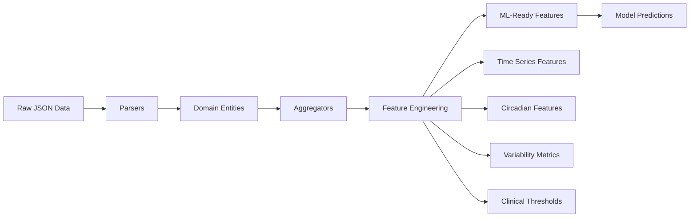

# 🏗️ Big Mood Detector: Architecture & Integration Roadmap

## 📊 Current State Analysis

### ✅ What We've Built

#### 1. **Domain Layer** (Clean Architecture Core)
- **Entities**: 
  - `SleepRecord`: Sleep periods with states (ASLEEP, REM, DEEP, etc.)
  - `ActivityRecord`: Physical activity (steps, distance, flights climbed)
  - `HeartRateRecord`: Heart rate & HRV measurements
- **Domain Services**:
  - `SleepAggregator`: Creates daily sleep summaries
  - `ActivityAggregator`: Aggregates daily activity metrics
  - `HeartRateAggregator`: Computes HR statistics & detects anomalies
  - `FeatureExtractionService`: Combines all data into clinical features

#### 2. **Infrastructure Layer**
- **JSON Parsers**: 
  - `SleepJSONParser`: Parses Apple Health sleep JSON
  - `ActivityJSONParser`: Parses step count & distance data
  - `HeartRateJSONParser`: Parses HR, resting HR, and HRV data

#### 3. **Clinical Features Extracted**
```python
@dataclass
class ClinicalFeatures:
    date: date
    # Sleep features
    sleep_duration_hours: float
    sleep_efficiency: float
    sleep_fragmentation_index: float
    
    # Activity features  
    total_steps: int
    sedentary_minutes: int
    active_minutes: int
    
    # Heart features
    avg_resting_hr: float
    hrv_sdnn: float
    
    # Circadian features
    circadian_alignment_score: float
    
    # Clinical flags
    is_clinically_significant: bool
    clinical_notes: list[str]
```

## 🔬 Research Requirements (From Literature)

### 1. **Seoul National University Study** (Nature Digital Medicine 2024)
**Required Features**:
- ✅ Sleep duration, efficiency, fragmentation
- ✅ Circadian rhythm phase (sleep timing)
- ⚠️ **MISSING**: 36 mathematical sleep features:
  - Sleep regularity index
  - Interdaily stability (IS)
  - Intradaily variability (IV)
  - Relative amplitude (RA)
  - L5 and M10 (least/most active periods)

### 2. **Harvard/Fitbit Study** (Bipolar Disorders 2024)
**Required Features**:
- ✅ Total sleep time
- ✅ Sleep efficiency
- ✅ Steps & activity
- ✅ Resting heart rate
- ⚠️ **MISSING**: 
  - REM/Deep sleep percentages
  - Activity intensity levels
  - Sedentary bout lengths

### 3. **Pretrained Actigraphy Transformer**
**Required Input Format**:
- ⚠️ **MISSING**: Raw accelerometer data at 30Hz
- ⚠️ **MISSING**: 5-minute epoch aggregation
- ⚠️ **MISSING**: Multi-day windows (7-14 days)

### 4. **XGBoost Mood Study**
**Required Features**:
- ✅ Sleep variability
- ✅ Activity patterns
- ⚠️ **MISSING**: Weather data integration
- ⚠️ **MISSING**: Social interaction metrics

## 🎯 Integration Gaps & Requirements

### 1. **Data Sources We Have**
```
✅ Sleep Analysis.json - Aggregated sleep stages
✅ Heart Rate.json - Daily HR statistics
✅ Step Count.json - Daily step totals
✅ Walking + Running Distance.json
✅ Heart Rate Variability.json
✅ Resting Heart Rate.json
```

### 2. **Data Sources We Need to Integrate**
```
🔄 Active Energy.json - For activity intensity
🔄 Respiratory Rate.json - Sleep quality indicator
🔄 Apple Sleeping Wrist Temperature.json - Circadian phase marker
⚠️ Raw accelerometer data - Not available in export
```

### 3. **Feature Engineering Pipeline Needed**



## 🚀 Next Steps Roadmap

### Phase 1: Complete Data Integration (Current)
- [x] Basic parsers for core metrics
- [ ] Add parsers for remaining data sources
- [ ] Create time series feature extractors
- [ ] Implement circadian rhythm calculations

### Phase 2: Advanced Feature Engineering
- [ ] Implement research-specific features:
  - [ ] Sleep regularity index
  - [ ] Interdaily stability/variability
  - [ ] Activity fragmentation
  - [ ] Circadian phase estimation
- [ ] Multi-day rolling windows
- [ ] Anomaly detection for each metric

### Phase 3: ML Model Integration
- [ ] Integrate Pretrained-Actigraphy-Transformer
- [ ] Adapt XGBoost model from mood_ml repo
- [ ] Create ensemble prediction system
- [ ] Implement confidence scoring

### Phase 4: Clinical Validation
- [ ] Map predictions to DSM-5 criteria
- [ ] Implement risk stratification
- [ ] Add explainability (SHAP values)
- [ ] Create clinical reports

## 💻 Implementation Priority

### Immediate Next Steps:
1. **Complete JSON Parser Suite**
   ```python
   # Add these parsers:
   - ActiveEnergyJSONParser
   - RespiratoryRateJSONParser  
   - WristTemperatureJSONParser
   ```

2. **Enhance Feature Extraction**
   ```python
   # Add to FeatureExtractionService:
   - calculate_sleep_regularity()
   - calculate_circadian_phase()
   - calculate_activity_fragmentation()
   - create_rolling_windows()
   ```

3. **Create ML Pipeline Interface**
   ```python
   class MoodPredictionPipeline:
       def prepare_features(data: dict) -> np.ndarray
       def predict(features: np.ndarray) -> MoodPrediction
       def explain(prediction: MoodPrediction) -> Explanation
   ```

## 🧪 Testing Strategy

### Current Test Coverage: 91%
- ✅ Unit tests for all parsers
- ✅ Domain service tests
- ✅ Feature extraction tests

### Needed Tests:
- [ ] Integration tests with real JSON data
- [ ] Time series feature validation
- [ ] ML model integration tests
- [ ] End-to-end prediction tests

## 📈 Performance Considerations

### Data Volume Estimates:
- **1 year of data**: ~365 daily summaries
- **Raw samples**: ~8.6M heart rate samples/year
- **Processing time**: <1 second for daily features

### Optimization Needs:
- Batch processing for multi-year data
- Caching for expensive calculations
- Parallel processing for feature extraction

## 🔗 Reference Repository Integration

### Key Repos to Integrate:
1. **mood_ml**: XGBoost implementation
2. **Pretrained-Actigraphy-Transformer**: Deep learning model
3. **tsfresh**: Time series feature extraction
4. **ngboost**: Uncertainty estimation

### Integration Strategy:
- Extract core algorithms
- Adapt to our data format
- Maintain clean architecture boundaries
- Create adapters for each model

## 🎯 Success Metrics

### Technical Metrics:
- Feature extraction: <1s per year of data
- Prediction accuracy: >85% (matching research)
- False positive rate: <10%

### Clinical Metrics:
- Days before episode detection: 3-7 days
- Clinical actionability: High confidence alerts only
- Explainability: Clear feature importance

---

## 🚦 Go/No-Go Decision Points

### ✅ Ready to Proceed:
- Core architecture is solid
- Data parsing works
- Feature extraction framework exists

### ⚠️ Critical Path Items:
1. Complete feature engineering pipeline
2. Validate against research papers
3. Integrate first ML model
4. Test with real patient data

### 🎯 Next Immediate Action:
**Create integration test with real JSON data to validate the complete pipeline**