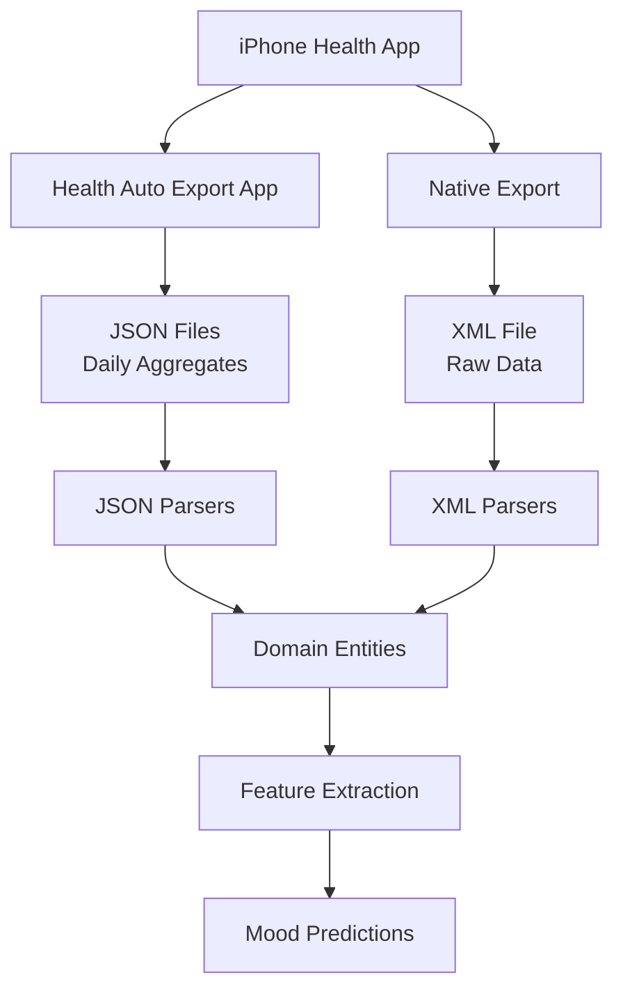

# 🏗️ Dual Pipeline Architecture: JSON + XML Support

## Overview

Big Mood Detector supports **two data input formats** to maximize compatibility and flexibility:

1. **JSON Format** - From "Health Auto Export - JSON+CSV" iOS app (daily aggregates)
2. **XML Format** - From native Apple Health app export (raw sensor data)

## Data Sources

### 📱 Health Auto Export App (JSON)
**What**: Third-party iOS app that exports aggregated daily summaries
**Format**: JSON files with daily totals
**Example**: `Sleep Analysis.json`, `Heart Rate.json`, `Step Count.json`

**Advantages**:
- ✅ Pre-aggregated daily summaries
- ✅ Small file sizes (KB not GB)
- ✅ Perfect for mood pattern detection
- ✅ Automatic daily exports

**How to get**:
1. Install "Health Auto Export - JSON+CSV" from App Store
2. Configure daily export to iCloud/Dropbox
3. Download JSON files

### 🍎 Apple Health Native Export (XML)
**What**: Built-in Apple Health export feature
**Format**: Single large XML file (`export.xml`)
**Contains**: Every single health measurement

**Advantages**:
- ✅ Complete raw data
- ✅ No third-party apps needed
- ✅ Works with Apple Health Bot
- ✅ Research-grade granularity

**How to get**:
1. Open Health app on iPhone
2. Tap profile picture → "Export All Health Data"
3. Wait for export to complete
4. Save/email the ZIP file
5. Extract `export.xml`

## Architecture

```
src/big_mood_detector/infrastructure/parsers/
├── json/                    # Health Auto Export parsers
│   ├── __init__.py
│   └── json_parsers.py      # Daily aggregates
├── xml/                     # Apple Health native parsers  
│   ├── __init__.py
│   ├── sleep_parser.py      # Raw sleep stages
│   ├── activity_parser.py   # Individual activities
│   └── heart_rate_parser.py # Every heartbeat
└── parser_factory.py        # Smart format detection
```

## Usage Examples

### Using the Smart Factory

```python
from big_mood_detector.infrastructure.parsers.parser_factory import ParserFactory

# Automatically detect format and parse
sleep_records = ParserFactory.parse_file("Sleep Analysis.json", "sleep")
# or
sleep_records = ParserFactory.parse_file("export.xml", "sleep")
```

### Using the Unified Parser

```python
from big_mood_detector.infrastructure.parsers.parser_factory import UnifiedHealthDataParser

parser = UnifiedHealthDataParser()

# Add JSON sources (Health Auto Export)
parser.add_json_source("data/Sleep Analysis.json", "sleep")
parser.add_json_source("data/Heart Rate.json", "heart_rate")
parser.add_json_source("data/Step Count.json", "activity")

# Add XML export (native Apple Health)
parser.add_xml_export("export.xml")

# Get all records
all_data = parser.get_all_records()
```

### Direct Parser Usage

```python
# JSON parsers
from big_mood_detector.infrastructure.parsers.json import SleepJSONParser
parser = SleepJSONParser()
records = parser.parse_file("Sleep Analysis.json")

# XML parsers  
from big_mood_detector.infrastructure.parsers.xml import SleepParser
parser = SleepParser()
with open("export.xml", "r") as f:
    records = parser.parse(f.read())
```

## When to Use Which Format

### Use JSON (Health Auto Export) when:
- You want **daily mood tracking**
- You need **manageable file sizes**
- You prefer **automatic daily exports**
- You're doing **continuous monitoring**

### Use XML (Native Export) when:
- You need **complete historical data**
- You want **raw sensor readings**
- You're doing **research analysis**
- You need **Apple Health Bot compatibility**

## Data Flow



## Integration with Apple Health Bot

The XML format is directly compatible with the Apple Health Bot:

```bash
# Use Apple Health Bot with XML export
cd reference_repos/apple-health-bot
python dataParser/xmldataparser.py /path/to/export.xml
```

## Best Practices

1. **For Development**: Use JSON files (faster, smaller)
2. **For Production**: Support both formats
3. **For Research**: Use XML for complete data
4. **For Real-time**: Use JSON with auto-export