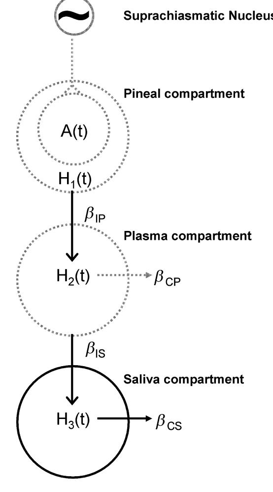
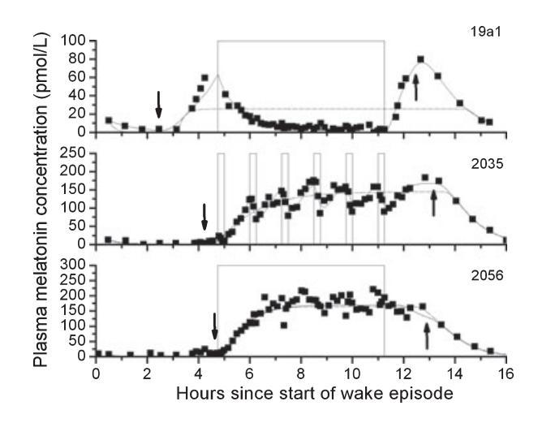
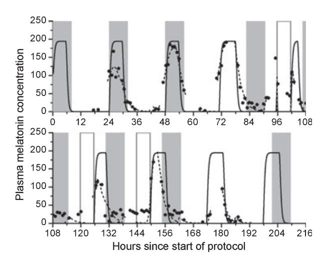

# A physiologically based mathematical model of melatonin including ocular light suppression and interactions with the circadian pacemaker

Abstract: The rhythm of plasma melatonin concentration is currently the most accurate marker of the endogenous human circadian pacemaker. A number of methods exist to estimate circadian phase and amplitude from the observed melatonin rhythm. However, almost all these methods are limited because they depend on the shape and amplitude of the melatonin pulse, which vary among individuals and can be affected by environmental influences, especially light. Furthermore, these methods are not based on the underlying known physiology of melatonin secretion and clearance, and therefore cannot accurately quantify changes in secretion and clearance observed under different experimental conditions. A published physiologically-based mathematical model of plasma melatonin can estimate synthesis onset and offset of melatonin under dim light conditions. We amended this model to include the known effect of melatonin suppression by ocular light exposure and to include a new compartment to model salivary melatonin concentration, which is widely used in clinical settings to determine circadian phase. This updated model has been incorporated into an existing mathematical model of the human circadian pacemaker and can be used to simulate experimental protocols under a number of conditions.

#### Melissa A. St Hilaire1 , Claude Gronfier2 , Jamie M. Zeitzer3 and Elizabeth B. Klerman1

1 Division of Sleep Medicine, Brigham and Womens Hospital and Harvard Medical School, Boston, MA, USA; 2 Inserm, U846, Department of Chronobiology, Bron, France; Stem Cell and Brain Research Institute, Bron, France; Universite´ de Lyon, Universite´ LyonI, Lyon, France; 3 Department of Psychiatry and Behavioral Sciences, Stanford University, VA Palo Alto Health Care System, Palo Alto, CA, USA

Key words: circadian, mathematical models, melatonin, pineal, plasma, saliva, suppression

Address reprint request to Melissa A. St Hilaire, Division of Sleep Medicine, Brigham and Womens Hospital, 221 Longwood Ave, Boston, MA 02115, USA. E-mail: msthilaire@rics.bwh.harvard.edu

Received April 12, 2007; accepted June 21, 2007.

## Introduction

The activity of the endogenous circadian pacemaker located in the suprachiasmatic nucleus (SCN) within the hypothalamus cannot be measured directly in humans. In order to extract information about circadian phase or amplitude or other characteristics of the circadian system, marker rhythms must be used. A comparison of the plasma melatonin rhythm to two other marker rhythms, core body temperature and cortisol, revealed that phase markers measured by melatonin are the least variable under relatively constant conditions, and therefore are more precise markers of the endogenous circadian rhythm [1]. Melatonin is also commonly used as a marker in circadian rhythms research because it or its metabolite can be assayed in blood, saliva or urine and because it is relatively unaffected by sleep–wake state or changes in posture [2].

Multiple mathematical methods have been published (for review, see Refs [1–3]) by which circadian phase can be extracted from the plasma melatonin rhythm. Most of these methods depend on curve-fitting of the melatonin profile and/or the crossing of a threshold to determine phase. Thus, these methods assume certain characteristics about the shape and amplitude of the melatonin profile. For example, to calculate phase as the quarter crossing of the

294

fit (DLMO25%), the amplitude of a melatonin pulse is calculated from a 3-harmonic fit of the data, which assumes that the shape of the melatonin pulse can be captured by a fundamental plus 2-harmonic (e.g. approximately 24, 12, and 8 hr) sinusoidal curve. Then, 25% of this fit amplitude is calculated and linear interpolation is used to estimate the time at which the plasma melatonin concentration crosses this value. This time is used as the phase marker (see Fig. 3 of Ref. [4]).

This or similar phase estimates may not be accurate for several reasons: (a) There is large intra-individual variability in melatonin amplitude and shape across several days, especially during an experimental intervention such as a light pulse under different background lighting conditions [5]; (b) There is large inter-individual variability in melatonin amplitude [6, 7]. Therefore, some threshold methods may not be accurate in individuals with low amplitude of melatonin concentration; (c) Linear interpolation assumes that the change in melatonin concentration across the interpolation interval is linear, which may not be true, especially when sampling rate is infrequent.

There are two other problems with most current measures of melatonin phase and amplitude. Most investigators agree that the onset of melatonin secretion is a marker of circadian phase [8]. However, the different definitions of this onset – which depend on the threshold or fit used – make it difficult to compare results across studies, or even to associate the time of the change with the physiology. A second problem is that the error in the calculation is not reported. Some circadian rhythms experiments report phase shifts of as little as 30 min as significant. However, without knowledge of the error in the phase marker, the statistical significance of the results and the statistical power of the experiments may not be known.

The suppression of melatonin by ocular light exposure has been used to probe the sensitivity of the circadian pacemaker to light in blind persons [9], to varying intensities and durations of polychromatic light exposure, and to long-term changes in light exposure [5]. This method is appropriate because the pathway for ocular light suppression of melatonin begins in the retina, travels via the singlesynaptic retino-hypothalamic tract (RHT) to the SCN of the hypothalamus, through the paraventricular nuclei and the superior cervical ganglion and ends in the pineal [10]. Intensity response curves [11] demonstrate that the halfmaximum sensitivity to light estimated from plasma melatonin suppression occurs at approximately 100 lx, with maximum melatonin suppression occurring between 1000 and 10,000 lx. For comparison, ordinary room light levels are approximately 100 lx. Therefore, studies conducted in room light may inadvertently include melatonin suppression in addition to other specified experimental effects. More recent studies have also reported melatonin suppression by monochromatic light with peak sensitivity in the short-wavelength bands [12–15].

In 1997, Brown et al. [16] introduced a method for calculating melatonin phase and amplitude using a physiologically based differential equation model of the diurnal variation of plasma melatonin concentrations. Details of the model are included below, in the Methods section. This model can be used to estimate the onset (SynOn) and offset (SynOff) of plasma melatonin production, as well as the amount of melatonin secreted (amplitude). The onsets and offsets estimated by the model were comparable to assessments of melatonin phase based on threshold methods. This method also yields information about the infusion rates of melatonin into and clearance rates of melatonin out of the plasma, information that cannot be extracted using the other methods but that may be useful in understanding pineal melatonin and circadian physiology. A method to estimate melatonin phase that is based on physiology may be a much more useful tool for melatonin analysis because there are no intrinsic assumptions about the shape and amplitude of the melatonin pulse and because the parameters (e.g. synthesis onset and offset, infusion and clearance rates, amplitude) can be directly related to physiologic processes. Such information may provide physiological insight into the differences in melatonin levels seen across individuals, and in different conditions.

Salivary melatonin rhythms have also been used as markers of the endogenous circadian pacemaker. Saliva samples for melatonin assay are often collected when it is impossible or impractical to collect plasma samples. Phase estimates are usually calculated by the same curve-fitting and threshold methods used for plasma melatonin. However, in addition to the problems detailed above for analyzing plasma samples for circadian information, there are at least two additional problems with using saliva for this purpose: (a) salivary melatonin concentrations are approximately 30% lower than plasma melatonin concentrations [17] which may make threshold methods even more difficult to apply, and (b) often only the rising portion of the salivary melatonin pulse is collected, because most melatonin secretion occurs when an individual is asleep and therefore not available for producing saliva samples. The lack of data from the entire time of melatonin secretion makes it impossible to use any threshold calculation that depends on the overall amplitude of the pulse.

We developed two additions to the existing physiologically based model of melatonin: (a) a photic effect to predict melatonin suppression by light and (b) a saliva compartment to predict salivary melatonin concentration. This model was then integrated with an existing mathematical model of the effect of light on the human circadian pacemaker [18] and used to estimate melatonin synthesis onset and offset, amplitude and infusion and clearance rates from data collected under a variety of conditions, including (a) a constant routine procedure (CR, described below); (b) exposures to continuous bright light (CBL), continuous dim light and intermittent bright light (IBL); and (c) conditions in which melatonin sampling rate was low or only included the rising portion of the melatonin curve. We compare these predictions to other known methods of melatonin phase estimation and discuss which methods are most accurate under a variety of experimental conditions.

## Methods

#### Model equations

The physiologically based model of melatonin developed by Brown et al. [16] was based on the physiological data of melatonin synthesis, secretion and clearance from rats; it is assumed that the same or similar physiology exists for humans. The pathway for pineal melatonin synthesis includes the following steps: tryptophan is hydroxylated and then decarboxylated to form serotonin. Arylalkylamine N-acetyltransferase (AA-NAT) converts serotonin to N-acetylserotonin [19], which is then O-methylated by hydroxindole-O-methyltransferase to produce melatonin [20]. Melatonin is not stored in the pineal, which is on the body side of the blood–brain barrier, but instead readily diffuses into the bloodstream [21], where it is transported through the blood, partially bound to albumin [22]. The hormone is cleared by the liver and excreted through the urine [23]. The mathematical model of this synthesis is a first-order kinetic process with two compartments: the pineal compartment and the plasma compartment. These two compartments are represented by two first-order differential equations:

$$
\frac{\mathrm{d}H_1(t)}{\mathrm{d}t} = -\beta_{\mathrm{IP}}H_1(t) + A(t) \tag{1}
$$

$$
\frac{dH_2(t)}{dt} = \beta_{IP} H_1(t) - \beta_{CP} H_2(t)
$$
 (2)

where bIP is the rate of infusion of melatonin into the plasma, bCP is the rate of clearance of melatonin from the plasma, H1(t) is the concentration of melatonin in the pineal compartment and H2(t) is the concentration of melatonin in the plasma. A(t) is the AA-NAT activity at time t and is calculated by the following function:

$$
A(t) = \begin{cases} A \left[ \frac{1 - e^{-\lambda(t - t_{\text{on}})}}{1 - e^{-\lambda(t_{\text{off}} - t_{\text{on}})}} \right] & t_{\text{on}} \le t < t_{\text{off}} \\ A e^{-\alpha(t - t_{\text{off}})} & t \ge t_{\text{off}} \end{cases}
$$
(3)

where k is the AA-NAT activity growth, a is the AA-NAT activity decline, ton is the onset time of increased AA-NAT activity and toff is the offset time of growth in AA-NAT activity and A is the maximum AA-NAT activity (pmol/L/min). Although the original model was based on the assumption that AA-NAT activity is the rate limiting step of melatonin synthesis, more recent studies indicate that this may not be the case [24].

#### Data analysis

Several datasets were used to develop and test the additions to the physiologically based model of melatonin. Fluorescent white light was used in all studies (see [25] for details, including light spectrum). For all protocols, circadian phase was assessed during CRs using a 2-harmonic-plus-noise fit of core body temperature (CBTmin) [26] and melatonin as phase markers. During a CR, individuals remain awake in bed under dim light with frequent small meals; the CR is designed to minimize changes known to affect markers of the circadian pacemaker [27,28]. CBTmin was used as the phase marker during the experiment to schedule events because CBT data are available in real-time and can be analyzed immediately, unlike melatonin which must first be assayed. A description of each dataset follows:

#### Intermittent bright light dataset

Gronfier et al. [4] performed a series of experiments to determine the response of the circadian pacemaker to three different light exposure patterns. In these experiments, 20 subjects were scheduled to two 24.0-hr days in approximately 90 lx followed by a 26.2-hr CR. After the initial CR, subjects were scheduled to 8 hr of sleep in 0 lx. For the next wake episode, subjects were randomly assigned to a 6.5-hr stimulus, centered approximately 3.5 hr before CBTmin, in one of three lighting conditions: (1) CBL at approximately 9500 lx (n = 6); (2) IBL consisting of six 15-min bright light pulses of approximately 9500 lx separated by 60 min of very dim light (VDL) of <1 lx (n = 7); (3) continuous VDL of <1 lx (n = 7). In each condition, the stimulus was preceded and followed by 30 min of <1 lx. The stimulus day was followed by a 64-hr CR. The light level during wakefulness was approximately 1.5 lx from the start of the initial CR until the end of the second CR, except during the light exposure session. Although the IBL stimulus represented only 23% of the total duration of the CBL stimulus, the phase shift of DLMO25%, the marker of melatonin phase, during IBL exposure was 74% as great as during a CBL stimulus. Melatonin suppression was observed in the CBL and IBL conditions [29], but was not reported in [4]. The data from this study were used to introduce the effect of light in the pineal melatonin concentration equation

### 3-Pulse phase-resetting protocol

Duffy et al. [30] performed a series of experiments in which 31 subjects were scheduled to two 24.0-hr days in approximately 90 lx followed by a 26- to 33-hr CR, depending on the desired center of the bright light stimulus. After the initial CR, subjects were scheduled to 8 hr of sleep in 0 lx. During the following three wake episodes, subjects were exposed to a 5-hr approximately 9500 lx pulse centered in the middle of the 16-hr wake episode, which occurred at different circadian phases to induce either a phase-advance or a phase-delay of the circadian pacemaker. The 3-cycle bright light stimulus was followed by a 40-hr CR. CBT and plasma melatonin rhythms were assessed throughout the protocol. The light level during wakefulness was approximately 10 lx from the start of the initial CR until the end of the second CR, except during the bright light stimuli. The plasma melatonin concentrations from the initial CR were used to determine the entrained phase angles between CBTmin and SynOn and SynOff.

#### 1-Pulse intensity response curve protocol

Zeitzer et al. [11] performed a series of experiments to determine the response of the pacemaker to light pulses of varying intensities. In these experiments, 21 subjects were scheduled to two 24.0-hr days in 150 lx followed by an approximately 50-hr CR. After the initial CR, subjects were scheduled to 8 hr of sleep in 0 lx. During the following wake episode, subjects were randomly assigned to receive a single 6.5-hr light pulse centered approximately 3.5 hr before CBTmin with intensities ranging from 3 to 9100 lx. The stimulus day was followed by a 30-hr CR. The light level during wakefulness was approximately 10 lx from the start of the initial CR until the end of the second CR, except during the stimulus. Melatonin suppression was calculated as the difference between the area under the curve (AUC) of the baseline melatonin pulse and the melatonin pulse during the light exposure divided by the baseline AUC. Baseline AUC was calculated from the 4-hr before the melatonin midpoint during the initial CR and the AUC during the light exposure was calculated using the same clock hours 24 hr later. AUC was calculated using the trapezoidal method. These data were used to validate the addition of a light suppression effect to the melatonin model.

#### Salivary melatonin concentration dataset

Both salivary and plasma samples were collected for melatonin assay from totally blind subjects scheduled to various inpatient protocols [31]. Data from these totally blind subjects are not confounded by ocular light suppression of melatonin concentrations. The salivary melatonin data were used to test and validate the addition of a salivary compartment to the melatonin model.

#### Incorporation of an effect of light on melatonin

#### Previous model

In 1999, Kronauer et al. [18] described a mathematical model of the effect of light on the human circadian pacemaker with a dynamic stimulus processor to represent the effect of light as a chemical reaction in which photons entering the retina activate ready elements (Process L) that are converted into a light drive that sends a signal to the circadian pacemaker in the SCN. Once the ready elements have been used, they are recycled back to a ready state to await reactivation. The dynamic stimulus processor assumes a prompt response occurring at the time the light source is turned on, with pseudosaturation occurring within 10–15 minutes before the drive returns to a lower steady state response until the light stimulus ends.

In this model, this light drive acts on the circadian pacemaker to produce phase shifts. The equations of Process L represent the physiological process by which light initiates a chemical reaction within the photo-pigments of the retinal photoreceptors that transmit a photic signal from the retina through the RHT to the circadian pacemaker within the SCN. This chemical reaction assumes a forward rate constant

$$
\alpha = \alpha_0 \left(\frac{I}{I_0}\right)^p \tag{4}
$$

where a0 = 0.05, I0 = 9500 and p = 0.5. Equation (4) converts ready elements into a drive B^ onto the pacemaker such that

$$
\hat{B} = G(1 - n)\alpha \tag{5}
$$

where G is a scaling constant and n is the fraction of elements in the system that are used. Used elements are recycled back into the ready state at a rate of b ¼ 0.0075. In general, the rate at which elements are activated (processed from ready to used) in Process L is given at any time by the formula

$$
\dot{n} = 60[\alpha(1-n) - \beta n] \tag{6}
$$

The drive generated in equation (5) acts onto the dynamic circadian pacemaker, Process P. Process P is divided into two components: the circadian pacemaker and the circadian sensitivity modulator. The coupled pacemaker equations are

$$
\dot{x} = \frac{\pi}{12} \left[ x_c + \mu \left( \frac{1}{3} x + \frac{4}{3} x^3 + \frac{256}{105} x^7 \right) + B \right] \tag{7}
$$

$$
\dot{x}_c = \frac{\pi}{12} \left\{ q B x_c - x \left[ \left( \frac{24}{0.99729 \tau_x} \right)^2 + kB \right] \right\} \tag{8}
$$

Equations (7) and (8) represent a higher-order limit cycle oscillator, and the coefficients in equation (7) were chosen so that the amplitude of the limit cycle would equal 1.00, as in previous iterations of the model [32]. B^ enters Process P via the circadian sensitivity modulator, where it is converted into a direct drive, B, onto the pacemaker that is dependent on the state variables x and xc such that

$$
B = \hat{B}(1 - 0.4x)(1 - 0.4x_c)
$$
\n(9)

to characterize the feature that the human circadian pacemaker has varying sensitivity to light throughout the circadian day [33].

To compare the results of the model to CBT data in humans, a phase relationship was derived [34] such that

$$
Time of \text{CBT}_{\text{min}} = Time \text{ of } \phi_{\text{xcx}} + \phi_{\text{ref}} \tag{10}
$$

where CBTmin is as described above, uref = 0.97, and uxcx is defined as the polar phase angle between the state variables x and xc such that

$$
\arctan\frac{x_c}{x} = -170.7^\circ \tag{11}
$$

#### Incorporation of light into melatonin model

To incorporate an effect of light into the melatonin model, the AA-NAT activity, A(t), in equation (3) was redefined as:

$$
A'(t) = A(t)(1 - m\hat{B})\tag{12}
$$

where m is a constant whose value was determined by parameter fitting to the Intermittent Bright Light dataset and validated on the 1-Pulse Intensity Response Curve dataset.

A phase relationship was derived to compare the results of the model to melatonin and CBT data in humans. CBTmin and melatonin SynOn (ton from equation 3) and SynOff (toff from equation 3) were calculated from the initial CR data from the 3-Pulse Phase-Resetting Protocol and the Intermittent Bright Light dataset. A schematic of the model is in Fig. 1.

#### Parameter fitting

Parameter fits to the data were derived by a similar method to the one described in the original publication [16]. The following equation is used to relate the model predictions to plasma melatonin data:

$$
y_{t_i} = H_2(t_i) + \varepsilon_i \tag{13}
$$

where H2(ti) is the plasma melatonin level at time ti and ei is an approximate Gaussian random variable with mean 0 and variance r2 ti determined by the melatonin immunoassay.

The objective is to estimate h, where

$$
\theta = (\beta_{IP}, \beta_{CP}, \alpha, \lambda, A, Sym_{on}, Sym_{off})
$$
\n(14)

The -2 log-likelihood of the model is

$$
-2\log f[y|\theta, H_1(t)] = \sum_{i=2}^{N} \frac{\{y_{t_i} - H_2[t_i|\theta, H(t_1)]\}^2}{\sigma_{t_i}^2} + K \quad (15)
$$

where

$$
K = (N-1)\log 2\pi + \sum_{i=2}^{N} \sigma_{t_i}^2
$$
 (16)

The maximum likelihood estimate of h, ^h; is computed by minimizing the likelihood. However, in the original model, a Bayesian analysis was used to calculate r2 ti . This analysis was based on the counts per minute recorded from the immunoassay. These data were not available for this analysis, nor are they available for many clinical applications. Therefore, we derived r2 ti from the intra-assay coefficient of variance obtained from the laboratory at which the melatonin immunoassays were run.

To integrate this model with an existing mathematical model of the effect of light on the human circadian pacemaker [18] so that it can predict synthesis onset and offset under a variety of simulated protocols, it is necessary to assign average parameter values to bIP, bCP, a, k, and A. We used the CR data from the Intermittent Bright Light dataset and the 3-Pulse Phase-Resetting Protocol. The individual fits of these 51 subjects were calculated using the parameter fitting method described above and each parameter was averaged across subjects to determine the average parameter value. The final average parameter estimates (mean ± S.E.M.) are: bIP = 0.047 ± 0.004, bCP = 0.025 ± 0.002, a = 0.067 ± 0.038, k = 0.588 ± 0.113, and A = 4.834 ± 0.365. The parameter value of m in equation (12) was determined by a best-fit to the Intermittent Bright Light dataset. A value of m = 7 was found to provide the best fit for all subjects.

#### Saliva compartment

The design of the saliva compartment was modeled by the same principles as the pineal and plasma compartments were created in the original mathematical model of melatonin. It is assumed that all melatonin is released from the pineal gland into the plasma [35]. In the plasma, melatonin partially binds to albumin and is eventually cleared through the liver. Melatonin that does not become bound to albumin readily diffuses into the saliva [36]. Melatonin in the saliva is eventually cleared through unknown processes. A third equation is added to account for the infusion of melatonin from the plasma into the saliva compartment and for the clearance from saliva. This equation is:

$$
\frac{dH_3(t)}{dt} = \beta_{IS}H_2(t) - \beta_{CS}H_3(t)
$$
\n(17)

where bIS is the rate of infusion from the plasma to the saliva compartment and bCS is the rate of clearance from the saliva. The plasma compartment equation (equation 1) has also been modified to include the infusion from the plasma to the saliva. This equation is:

$$
\frac{dH_2(t)}{dt} = \beta_{IP}H_1(t) - \beta_{CP}H_2(t) - \beta_{IS}H_2(t)
$$
\n(18)

#### Comparison of model simulations to data

To determine which model fit the experimental data better, both the adjusted R2 (R2 adj) and the Akaike Information Criterion (AIC) were calculated. R equals the covariance between the experimental data and the model divided by the product of the standard deviation of the experimental

Fig. 1. Schematic diagram of the melatonin model adapted from Brown et al. [16].

data and the standard deviation of the model predictions; R2 therefore has the same units as variance. R2 adj is calculated as

$$
\frac{R^2 - (1 - R^2)k}{n - k - 1} \tag{19}
$$

where n is the number of samples and k is the number of parameters estimated for each model. The inclusion of k in the calculation imposes a penalty for adding new parameters to the model. A higher R2 adj indicates a better fit to the experimental data. When the degrees of freedom n – k – 1 was £ 0, R2 was reported in place of R2 adj. The AIC was calculated as n log (r^2)+2k, where r^2is the residual sum of squares, and n and k are defined as in the R2 adj calculation [37]. Similarly to the R2 adj calculation, the -2k term in the AIC formula imposes a penalty for adding new parameters to a model. A lower AIC indicates a better fit to the experimental data. For the original model (equations 1–3), k = 7. With the addition of the light suppression term (equation 12), the number of parameters fit increases to 8. For the salivary melatonin model (equation 18), two additional parameters were added to the model; therefore, k = 10.

## Results

For the 51 subjects from the Intermittent Bright Light dataset and the 3-Pulse Phase-Resetting Protocol, SynOn occurred 8.26 ± 1.58 hr before CBTmin while SynOff occurred 1.28 ± 3.33 hr before CBTmin on average. Thus the time of SynOn is defined as:

$$
Time of SynOn = Time of \phi_{xcxon} + \phi_{ref}
$$
 (20)

where SynOn is the synthesis onset, uref = 0.97, and uxcxon is defined as the polar phase angle between the state variables x and xc of the circadian model such that

$$
\arctan\frac{x_c}{x} = -65.3^\circ \tag{21}
$$

Similarly, the time of SynOff is defined as:

$$
Time of SynOff = Time of \phi_{xcxoff} + \phi_{ref}
$$
 (22)

where SynOff is the synthesis offset, uref = 0.97, and uxcxoff is defined as the polar phase angle between the state variables x and xc such that

$$
\arctan\frac{x_c}{x} = -166.2^{\circ}
$$
 (23)

The model was fit to data from the Intermittent Bright Light dataset with CBL, IBL and VDL conditions. While both the original melatonin model and that with the incorporated light effect can predict the data from the continuous VDL condition (Fig. 2, bottom panel), only the latter model can simulate the melatonin suppression of the CBL or IBL conditions (Fig. 2, top and middle panels).

Fig. 2. The melatonin concentration of subjects exposed to a 6.5-hr continuous bright light (CBL) pulse (top panel, approximately 9500 lx), six 15-min intermittent bright light (IBL) pulses during a 6.5-hr interval (middle panel, approximately 9500 lx pulses separated by 60-min of <1 lx) and a 6.5-hr continuous dim light (VDL) pulse (bottom panel, <1 lx) compared to the model with the effect of light suppression incorporated (solid lines) and without (dashed lines). Arrows pointing down indicate when predicted SynOn occurs and arrows pointing up indicate when predicted SynOff occurs.

Table 1 compares the R2 adj and AIC of both models with respect to the experimental data for each subject in each condition. SynOn indicates the time when melatonin

Table 1. Estimates of the original melatonin model and the model with incorporated light effect to plasma melatonin data from subjects scheduled to a 6.5-hr continuous bright light (CBL), intermittent bright light (IBL) or very dim light (VDL) exposure

|               |                       | Original melatonin model |                      |           |         |                          |                           | Model with incorporated light effect |           |         |  |  |
|---------------|-----------------------|--------------------------|----------------------|-----------|---------|--------------------------|---------------------------|--------------------------------------|-----------|---------|--|--|
| Subject       | SynOn (clock hour) | SynOff (clock hour)   | A(t) (pmol/L/min) | R2 adj | AIC     | SynOn (clock hour) | SynOff (clock hour) | A(t) (pmol/L/min)                 | R2 adj | AIC     |  |  |
| Condition BL  |                       |                          |                      |           |         |                          |                           |                                      |           |         |  |  |
| 19a1v         | 20.87                 | 8.11                     | 1.19                 | 0.13      | 3892.12 | 20.2                     | 6.10                      | 1.29                                 | 0.96      | 1844.38 |  |  |
| 2006v         | 20.09                 | 21.91                    | 7.70                 | 0.38      | 5420.69 | 20.01                    | 4.17                      | 11.28                                | 0.98      | 3238.42 |  |  |
| 2012v         | 5.44                  | 7.87                     | 3.71                 | 0.99      | 3536.74 | 22.96                    | 8.03                      | 3.71                                 | 0.99      | 3541.13 |  |  |
| 2036v         | 4.39                  | 8.30                     | 4.37                 | 0.99      | 3279.80 | 4.43                     | 5.78                      | 2.06                                 | 0.99      | 2912.51 |  |  |
| 2041v         | –                     | 20.51                    | –                    | -0.30     | 6266.01 | 18.55                    | 5.69                      | 5.40                                 | 0.99      | 3172.92 |  |  |
| 2043v         | 0.76                  | 3.16                     | 4.05                 | 0.82      | 2789.14 | –                        | 6.55                      | 0.72                                 | 0.96      | 1958.00 |  |  |
| Condition IBL |                       |                          |                      |           |         |                          |                           |                                      |           |         |  |  |
| 19b9v         | 21.42                 | 7.45                     | 0.89                 | 0.94      | 2376.36 | 22.23                    | 7.59                      | 1.07                                 | 0.97      | 1852.74 |  |  |
| 19c4v         | 20.80                 | 8.09                     | 2.83                 | 0.71      | 5178.28 | 20.95                    | 7.29                      | 8.53                                 | 0.90      | 4480.78 |  |  |
| 2004v         | 23.60                 | 8.01                     | 1.01                 | 0.82      | 5752.39 | 23.16                    | 8.69                      | 11.52                                | 0.97      | 4589.86 |  |  |
| 2024v         | 21.30                 | 8.37                     | 4.00                 | 0.94      | 4631.57 | 21.79                    | 7.37                      | 3.98                                 | 0.98      | 3893.72 |  |  |
| 2035v         | 20.54                 | 5.78                     | 3.84                 | 0.91      | 4035.70 | 20.42                    | 5.42                      | 3.06                                 | 0.98      | 3019.08 |  |  |
| 19c9v0t2      | 20.62                 | 6.72                     | 5.66                 | 0.81      | 4562.74 | 20.58                    | 6.17                      | 4.01                                 | 0.90      | 4151.10 |  |  |
| 2042v         | 21.76                 | –                        | 1.14                 | 0.93      | 4213.36 | 21.7                     | –                         | 2.15                                 | 0.96      | 3783.21 |  |  |
| Condition VDL |                       |                          |                      |           |         |                          |                           |                                      |           |         |  |  |
| 19b1v         | 22.17                 | 6.38                     | 6.04                 | 0.90      | 4507.15 | 22.08                    | 7.27                      | 3.42                                 | 0.88      | 4636.21 |  |  |
| 19c3v         | 22.13                 | 5.88                     | 4.05                 | 0.81      | 5032.53 | 21.84                    | 7.25                      | 4.26                                 | 0.82      | 4995.12 |  |  |
| 2008v         | 21.41                 | 2.71                     | 2.86                 | 0.92      | 3942.86 | 21.31                    | 2.17                      | 2.68                                 | 0.92      | 3913.54 |  |  |
| 2018v         | 22.50                 | 7.26                     | 4.44                 | 0.94      | 4410.99 | 22.3                     | 7.83                      | 3.85                                 | 0.93      | 4547.55 |  |  |
| 2038v         | 19.68                 | 20.66                    | 11.77                | 0.96      | 3601.56 | 20.33                    | 6.45                      | 10.81                                | 0.87      | 4474.42 |  |  |
| 2039v         | 20.09                 | 23.39                    | 1.59                 | 0.94      | 3665.99 | 20.21                    | 5.16                      | 4.42                                 | 0.90      | 3988.82 |  |  |
| 2056v         | 23.10                 | 6.55                     | 3.49                 | 0.96      | 3710.22 | 22.97                    | 7.14                      | 2.94                                 | 0.96      | 3697.57 |  |  |

–, data were missing or an accurate value could not be obtained.

Fig. 3. Predictions of the 1 Pulse Intensity Response Curve protocol (filled squares) fit by a four-parameter logistic function (solid line) compared with the experimental data (open circles).

synthesis onset occurred and SynOff indicates the time when melatonin synthesis offset occurred. A indicates the maximum AA-NAT activity. R2 adj and AIC are two goodness of fit measures; a higher R2 adj and a lower AIC indicate a better fit to the data. For subjects in the CBL and IBL conditions, the R2 adj values increase and the AIC values decrease from the original melatonin model to the model with the incorporated light effect, indicating that the model with the incorporated light effect is a better fit to the data. For the VDL condition, the R2 adj values are approximately equal for both models, while the AIC increases for the model with the incorporated light effect. Because the light level in this condition is low, the light suppression is not activated; the AIC values increase because of the -2k parameter penalty in the AIC equation. Similarly, the R2 adj values decrease because of the n–k–1 parameter penalty in the R2 adj equation.

This model was validated by fitting the model to data from the 1-Pulse Intensity Response Curve Protocol with m = 7 as found by fits to the Intermittent Bright Light dataset as described above. Fig. 3 plots the melatonin suppression calculated from the model fits as a function of light intensity. The predicted melatonin suppression data were fit with a four-parameter logistic function. The original experimental data reported in [11] has been superimposed onto Fig. 3 for comparison. Zeitzer et al. reported a half-maximal light intensity of 106 lux with saturation of the melatonin suppression response occurring at approximately 200 lx and minimal suppression occurring below 80 lx, with variable response between these two lux levels. Similarly, the model predicts a half-maximal response at 98 lx with saturation of the melatonin suppression response at approximately 200 lx.

The data from one blind subject from the Salivary Melatonin Concentration dataset are plotted in Fig. 4 against model predictions. Table 2 reports the R2 adj, SynOn and SynOff for each subject in whom a full salivary melatonin profile was available. Table 2 also reports the SynOn and SynOff values for each subject calculated from plasma melatonin, when available. In general, the AIC

Fig. 4. The 24-hr salivary melatonin profile of a blind subject fit by the salivary melatonin model. For these data, the fit had R2 adj = 0.96 and AIC = 37.01. Arrows pointing down indicate when predicted SynOn occurs and arrows pointing up indicate when predicted SynOff occurs.

values are lower for the salivary than for plasma melatonin data. This does not indicate that the fits by the salivary melatonin model are better; the difference in values may be due to difference in sampling rates of saliva and plasma melatonin concentrations. The salivary melatonin data were also more variable than the plasma data, which may also explain why the R2 adj values are lower in the salivary melatonin fits.

When only a portion of a melatonin pulse is available for analysis, relative threshold methods such as DLMO25% cannot be used to estimate circadian phase. Often under clinical settings, only the rising portion of a salivary melatonin pulse is obtained, because collecting samples throughout the night would require interrupting the sleep episode. Only the rising portion of the melatonin profile was analyzed for 14 melatonin profiles from four subjects in the Salivary Melatonin Concentration dataset. These data were fit by the model to determine whether an accurate estimate of SynOn could be extracted. As SynOff cannot be estimated from the data, an arbitrary SynOff (equal to the time at which the final available data point was measured) was used in the model, as solving equation (3) requires a value for toff. Therefore, only h ¼ ðbIP; bCP; bIS; bCS; a; k; A; SynonÞ was estimated.

The data from one subject are plotted in Fig. 5 against model predictions. Table 3 reports the R2 , AIC and SynOn for each subject in which the rising portion of the salivary melatonin concentration was available. In some cases, the SynOn value predicted was not a reasonable estimate of the true clock time at which SynOn would be estimated to occur based on other methods. The possible reasons for this include a poor fitting procedure, a bad choice of initial parameters, data that are too noisy, or not enough data points.

Another way to assess the models ability to calculate SynOn when only the rising portion of a curve is available is to truncate full plasma and salivary melatonin curves and

|          |                    | Salivary              |                        |                      |           | Plasma |                       |                        |                      |           |        |
|----------|--------------------|-----------------------|------------------------|----------------------|-----------|--------|-----------------------|------------------------|----------------------|-----------|--------|
| Subject  | Day of protocol | SynOn (clock hour) | SynOff (clock hour) | A(t) (pmol/L/min) | R2 adj | AIC    | SynOn (clock hour) | SynOff (clock hour) | A(t) (pmol/L/min) | R2 adj | AIC    |
| 1138U1T3 | 2                  | 5.23                  | 7.48                   | 0.13                 | 0.20      | 27.32  | –                     | –                      | –                    | –         | –      |
| 1415U7T6 | 4                  | 5.14                  | 14.90                  | 0.28                 | 0.96      | 37.01  | 5.93                  | 14.48                  | 6.85                 | 0.94      | 75.52  |
|          | 10                 | 4.98                  | 8.99                   | 0.30                 | 0.49      | 36.53  | 6.01                  | 15.49                  | 5.61                 | 0.96      | 69.34  |
|          | 11                 | 6.14                  | 15.58                  | 0.25                 | 0.80      | 40.09  | 7.12                  | 16.64                  | 3.50                 | 0.93      | 71.65  |
|          | 17                 | 6.96                  | 10.02                  | 0.63                 | 0.61      | 45.53  | 6.99                  | 17.02                  | 3.49                 | 0.76      | 80.63  |
|          | 18                 | 7.91                  | 15.43                  | 0.31                 | 0.81      | 36.76  | 7.10                  | 15.60                  | 3.35                 | 0.92      | 62.22  |
|          | 20                 | 6.98                  | 15.48                  | 0.36                 | 0.92      | 44.91  | 6.11                  | –                      | 3.19                 | 0.05      | 102.53 |
|          | 46                 | –                     | 11.34                  | 0.56                 | 0.76      | 53.83  | –                     | –                      | –                    | –         | –      |
| 1451U4T4 | 3                  | 0.06                  | –                      | 0.15                 | 0.89      | 26.43  | 2.10                  | 7.48                   | 2.56                 | 0.71      | 81.46  |
|          | 13                 | 1.96                  | –                      | 0.13                 | 0.93      | 19.89  | 2.00                  | 7.95                   | 6.49                 | 0.96      | 83.85  |
| 1459U4T4 | 6                  | 20.09                 | 21.12                  | 0.40                 | 0.32      | 48.60  | 18.03                 | 2.95                   | 6.22                 | 0.98      | 55.12  |
| 1459U5T6 | 2                  | 20.02                 | 22.97                  | 0.19                 | 0.88      | 35.46  | 21.06                 | 3.56                   | 3.96                 | 0.96      | 65.87  |
|          | 6                  | 22.49                 | 5.35                   | 0.33                 | 0.83      | 37.75  | –                     | –                      | –                    | –         | –      |
|          | 7                  | –                     | –                      | 0.70                 | 0.11      | 64.97  | 22.07                 | 3.20                   | 6.25                 | 0.92      | 61.48  |
| 1459U5T7 | 5                  | –                     | 6.75                   | 0.20                 | 0.93      | 28.08  | –                     | –                      | –                    | –         | –      |
| 1531U6T6 | 7                  | –                     | 19.00                  | 3.71                 | 0.60      | 72.00  | 18.01                 | 23.93                  | 7.00                 | 0.95      | 85.50  |
| 1573U6T2 | 2                  | 18.16                 | 2.55                   | 0.40                 | 0.95      | 35.37  | –                     | –                      | –                    | –         | –      |

Table 2. Estimates of the model with an incorporated salivary melatonin component to full salivary melatonin profiles compared with estimates of the plasma melatonin model to full plasma melatonin profiles in the same subjects

–, data were missing or an accurate value could not be obtained.

Fig. 5. The salivary melatonin concentration in a blind subject in which data from the rising portion of the curve only was available fit by the salivary melatonin model with a fixed SynOff value equal to the time of the last recorded concentration. For these data, the fit had R2 = 0.98 and AIC = 18.91. The arrow pointing down indicates when predicted SynOn occurs.

fit the model. A total of 16 full salivary melatonin curves were available for this analysis from the Salivary Melatonin Concentration dataset. The curves were truncated at the peak value of melatonin obtained. Again, an arbitrary SynOff, equal to the time at which the final available data point was measured, was used. Table 4 reports the R2 and the SynOn values estimated from the truncated curves compared to the SynOn values estimated from the full curves. There is larger variability between the two SynOn values, which suggests that a full curve may be necessary to obtain an accurate SynOn. The range of differences in SynOn was 1.29 to 3.01 hr with a mean ± SD of )0.70 ± 1.27 hr.

Table 3. Estimates of the model with an incorporated salivary melatonin component to the rising portion of the salivary melatonin concentration

| Subject  | Day of protocol | SynOn (clock hour) | R2   | AIC   |
|----------|--------------------|-----------------------|------|-------|
| 1415U7T6 | 7                  | 4.30                  | 1.00 | 11.56 |
|          | 8                  | 5.60                  | 1.00 | 17.42 |
|          | 9                  | 3.02                  | 0.80 | 40.10 |
|          | 15                 | 5.98                  | 0.92 | 39.18 |
|          | 16                 | 7.05                  | 0.97 | 32.48 |
|          | 21                 | 8.03                  | 0.98 | 15.90 |
|          | 30                 | –                     | 0.97 | 23.60 |
|          | 31                 | –                     | 1.00 | 14.00 |
|          | 33                 | –                     | 1.00 | 6.76  |
|          | 38                 | 3.15                  | 1.00 | 9.82  |
| 1459U5T6 | 5                  | –                     | 0.79 | 24.23 |
| 1459U5T7 | 10                 | 20.87                 | 0.98 | 22.91 |
|          | 11                 | –                     | 1.00 | 10.12 |
| 1531U6T6 | 8                  | 18.97                 | 0.99 | 24.49 |

–, data were missing or an accurate value could not be obtained.

The existing mathematical model of the human circadian pacemaker uses CBTmin as a phase marker of the circadian system, although the CBT rhythm itself is not an output of the model. By incorporating melatonin as both a phase marker and an output rhythm of the circadian pacemaker, the model can predict both phase and melatonin suppression. Fig. 6 is an example of the melatonin output of the circadian model generated by simulating the 3-Pulse Phase-Resetting Protocol, as described above. The phase response to the light stimulus is determined by subtracting initial phase found during the initial pre-stimulus CR from the final phase found during the post-stimulus CR, just as was done for CBT data. Additionally, melatonin suppression is observed on the three light exposure days, which affects the estimate of melatonin phase on those non-CR days. By

| Subject  | Day of protocol | SynOn (clock hour) estimated from rise only | R2 | AIC        | SynOn (clock hour) estimated from full curve |
|----------|--------------------|------------------------------------------------------|----|------------|-------------------------------------------------------|
| 1415U7T6 | 4                  | 5.15                                                 |    | 1.00 14.04 | 5.14                                                  |
|          | 10                 | 6.27                                                 |    | 0.97 24.08 | 4.98                                                  |
|          | 11                 | –                                                    |    | 0.99 22.49 | 6.14                                                  |
|          | 17                 | 6.68                                                 |    | 0.91 32.12 | 6.96                                                  |
|          | 18                 | –                                                    |    | 0.91 26.78 | 7.91                                                  |
|          | 20                 | 7.00                                                 |    | 1.00 16.46 | 6.98                                                  |
|          | 46                 | 8.50                                                 |    | 1.00 20.06 | –                                                     |
| 1451U4T4 | 3                  | 22.98                                                |    | 0.96 18.73 | 0.06                                                  |
|          | 13                 | 0.19                                                 |    | 0.96 20.05 | 1.96                                                  |
| 1459U4T4 | 6                  | 17.08                                                |    | 0.98 22.04 | 20.09                                                 |
| 1459U5T6 | 2                  | 20.03                                                |    | 0.99 19.08 | 20.02                                                 |
|          | 6                  | 21.00                                                |    | 0.95 23.01 | 22.49                                                 |
|          | 7                  | 20.88                                                |    | 0.80 32.28 | –                                                     |
| 1459U5T7 | 5                  | –                                                    |    | 0.99 21.96 | –                                                     |
| 1531U6T6 | 2                  | 11.42                                                |    | 1.00 14.24 | –                                                     |
|          | 7                  | 17.02                                                |    | 0.98 33.47 | –                                                     |

Table 4. Estimates of the model with an incorporated salivary melatonin component to the rising portion of full salivary melatonin profiles

–, data were missing or an accurate value could not be obtained.

Fig. 6. Measured melatonin concentrations (filled circles) and best fits to experimental data (dashed lines) in response to a 3-pulse phase resetting protocol. Also shown are predictions of the plasma melatonin concentration (solid line, based on average parameter values in the melatonin model equations). Gray bars indicate when scheduled sleep occurs. Open bars indicate scheduled bright light exposure.

incorporating melatonin into our existing model of the circadian pacemaker, the model can predict both melatonin phase and melatonin suppression under different experimental conditions.

## Discussion

The original physiologically based mathematical model of melatonin was able to estimate synthesis onset, offset and amplitude from plasma melatonin samples collected under dim light conditions. We have updated this model to include an effect of ocular light exposure. This model can be used to estimate synthesis onset, offset and amplitude from plasma melatonin samples collected under a variety of lighting conditions, including exposure to IBL pulses. Phase estimates are often not calculated on light exposure days because threshold methods cannot account for the change in shape and amplitude of the melatonin profile that is observed during the light exposure. However, this model with an incorporated light effect can account for the changes in melatonin concentration observed in response to a light pulse. Furthermore, the additional parameters of the model, including infusion rate of melatonin into the plasma and clearance rate from the plasma, may provide useful information about the dynamics of melatonin suppression by light.

We also added a salivary melatonin compartment to the existing model. The structure of the salivary melatonin compartment is similar to the plasma melatonin compartment and includes rates of infusion from the plasma to saliva and clearance from the saliva. Thus, this model can be used to estimate synthesis onset, offset and amplitude from salivary melatonin samples when plasma melatonin samples have not been collected. Because full salivary melatonin profiles are not always available, we additionally tested whether the model was able to predict accurately the synthesis onset from the rising portion of salivary melatonin only. As can be seen in Table 4, the results of this analysis were inconclusive: for some melatonin pulses analyzed, the SynOn estimates obtained from the rising portion of the curve were within 2 minutes of the SynOn estimates obtained from the full curve. For other melatonin pulses, this was not the case. Further analysis with a larger set of data is necessary to determine under which conditions a rising portion of the curve is sufficient to obtain accurate phase estimates.

The updated melatonin model was incorporated into an existing model of the circadian pacemaker. The original model of the circadian pacemaker reported CBTmin as the phase marker; however, melatonin is the preferred marker rhythm and most experimental results are reported using melatonin. Therefore, the addition of this melatonin model to the circadian pacemaker model facilitates comparisons of experimental results to model predictions. Additionally, melatonin suppression by light is often used to evaluate the sensitivity of the pacemaker to varying durations, timings and intensities of light. This model of the circadian pacemaker can predict melatonin suppression as well as phase shifts of the melatonin rhythm.

In the original publication of the melatonin model [16], it was reported that estimates of synthesis onset and offset were comparable with melatonin phase markers estimated by threshold methods. Because existing threshold methods depend on the shape and amplitude of the melatonin pulse, they are not adequate measures to estimate phase under experimental conditions in which the shape and amplitude of the melatonin profiles changes. We propose that a physiologically based method to estimate melatonin phase is more appropriate because these changes in shape and amplitude are considered in the parameters of the model. Furthermore, this method of analysis can provide additional information about the melatonin profile that cannot be measured with threshold-based methods.

Many studies have shown that melatonin suppression by light [12–15], as well as circadian phase-shifting measured from the melatonin rhythm [14, 38–40], is differentially sensitive to light wavelength. In particular, action spectra that have been constructed from melatonin suppression data reveal peak sensitivity around 460 nm [12, 13]. Future work on the circadian model will include the incorporation of wavelength of light information to predict the effect of narrowband and broadband monochromatic light stimuli on melatonin suppression and melatonin phase shifts.

A user-friendly version of the model detailed in this paper is available for download at: http://sleep.med. harvard.edu/people/faculty/225/klerman or can be obtained directly from the author.

## Acknowledgments

We thank Drs Jeanne F. Duffy and Charles A. Czeisler for the use of their data. This work was supported by National Aeronautics and Space Administration (NASA) Cooperative Agreement NCC9-58 with the National Space Biomedical Research Institute HPF 00203 and HPF 00405 and by NASA Grant NAG69-1035. The experimental studies were performed in a General Clinical Research Center supported by National Institutes of Health (NIH) Grant MO1-RR02635, and by NIA-1-R01-AG06072 http://sleep. med.harvard.edu/people/faculty/225/klerman and NIMH-1-R01-MH45130. EBK is supported by NIH K02- HD045459. CG is supported by FP6-EUCLOCK

## References

- 1. Klerman EB, Gershengorn HB, Duffy JF, Kronauer RE. Comparisons of the variability of three markers of the human circadian pacemaker. J Biol Rhythms 2002a; 17:181–193.
- 2. Arendt J. Melatonin: characteristics, concerns, and prospects. J Biol Rhythms 2005; 20:291–303.
- 3. Van Someren EJ, Nagtegaal E. Improving melatonin circadian phase estimates. Sleep Med 2007; In press.
- 4. Gronfier C, Wright KP Jr, Kronauer RE, Jewett ME, Czeisler CA. Efficacy of a single sequence of intermittent bright light pulses for delaying circadian phase in humans. Am J Physiol Endocrinol Metab 2004; 287:E174–E181.
- 5. Smith KA, Schoen MW, Czeisler CA. Adaptation of human pineal melatonin suppression by recent photic history. J Clin Endocrinol Metab 2004; 89:3610–3614.
- 6. Van Coevorden A, Mockel J, Laurent E et al. Neuroendocrine rhythms and sleep in aging men. Am J Physiol 1991; 260:E651–E661.
- 7. Zeitzer JM, Daniels JE, Duffy JF et al. Do plasma melatonin concentrations decline with age? Am J Med 1999; 107:432–436.
- 8. Lewy AJ, Sack RL. The dim light melatonin onset as a marker for circadian phase position. Chronobiol Int 1989; 6:93–102.
- 9. Klerman EB, Shanahan TL, Brotman DJ et al. Photic resetting of the human circadian pacemaker in the absence of conscious vision. J Biol Rhythms 2002b; 17:548–555.
- 10. Klein DC, Moore RY. Pineal N-acetyltransferase and hydroxyindole-O-methyltransferase: control by the retinohypothalamic tract and the suprachiasmatic nucleus. Brain Res 1979; 174:245–262.

- 11. Zeitzer JM, Dijk DJ, Kronauer RE, Brown EN, Czeisler CA. Sensitivity of the human circadian pacemaker to nocturnal light: melatonin phase resetting and suppression. J Physiol (Lond) 2000; 526:695–702.
- 12. Brainard GC, Hanifin JP, Greeson JM et al. Action spectrum for melatonin regulation in humans: evidence for a novel circadian photoreceptor. J Neurosci 2001; 21:6405–6412.
- 13. Thapan K, Arendt J, Skene DJ. An action spectrum for melatonin suppression: evidence for a novel non-rod, non-cone photoreceptor system in humans. J Physiol 2001; 535:261– 267.
- 14. Wright HR, Lack LC. Effect of light wavelength on suppression and phase delay of the melatonin rhythm. Chronobiol Int 2001; 18:801–808.
- 15. Cajochen C, Munch M, Kobialka S et al. High sensitivity of human melatonin, alertness, thermoregulation, and heart rate to short wavelength light. J Clin Endocrinol Metab 2005; 90:1311–1316.
- 16. Brown EN, Choe Y, Shanahan TL, Czeisler CA. A mathematical model of diurnal variations in human plasma melatonin levels. Am J Physiol 1997; 272:E506–E516.
- 17. Voultsios A, Kennaway DJ, Dawson D. Salivary melatonin as a circadian phase marker: validation and comparison to plasma melatonin. J Biol Rhythms 1997; 12:457–466.
- 18. Kronauer RE, Forger DB, Jewett ME. Quantifying human circadian pacemaker response to brief, extended, and repeated light stimuli over the photopic range. J Biol Rhythms 1999; 14:500–515.
- 19. Weissbach H, Redfield BG, Axelrod J. Biosynthesis of melatonin: enzymic conversion of serotonin to N-acetylserotonin. Biochim Biophys Acta 1960; 43:352–353.
- 20. Axelrod J, Weissbach H. Enzymatic O-methylation of N-acetylserotonin to melatonin. Science 1960; 131:1312.
- 21. Rollag MD, Morgan RJ, Niswender GD. Route of melatonin secretion in sheep. Endocrinology 1978; 102:1–8.
- 22. Cardinali DP, Lynch HJ, Wurtman RJ. Binding of melatonin to human and rat plasma proteins. Endocrinology 1972; 91:1213–1218.
- 23. Kopin IJ, Pare CMB, Axelrod J, Weissbach H. The fate of melatonin in animals. J Biol Chem 1961; 236:3072–3075.
- 24. Liu T, Borjigin J. N-acetyltransferase is not the rate-limiting enzyme of melatonin synthesis at night. J Pineal Res 2005; 39:91–96.
- 25. Gronfier C, Wright KP Jr, Kronauer RE, Czeisler CA. Entrainment of the human circadian pacemaker to longerthan-24 h days. Proc Natl Acad Sci USA 2007; 104:9081–9086.
- 26. Brown EN, Czeisler CA. The statistical analysis of circadian phase and amplitude in constant-routine core-temperature data. J Biol Rhythms 1992; 7:177–202.
- 27. Duffy JF. Constant Routine. In: Encyclopedia of Sleep and Dreaming. Carskadon MA, ed. Macmillan Publishing Company, New York, 1993; pp. 134–136.
- 28. Duffy JF, Wright KP Jr. Entrainment of the human circadian system by light. J Biol Rhythms 2005; 20:326–338.
- 29. Gronfier C, Wright KP Jr, Czeisler CA. Time course of melatonin suppression in response to intermittent bright light exposure in humans. Journal of Sleep Research 2002; 11(Suppl. 1):86–87.
- 30. Duffy JF, Kronauer RE, Czeisler CA. Phase-shifting human circadian rhythms: influence of sleep timing, social contact and light exposure. J Physiol (Lond) 1996; 495:289–297.
- 31. Klerman EB, Rimmer DW, Dijk DJ, Kronauer RE, Rizzo JF III, Czeisler CA. Nonphotic entrainment of the

human circadian pacemaker. Am J Physiol 1998; 274:R991– R996.

- 32. Kronauer RE. A quantitative model for the effects of light on the amplitude and phase of the deep circadian pacemaker, based on human data. In: Sleep -90, Proceedings of the Tenth European Congress on Sleep Research. Horne J, ed. Pontenagel Press, Dusseldorf, 1990; pp. 306– 309.
- 33. Jewett ME, Rimmer DW, Duffy JF, Klerman EB, Kronauer RE, Czeisler CA. Human circadian pacemaker is sensitive to light throughout subjective day without evidence of transients. Am J Physiol 1997; 273:R1800–R1809.
- 34. May CD, Dean DA II, Jewett ME. A revised definition of Core Body Temperature phase that incorporates both state variables of a limit-cycle human circadian pacemaker model improves model stability at low circadian amplitudes. Society for Research on Biological Rhythms. 2002; 133.

- 35. Iguchi H, Kato KI, Ibayashi H. Melatonin serum levels and metabolic clearance rate in patients with liver cirrhosis. J Clin Endocrinol Metab 1982; 54:1025–1027.
- 36. Kennaway DJ, Voultsios A. Circadian rhythm of free melatonin in human plasma. J Clin Endocrinol Metab 1998; 83:1013–1015.
- 37. Anderson DR, Burnham KP, Thompson WL. Null hypothesis testing: problems, prevalence, and an alternative. J Wildl Dis 2000; 64:912–923.
- 38. Lockley SW, Brainard GC, Czeisler CA. High sensitivity of the human circadian melatonin rhythm to resetting by short wavelength light. J Clin Endocrinol Metab 2003; 88:4502–4505.
- 39. Warman VL, Dijk DJ, Warman GR, Arendt J, Skene DJ. Phase advancing human circadian rhythms with short wavelength light. Neurosci Lett 2003; 342:37–40.
- 40. Wright HR, Lack LC, Kennaway DJ. Differential effects of light wavelength in phase advancing the melatonin rhythm. J Pineal Res 2004; 36:140–144.