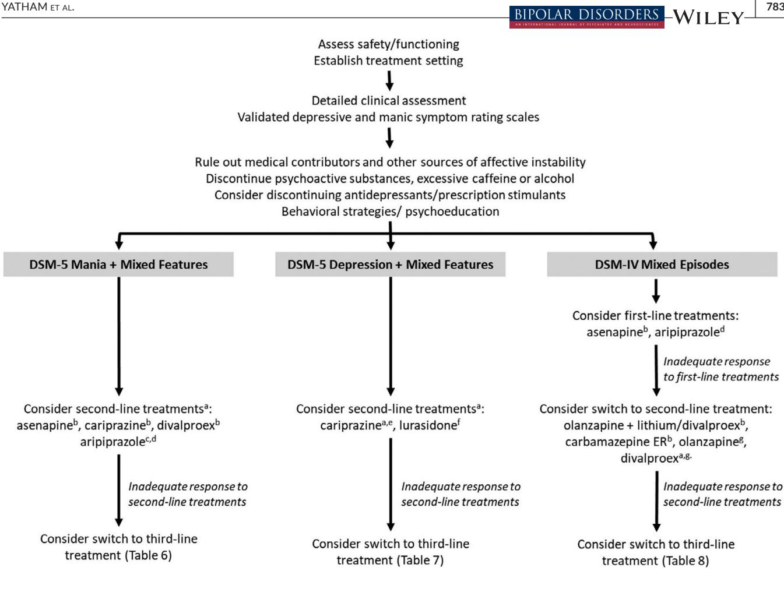

# **ORIGINAL ARTICLE**

# **Canadian Network for Mood and Anxiety Treatments (CANMAT) and International Society for Bipolar Disorders (ISBD) recommendations for the management of patients with bipolar disorder with mixed presentations**

**Lakshmi N. Yatham1** | **Trisha Chakrabarty[1](https://orcid.org/0000-0002-2262-8697)** | **David J. Bond2** | **Ayal Schaffer3** | **Serge Beaulieu4** | **Sagar V. Parikh5** | **Roger S. McIntyre[3](https://orcid.org/0000-0003-4733-2523)** | **Roumen V. Milev6** | **Martin Alda7** | **Gustavo Vazquez6** | **Arun V. Ravindran3** | **Benicio N. Frey[8](https://orcid.org/0000-0001-8267-943X)** | **Verinder Sharma[9](https://orcid.org/0000-0002-9885-8245)** | **Benjamin I. Goldstein3** | **Soham Rej4** | **Claire O'Donovan7** | **Valerie Tourjman10** | **Jan-Marie Kozicky11** | **Marcia Kauer-Sant'Anna12** | **Gin Malhi13** | **Trisha Suppes14** | **Eduard Vieta1[5](https://orcid.org/0000-0002-0548-0053)** | **Flavio Kapczinski8** | **Shigenobu Kanba16** | **Raymond W. Lam1** | **Sidney H. Kennedy3** | **Joseph Calabrese17** | **Michael Berk18** | **Robert Post19**

1 Department of Psychiatry, University of British Columbia, Vancouver, British Columbia, Canada

2 Department of Psychiatry and Behavioral Sciences, University of Minnesota Medical School, Minneapolis, Minnesota, USA

3 Department of Psychiatry, University of Toronto, Toronto, Ontario, Canada

4 Department of Psychiatry, McGill University, Montreal, QC, Canada

5 Department of Psychiatry, University of Michigan, Ann Arbor, Michigan, USA

6 Department of Psychiatry, Queens University, Kingston, Ontario, Canada

7 Department of Psychiatry, Dalhousie University, Halifax, Nova Scotia, Canada

8 Department of Psychiatry and Behavioural Neurosciences, McMaster University, and St. Joseph's Healthcare, Hamilton, Ontario, Canada

9 Departments of Psychiatry and Obstetrics & Gynaecology, Western University, London, Ontario, Canada

10Department of Psychiatry and addiction, University of Montreal, Montreal, QC, Canada

11Vancouver, British Columbia, Canada

12Department of Psychiatry, Universidade Federal do Rio Grande do Sul, Porto Alegre, Brazil

13Department of Psychiatry, University of Sydney, Sydney, Australia

14Department of Psychiatry and Behavioural Sciences, Stanford School of Medicine and VA Palo Alto Health Care System, Palo Alto, California, USA

15Hospital Clinic, Institute of Neuroscience, University of Barcelona, IDIBAPS, CIBERSAM, Barcelona, Catalonia, Spain

16Department of Neuropsychiatry, Kyushu University, Fukuoka, Japan

17Department of Psychiatry, Western Reserve University, Cleveland, Ohio, USA

18IMPACT – the Institute for Mental and Physical Health and Clinical Translation, School of Medicine, Barwon Health, Deakin University, Geelong, Australia

19Department of Psychiatry, George Washington University, Washington, District of Columbia, USA

This publication is dedicated to the memory of Dr. Glenda MacQueen (1965–2020).

© 2021 John Wiley & Sons A/S. Published by John Wiley & Sons Ltd

#### **Correspondence**

Lakshmi N. Yatham, Mood Disorders Centre, University of British Columbia and UBC Hospital, Room 2C7 - 2255 Wesbrook Mall, Vancouver, BC V6T 2A1, Canada. E-mail: [yatham@mail.ubc.ca](mailto:yatham@mail.ubc.ca)

### **Abstract**

**Objectives:** The 2018 Canadian Network for Mood and Anxiety Treatments (CANMAT) and International Society for Bipolar Disorders (ISBD) guidelines provided clinicians with pragmatic treatment recommendations for bipolar disorder (BD). While these guidelines included commentary on how mixed features may direct treatment selection, specific recommendations were not provided—a critical gap which the current update aims to address.

**Method:** Overview of research regarding mixed presentations in BD, with treatment recommendations developed using a modified CANMAT/ISBD rating methodology. Limitations are discussed, including the dearth of high-quality data and reliance on expert opinion.

**Results:** No agents met threshold for first-line treatment of DSM-5 manic or depressive episodes with mixed features. For mania + mixed features second-line treatment options include asenapine, cariprazine, divalproex, and aripiprazole. In depression + mixed features, cariprazine and lurasidone are recommended as second-line options. For DSM-IV defined mixed episodes, with a longer history of research, asenapine and aripiprazole are first-line, and olanzapine (monotherapy or combination), carbamazepine, and divalproex are second-line. Research on maintenance treatments following a DSM-5 mixed presentation is extremely limited, with third-line recommendations based on expert opinion. For maintenance treatment following a DSM-IV mixed episode, quetiapine (monotherapy or combination) is first-line, and lithium and olanzapine identified as second-line options.

**Conclusion:** The CANMAT and ISBD groups hope these guidelines provide valuable support for clinicians providing care to patients experiencing mixed presentations, as well as further influence investment in research to improve diagnosis and treatment of this common and complex clinical state.

**KEYWORDS** bipolar disorder, guidelines, mixed features, pharmacotherapy

# **1** | **INTRODUCTION**

### **1.1** | **Purpose**

Since 1997, the Canadian Network for Mood and Anxiety Treatments (CANMAT) has regularly published guidelines for the management of bipolar disorder (BD).1–5 The most recent version, published in collaboration with the International Society for Bipolar Disorders (ISBD), combined a rigorous review of current research evidence with expert clinical opinion to develop hierarchical recommendations for treatment of acute mania, depression, and maintenance in bipolar I (BDI) and bipolar II (BDII) disorders.5 While these 2018 guidelines included commentary on how clinical features such as mixed features may help direct treatment selection, a thorough description of the complexities surrounding diagnosis and management of mixed presentations were lacking.

This is a critical gap. While there is significant variability across samples,6 a recent systematic review concluded that an average of 35% of people with either mania or depression in BD present with **TABLE 1** Characteristics of bipolar disorder with mixed presentations

| Earlier age of onset                                   |
|--------------------------------------------------------|
| Increased risk for hospitalization                     |
| Higher rates of medical and psychiatric comorbidities  |
| Poorer treatment response                              |
| More frequent and severe episodes (less time euthymic) |
| Poorer response to maintenance treatments              |
| Higher risk for suicidal behavior                      |

mixed features (as defined by DSM-5).7 These symptoms have important prognostic implications (Table 1), with individuals experiencing an earlier age of onset, increased risk of psychiatric hospitalization, increased comorbid anxiety or substance use,6,8–12 as well as higher rates of medical illness including hyperlipidemia and hypothyroidism.13,14 Acute mixed presentations are an important risk factor for suicidal behavior,15 and individuals with predominantly mixed presentations have a high lifetime risk of suicide attempts.16,17 Effective acute and long-term management of mixed presentations remains a challenge: mixed presentations have poorer treatment response than "pure" depressive or manic episodes in the acute phase,13 and longitudinally individuals with mixed presentations manifest more frequent and severe episodes, spend less time in euthymia, and exhibit poorer response to maintenance treatment.13,18

The purpose of these guidelines is to focus specifically on mixed presentations in patients with BD and provide up-to-date recommendations regarding treatments, following the format and rigor of the 2018 CANMAT/ISBD Guidelines for the Management of Bipolar Disorder.5 Although there are other guidelines which address the issue of mixed presentations,19,2021 none have applied CANMAT/ ISBD methodology of combining research evidence with clinical expertise in order to develop pragmatic recommendations supported by narrative descriptions. This approach allows clinicians to better understand gaps in evidence or controversy in expert opinion—a feature which is of particular importance in mixed episodes due to the high level of complexity.

### **1.2** | **Format**

The evolving diagnostic criteria for mixed presentations in BD (described further in Section 2.1) create a unique challenge in synthesizing the evidence base for treatment. Most studies have used the previous DSM-IV mixed episode criteria.22 Relatively few investigations have directly used the more permissive DSM-5 mixed features specifier23; rather post-hoc approximation ("proxy criteria") or other related diagnostic schemes have been favored. To acknowledge this complexity and to avoid excluding applicable evidence, we included all studies that examined the efficacy of an intervention for the treatment or prevention of a mixed presentation of BD, so long as the criteria used to define that mixed presentation was described. To encapsulate the types of mixed presentations most commonly studied, the acute treatment of mixed presentations is divided into three sections: DSM-5 manic episodes with mixed features (presentations consisting of predominantly manic symptoms with some depressive features), DSM-5 depressive episodes with mixed features (presentations consisting of predominantly depressive symptoms with some manic features), and DSM-IV mixed episodes (concurrent syndromal manic and depressive episodes). While previous versions of the CANMAT/ISBD guidelines have included a separate section for BDII, the lack of evidence in mixed presentations does not allow inclusion of this subpopulation in this update (see Figure 1). Where a study specifically examines cohorts with BDII, this is noted in the text/table.

Following a detailed longitudinal assessment (Section 2.2), clinicians should use their global impression of their patient to guide them to the appropriate treatment section, using Table 2 as a guide. For example, for a patient experiencing a predominantly manic episode with some depressive symptoms, clinicians may consult Section 3.1 (Management of DSM-5 Manic Episodes with Mixed Features). If manic and depressive symptoms appear to be equally prominent, Section 3.3 (Management of DSM-IV Mixed Episodes) may provide the most useful information.

# **1.3** | **Level of Evidence and Line of Treatment Rating Criteria: Updates and Limitations**

The criteria for rating levels of evidence (Table 3) and providing treatment recommendations (Table 4) for mixed presentations have been

# **Mixed presentaons in bipolar II disorder: Common yet understudied**

Bipolar II disorder (BDII) is understudied compared to bipolar I disorder (BDI), and this disparity is even more marked when it comes to mixed presentaons. Our review yielded only two treatment studies that examined cohorts with BDII, with one exclusively recruing parcipants with BDII experiencing hypomania + depressive features (Secon 3.1) and the second recruing parcipants with either MDD or BDII experiencing depression + mixed features (Secon 3.2).81,95

Diagnosc criteria in previous iteraons of the DSM are a prime contributor to this paucity of evidence, as according to DSM-IV schema, the presence of a mixed episode automacally led to a diagnosis of BDI.22 It was only with the advent of the DSM-5 that mixed features in BDII depression or hypomania were formally acknowledged, thus allowing for standardized research. Such invesgaon is urgently needed, as mixed features appear to be at least as prevalent in BDII depression as in BDI depression, whether using DSM-5 or more liberal criteria.10,18

Due to the dearth of evidence, this guideline update does not have a separate secon on management of mixed presentaons in BDII. Clinicians may consider the recommendaons in these guidelines to tailor treatments for the management of paents with BDII based on individual symptom profile. This is not meant to suggest that evidence for the management of mixed presentaons in BDI is directly translatable to mixed presentaons in BDII, just as management of 'pure' mood episodes is not completely analogous between BD subtypes. Rather, we would urge clinicians to be aware of the limitaons in the current data and consider the recommendaons for both BDII 'pure' episodes and BDI mixed episodes to tailor treatments for those with BDII mixed presentaons as we await further research.

adapted from those used in the 2018 CANMAT/ISBD Guidelines.5 Changes were made to the level of evidence rating criteria, to reflect the unique limitations from the limited research in mixed presentations. Studies which applied proxy criteria to identify participants with mixed features from larger clinical trials were downgraded a

#### **TABLE 2** Organization of CANMAT/ISBD Guidelines for Management of Mixed Presentations

#### Section 1: Introduction

- Section 2: Foundations of Management
- Section 3: Management of Acute Mixed Presentations
- 3.1 DSM-5 Mania + Mixed Features
- Level of evidence ratings and treatment recommendations for patients with syndromal manica episodes concurrent with subsyndromal depressive symptoms
- 3.2 DSM-5 Depression + Mixed Features
- Level of evidence ratings and treatment recommendations for patients with syndromal depressive episodes concurrent subsyndromal manica symptoms
- 3.3 DSM-IV Mixed Episodes
- Level of evidence ratings and treatment recommendations for patients for concurrent syndromal manica and depressive episodes
- Section 4: Maintenance Treatment following an Index Mixed Presentation
- Section 5: Management of Mixed Presentations in Specific Populations
- 5.1 Children and Adolescents
- 5.2 Older Adults
- 5.3 Peripartum

#### Section 6: Conclusion

a While previous versions of the CANMAT/ISBD guidelines have included a separate section for BDII, the lack of evidence in mixed presentations does not allow for this to be included in this supplement. Rather, recommendations provided for acute and maintenance treatment apply primarily to BDI. Where a study specifically examines participants with BDII, this is noted in the text/table.

level of evidence (Figure 2), as were those which used combined samples of participants with mixed and manic episodes and did not report results from mixed individuals separately.

Notably, as a specific intervention may have demonstrated efficacy in managing symptoms for one polarity but not another during a mixed presentation, levels of evidence for mania [M] and depressive [D] symptoms are rated separately. However, each agent is only given one line of treatment recommendation based on rating criteria for the primary pole (i.e., mania in mania with mixed features, and depression in depression + mixed features). Mania was also used as the primary pole for DSM-IV mixed episodes, as studies almost exclusively reported on outcomes for manic but not depressive symptoms. In cases where an agent may have evidence for one polarity but results for the other pole are inconclusive or were not reported, either a "Level 4" rating (based on expert opinion) was applied where there was evidence from "pure" mood states and clinical experience to support use for that polarity in mixed presentations, or "Ins" (insufficient evidence) when there were doubts about this use. Likewise, first- and second-line agents from the 2018 guidelines with evidence for efficacy in mood episodes which had nonexistent or inconclusive data for mixed presentations were rated as "Level 4," based on expert opinion, when clinical experience supported use in mixed presentations, and "Ins" in cases without this support (Figure 3). Agents were assigned treatment recommendations for maintenance based on their evidence for preventing any mood episode following an index mixed presentation episode; specific ratings are not provided for prevention of specific mood episode types (manic, depressed, or mixed) due to limitations in available evidence.

As outlined in the 2018 guidelines, BD should be treated as a chronic lifetime condition, and preference should be given to agents with evidence for efficacy across the spectrum of illness. To reinforce this approach, agents within a line of treatment are listed in order of evidence for efficacy in treating symptoms of the primary

| Level 1 | Meta-analysis with narrow confidence interval or replicated double-blind (DB), randomized controlled trials (RCT) that include a placebo or active control comparison (n ≥ 30 participants with mixed presentations/featuresc in each treatment arm) |
|---------|------------------------------------------------------------------------------------------------------------------------------------------------------------------------------------------------------------------------------------------------------------------|
| Level 2 | Meta-analysis with wide confidence interval or one DB RCT with placebo or active control comparison condition (n ≥ 30 participants with mixed presentations/featuresc in each treatment arm)                                                            |
| Level 3 | At least one DB RCT with placebo or active control comparison condition (n = 10–29 participants with mixed presentations/featuresc in each treatment arm), or health system administrative data                                                         |
| Level 4 | Uncontrolled trial, anecdotal reports, or expert opinionb                                                                                                                                                                                                        |
| Ins     | Insufficient evidence to provide rating                                                                                                                                                                                                                          |

a Level of evidence ratings is provided for acute manic [M] and depressive [D] symptoms separately. b When Level 4 ratings are based on expert opinion this is specifically denoted in the text and table. c Meta-analysis or DB RCT which used proxy criteria to define mixed features, was a post-hoc, subgroup, or regression analysis, or did not report results from mixed participants separately was downgraded one Level.

**TABLE 3** Criteria for Level of Evidence Ratingsa

pole, followed by evidence for efficacy in the subsyndromal opposing pole (or depressive symptoms in DSM-IV defined mixed episodes), then finally by evidence for efficacy in maintenance. Given the limitations in data, this should not be viewed as strictly as the hierarchical ranking present in the 2018 guidelines.

It is important to reiterate that this guideline for patients with mixed presentations attempts to address the many limitations in the literature using the above-described adjustments to the rating criteria, as the overall quantity and quality of the literature for mixed presentations is not as high as that used to generate the 2018

|  |  | TABLE 4 Criteria for Line of Treatment Recommendations |  |
|--|--|--------------------------------------------------------|--|
|--|--|--------------------------------------------------------|--|

| First-Line                 | Level 1 or level 2 evidence for efficacy in primary mood polea , plus clinical support for safety/tolerability and low risk of treatment-emergent switchb |
|----------------------------|-----------------------------------------------------------------------------------------------------------------------------------------------------------------------|
| Second-Line                | Level 3 or higher evidence for efficacy in primary mood polea , plus clinical support for safety/tolerability and low risk of treatment-emergent switchb  |
| Third-Line                 | Level 4 evidence or higher for efficacy in primary mood polea , plus clinical support for safety/tolerabilityb                                               |
| Further Research Needed | Insufficient evidence to provide recommendation                                                                                                                    |
| Not Recommended            | Level 1 evidence for lack of efficacy, or level 2 evidence for lack of efficacy plus expert opinion                                                             |

a Primary pole is mania in DSM-5 mania + mixed features, depression in DSM-5 depression + mixed features, and mania in DSM-IV mixed episodes.

b For further information on safety/tolerability and treatment-emergent switch ratings please see Yatham et al. 2018.5

CANMAT/ISBD guidelines for "pure" episodes. Thus, these recommendations should be viewed with additional prudence and caution and with continuing consideration of the evolving evidence in this field.

# **1.4** | **Foundations of Management**

#### **1.5** | **Conceptualization of Mixed** Presentations

Mixed presentations were first conceptualized 50 yr after the initial description of BD as "la folie circulaire," with detailed, longitudinal observations showing that a significant proportion of patients did not fit neatly into "pure" manic or depressed presentations.24,25 This led to the historical classification of symptoms of BD into three domains mood, activity, and thought. In "pure" manic or depressive states, these domains were altered in the same direction (e.g., mood elevation, psychomotor activation, and grandiosity in mania, and sadness, psychomotor slowing, and negative/hopeless thoughts in depression). In "mixed states," however, the domains were altered in incongruent directions, with up to six possible phenotypes—anxious or depressive mania, agitated depression, mania with thought inhibition, manic stupor, depression with flight of ideas, or inhibited mania.26,27

The DSM-III and DSM-IV departed from this flexible description by defining bipolar mixed episodes as a distinct subset of manic episodes; wherein diagnostic criteria for both a manic and major depressive episode were simultaneously met, nearly every day, for at least a week.22 These criteria drew criticism for being too stringent in clinical practice,28 with subsequent data from a range of sources demonstrating that a substantial proportion of mixed presentations consisted of subsyndromal symptoms of the opposite polarity, providing support for a more nuanced approach.12,18,29,30

# **Use of medicaons studied for "pure" mood episodes in the treatment of mixed presentaons**

While several medicaons are known to be effecve for the treatment of symptoms in the context of "pure" manic or depressive episodes, many have not been studied in the context of mixed presentaons. A good example is queapine, which has strong evidence for efficacy in treang both "pure" manic and depressive episodes5 but has not been formally assessed for efficacy in parcipants with mixed features.

As there is no conclusive evidence that efficacy in "pure" episodes of either polarity translates to efficacy in treang symptoms of the same polarity in the context of mixed presentaons, the guideline authors used their clinical experience and experse to inform recommendaons in these guidelines. This is because the authors agreed that while clinical experience suggests some agents which are efficacious in "pure" mood states are also effecve for mixed presentaons, this is not universal.

Thus, in order to acknowledge the possible role and highlight limitaons of first- and second-line agents for "pure" mood episodes in treatment of mixed presentaons, a decision was made to provide a "Level 4" rang for those which expert opinion supported effecveness in mixed states—allowing for a third-line treatment recommendaon. In cases where clinical experience did not support this use, a rang of "Ins" (insufficient data) was provided, and further research is recommended.

**FIGURE 3** Level of evidence rating for agents studied in "pure" but not mixed presentations [Colour figure can be viewed at

**FIGURE 4** Dimensional Model of "Pure" versus Mixed Bipolar Presentations. Adapted from McElroy & Keck31 [Colour figure can

With the DSM-5, the American Psychiatric Association attempted to rectify these concerns by creating the "mixed features" specifier, which may be added to either a manic or depressive episode when three or more symptoms from the opposite pole are present.23 This change broadened the conceptualization of mixed presentations in BD to a spectrum incorporating subthreshold symptoms of the opposite pole (Figure 4).31 While the DSM-5 criteria were acknowledged to be a likely improvement in capturing the heterogeneity of mixed presentations, it is not without criticism. For example, the number of opposite pole symptoms (three) required to meet criteria for the specifier is not clearly based on empirical evidence. Moreover, the exclusion of the overlapping symptoms of distractibility, irritability, and psychomotor agitation may decrease sensitivity,32 as these overlapping symptoms are highly correlated with mixed presentations.33 Furthermore, "mixed features" under the DSM-5 are not synonymous with other existing definitions of "mixed mood," contributing to further variability in diagnosis13,34 Future iterations of the mixed features criteria are expected as the DSM-5 established the mixed features specifier as an interim definition, subject to further refinement as research identifies more optimal diagnostic approaches.

# **1.6** | **Assessment and Diagnosis of DSM-5 Mixed Features**

To qualify for the DSM-5 mixed features specifier, an individual who meets full criteria for a hypomanic/manic or depressive episode must also experience at least three non-overlapping symptoms from the opposing pole during the majority of the days of the current episode.23 Clinical experience indicates that the mixed symptoms may be continuously present, or manifest sporadically (e.g., depression + mixed features is sometimes characterized by "bursts" of time with increased energy or racing thoughts). Similar to any mood episode in BD, these symptoms must represent a change from usual behavior and not be attributable to the physiological effects of a substance or a medical condition (Table 5).23

Several strategies for systematically assessing mixed symptoms are available in clinical practice. It is important that characterization occurs at baseline as well as follow-up, as mixed presentations may

#### **TABLE 5** DSM-5 diagnostic criteria for mixed features

#### **Manic or Hypomanic Episode with Mixed Features Depressive Episode with Mixed Features**

- Full criteria are met for a manic episode or hypomanic episode, and at least three of the following symptoms are present during the majority of days of the current or most recent episode of mania or hypomania:
- -Prominent dysphoria or depressed mood as indicated by either subjective report (e.g., feels sad or empty) or observation made by others (e.g., appears tearful).
- Diminished interest or pleasure in all, or almost all, activities (as indicated by either subjective account or observation made by others).
- Psychomotor retardation nearly every day (observable by others; not merely subjective feelings of being slowed down).
- Fatigue or loss of energy.
- Feelings of worthlessness or excessive or inappropriate guilt (not merely self-reproach or guilt about being sick).
- - Recurrent thoughts of death (not just fear of dying), recurrent suicidal ideation without a specific plan, or a suicide attempt or a specific plan for committing suicide.

#### *For both polarities:*

- Mixed symptoms are observable by others and represent a change from the person's usual behavior.
- The mixed symptoms are not attributable to the physiological effects of a substance (e.g., a drug of abuse, a medication, and other treatment) or a medical condition.
- For individuals whose symptoms meet full episode criteria for both mania and depression simultaneously, the diagnosis should be manic episode, with mixed features, due to the marked impairment and clinical severity of full mania.

represent a transition from one pole to another rather than a de novo episode.13 A detailed and longitudinal appraisal is required to clarify the diagnosis, which may be further confounded by personality, substance use, and/or anxiety comorbidity.35–38

Clinicians may use the Montgomery Asberg Depression Rating Scale (MADRS)39 and the Young Mania Rating Scale (YMRS)40 to evaluate severity of depressive and manic symptoms, respectively, in patients with mixed presentations. The Clinically Useful Depression Outcome Scale for the DSM-5 mixed features specifier (CUDOS-M) scale is the only tool which specifically matches DSM-5 criteria for the depressive mixed features specifier (i.e., excluding overlapping hypomanic/manic symptoms).41 Sachs et al. developed a clinical monitoring form that rates DSM-5 symptoms of mania and depression without specifically excluding overlapping symptoms.42,43 Another recommended approach is to combine a validated self-report depression scale (such as the Beck Depression Inventory (BDI),44 Patient Health Questionnaire-9 (PHQ-9),45 or Quick Inventory of Depressive Symptomatology Self-Report (QIDS-SR)46 with a scale assessing mania such as the Altman Self-Rating Mania Scale.47 Additional scales, such as the Bipolar Depression Rating Scale which includes a mixed symptoms subscale,48 and Koukopoulos Mixed Depression Rating Scale (KMDRS)24,49 are available as tools for assessing depression + mixed features. The items used in the KMDRS do not overlap with symptoms included in either DSM-IV or DSM-5 definitions and are thus not recommended.

Following detection of a possible mixed presentation, a detailed longitudinal clinical history, physical exam, and laboratory investigations is necessary to rule out other potential contributors and conditions. The differential diagnosis for a mixed presentation includes medical conditions, such as endocrinological disturbances (hypo- or hyperthyroidism, and hypo- or hyperglycemia), hematological abnormalities (such as anemia), or neurological insults (such as seizure, head injury, or cerebrovascular event). Assessment for personality disorders, especially borderline personality disorder, and other psychiatric disorders such as anxiety and attention-deficit hyperactivity disorder are important as these can present with phenotypes which overlap with mixed states. Substance use (including stimulants, opioids, or alcohol) may also complicate mood presentations.13 The presence of substance use should be actively elicited by clinicians by reviewing the patient's history, obtaining a detailed substance use history, examining for physical signs of intoxication, withdrawal, and/or long-term use, collateral information, and blood/ urine testing.

Clinicians should also ascertain whether the mixed presentation may have been iatrogenically induced. For example, if a person with mixed symptoms is being treated with antidepressants (especially dual reuptake inhibitors) or amphetamine/non-amphetamine (e.g., modafinil) stimulants, which have the potential to precipitate, aggravate, or perpetuate these features, a dose taper or discontinuation should be considered.50 The likelihood that an agent such as an antidepressant or stimulant is causally related to the development of mixed symptoms is increased if a) the mixed presentation began immediately or shortly after initiating treatment with the agent or increasing the dose, b) the symptoms are inconsistent with prior illness course in occurrence, severity, or duration, c) the agent was previously associated with the development of mixed presentations in the person, and d) the agent is known to have increased risk for inducing mania (with tricyclic antidepressants and serotonin–norepinephrine

- Full criteria are met for a major depressive episode, and at least three of the following manic/hypomanic symptoms are present during the majority of days of the current or most recent episode of depression:
- Elevated, expansive mood. - Inflated self-esteem or grandiosity.
- More talkative than usual or pressure to keep talking.
- Flight of ideas or subjective experience that thoughts are racing.
- Increase in energy or goal-directed activity (either socially, at work or school, or sexually).
- Increased or excessive involvement in activities that have a high potential for painful consequences (e.g., engaging in unrestrained buying sprees, sexual indiscretions, or foolish business investments).
- Decreased need for sleep (feeling rested despite sleeping less than usual; to be contrasted with insomnia).

reuptake inhibitors posing greater risk than SSRIs or bupropion).50 The potential benefits of tapering/discontinuing the agent should be weighed against potential risks (e.g., worsening of depression with discontinuation of antidepressants). Patients should be monitored to ensure mixed presentations improve with taper/discontinuation and that depressive symptoms do not worsen.

Treatment-emergent mixed features during antidepressant therapy may be a prognostic indicator, as only a subset of patients with depression in BD develop mixed symptoms in response to adjunctive antidepressant treatment.51–53 The occurrence of such switching may suggest an underlying vulnerability or propensity to mood instability. A higher rate of antidepressant treatment-emergent manic symptoms is seen in BDI compared to BDII.54,55 However, the similarities and differences between "endogenous" mixed presentations and those that emerge after antidepressant treatment need to be examined further to determine whether the consequences of such episodes differ.

It is also important to note that antipsychotics, lithium, or divalproex used to treat mania may cause sedation, emotional blunting, or psychomotor slowing that could mimic depressive symptoms within a mixed presentation.56 Additionally, akathisia resulting from an antipsychotic may be confused for psychomotor agitation or restlessness.57 Clinicians should therefore compare the onset of mixed-type symptoms against the timeline for recent introduction or changes in such medications as well.

### **1.7** | **Suicide Risk**

Mixed presentations are consistently associated with an increased risk of suicide attempts.58–60 Indeed, mixed features may be the strongest risk factor for suicidality in BD,15 associated with a 65-fold increase in likelihood of a suicide attempt.61 Emerging research further suggests that the increase in suicide risk may be primarily attributable to the severity of depressive symptoms; the risk is higher in mania + mixed features compared with mania but equivalent between depression + mixed features and depression.62,63

As described in the 2018 CANMAT/ISBD Guidelines,5 it is imperative for clinicians to review suicide risk factors and determine an appropriate treatment setting to address safety issues. Safety planning, psychological support, and self-care strategies to support ongoing management of suicidal ideation should be encouraged for all persons at risk, including those with prior attempts and/or those in the post-hospitalization period.59,64,65

# **1.8** | **Role of Psychosocial Strategies**

While the purpose of these guidelines is to outline the evidence base and recommendations for pharmacological management of mixed states, the importance of psychosocial strategies must also be acknowledged. In the 2018 Guidelines, adjunctive psychological treatments were recommended for acute depressive episodes, as well as in maintenance treatment to prevent relapse and to restore quality of life.5 While there are no studies which specifically examined the impact of non-pharmacological interventions on mixed presentations, expert opinion supports the use of psychoeducation and/or other evidence-based psychosocial interventions with evidence in bipolar mood states, along with modules addressing suicide risk and anxiety management, as adjuncts for treating acute mixed presentations and preventing relapse.66

# **2** | **MANAGEMENT OF ACUTE MIXED PRESENTATIONS**

# **2.1** | **Management of DSM-5 Manic Episodes with Mixed Features**

This section addresses the treatment of acute manic episodes with mixed depressive features. Ratings and recommendations are based predominantly on studies of participants who met DSM-5 proxy criteria (see Figure 2) but also include studies of those with manic episodes with fewer than three concurrent depressive symptoms, or symptom rating scale cut-offs consistent with syndromal manic episode and subsyndromal depressive symptoms. Thus, ratings and recommendations summarized below and in Table 6 best apply to patients who are experiencing a predominantly manic episode with additional depressive symptoms.

#### 2.1.1 | Presentation

Approximately one third of patients with mania meet DSM-5 criteria for mixed features.7 Anxiety, irritability, and agitation are commonly reported symptoms,60 along with depressed mood, pathological guilt, suicidal tendency, anhedonia, and fatigue.67 Although the mixed features specifier is considered an advance from DSM-IV criteria for mixed episodes, there are still strong criticisms against the DSM-5—including arguments regarding the number of depressive symptoms required to meet threshold for mixed features, exclusion of melancholic or atypical depressive symptoms, and inadequate consideration of anxiety.28,31,68

#### 2.1.2 | Treatment Recommendations

*First-Line*: There are no agents with sufficient evidence to be recommended as first-line for the acute treatment of DSM-5 manic or depressive symptoms in a manic episode with mixed features. Therefore, second-line agents should be considered for initial treatment selection.

*Second-Line*: Asenapine (Level 3[M], Level 3[D]), cariprazine (Level 3[M], Level 3[D]), divalproex (Level 3[M]), Level 4 [D]), and aripiprazole (Level 3[M], Ins [D]) are recommended as second-line treatments for mania + mixed features.

 YATHAM et al. **| 775**

#### **TABLE 6** Level of evidence ratings and recommendations for DSM-5 Mania + mixed features

|                                     | Acute mania + mixed features |                              | Maintenance            |
|-------------------------------------|------------------------------|------------------------------|------------------------|
|                                     | Mania                        | Depressive mixed features | treatment a |
| First-line                          |                              |                              |                        |
| None determined                     |                              |                              |                        |
| Second-line                         |                              |                              |                        |
| Asenapine                           | $\bigcirc$                   |                              | $\mathbf{C}$           |
| Cariprazine                         |                              |                              | $\mathbf{C}$           |
| Divalproex                          |                              | $\bigcap C$                  | $\mathbf{C}^c$         |
| Aripiprazole                        |                              | Ins                          | Ins                    |
| Third-line                          |                              |                              |                        |
| Ziprasidoneb                        | $\bigcirc$                   | $\bullet$                    | Ins                    |
| Olanzapineb                         |                              | $\mathbf{C}$                 | $\bigcirc$             |
| Olanzapine + lithium/divalproex $b$ |                              |                              | $\bigcirc$             |
| Quetiapine                          | $\bigcap C$                  | $\bigcap$                    | $\mathbf{C}$           |
| Carbamazepine ER b       | $\mathbf{C}$                 | $\mathbf{C}$                 | $\mathbf{C}$           |
| ECT                                 | $\mathbf{C}$                 | $\mathbf{C}^c$               | $\mathbf{C}^c$         |
| Further research needed             |                              |                              |                        |
| Lithium                             | Ins                          | Ins                          | $\mathbf{C}$           |
| Lurasidone                          | Ins                          | Ins                          | Ins                    |
| Paliperidone                        | Ins                          | Ins                          | Ins                    |
| Risperidone                         | Ins                          | Ins                          | Ins                    |
|                                     |                              |                              |                        |

Level 3 evidence for efficacy; Level 4 evidence for efficacy.

DVP, divalproex; ECT, electroconvulsive therapy; ER, extended release; Ins, insufficient evidence; Li, lithium.

a Prevention of any mood episode following resolution of a DSM-5 mania + mixed episode.

b Possible safety/tolerability concerns.

d Studies done in Bipolar II Disorder.

Asenapine (Level 3[M], Level 3[D]) has evidence from post-hoc analyses applying proxy criteria for DSM-5 mixed features from three double blind RCTs.69 Furthermore, another post-hoc analysis which examined participants who were manic and had at least moderate to severe depressive symptoms (identified by MADRS scores) confirmed that asenapine was more effective than placebo in improving manic and depressive symptoms in this presentation.70 Cariprazine (Level 3[M], Level 3 [D]) showed clear efficacy for manic symptoms in participants who met the proxy criteria for mixed features; however, the efficacy for improving depressive symptoms was apparent only in those who had a baseline MADRS score of ≥10,71 indicating that the efficacy is not as apparent in those with minimal concurrent depressive symptoms (floor effect). In a posthoc analysis of a RCT, the efficacy of divalproex (Level 3[M]), Level 4 [D]) was evaluated in participants with mania + mixed features, defined as at least two depressive symptoms endorsed from the Schedule for Affective Disorders and Schizophrenia-Change Version (SADS-C) and/or Affective Disorders Rating Scale (ADRS).72 While divalproex was equally effective in treating mania and mixed mania, and more effective than lithium in improving manic symptoms in mixed mania, specific outcomes for depressive symptoms were not reported. Given that divalproex has efficacy in treating bipolar depression and expert opinion supports its utility in improving depressive symptoms in patients with mania + mixed features, it is given a Level 4 evidence rating for this pole. In a posthoc analysis of participants with DSM-IV mania or mixed episodes, aripiprazole (Level 3[M], Ins [D]) was equally efficacious for manic symptoms in those with low (MADRS ≤8), intermediate (MADRS 9–18), or high (MADRS >18) concurrent depressive symptoms; although depressive outcomes were not reported.73 While there is negative evidence for aripiprazole in depression,74,75 it has been shown to have a potential benefit for treating depressive symptoms in DSM-IV mixed episodes73,76 and is thus given a rating of "Ins" for depressive mixed features.

c Expert opinion.

*Third-Line*: Ziprasidone (Level 3[M], Level 3[D]), olanzapine monotherapy (Level 3[M], Level 4[D]), olanzapine + lithium/divalproex (Level 4[M], Level 4[D]), quetiapine (Level 4[M]), Level 3[D]), carbamazepine extended release (Level 4[M] Level 4[D]), and ECT (Level 4[M], Level 4[D]) are recommended as third-line treatments for mania + mixed features. As with prior iterations of the CANMAT/ISBD guidelines, concern with safety/tolerability for olanzapine, carbamazepine, and ziprasidone was considered in the recommendations.5

Ziprasidone (Level 3[M], Level 3[D]) has evidence for efficacy versus placebo for both mood polarities based on a post-hoc analysis of participants from two large RCTs with acute mania and at least two concurrent depressive symptoms.77 Olanzapine monotherapy (Level 3[M], Level 4[D]) had superior efficacy compared to placebo in reducing symptoms of mania in a post-hoc analysis using DSM-5 proxy criteria, although improvement in depressive symptoms was not statistically significant (*p* = 0.061).78 As olanzapine has evidence for efficacy in alleviating depressive symptoms in depression + mixed features (see Section 3.2) as well as depression,5 expert opinion supports a Level 4[D] rating here. Olanzapine in combination with lithium or divalproex (Level 4[M], Level 4[D]) has been shown to provide benefits for managing manic and depressive symptoms in participants with "dysphoric mania" in one open label, uncontrolled study and one naturalistic study compared to combination therapy with other antipsychotics (mostly haloperidol or levomepromazine).79,80 Quetiapine (Level 4[M]), Level 3[D]), has not been assessed in treating DSM-5 manic episodes with mixed features. However, a small RCT which recruited participants with BDII experiencing hypomanic and depressive symptoms (mean YMRS score = 21, mean MADRS score = 28), showed significant improvements in depressive but not in hypomanic symptoms.81 The lack of improvement in hypomanic symptoms in this study may have been due to the low dose of quetiapine (<300 mg/day), which is below the dose range typically used to treat mania. Moreover, quetiapine has substantial efficacy in treating mania, along with evidence for preventing manic episodes in maintenance treatment. Thus, expert opinion is that it is also useful in treatment of manic symptoms in patients with mania + mixed features. Carbamazepine extended release (Level 4[M] Level 4[D]) has not been investigated in mania + mixed features, but expert opinion supports this use. Clinical experience is consistent with the pooled data of carbamazepine studies of participants with DSM-IV mixed episodes, which showed efficacy in treating both manic and depressive symptoms.82

While ECT has not been studied in participants with DSM-5 mania + mixed features, the expert opinion is that it is effective in such cases (Level 4[M] Level 4[D]). We recommend that ECT be reserved for severely unwell patients who have not responded to recommended pharmacotherapy with second- and third-line options.

*Further research needed*: While lithium, paliperidone, and risperidone are recommended for manic episodes, and lithium and lurasidone for depression,5 these agents have not been adequately studied for mania + mixed features, and expert opinion does not support this use. Thus, further evaluation is needed before recommendations can be made about their usefulness for this presentation.

*Not Recommended*: While first-generation antipsychotics such as haloperidol have been shown to be effective in treating manic episodes, there is no evidence to suggest that they have any efficacy in improving depressive symptoms. Furthermore, haloperidol has been shown to increase the risk of depression when used to treat mania.83 Hence, we do not recommend using first-generation antipsychotics for treating mania + mixed features.

# **2.2** | **Management of DSM-5 Depressive Episodes with Mixed Features**

This section applies to patients with BD presenting in an acute depressive episode with concurrent subsyndromal manic symptoms. Studies evaluating participants meeting DSM-5 proxy criteria for depression + mixed features were included (see Figure 2), alongside those using similar but more flexible definitions (e.g., requiring only two concurrent manic symptoms), to develop the treatment recommendations listed below and in Table 7.

### 2.2.1 | Presentation

Mixed features affect approximately one third of individuals with BD experiencing depression7 ; Irritability, distractibility, flight of ideas, and psychomotor agitation are among the most frequently reported symptoms.8,12 This supports the argument that disallowing "overlapping" symptoms (as in the DSM-5 depression + mixed features specifier) does not capture the full spectrum of mixed presentations.84–86 Further supporting this argument, a study using the Stanley Centers database of over 900 participants found that while applying strict DSM-5 criteria resulted in fewer individuals being identified as being in a mixed presentation compared to a definition allowing two or more concurrent depressive symptoms, both criteria resulted in samples with similar demographic profile and longitudinal clinical course.18 Similarly, a recent paper examining 199 participants with bipolar depression found that only 31 (14.3%) had depression + mixed features as defined by the DSM-5, compared to 123 (61.8%) when overlapping criteria were permitted.36

### 2.2.2 | Treatment Recommendations

*First-Line*: As with mania +mixed features, no agents have sufficient evidence for first-line recommendations for the management of DSM-5 depressive episodes with mixed features. Therefore, secondline agents should be considered in initial treatment selection.

*Second-Line*: Cariprazine (Level 3[D], Level 4 [M])87 and lurasidone (Level 3[D], Ins[M])88 are recommended as second-line treatments for depression + mixed features. While both agents improved  YATHAM et al. **| 777**

**TABLE 7** Level of evidence ratings and recommendations for DSM-5 depression + mixed features

|                                    | Acute depression + mixed features |                                | Maintenance            |
|------------------------------------|-----------------------------------|--------------------------------|------------------------|
|                                    | Depression                        | <b>Manic</b> mixed features | treatment a |
| First-line                         |                                   |                                |                        |
| None determined                    |                                   |                                |                        |
| Second-line                        |                                   |                                |                        |
| Cariprazine                        |                                   | $\bigcirc$                     | $\mathbf{C}$           |
| Lurasidone                         |                                   | Ins                            | $\mathbf{C}$           |
| Third-line                         |                                   |                                |                        |
| Olanzapineb                        | $\bigcirc$                        | C                              | $\bigcirc$             |
| Olanzapine-fluoxetine b |                                   | Ins                            | Ins                    |
| Quetiapine                         | $\mathbf{C}$                      | $\mathbf{C}$                   | $\bigcirc$             |
| Divalproex                         | $\mathbf{C}$                      | $\mathbf{R}^c$                 | $\bigcirc$             |
| Lamotrigine                        | $\bigcap C$                       | Ins                            | Ins                    |
| Ziprasidone b           | $\bigoplus$ d                     | $\bigcirc$                     | Ins                    |
| ECT                                | $\bigcap C$                       | $\mathbf{p}$ c                 | $\bigcirc$             |
| Further research needed            |                                   |                                |                        |
| Aripiprazole                       | Ins                               | $\mathbf{C}$                   | Ins                    |
| Asenapine                          | Ins                               | $\mathbf{p}$ c                 | $\mathbf{C}^c$         |
| Carbamazepine ER b      | Ins                               | $\mathbf{C}$                   | Ins                    |
| Lithium                            | Ins                               | Ins                            | $\bigcirc$             |
| rTMS                               | $\mathbb{R}^C$                    | Ins                            | Ins                    |

Level 3 evidence for efficacy; Level 4 evidence for efficacy.

DVP, divalproex; ER, extended release; Ins, insufficient evidence; Li, lithium; rTMS, repetitive transcranial magnetic stimulation.

a Prevention of any mood episode following resolution of a DSM-5 depression + mixed features episodes.

b Possible safety/tolerability concerns.

c Expert opinion.

d Studies done in combined sample of BDII and MDD.

depressive symptoms in post-hoc analysis of RCTs using DSM-5 proxy criteria, neither medication was superior to placebo in improving manic symptoms. The interpretation of these results should be limited, however, as mean YMRS scores at study entry were low (5.5 for cariprazine, 6.0 for lurasidone) (discussed further in Figure 5). As there is evidence supporting efficacy of cariprazine for manic symptoms in other mixed states (see Section 3.1), expert opinion also supports its utility for subsyndromal manic symptoms in the context of depression + mixed features.

*Third-Line*: Olanzapine (Level 3[D], Level 3[M]), olanzapine– fluoxetine combination (OFC) (Level 3[D] Ins[M]), quetiapine (Level 4[D] (Level 4[M]), divalproex (Level 4[D] (Level 4[M]), lamotrigine ((Level 4[D] (Ins [M]), ziprasidone (Level 4[D] (Level 4[M]), and ECT (Level 4[D] (Level 4[M]) are recommended as third-line treatments for depression + mixed features. As with prior iterations of the CANMAT/ISBD guidelines, safety/tolerability issues for olanzapine, OFC, and ziprasidone were considered in the recommendations.5

In a post-hoc analysis applying proxy criteria to pooled data from two RCTs of participants with bipolar depression, olanzapine (Level 3[D], Level 3[M]) showed efficacy versus placebo in reducing depressive and manic symptoms.89 For OFC (Level 3[D] Ins[M]), a post-hoc analysis of a RCT in BDI depression versus olanzapine and placebo found that the response rate (defined as ≥50% change in MADRS scores and <2 concurrent manic symptoms on the YMRS) to OFC was equivalent in those with or without mixed features (defined using proxy criteria), although results did not outline specific numerical changes in either pole.90 Participants with mixed features treated with OFC also showed a significantly higher response rate compared to placebo. In this study, participants with mixed features treated with olanzapine monotherapy showed significant response rates compared to those without mixed features, and overall response rates in the mixed sample showed trend

**FIGURE 5** Level of evidence ratings for manic symptoms in depression + mixed features [Colour figure can be viewed at

level superiority for OFC versus olanzapine (*p* = 0.065).90 OFC treatment did not result in significantly higher rates of switching to mania/ hypomania compared to other treatment arms (switch rates of 8.5% in OFC, 6.8% in olanzapine, and 7.9% in placebo arms).

Although quetiapine (Level 4[D], Level 4[M]) is effective in treating acute bipolar depression91,92 and mania,93 no study has assessed its efficacy in treatment of bipolar depression + mixed features. However, given its efficacy in treating both mania and depression, and in preventing mood episodes in those with index mixed episode,5,94 the expert opinion is that it likely has utility for both poles in those with depression + mixed features. Similarly, divalproex and lamotrigine were given Level 4 [D] ratings based on expert opinion, as they each have evidence for efficacy in treating "pure" depression.5 Divalproex is also effective in treating manic symptoms in mania and mania + mixed features (see section 3.1), thus warranting a Level 4[M] rating in this context. Lamotrigine has not shown efficacy in treating mania and thus has insufficient evidence (Ins [M]) to support its use for treating manic symptoms in depression + mixed features. Ziprasidone (Level 4[D], Level 4[M]) has shown efficacy for depressive symptoms in a combined sample of BDII and MDD.95 Outcomes for manic symptoms were negative; although similar to studies reviewed for cariprazine and lurasidone, low baseline severity likely contributed to this.95 Given ziprasidone's efficacy in treating manic symptoms in other presentations, the expert opinion is that it is likely effective in this context as well.

While there are no systematic data for ECT (Level 4[D], Level 4[M]) in patients with bipolar depression and mixed features, it is effective in treating depressive episodes.96 Moreover, expert opinion is that it is effective in mania as well, and hence is recommended for those who have not responded to recommended second- and thirdline pharmacotherapy options.

*Further research needed*: There are no data for the efficacy of lithium, asenapine, aripiprazole, carbamazepine extended release, and rTMS for depression + mixed features, and expert opinion does not support their use. Therefore, for all these strategies, further evaluation is needed before recommendations can be made about their usefulness for depression + mixed features.

**Not Recommended:** Antidepressant monotherapy or adjunctive therapy is not recommended for patients with bipolar depression + mixed features. This is aligned with expert opinion outlined in recommendations from the ISBD Task Force,50 and based on data which suggest that even minimal manic symptoms in these patients may increase risk of manic switch.52 As noted in Section 2.2 clinicians should strongly consider carefully tapering and/or discontinuing these agents in patients already taking them, while monitoring carefully for worsening depressive symptoms.

**TABLE 8** Level of evidence and treatment recommendations for DSM-IV mixed episodes

|                                               | Acute mixed episodes |                           | Maintenance               |
|-----------------------------------------------|----------------------|---------------------------|---------------------------|
|                                               | Mania                | Depression                | treatment a    |
| First-line                                    |                      |                           |                           |
| Asenapine                                     | $\Box$               |                           | $\bigcirc$                |
| Aripiprazole                                  |                      |                           | Ins                       |
| Second-line                                   |                      |                           |                           |
| Olanzapine + lithium/ divalproex b |                      |                           | $\mathbb{C}^c$            |
| Carbamazepine ER b                 |                      |                           | $\mathbf{C}^{\mathsf{c}}$ |
| Olanzapine b                       |                      | $\mathbb{R}^C$            |                           |
| Divalproex                                    |                      | $\mathbf{C}$              | $\mathbf{C}$              |
| Third-line                                    |                      |                           |                           |
| Ziprasidone b                      |                      | $\mathbf{C}$              | Ins                       |
| Divalproex + carbamazepine ER b    |                      |                           | $\bigcirc$                |
| Cariprazine                                   | $\mathbf{C}$         | $\mathbb{R}^{\mathsf{C}}$ | $\bigcap C$               |
| Lithium+ divalproex                           | $\mathbf{C}$         | $\mathbf{C}$              | $\mathbf{C}$              |
| <b>ECT</b>                                    | $\mathbf{p}$ c       |                           | $\mathbf{C}$              |
| Further research needed                       |                      |                           |                           |
| Lithium                                       | Ins                  | Ins                       | $\mathbf{C}^c$            |
| Lurasidone                                    | Ins                  | $\bigcirc$                | $\mathbf{C}$              |
| Quetiapine                                    | Ins                  | Ins                       |                           |
| Paliperidone                                  | Ins                  | Ins                       | Ins                       |
| Risperidone                                   | Ins                  | Ins                       | Ins                       |
| Risperidone + lithium/ divalproex             | Ins                  | Ins                       | Ins                       |
| rTMS                                          | Ins                  | Ins                       | Ins                       |

Level 1 evidence for efficacy; Level 2 evidence for efficacy; Level 3 evidence for efficacy; Level 4 evidence for efficacy.

DVP, divalproex; ER, extended release; Ins, insufficient evidence; Li, lithium.

a Prevention of any mood episode following resolution of a DSM-IV mixed episode.

b Possible safety/tolerability concerns.

c Expert opinion.

# **2.3** | **Management of** DSM-IV Mixed Episodes

This section addresses the treatment of mixed presentations consistent with fully syndromal concurrent manic and depressive episodes. Ratings described below and in Table 8 are based on studies in participants with DSM-IV mixed episodes, or similar definitions. Due to the lengthy history of this categorization, there are significantly more data to inform recommendations than in other sections.

### 2.3.1 | Presentation

DSM-IV criteria for mixed episodes, requiring fully syndromal concurrent manic and depressive episodes (although with depression lasting ≥1 week rather than 2 weeks), represent the most restrictive criteria for a mixed presentation.13 Prevalence estimates for DSM-IV defined mixed episodes range from 7 to 28%.97 Unsurprisingly, prevalence estimates for DSM-IV defined mixed episodes are significantly lower than those for more broadly defined mixed presentations.98,99

Commonly reported symptoms in DSM-IV defined mixed episodes are dysphoria, mood lability, guilt, suicidality, and irritability.100–102 Mixed episodes are less likely than manic episodes to be associated with euphoria, increase in pleasurable activities, and pressured speech.102,103 Overall clinical severity tends to be higher in DSM-IV defined mixed episodes compared to manic or depressive episodes,101 and individuals in a mixed episode are more likely to display symptoms of anxiety.100–102

#### 2.3.2 | Treatment Recommendations

*First-Line*: Aripiprazole (Level 2[M], Level 2[D]) 73,76 and asenapine (Level 2[M], Level 2[D]) 70,104,105 are recommended as first-line treatments for acute mixed episodes, with evidence for improving both manic and depressive symptoms from post-hoc/subgroup analyses of RCTs of participants with DSM-IV mixed episodes.

*Second-Line*: Olanzapine monotherapy (Level 2 [M], Level 4[D]) or combination (Level 1[M], Level 2[D]), carbamazepine extended release (Level 2 [M], Level 2[D]), and divalproex (Level 3 [M], Level 4[D]) are recommended as second-line treatments. As with prior iterations of the CANMAT/ISBD guidelines, safety/tolerability issues for olanzapine and carbamazepine were considered in the recommendations.5

Olanzapine monotherapy (Level 2 [M], Level 4[D]) was shown to have efficacy versus placebo for both mania and mixed mania; however, only the impact on manic symptoms was reported.106 Olanzapine's known efficacy in depression and clinical experience in mixed episodes support a Level 4[D] rating based on expert opinion. In a RCT of participants with mixed episodes who were nonresponsive to divalproex, adjunctive olanzapine (Level 1[M], Level 2[D]) had significant benefits for both manic and depressive symptoms.107 In a subgroup analysis of a similarly designed study of manic and mixed participants, those with a mixed episode who had an inadequate response to lithium or divalproex experienced significantly greater reductions in manic symptoms with adjunctive olanzapine versus placebo; however improvements in depression were limited to the subset of participants with moderate or severe symptoms at baseline (i.e., HAMD ≥20).108

Carbamazepine extended release (Level 2[M], Level 2[D]) has shown efficacy for both polarities in RCTs of participants experiencing DSM-IV manic and mixed episodes.82,109 A pooled analysis demonstrated the efficacy of extended carbamazepine in improving both manic symptoms and depressive symptoms in participants with mixed episodes.82

Divalproex (Level 3[M], Level 4[D]) was shown to improve manic symptoms equally well in participants in manic and mixed episode, although results were not reported separately for mixed episodes.110 While no significant effect of treatment was found on depressive symptoms, a greater proportion of participants in the divalproex versus placebo group achieved symptomatic remission and good tolerability (defined as Mania Rating Scale ≤12 and Depressive Syndrome Scale ≤13 at final evaluation and not having discontinued for an adverse event). That, alongside expert opinion and known efficacy in depression, supports its use for depressive symptoms in this context.

*Third-Line*: Ziprasidone (Level 3[M], Level 4 [D]), divalproex + carbamazepine (Level 4[M], Level 4[D]), cariprazine (Level 4[M], Level 4[D]), lithium + divalproex (Level 4[M], Level 4[D]), and ECT (Level 4[M], Level 4[D]) are recommended as third-line strategies. Safety/ tolerability issues with ziprasidone and carbamazepine were considered in the recommendations.5

Ziprasidone (Level 3[M], Level 4 [D]) significantly reduced manic symptoms in a combined sample of mania and mixed mania, although results were not reported separately for the mixed group.111 No data were reported for depressive symptoms, although expert opinion supports this use.

Mood stabilizer combinations such as divalproex + carbamazepine (Level 4[M], Level 4[D]) and lithium + divalproex (Level 4[M], Level 4[D]) are recommended based largely on expert opinion, although the combination of divalproex + carbamazepine does have some support from a very small retrospective study.112

While there are no data for cariprazine (Level 4[M], Level 4[D]) in DSM-IV mixed episodes, expert opinion supports this use, consistent with evidence from DSM-5 episodes with mixed features.

ECT (Level 4[M], Level 4[D]) has support from several uncontrolled trials in mixed episodes.113–117 As with other mixed presentations, this strategy is recommended for those who have not responded to recommended second- and third-line pharmacotherapy options.

*Further research needed*: While quetiapine has negative evidence in the context of mixed episodes (on the basis of a RCT subgroup analysis examining BDI manic and mixed participants), limitations in study design necessitate further research in this area.118 Additional agents recommended for other mood presentations which have not been adequately studied in mixed episodes include lithium,119 lurasidone, paliperidone,120,121 risperidone monotherapy122 and combination,123–125 and rTMS.126

*Not recommended*: Based on data from an RCT,127 and consistent with ratings from the 2018 guidelines, zonasamide (Level 2-ve [M], Level 2-ve [D]) is not recommended for use in mixed episodes. Topiramate is also not recommended based on negative results from combined studies of mania and mixed mania,128 with the caveat that data were not reported separately for mixed episodes.

# **3** | **MAINTENANCE TRE ATMENT FOLLOWING AN INDE X MIXED PRESENTATION**

#### **3.1** | **Treatment Recommendations**

As described in the 2018 guidelines,5 almost all individuals with BD will require maintenance treatment to prevent subsequent episodes, reduce residual symptoms, and restore functioning and quality of life. Psychosocial interventions are an important component of maintenance treatment and can help support treatment adherence.5 Regardless of the polarity of the index mood episode, continuation of the initial treatment found to be successful into the maintenance phase is recommended, with few exceptions (e.g., antidepressants).5 The recommendations for pharmacological management listed below may be used, alongside clinical judgment, to help direct choice of agent for individuals who are not receiving or responding to current therapy.

These recommendations should be viewed tentatively considering significant methodological limitations in studies they are based on. After an acute index episode, the efficacy of maintenance treatments would ideally be confirmed by studies randomizing participants to different maintenance treatments and following outcomes  YATHAM et al. **| 781**

longitudinally; however, scarce data exist of this type for mixed presentations.

### 3.1.1 | DSM-5 Episodes with Mixed Features

Given the lack of evidence for maintenance therapies following an acute DSM-5 episode with mixed features, there are no first-line or second-line agents for these presentations.

As indicated in Tables 6 and 7; expert opinion (Level 4) supports use of several agents as third-line treatments following resolution of these acute mixed presentations:

*Mania* + *Mixed Features*: Asenapine, cariprazine, divalproex, olanzapine monotherapy and combination, quetiapine, carbamazepine extended release, ECT, and lithium.

*Depression* + *Mixed Features*: Cariprazine, lurasidone, olanzapine, quetiapine, divalproex, ECT, asenapine, and lithium.

# 3.1.2 | DSM-IV Mixed Episodes

*First-Line*: Quetiapine monotherapy and combination are recommended first-line maintenance therapies for patients with an index mixed episode. In participants with an index DSM-IV mixed episode who responded to treatment in the acute phase, quetiapine monotherapy was more effective than placebo in preventing relapse into any mood episode, manic episode, or depressive episode (Level 2).94 While relapse to mixed episode specifically was not reported, expert opinion supports this use (Level 4). In a post-hoc analysis of participants with an index mixed episode who responded to quetiapine adjunctive to lithium or divalproex, continuation of quetiapine combination therapy was shown to be more effective than mood stabilizer monotherapy for preventing a subsequent mixed, manic, depressive, or any mood episode (Level 2).129

*Second-Line*: Lithium and olanzapine monotherapy are recommended second-line maintenance therapies.

In participants with an acute mixed episode which responded to quetiapine, subsequent maintenance treatment with lithium monotherapy was effective in preventing any mood episode, as well as both manic and depressive episodes (Level 2).94 While relapse to mixed episode was not reported, expert opinion supports this use (Level 4). Furthermore, lithium's noted anti-suicidal effects may be particularly relevant in mixed presentations where suicidal risk is particularly pronounced.130

In participants who responded to olanzapine monotherapy during an index mixed episode, continuation of olanzapine was more effective than switching to placebo in preventing relapse to any mood episode and manic episode (Level 2) but not depressive episodes (Ins, as median time to relapse, a secondary outcome, was increased).131,132 There were not enough mixed episode relapses to estimate the median time to relapse in this study, but expert opinion supports this use (Level 4). While both the evidence and the small number of alternatives would suggest that olanzapine be considered first-line, its significant metabolic side effect profile downgrades it to second-line.

*Third-Line*: Based on efficacy in maintenance following acute mood episodes as well as in acute treatment of DSM-IV mixed episodes, expert opinion (Level 4) supports asenapine, olanzapine combination, carbamazepine extended release, divalproex, divalproex + carbamazepine, cariprazine, lithium + divalproex, and ECT as third-line options.

*Further research needed*: In a post-hoc analysis of individuals with an index mixed episode presentation, aripiprazole adjunctive therapy to lithium or valproate was not more effective than placebo adjunctive therapy in preventing relapse of mood episodes (Level 3, negative).133 This finding has not been replicated and so it is unclear if the study was a negative or failed trial. Additional agents/treatments with insufficient data to provide a rating include ziprasidone, paliperidone, risperidone monotherapy or combination, and rTMS.

# **4** | **MANAGEMENT OF MIXED FE ATURES IN SPECIFIC POPULATIONS**

#### **4.1** | **Children and Adolescents**

Mixed presentations are common in pediatric patients with BD and are different from, and often more complex, than those occurring in older adolescents and adults. When adults and youth with BDI are compared head-to-head using similar measures, youth are found to spend more time in mixed states.134 An earlier age of onset of BD is associated with a greater likelihood of mixed presentations, rapid cycling, and later, a poor prognostic course.135,136

Except for lurasidone, treatment recommendations listed below are based on studies of combined DSM-IV manic and mixed episodes. In contrast to the adult literature, most participants in many of the key trials to date in pediatric BD were experiencing mixed states. Unfortunately, these studies do not provide outcome data separately for mixed episodes. However, given that >50% of participants in these studies were experiencing mixed episodes, the level of evidence was not downgraded as was done for studies in adult participants which had a smaller proportion of mixed participants.

*First-Line*: Asenapine and risperidone are recommended as firstline treatments for acute mixed episodes. Asenapine (Level 2[M], Level 4 [D]) has demonstrated efficacy in manic symptoms versus placebo,137–139 and expert opinion supports its use for concurrent depressive symptoms. Risperidone (Level 2 [M], Ins[D]) has shown efficacy for manic symptoms in RCTs versus placebo as well as lithium and divalproex. However, depressive symptom change was not reported in these trials and there are insufficient data to support this use.140,141

*Second-Line*: Olanzapine (Level 2 [M], Level 4 [D])142,143 and ziprasidone (Level 2[M], (Level 4 [D])144 have shown efficacy in improving manic symptoms in adolescents with an index manic or mixed episode, but are downgraded to second-line due to safety/tolerability concerns. While neither have evidence to support efficacy for depressive symptoms in this context, expert opinion supports this use.

Lurasidone (Level 3 [D], Ins [M])145 has demonstrated superiority to placebo in reducing symptoms of depression in a post-hoc analysis of a RCT in participants with DSM-5 defined depression + mixed features. In this study there was a significant association between change in hypomanic symptom severity and change in depression symptom severity.

*Third-Line*: *Q*uetiapine (Level 4 [M], Level 4 [D]),146 and divalproex (Level 4 [M], Level 4 [D]) 146,147 are third-line agents, primarily based on expert opinion, although limited evidence does support this use. While commonly used, there are limited data to support lithium (Level 4 [M], Level 4 [D]) in this population, with the strongest evidence being a RCT showing equivalence to divalproex but inferiority to risperidone.140

Carbamazepine (Level 4 [M], Level 4 [D])148 may also be considered, but due to safety/tolerability concerns and high risk of drug– drug interactions, other options should be considered first.

*Maintenance*: Available evidence only allows for second-line recommendations for maintenance treatment in pediatric patients; with lithium (Level 3)149 recommended based on a single study with 24-week follow-up showing lower rates of discontinuation due to mood symptoms in those treated with lithium than those with placebo. Likewise, lamotrigine as an adjunct to other mood stabilizers (Level 3)150 is also recommended as a second-line treatment for maintenance in adolescents only; it is important to note that only 24% of participants completed the 36-week study on which this recommendation rests.

#### **4.2** | **Older Adults**

As described in the 2018 guidelines,5 there are a limited number of studies that examined treatment response in older adults with BD, and this is even more limited for mixed presentations. Due to this lack of evidence, no specific recommendations are made for this population. Rather, readers should refer to recommendations made for adults, with due consideration of the unique medication tolerability and safety issues in geriatric populations.

While the GERI-BD RCT of lithium and divalproex in 224 older adults included 52 individuals who presented with a DSM-IV defined mixed episode, no subgroup analysis was done.151 In an exploratory mixed-model analysis, it was noted that manic symptoms improved with either lithium or divalproex in participants with either manic or mixed episodes. Small studies have reported improvements in both depressive and manic symptoms with antipsychotic agents such as aripiprazole and asenapine in older-age BD samples over 12 weeks,152,153 but systematic reporting of whether patients are actually in mixed episodes is lacking in the field.

#### **4.3** | **Peripartum**

Mixed presentations are common in pregnancy. A prospective observational study found that 74% of women with BD who discontinued mood stabilizers prior to or in early pregnancy had a recurrence of depression or a mixed episode during the first trimester.154 Mixed symptoms appear to be particularly common after childbirth and may be more common during this period than at other times in a woman's life. Celik et al. reported that nearly 69% had at least five symptoms of mania as measured by the Modified Hypomania Checklist (mHCL-32),155 which has shown to be a useful tool for detecting symptoms of mixed depression.156 Viguera et al. studied more than 1000 women and found that 6.5% of those with BDI and 2.5% of those with BDII had mixed episodes in the postpartum period.157 Symptoms of depression are more common and more severe in women with postpartum-onset compared to non-postpartum-onset mania.158 Similarly, mixed symptoms are a common occurrence in women with puerperal psychosis.159 It is important to recognize mixed presentations in women in the postpartum period as they have an increased risk of developing thoughts of self-harm.160

As with older adults, a dearth of treatment trials of mixed presentations in the peripartum period do not allow for specific treatment recommendations. There is some evidence that quetiapine may be effective in treating bipolar postpartum depression.161 A trial of low-dose quetiapine is a possible treatment option for postpartum women with mixed depression.162

We also recommend that prior to initiation of antidepressants for possible postpartum MDD, women should be routinely screened for symptoms of (hypo)mania. Additionally, even if there is no prior history of antidepressant-associated hypomania or mania, women being treated for postpartum-onset MDD should be made aware that there is a risk of mood instability with these medications.162

# **5** | **CONCLUDING REMARKS**

Despite the immense clinical need, there remains a dearth of clinically relevant guidance for managing patients with mixed presentations in BD,19,20 as critically pointed out by Verdolini et al.163 This is surprising, given the long history of recognition of mixed presentations and the high frequency in which they occur. To address this gap, the CANMAT and ISBD guideline committee has endeavored to apply the approach from the 2018 Bipolar Guidelines to develop pragmatic recommendations for mixed presentations, based on the limited available research evidence as well as clinical expertise. Considerations of which treatment recommendation pathway (Figure 6) to follow should depend on the relative severity of mixed symptoms in an individual patient. For example, a patient experiencing a predominantly manic episode with subsyndromal depressive symptoms, recommendations for DSM-5 mania + mixed features may be most appropriate. In other cases, such as where manic and depressive symptoms appear to be equally prominent, recommendations for DSM-IV mixed episodes (which have a greater evidence base) may be more suitable. In addition to supporting clinicians in providing more evidence-based care, members of the guideline committee hope this first attempt at systematically interpreting the

**FIGURE 6** CANMAT/ISBD treatment algorithm for management of acute mixed presentations

a No agents met threshold criteria for first-line recommendation

b Expert opinion for maintenance treatment following a mixed presentation

c Insufficient evidence for treatment of depressive symptoms

d Insufficient evidence for maintenance treatment following a mixed presentation

e Expert opinion for treatment of manic symptoms

f Insufficient evidence for treatment of manic symptoms

g Expert opinion for treatment of depressive symptoms

available literature will influence increased research into more effective treatments for mixed presentations.

# **AUTHOR CONTRIBUTION AND ETHICAL STATEMENT**

All authors have made substantial contributions to conception and design, or acquisition of data, or analysis and interpretation of data; been involved in drafting the manuscript or revising it critically for important intellectual content; given final approval of the version to be published. Each author should have participated sufficiently in the work to take public responsibility for appropriate portions of the content; and agree to be accountable for all aspects of the work in ensuring that questions related to the accuracy or integrity of any part of the work are appropriately investigated and resolved.

# **ACKNOWLEDGMENTS**

The authors would like to thank Dee Bass, Kayhan Ghatavi, and Michael Rosenbluth for their insightful feedback on a draft version of the manuscript.

# **DATA AVAILABILITY STATEMENT**

Data sharing is not applicable to this article as no new data were created or analyzed in this study.

#### **ORCID**

*Trisha Chakrabarty* <https://orcid.org/0000-0002-2262-8697> *David J. Bond* <https://orcid.org/0000-0002-8713-7311> *Ayal Schaffer* <https://orcid.org/0000-0001-6220-5042> *Serge Beaulieu* <https://orcid.org/0000-0001-6921-3870> *Roger S. McIntyre* <https://orcid.org/0000-0003-4733-2523> *Martin Alda* <https://orcid.org/0000-0001-9544-3944> *Benicio N. Frey* <https://orcid.org/0000-0001-8267-943X> *Verinder Sharma* <https://orcid.org/0000-0002-9885-8245> *Claire O'Donovan* <https://orcid.org/0000-0002-8640-3016> *Jan-Marie Kozicky* <https://orcid.org/0000-0003-0697-0342> *Eduard Vieta* <https://orcid.org/0000-0002-0548-0053> *Flavio Kapczinski* <https://orcid.org/0000-0001-8738-856X> *Robert Post* <https://orcid.org/0000-0002-4246-524X>

#### **REFERENCES**

- 1. Kusumakar V, Yatham LN. The treatment of bipolar disorder: review of the literature, guidelines and options: introduction. *Can J Psychiatry*. 1997;42:67S-100S.
- 2. Yatham LN, Kennedy SH, O'Donovan C, et al. Canadian Network for Mood and Anxiety Treatments (CANMAT) guidelines for the management of patients with bipolar disorder: consensus and controversies. *Bipolar Disord*. 2005;7(Suppl 3):5-69.
- 3. Yatham LN, Kennedy SH, Schaffer A, et al. Canadian Network for Mood and Anxiety Treatments (CANMAT) and International Society for Bipolar Disorders (ISBD) collaborative update of CANMAT guidelines for the management of patients with bipolar disorder: update 2009. *Bipolar Disord*. 2009;11:225-255.
- 4. Yatham LN, Kennedy SH, Parikh SV, et al. Canadian Network for Mood and Anxiety Treatments (CANMAT) and International Society for Bipolar Disorders (ISBD) collaborative update of CANMAT guidelines for the management of patients with bipolar disorder: update 2013. *Bipolar Disord*. 2013;15:1-44.
- 5. Yatham LN, Kennedy SH, Parikh SV, et al. Canadian Network for Mood and Anxiety Treatments (CANMAT) and International Society for Bipolar Disorders (ISBD) 2018 guidelines for the management of patients with bipolar disorder. *Bipolar Disord*. 2018;20:97-170.
- 6. Vieta E, Valenti M. Mixed states in DSM-5: implications for clinical care, education, and research. *J Affect Disord*. 2013;148:28-36.
- 7. Vázquez GH, Lolich M, Cabrera C, et al. Mixed symptoms in major depressive and bipolar disorders: a systematic review. *J Affect Disord*. 2018;225:756-760.
- 8. Goldberg JF, Perlis RH, Bowden CL, et al. Manic symptoms during depressive episodes in 1,380 patients with bipolar disorder: findings from the STEP-BD. *Am J Psychiatry*. 2009;166:173-181.
- 9. González-Pinto A, Barbeito S, Alonso M, et al. Poor long-term prognosis in mixed bipolar patients: 10-year outcomes in the Vitoria prospective naturalistic study in Spain. *J Clin Psychiatry*. 2011;72:671-676.
- 10. McIntyre RS, Soczynska JK, Cha DS, et al. The prevalence and illness characteristics of DSM-5-defined "mixed feature specifier" in adults with major depressive disorder and bipolar disorder: results from the International Mood Disorders Collaborative Project. *J Affect Disord*. 2015;172:259-264.
- 11. McIntyre RS, Ng-Mak D, Chuang C-C, et al. Major depressive disorder with subthreshold hypomanic (mixed) features: a real-world assessment of treatment patterns and economic burden. *J Affect Disord*. 2017;210:332-337.
- 12. Perugi G, Angst J, Azorin J-M, et al. Mixed features in patients with a major depressive episode: the BRIDGE-II-MIX study. *J Clin Psychiatry*. 2015;76:e351-e358.
- 13. Swann AC, Lafer B, Perugi G, et al. Bipolar mixed states: an International Society for Bipolar Disorders task force report of symptom structure, course of illness, and diagnosis. *Am J Psychiatry*. 2013;170:31-42.
- 14. Goldberg JF, McElroy SL. Bipolar mixed episodes: characteristics and comorbidities. *J Clin Psychiatry*. 2007;68:e25.
- 15. Seo HJ, Wang HR, Jun TY, Woo YS, Bahk WM. Factors related to suicidal behavior in patients with bipolar disorder: the effect of mixed features on suicidality. *Gen Hosp Psychiatry*. 2016;39:91-96.
- 16. Pacchiarotti I, Mazzarini L, Kotzalidis GD, et al. Mania and depression: mixed, not stirred. *Eur Neuropsychopharmacol*. 2011;21:S419.
- 17. Fiedorowicz JG, Persons JE, Assari S, et al. Depressive symptoms carry an increased risk for suicidal ideation and behavior in bipolar disorder without any additional contribution of mixed symptoms. *J Affect Disord*. 2019;246:775-782.
- 18. Miller S, Suppes T, Mintz J, et al. Mixed depression in bipolar disorder: prevalence rate and clinical correlates during

naturalistic follow-up in the Stanley Bipolar Network. *Am J Psychiatry*. 2016;173:1015-1023.

- 19. Stahl SM, Morrissette DA, Faedda G, et al. Guidelines for the recognition and management of mixed depression. *CNS Spectr*. 2017;22:203-219.
- 20. Grunze H, Vieta E, Goodwin GM, et al. The World Federation of Societies of Biological Psychiatry (WFSBP) guidelines for the biological treatment of bipolar disorders: acute and long-term treatment of mixed states in bipolar disorder. *World J Biol Psychiatr*. 2018;19:2-58.
- 21. Malhi GS, Bell E, Boyce P, et al. The 2020 Royal Australian and New Zealand College of Psychiatrists clinical practice guidelines for mood disorders: bipolar disorder summary. *Bipolar Disord*. 2020;22:805-.
- 22. American Psychiatric Association. *Diagnostic and Statistical Manual of Mental Disorders*. 4th ed., text rev. American Psychiatric Association; 2000.
- 23. American Psychiatric Association. *Diagnostic and Statistical Manual of Mental Disorders*. . 5th ed. American Psychiatric Publishing; 2013.
- 24. Sani G, Vöhringer PA, Napoletano F, et al. Koukopoulos' diagnostic criteria for mixed depression: a validation study. *J Affect Disord*. 2014;164:14-18.
- 25. Vieta E, Grunze H, Azorin JM, Fagiolini A. Phenomenology of manic episodes according to the presence or absence of depressive features as defined in DSM-5: results from the impact selfreported online survey. *J Affect Disord*. 2014;156:206-213.
- 26. Salvatore P, Baldessarini RJ, Centorrino F, et al. Weygandt's on the mixed states of manic-depressive insanity: a translation and commentary on its significance in the evolution of the concept of bipolar disorder. *Harv Rev Psychiatry*. 2002;10:255-275.
- 27. Malhi GS, Irwin L, Hamilton A, et al. Modelling mood disorders: an ACE solution? *Bipolar Disord*. 2018;20:4-16.
- 28. Koukopoulos A, Sani G. DSM-5 criteria for depression with mixed features: a farewell to mixed depression. *Acta Psychiatr Scand*. 2014;129:4-16.
- 29. Suppes T, Mintz J, McElroy SL, et al. Mixed hypomania in 908 patients with bipolar disorder evaluated prospectively in the Stanley Foundation Bipolar Treatment Network: a sex-specific phenomenon. *Arch Gen Psychiatry*. 2005;62:1089-1096.
- 30. Angst J, Azorin JM, Bowden CL, et al. Prevalence and characteristics of undiagnosed bipolar disorders in patients with a major depressive episode: the BRIDGE study. *Arch Gen Psychiatry*. 2011;68:791-798.
- 31. McElroy SL, Keck PE. Dysphoric mania, mixed states, and mania with mixed features specifier: are we mixing things up? *CNS Spectr*. 2017;22:170-176.
- 32. Malhi GS, Fritz K, Allwang C, et al. Are manic symptoms that 'dip' into depression the essence of mixed features? *J Affect Disord*. 2016;192:104-108.
- 33. Suppes T, Eberhard J, Lemming O, Young AH, McIntyre RS. Anxiety, irritability, and agitation as indicators of bipolar mania with depressive symptoms: a post hoc analysis of two clinical trials. *Int J Bipolar Disord*. 2017;5:36.
- 34. Malhi GS, Fritz K, Elangovan P, Irwin L. Mixed states: modelling and management. *CNS Drugs*. 2019;33:301-313.
- 35. Perugi G, Angst J, Azorin J-M, et al. Relationships between mixed features and borderline personality disorder in 2811 patients with major depressive episode. *Acta Psychiatr Scand*. 2016;133:133-143.
- 36. Shim IH, Lee J, Kim M-D, et al. The prevalence and diagnostic classification of mixed features in patients with major depressive episodes: a multicenter study based on the DSM-5. *Int J Methods Psychiatr Res*. 2019;28:e1773.
- 37. Shalini Theodore R, Ramirez Basco M, Biggan JR. Diagnostic disagreements in bipolar disorder: the role of substance abuse comorbidities. *Depress Res Treat*. 2012;2012:435486.

- 38. Sasson Y, Chopra M, Harrari E, Amitai K, Zohar J. Bipolar comorbidity: from diagnostic dilemmas to therapeutic challenge. *Int J Neuropsychopharmacol*. 2003;6:139-144.
- 39. Montgomery SA, Asberg M. A new depression scale designed to be sensitive to change. *Br J Psychiatry*. 1979;134:382-389.
- 40. Young RC, Biggs JT, Ziegler VE, Meyer DA. A rating scale for mania: reliability, validity and sensitivity. *Br J Psychiatry*. 1978;133:429-435.
- 41. Zimmerman M, Chelminski I, Young D, Dalrymple K, Martinez JH. A clinically useful self-report measure of the DSM-5 mixed features specifier of major depressive disorder. *J Affect Disord*. 2014;168:357-362.
- 42. Beidas RS, Stewart RE, Walsh L, et al. Free, brief, and validated: standardized instruments for low-resource mental health settings. *Cogn Behav Pract*. 2015;22:5-19.
- 43. Sachs GS, Guille C, McMurrich SL. A clinical monitoring form for mood disorders. *Bipolar Disord*. 2002;4:323-327.
- 44. Richter P, Werner J, Heerlein A, Kraus A, Sauer H. On the validity of the Beck Depression Inventory. A review. *Psychopathology*. 1998;31:160-168.
- 45. Mitchell AJ, Yadegarfar M, Gill J, Stubbs B. Case finding and screening clinical utility of the patient health questionnaire (PHQ-9 and PHQ-2) for depression in primary care: a diagnostic meta-analysis of 40 studies. *BJPsych Open*. 2016;2:127-138.
- 46. Rush AJohn, Trivedi MH, Ibrahim HM, et al. The 16-item quick inventory of depressive symptomatology (QIDS), clinician rating (QIDS-C), and self-report (QIDS-SR): a psychometric evaluation in patients with chronic major depression. *Biol Psychiatry*. 2003;54:573-583.
- 47. Altman EG, Hedeker D, Peterson JL, Davis JM. The Altman Self-Rating Mania Scale. *Biol Psychiatry*. 1997;42:948-955.
- 48. Berk M, Malhi GS, Cahill C, et al. The Bipolar Depression Rating Scale (BDRS): its development, validation and utility. *Bipolar Disord*. 2007;9:571-579.
- 49. Sani G, Vöhringer PA, Barroilhet SA, Koukopoulos AE, Ghaemi SN. The Koukopoulos Mixed Depression Rating Scale (KMDRS): an International Mood Network (IMN) validation study of a new mixed mood rating scale. *J Affect Disord*. 2018;232:9-16.
- 50. Pacchiarotti I, Bond DJ, Baldessarini RJ, et al. The International Society for Bipolar Disorders (ISBD) task force report on antidepressant use in bipolar disorders. *Am J Psychiatry*. 2013;170:1249-1262.
- 51. Sani G, Napoletano F, Vöhringer PA, et al. Mixed depression: clinical features and predictors of its onset associated with antidepressant use. *Psychother Psychosom*. 2014;83:213-221.
- 52. Frye MA, Helleman G, McElroy SL, et al. Correlates of treatmentemergent mania associated with antidepressant treatment in bipolar depression. *Am J Psychiatry*. 2009;166:164-172.
- 53. O'Donovan C, Garnham JS, Hajek T, Alda M. Antidepressant monotherapy in pre-bipolar depression; predictive value and inherent risk. *J Affect Disord*. 2008;107:293-298.
- 54. Bond DJ, Noronha MM, Kauer-Sant'Anna M, Lam RW, Yatham LN. Antidepressant-associated mood elevations in bipolar II disorder compared with bipolar I disorder and major depressive disorder: a systematic review and meta-analysis. *J Clin Psychiatry*. 2008;69:1589-1601.
- 55. Altshuler LL, Suppes T, Black DO, et al. Lower switch rate in depressed patients with bipolar II than bipolar I disorder treated adjunctively with second-generation antidepressants. *Focus (Am Psychiatr Publ)*. 2019;17:322-324.
- 56. Stahl SM. *Stahl's Essential Psychopharmacology: Neuroscientific Basis and Practical Applications*. 4th ed. Cambridge University Press; 2013.
- 57. Salem H, Nagpal C, Pigott T, Teixeira AL. Revisiting antipsychoticinduced akathisia: current issues and prospective challenges. *Curr Neuropharmacol*. 2017;15:789-798.

- 58. Gardner DM, Murphy AL, Kutcher S, et al. Evidence review and clinical guidance for the use of ziprasidone in Canada. *Ann of Gen Psych*. 2013;12:1.
- 59. Schaffer A, Isometsä ET, Azorin J-M, et al. A review of factors associated with greater likelihood of suicide attempts and suicide deaths in bipolar disorder: part II of a report of the International Society for Bipolar Disorders task force on suicide in bipolar disorder. *Aust N Z J Psychiatry*. 2015;49:1006-1020.
- 60. Young AH, Eberhard J. Evaluating depressive symptoms in mania: a naturalistic study of patients with bipolar disorder. *Neuropsychiatr Dis Treat*. 2015;11:1137-1143.
- 61. Holma KM, Haukka J, Suominen K, et al. Differences in incidence of suicide attempts between bipolar I and II disorders and major depressive disorder. *Bipolar Disord*. 2014;16:652-661.
- 62. Persons JE, Coryell WH, Solomon DA, Keller MB, Endicott J, Fiedorowicz JG. Mixed state and suicide: is the effect of mixed state on suicidal behavior more than the sum of its parts? *Bipolar Disord*. 2018;20:35-41.
- 63. Lage RR, Santana CMT, Nardi AE, Cheniaux E. Mixed states and suicidal behavior: a systematic review. *Trends Psychiatry Psychother*. 2019;41:191-200.
- 64. Schaffer A, Van Meter A, Sinyor M. The best defense is a good offense: proactive approaches for suicide prevention in bipolar disorder. *Bipolar Disord*. 2020;22:191-192.
- 65. Schaffer A, Isometsä ET, Tondo L, et al. Epidemiology, neurobiology and pharmacological interventions related to suicide deaths and suicide attempts in bipolar disorder: part I of a report of the International Society for Bipolar Disorders task force on suicide in bipolar disorder. *Aust N Z J Psychiatry*. 2015;49:785-802.
- 66. O'Brien B, Lee D, Swann AC, Mathew SJ, Lijffijt M. Psychotherapy for mixed depression and mixed mania. *Psychiatr Clin North Am*. 2020;43:199-211.
- 67. Cassidy F, Ahearn E, Carroll BJ. Concordance of self-rated and observer-rated dysphoric symptoms in mania. *J Affect Disord*. 2009;114:294-298.
- 68. Angst J. Bipolar disorders in DSM-5: strengths, problems and perspectives. *Int J Bipolar Disord*. 2013;1:12.
- 69. McIntyre RS, Tohen M, Berk M, Zhao J, Weiller E. DSM-5 mixed specifier for manic episodes: evaluating the effect of depressive features on severity and treatment outcome using asenapine clinical trial data. *J Affect Disord*. 2013;150:378-383.
- 70. Berk M, Tiller JW, Zhao J, Yatham LN, Malhi GS, Weiller E. Effects of asenapine in bipolar I patients meeting proxy criteria for moderate-to-severe mixed major depressive episodes: a post hoc analysis. *J Clin Psychiatry*. 2015;76:728-734.
- 71. McIntyre RS, Masand PS, Earley W, Patel M. Cariprazine for the treatment of bipolar mania with mixed features: a post hoc pooled analysis of 3 trials. *J Affect Disord*. 2019;257:600-606.
- 72. Swann AC, Bowden CL, Morris D, et al. Depression during mania. Treatment response to lithium or divalproex. *Arch Gen Psychiatry*. 1997;54:37-42.
- 73. Suppes T, Eudicone J, McQuade R, Pikalov A 3rd, Carlson B. Efficacy and safety of aripiprazole in subpopulations with acute manic or mixed episodes of bipolar I disorder. *J Affect Disord*. 2008;107:145-154.
- 74. Thase ME, Jonas A, Khan A, et al. Aripiprazole monotherapy in nonpsychotic bipolar I depression: results of 2 randomized, placebocontrolled studies. *J Clin Psychopharmacol*. 2008;28:13-20.
- 75. Fountoulakis KN, Vieta E, Schmidt F. Aripiprazole monotherapy in the treatment of bipolar disorder: a meta-analysis. *J Affect Disord*. 2011;133:361-370.
- 76. Sachs G, Sanchez R, Marcus R, et al. Aripiprazole in the treatment of acute manic or mixed episodes in patients with bipolar I disorder: a 3-week placebo-controlled study. *Journal of Psychopharmacology*. 2006;20:536-546.

- 77. Stahl S, Lombardo I, Loebel A, Mandel FS. Efficacy of ziprasidone in dysphoric mania: pooled analysis of two double-blind studies. *J Affect Disord*. 2010;122:39-45.
- 78. Tohen M, McIntyre RS, Kanba S, Fujikoshi S, Katagiri H. Efficacy of olanzapine in the treatment of bipolar mania with mixed features defined by DSM-5. *J Affect Disord*. 2014;168:136-141.
- 79. Gonzalez-Pinto A, Lalaguna B, Mosquera F, et al. Use of olanzapine in dysphoric mania. *J Affect Disord*. 2001;66:247-253.
- 80. Gonzalez-Pinto A, Tohen M, Lalaguna B, et al. Treatment of bipolar I rapid cycling patients during dysphoric mania with olanzapine. *J Clin Psychopharmacol*. 2002;22:450-454.
- 81. Suppes T, Ketter TA, Gwizdowski IS, et al. First controlled treatment trial of bipolar II hypomania with mixed symptoms: quetiapine versus placebo. *J Affect Disord*. 2013;150:37-43.
- 82. Weisler RH, Hirschfeld R, Cutler AJ, et al. Extended-release carbamazepine capsules as monotherapy in bipolar disorder: pooled results from two randomised, double-blind, placebo-controlled trials. *CNS Drugs*. 2006;20:219-231.
- 83. Katagiri H, Takita Y, Tohen M, Higuchi T, Kanba S, Takahashi M. Efficacy and safety of olanzapine in the treatment of Japanese patients with bipolar I disorder in a current manic or mixed episode: a randomized, double-blind, placebo- and haloperidol-controlled study. *J Affect Disord*. 2012;136:476-484.
- 84. Betzler F, Stover LA, Sterzer P, Kohler S. Mixed states in bipolar disorder-changes in DSM-5 and current treatment recommendations. *Int J Psychiatry Clin Pract*. 2017;21:244-258.
- 85. Koukopoulos A, Sani G, Ghaemi SN. Mixed features of depression: why DSM-5 is wrong (and so was DSM-IV). *Br J Psychiatry*. 2013;203:3-5.
- 86. Parker G. The DSM-5 classification of mood disorders: some fallacies and fault lines. *Acta Psychiatr Scand*. 2014;129:404-409.
- 87. McIntyre RS, Suppes T, Earley W, Patel M, Stahl SM. Cariprazine efficacy in bipolar I depression with and without concurrent manic symptoms: post hoc analysis of 3 randomized, placebo-controlled studies. *CNS Spectr*. 2019;1–9.
- 88. McIntyre RS, Cucchiaro J, Pikalov A, Kroger H, Loebel A. Lurasidone in the treatment of bipolar depression with mixed (subsyndromal hypomanic) features: post hoc analysis of a randomized placebo-controlled trial. *J Clin Psychiatry*. 2015;76:398-405.
- 89. Tohen M, Kanba S, McIntyre RS, Fujikoshi S, Katagiri H. Efficacy of olanzapine monotherapy in the treatment of bipolar depression with mixed features. *J Affect Disord*. 2014;164:57-62.
- 90. Benazzi F, Berk M, Frye MA, Wang W, Barraco A, Tohen M. Olanzapine/fluoxetine combination for the treatment of mixed depression in bipolar I disorder: a post hoc analysis. *J Clin Psychiatry*. 2009;70:1424-1431.
- 91. Suttajit S, Srisurapanont M, Maneeton N, Maneeton B. Quetiapine for acute bipolar depression: a systematic review and metaanalysis. *Drug Des Devel Ther*. 2014;8:827-838.
- 92. Kishi T, Ikuta T, Sakuma K, Matsuda Y, Iwata N. Comparison of quetiapine immediate- and extended-release formulations for bipolar depression: a systematic review and network meta-analysis of double-blind, randomized placebo-controlled trials. *J Psychiatr Res*. 2019;115:121-128.
- 93. Scherk H, Pajonk FG, Leucht S. Second-generation antipsychotic agents in the treatment of acute mania: a systematic review and meta-analysis of randomized controlled trials. *Arch Gen Psychiatry*. 2007;64:442-455.
- 94. Weisler RH, Nolen WA, Neijber A, Hellqvist A, Paulsson B. Continuation of quetiapine versus switching to placebo or lithium for maintenance treatment of bipolar I disorder (trial 144: a randomized controlled study). *J Clin Psychiatry*. 2011;72:1452-1464.
- 95. Patkar A, Gilmer W, Pae C-U, et al. A 6 week randomized doubleblind placebo-controlled trial of ziprasidone for the acute depressive mixed state. *PLoS One*. 2012;7:e34757.
- 96. Schoeyen HK, Kessler U, Andreassen OA, et al. Treatmentresistant bipolar depression: a randomized controlled trial of

electroconvulsive therapy versus algorithm-based pharmacological treatment. *Am J Psychiatry*. 2015;172:41-51.

- 97. Cassidy F, Yatham LN, Berk M, Grof P. Pure and mixed manic subtypes: a review of diagnostic classification and validation. *Bipolar Disord*. 2008;10:131-143.
- 98. Cassidy F, Carroll BJ. The clinical epidemiology of pure and mixed manic episodes. *Bipolar Disord*. 2001;3:35-40.
- 99. Vieta E, Morralla C. Prevalence of mixed mania using 3 definitions. *J Affect Disord*. 2010;125:61-73.
- 100. Cassidy F, Murry E, Forest K, Carroll BJ. Signs and symptoms of mania in pure and mixed episodes. *J Affect Disord*. 1998;50:187-201.
- 101. Singh V, Bowden CL, Gonzalez JM, et al. Discriminating primary clinical states in bipolar disorder with a comprehensive symptom scale. *Acta Psychiatr Scand*. 2013;127:145-152.
- 102. González-Pinto A, Aldama A, González Pinto A, et al. Dimensions of mania: differences between mixed and pure episodes. *Eur Psychiatry*. 2004;19:307-310.
- 103. Akiskal HS, Hantouche EG, Bourgeois ML, et al. Gender, temperament, and the clinical picture in dysphoric mixed mania: findings from a French national study (EPIMAN). *J Affect Disord*. 1998;50:175-186.
- 104. Azorin J, Sapin C, Weiller E, Hansen K. Effects of asenapine on manic and depressive symptoms in bipolar I patients with mixed episodes: results from post-hoc analyses. *Int Clin Psychopharmacol*. 2012;28:e49-e50.
- 105. McIntyre RS, Cohen M, Zhao J, Alphs L, Macek TA, Panagides J. A 3-week, randomized, placebo-controlled trial of asenapine in the treatment of acute mania in bipolar mania and mixed states. *Bipolar Disord*. 2009;11:673-686.
- 106. Baldessarini RJ, Hennen J, Wilson M, et al. Olanzapine versus placebo in acute mania treatment responses in subgroups. *J Clin Psychopharmacol*. 2003;23:370-376.
- 107. Houston JP, Tohen M, Degenhardt EK, Jamal HH, Liu LL, Ketter TA. Olanzapine-divalproex combination versus divalproex monotherapy in the treatment of bipolar mixed episodes: a double-blind, placebo-controlled study. *J Clin Psychiatry*. 2009;70:1540-1547.
- 108. Tohen M, Chengappa KNR, Suppes T, et al. Efficacy of olanzapine in combination with valproate or lithium in the treatment of mania in patients partially nonresponsive to valproate or lithium monotherapy. *Arch Gen Psychiatry*. 2002;59:62-69.
- 109. Weisler RH, Kalali AH, Ketter TA, et al. A multicenter, randomized, double-blind, placebo-controlled trial of extended-release carbamazepine capsules as monotherapy for bipolar disorder patients with manic or mixed episodes. *J Clin Psychiatry*. 2004;65:478-484.
- 110. Bowden CL, Swann AC, Calabrese JR, et al. A randomized, placebo-controlled, multicenter study of divalproex sodium extended release in the treatment of acute mania. *J Clin Psychiatry*. 2006;67:1501-1510.
- 111. Keck PE Jr, Versiani M, Potkin S, West SA, Giller E, Ice K. Ziprasidone in the treatment of acute bipolar mania: a threeweek, placebo-controlled, double-blind, randomized trial. *Am J Psychiatry*. 2003;160:741-748.
- 112. Tohen M, Castillo J, Pope HG Jr, Herbstein J. Concomitant use of valproate and carbamazepine in bipolar and schizoaffective disorders. *J Clin Psychopharmacol*. 1994;14:67-70.
- 113. Valenti M, Benabarre A, Garcia-Amador M, Molina O, Bernardo M, Vieta E. Electroconvulsive therapy in the treatment of mixed states in bipolar disorder. *Eur Psychiatry*. 2008;23:53-56.
- 114. Ciapparelli A, Dell'Osso L, Tundo A, et al. Electroconvulsive therapy in medication-nonresponsive patients with mixed mania and bipolar depression. *J Clin Psychiatry*. 2001;62:552-555.
- 115. Medda P, Perugi G, Zanello S, Ciuffa M, Rizzato S, Cassano GB. Comparative response to electroconvulsive therapy in medication-resistant bipolar I patients with depression and mixed state. *Journal of ECT*. 2010;26:82-86.

116. Medda P, Toni C, Mariani MG, De Simone L, Mauri M, Perugi G. Electroconvulsive therapy in 197 patients with a severe, drugresistant bipolar mixed state: treatment outcome and predictors of response. *J Clin Psychiatry*. 2015;76:1168-1173.

117. Palma M, Ferreira B, Borja-Santos N, Trancas B, Monteiro C, Cardoso G. Efficacy of electroconvulsive therapy in bipolar disorder with mixed features. *Depress Res Treat*. 2016;2016:8306071.

- 118. Cutler AJ, Datto C, Nordenhem A, Minkwitz M, Acevedo L, Darko D. Extended-release quetiapine as monotherapy for the treatment of adults with acute mania: a randomized, double-blind, 3-week trial. *Clin Ther*. 2011;33:1643-1658.
- 119. Miguel SRPS, Lima AFBS, Cruz LN, et al. Bipolar disorder mixed episodes: a pragmatic trial of a public health treatment effectiveness. *Value Health Reg Issues*. 2018;17:158-163.
- 120. Vieta E, Nuamah IF, Lim P, et al. A randomized, placebo- and active-controlled study of paliperidone extended release for the treatment of acute manic and mixed episodes of bipolar i disorder. *Bipolar Disord*. 2010;12:230-243.
- 121. Berwaerts J, Xu H, Nuamah I, Lim P, Hough D. Evaluation of the efficacy and safety of paliperidone extended-release in the treatment of acute mania:a randomized, double-blind, dose-response study. *J Affect Disord*. 2012;136:e51-e60.
- 122. Perlis RH, Baker RW, Zarate CA, et al. Olanzapine versus risperidone in the treatment of manic or mixed states in bipolar I disorder: a randomized, double-blind trial. *J Clin Psychiatry*. 2006;67:1747-1753.
- 123. Sachs GS, Grossman F, Ghaemi SN, Okamoto A, Bowden CL. Combination of a mood stabilizer with risperidone or haloperidol for treatment of acute mania: a double-blind, placebo-controlled comparison of efficacy and safety. *Am J Psychiatry*. 2002;159:1146-1154.
- 124. Singh V, Bowden CL, Mintz J. Relative effectiveness of adjunctive risperidone on manic and depressive symptoms in mixed mania. *Int Clin Psychopharmacol*. 2013;28:91-95.
- 125. Woo YS, Bahk W-M, Jon D-I, et al. Risperidone in the treatment of mixed state bipolar patients: results from a 24-week, multicenter, open-label study in Korea. *Psychiatry Clin Neurosci*. 2010;64:28-37.
- 126. Pallanti S, Grassi G, Antonini S, Quercioli L, Salvadori E, Hollander E. rTMS in resistant mixed states: an exploratory study. *J Affect Disord*. 2014;157:66-71.
- 127. Dauphinais D, Knable M, Rosenthal J, Polanski M, Rosenthal N. Zonisamide for bipolar disorder, mania or mixed states: a randomized, double blind, placebo-controlled adjunctive trial. *Psychopharmacol Bull*. 2011;44:5-17.
- 128. Kushner SF, Khan A, Lane R, Olson WH. Topiramate monotherapy in the management of acute mania: results of four double-blind placebo-controlled trials. *Bipolar Disord*. 2006;8:15-27.
- 129. Vieta E, Suppes T, Ekholm B, Udd M, Gustafsson U. Long-term efficacy of quetiapine in combination with lithium or divalproex on mixed symptoms in bipolar I disorder. *J Affect Disord*. 2012;142:36-44.
- 130. Cipriani A, Hawton K, Stockton S, Geddes JR. Lithium in the prevention of suicide in mood disorders: updated systematic review and meta-analysis. *BMJ*. 2013;346:f3646.
- 131. Tohen M, Sutton VK, Calabrese JR, Sachs GS, Bowden CL. Maintenance of response following stabilization of mixed index episodes with olanzapine monotherapy in a randomized, doubleblind, placebo-controlled study of bipolar I disorder. *J Affect Disord*. 2009;116:43-50.
- 132. Tohen M, Calabrese JR, Sachs GS, et al. Randomized, placebocontrolled trial of olanzapine as maintenance therapy in patients with bipolar I disorder responding to acute treatment with olanzapine. *Am J Psychiatry*. 2006;163:247-256.
- 133. Yatham LN, Fountoulakis KN, Rahman Z, et al. Efficacy of aripiprazole versus placebo as adjuncts to lithium or valproate in relapse prevention of manic or mixed episodes in bipolar I patients stratified by index manic or mixed episode. *J Affect Disord*. 2013;147:365-372.

- 134. Birmaher B, Axelson D, Strober M, et al. Clinical course of children and adolescents with bipolar spectrum disorders. *Arch Gen Psychiatry*. 2006;63:175-183.
- 135. Shim IH, Woo YS, Bahk WM. Prevalence rates and clinical implications of bipolar disorder "with mixed features" as defined by DSM-5. *J Affect Disord*. 2015;173:120-125.
- 136. Ernst CL, Goldberg JF. Clinical features related to age at onset in bipolar disorder. *J Affect Disord*. 2004;82:21-27.
- 137. Findling RL, Earley W, Suppes T, et al. Post hoc analyses of asenapine treatment in pediatric patients with bipolar I disorder: efficacy related to mixed or manic episode, stage of illness, and body weight. *Neuropsychiatr Dis Treat*. 2018;14:1941-1952.
- 138. Findling RL, Landbloom RL, Mackle M, et al. Long-term safety of asenapine in pediatric patients diagnosed with bipolar I disorder: a 50-week open-label, flexible-dose trial. *Paediatr Drugs*. 2016;18:367-378.
- 139. Findling RL, Landbloom RL, Szegedi A, et al. Asenapine for the acute treatment of pediatric manic or mixed episode of bipolar I disorder. *J Am Acad Child Adolesc Psychiatry*. 2015;54:1032-1041.
- 140. Geller B, Luby JL, Joshi P, et al. A randomized controlled trial of risperidone, lithium, or divalproex sodium for initial treatment of bipolar I disorder, manic or mixed phase, in children and adolescents. *Arch Gen Psychiatry*. 2012;69:515-528.
- 141. Haas M, DelBello MP, Pandina G, et al. Risperidone for the treatment of acute mania in children and adolescents with bipolar disorder: a randomized, double-blind, placebo-controlled study. *Bipolar Disord*. 2009;11:687-700.
- 142. Xiao LE, Ganocy SJ, Findling RL, et al. Baseline characteristics and early response at week 1 predict treatment outcome in adolescents with bipolar manic or mixed episode treated with olanzapine: results from a 3-week, randomized, placebo-controlled trial. *J Clin Psychiatry*. 2017;78:e1158-e2116.
- 143. Tohen M, Kryzhanovskaya L, Carlson G, et al. Olanzapine versus placebo in the treatment of adolescents with bipolar mania. *Am J Psychiatry*. 2007;164:1547-1556.
- 144. Findling RL, Çavuş I, Pappadopulos E, et al. Efficacy, long-term safety, and tolerability of ziprasidone in children and adolescents with bipolar disorder. *J Child Adolesc Psychopharmacol*. 2013;23:545-557.
- 145. Singh MK, Pikalov A, Siu C, Tocco M, Loebel A. Lurasidone in children and adolescents with bipolar depression presenting with mixed (subsyndromal hypomanic) features: post hoc analysis of a randomized placebo-controlled trial. *J Child Adolesc Psychopharmacol*. 2020;30:590-598.
- 146. Delbello MP, Kowatch RA, Adler CM, et al. A double-blind randomized pilot study comparing quetiapine and divalproex for adolescent mania. *J Am Acad Child Adolesc Psychiatry*. 2006;45:305-313.
- 147. Pavuluri MN, Henry DB, Carbray JA, Naylor MW, Janicak PG. Divalproex sodium for pediatric mixed mania: a 6-month prospective trial. *Bipolar Disord*. 2005;7:266-273.
- 148. Findling RL, Ginsberg LD. The safety and effectiveness of openlabel extended-release carbamazepine in the treatment of children and adolescents with bipolar I disorder suffering from a manic or mixed episode. *Neuropsychiatr Dis Treat*. 2014;1589–97.
- 149. Findling RL, McNamara NK, Pavuluri M, et al. Lithium for the maintenance treatment of bipolar I disorder: a double-blind, placebo-controlled discontinuation study. *J Am Acad Child Adolesc Psychiatry*. 2019;58:287-96.e4.
- 150. Findling RL, Chang K, Robb A, et al. Adjunctive maintenance lamotrigine for pediatric bipolar I disorder: a placebo-controlled, randomized withdrawal study. *J Am Acad Child Adolesc Psychiatry*. 2015;54:1020-31.e3.
- 151. Young RC, Mulsant BH, Sajatovic M, et al. GERI-BD: A randomized double-blind controlled trial of lithium and divalproex in the treatment of mania in older patients with bipolar disorder. *Am J Psychiatry*. 2017;174:1086-1093.

- 152. Sajatovic M, Coconcea N, Ignacio RV, et al. Aripiprazole therapy in 20 older adults with bipolar disorder: a 12-week, open-label trial. *J Clin Psychiatry*. 2008;69:41-46.
- 153. Sajatovic M, Dines P, Fuentes-Casiano E, et al. Asenapine in the treatment of older adults with bipolar disorder. *Int J Geriatr Psychiatry*. 2015;30:710-719.
- 154. Viguera AC, Whitfield T, Baldessarini RJ, et al. Risk of recurrence in women with bipolar disorder during pregnancy: prospective study of mood stabilizer discontinuation. *Am J Psychiatry*. 2007;164:1817-1824.
- 155. Çelik SB, Bucaktepe GE, Uludağ A, Bulut İU, Erdem Ö, Altınbaş K. Screening mixed depression and bipolarity in the postpartum period at a primary health care center. *Compr Psychiatry*. 2016;71:57-62.
- 156. Altinbas K. Unipolar versus bipolar mixed depression: interpretations for the clinical practice. *Bipolar Disord*. 2014;16:53.
- 157. Viguera AC, Tondo L, Koukopoulos AE, Reginaldi D, Lepri B, Baldessarini RJ. Episodes of mood disorders in 2,252 pregnancies and postpartum periods. *Am J Psychiatry*. 2011;168:1179-1185.
- 158. Ganjekar S, Desai G, Chandra PS. A comparative study of psychopathology, symptom severity, and short-term outcome of postpartum and nonpostpartum mania. *Bipolar Disord*. 2013;15:713-718.
- 159. Blackmore ER, Rubinow DR, O'Connor TG, et al. Reproductive outcomes and risk of subsequent illness in women diagnosed with postpartum psychosis. *Bipolar Disord*. 2013;15:394-404.

- 160. Sharma V, Doobay M, Baczynski C. Bipolar postpartum depression: an update and recommendations. *J Affect Disord*. 2017;219:105-111.
- 161. Sharma V, Khan M, Sommerdyk C. Quetiapine in the acute treatment of bipolar postpartum depression: a chart review. *J Clin Psychopharmacol*. 2015;35:733-735.
- 162. Sharma V. Are mixed symptoms a red flag for conversion of postpartum depression to bipolar disorder? *Prim Care Companion CNS Disord*. 2018;20:17l02201.
- 163. Verdolini N, Hidalgo-Mazzei D, Murru A, et al. Mixed states in bipolar and major depressive disorders: systematic review and quality appraisal of guidelines. *Acta Psychiatr Scand*. 2018;138:196-222.

**How to cite this article:** Yatham LN, Chakrabarty T, Bond DJ, et al. Canadian Network for Mood and Anxiety Treatments (CANMAT) and International Society for Bipolar Disorders (ISBD) recommendations for the management of patients with bipolar disorder with mixed presentations. *Bipolar Disord*. 2021;23:767–788. doi[:10.1111/bdi.13135](https://doi.org/10.1111/bdi.13135)