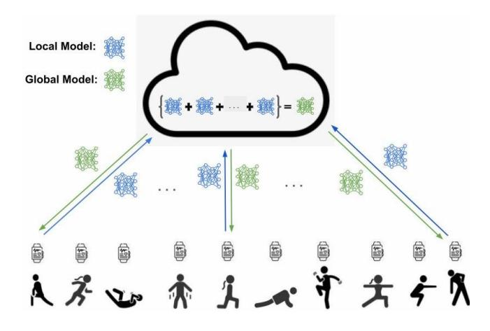
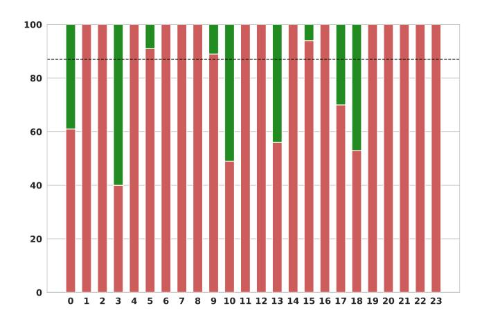
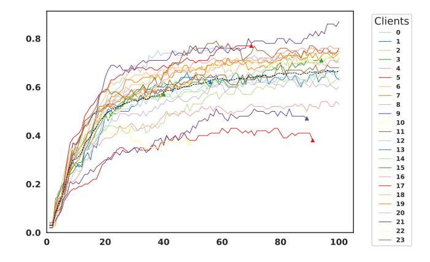

# FedFitTech: A Baseline in Federated Learning for Fitness Tracking

[Zeyneddin Oz](https://orcid.org/0000-0002-4216-9854)∗ Ubiquitous Computing, University of Siegen Siegen, NRW, Germany zeyneddin.oez@uni-siegen.de

[Marius Bock](https://orcid.org/0000-0001-7401-928X) Ubiquitous Computing, University of Siegen Siegen, NRW, Germany marius.bock@uni-siegen.de

## Abstract

Rapid evolution of sensors and resource-efficient machine learning models have spurred the widespread adoption of wearable fitness tracking devices. Equipped with inertial sensors, such devices can continuously capture physical movements for fitness technology (FitTech), enabling applications from sports optimization to preventive healthcare. Traditional centralized learning approaches to detect fitness activities struggle with data privacy concerns, regulatory constraints, and communication inefficiencies. In contrast, Federated Learning enables a decentralized model training by communicating model updates rather than potentially private wearable sensor data. Applying Federated Learning to FitTech presents unique challenges, such as data imbalance, lack of labelled data, heterogeneous user activity patterns, and trade-offs between personalization and generalization. To simplify research on FitTech in Federated Learning, we present the FedFitTech baseline, under the Flower framework, which is publicly available and widely used by both industry and academic researchers. Additionally, to illustrate its usage, this paper presents a case study that implements a system based on the FedFitTech baseline, incorporating a client-side early stopping strategy and comparing the results. For instance, this system allows wearable devices to optimize the trade-off between capturing common fitness activity patterns and preserving individuals' nuances, thereby enhancing both the scalability and efficiency of privacy-aware fitness tracking applications. Results show that this reduces overall redundant communications by 13%, while maintaining the overall recognition performance at a negligible recognition cost by 1%. Thus, FedFitTech baseline creates a foundation for a wide range of new research and development opportunities in FitTech, and it is available as open-source at: <https://github.com/adap/flower/tree/main/baselines/fedfittech>

# Keywords

Federated learning, Human Activity Recognition, Fitness Tracking

#### 1 Introduction

With recent advancements in sensor technologies and resourceefficient machine learning models, wearable fitness trackers in various form factors such as wrist watches, glasses, earbuds, and rings have gained widespread use. These devices generate vast amounts of valuable sensor data for Human Activity Recognition (HAR) applications, in which body movements can be analyzed in detail

Shreyas Korde Ubiquitous Computing, University of Siegen Siegen, NRW, Germany shreyas.korde@student.uni-siegen.de

[Kristof Van Laerhoven](https://orcid.org/0000-0001-5296-5347) Ubiquitous Computing, University of Siegen Siegen, NRW, Germany kvl@eti.uni-siegen.de

with minimal intrusion. For example, inertial sensors can continuously monitor motion and gestures at specific body locations, thus providing a detailed representation of the user's motion patterns. This makes such devices particularly useful for an extensive range of applications in fitness technology (FitTech), including medical assistance and the optimization of complex work processes [\[1\]](#page-5-0).

FitTech is a crossover term that combines fitness and technology, encompassing innovations that enhance fitness, wellness, and health experiences. Using wearable devices, mobile apps, and virtual personal training platforms, FitTech can monitor physical activity, provide real-time feedback to user, and can tailor exercise programs. Through machine learning, FitTech promises to transform the fitness industry by making workouts more personalized, efficient, and data-driven, helping users achieve better training results.

Current research tends to focus largely on centralized learning of fitness activities, which can be used to develop potent machine learning models by being able to process large datasets and leverage substantial computational power. However, centralized learning requires sensor data to be shared and stored in a central location, which can deter data sharing due to regulatory restrictions (e.g., the European General Data Protection Regulation (GDPR) [\[2\]](#page-5-1) and the California Consumer Privacy Act (CCPA) [\[3\]](#page-5-2)), making users reluctant to grant access for training. Moreover, centralized learning struggles to meet the needs for scalability and communication efficiency.

To address these challenges, Federated Learning [\[4\]](#page-5-3) has emerged as an alternative to centralized learning, offering a model communication mechanism instead of raw data sharing. In Federated Learning, a global model is shared to devices (also known as clients, nodes, or workers) for local training using local data. These tuned local models are then sent back to the server, which aggregates them to update the global model. The updated global model is redistributed to the devices for further training rounds. By the end of the process, all devices obtain a global model trained on all local data, while data privacy is maintained as no sensitive raw data is transmitted to external sources (see Fig. [1\)](#page-1-0). Additionally, Federated Learning offers benefits such as improved data availability, scalability, fault recovery, and communication efficiency [\[5\]](#page-5-4).

While Federated Learning is widely recognized as a viable approach for training machine learning models on decentralized devices, its potential impact on FitTech remains underexplored. Wearables such as smartwatches typically share similar sensors, in particular MEMS inertial sensors, as well as processing and wireless networking components, making FitTech applications relatively

Figure 1: In FedFitTech, wearable fitness devices locally train a global classification model for fitness activities (green model) shared by a server. Tuned local models (blue models) are shared with the server for aggregation to update a global model across all participants. Then, this global model is redistributed for further training rounds, which leads to a private system while profiting from outer patterns.

homogeneous compared to other environments. This similarity results in consistent computation and communication capabilities across smartwatches, allowing to train the same global model with synchronized communication.

Additionally, McMahan et al [\[4\]](#page-5-3) identified communication as the primary challenge in Federated Learning systems. However, unlike other domains, fitness tracking does not require daily communication. Since people do not exercise frequently throughout the day, data is not generated continuously, and wearable devices accumulate small datasets. This allows for less frequent and more convenient communication times, such as during charging or when connected to unmetered Wi-Fi. Moreover, modern processors make computing tiny machine learning models more efficient, reducing costs. Furthermore, Ek et al. [\[6\]](#page-5-5) compared various Federated Learning algorithms and found that Federated Learning can achieve comparable or even superior performance to Centralized Learning techniques in the HAR domain. Thus, the FitTech environment is naturally well-suited to Federated Learning.

On the other hand, each person exhibits unique movement patterns, and the performing of the same exercise can vary depending on individual performance. The position of sensors on a person can affect the motion patterns that are recorded, even when repeating the same actions [\[7\]](#page-5-6). Factors such as gender, age, weight, height, and exercise frequency further contribute to these unique features [\[8\]](#page-5-7). For instance, one person might jog once a week, while another person might jog every other day, leading eventually to data imbalances. Literature shows that Federated Learning underperforms when device data are imbalanced, as excessive external patterns can reduce performance on local data due to the personal nature of movements [\[9\]](#page-5-8). Moreover, annotated local data are often limited, requiring other people's patterns to accurately detect a person's exercise. Given the advantages of Federated Learning in FitTech, we thus present in this paper FedFitTech, a Federated Learning baseline designed for research in the FitTech domain.

Furthermore, we give an example using the FedFitTech baseline by designing a client-side early-stopping implementation and analyze its benefits. In FitTech, due to varied user motion patterns, the global model should not override individual variations. Thus, early exit from FL training may be necessary when the global model underperforms on local datasets. The attractiveness for implementing client-side early stopping in FedFitTech is that in the standard Federated Learning setting [\[4\]](#page-5-3), all devices participate in the training of the global model for a fixed number of global rounds. This can lead to unnecessary resource consumption for devices that do not need to attend all training rounds. In addition, the FitTech domain requires incorporating only common patterns from others without losing the influence of personal data in the global model. Although Federated Learning provides a private way to benefit from external patterns, users need the global model to be tailored to local data. Therefore, it is essential to design a Federated Learning system that balances personalization and generalization in FitTech. Thus, our case study of FedFitTech baseline involves an early stopping method to mitigate these challenges.

Our contributions are as threefold:

- Federated Fitness Activity Recognition: We highlight the domain of fitness activity recognition (or HAR) as interesting and suitable for the field of Federated Learning.
- Flower Baseline for Fitness Tracking: We designed Fed-FitTech as an easy-to-use baseline built under the Flower framework [\[10\]](#page-5-9), a widely adopted and openly available platform that enables the implementation and benchmarking of reproducible experiments.
- Use Case Experiment of Early Stopping: We present an example usage of this baseline, by allowing client-side early stopping to reduce energy consumption and improving efficiency.

#### 2 Related Work

Several studies have investigated various implementations of Federated Learning for HAR, addressing different challenges through novel strategies. FL-PMI [\[7\]](#page-5-6) proposes a system leveraging unlabeled data by applying a cleaning process with auto-labeling propagation to support smart healthcare applications. Meta-HAR [\[8\]](#page-5-7) employs a model-agnostic meta-learning approach that extracts adaptive signal embeddings from sensor data and integrates a task-specific classification network via fine-tuning. PMF [\[11\]](#page-5-10) adopts a secure data handling approach by combining differential privacy with secure multi-party computation and introduces an adaptive weight adjustment mechanism to ensure fair contributions to a global model. Also, the work by [\[12\]](#page-5-11) presents a perceptive extraction network system that enhances data representation while employing encryption and decryption to mitigate potential data leakage risks.

To address challenges of inadequate data and secure data sharing, researchers in [\[13\]](#page-5-12) propose a two-dimensional framework that employs both horizontal and vertical FL paradigms, while another study [\[14\]](#page-5-13) utilises specialized training algorithms aimed at increasing data diversity and fostering inclusivity for devices with inferior networking conditions.

Focusing on model training improvements, several works explore client grouping and dynamic layer sharing. PS-PFL [\[15\]](#page-5-14) introduces a personalized FL model based on profile similarity that aggregates local models through weighted computations. An attention-based clustering mechanism in [\[16\]](#page-5-15) calculates an optimal weighted model combination to encourage similar clients to group together without relying on a single global model. ClusterFL [\[17\]](#page-5-16) leverages a cluster indicator matrix and iterative optimization techniques to update client model weights, facilitating cluster-wise straggler dropout and correlation-based client selection. ProtoHAR [\[9\]](#page-5-8) integrates a prototype-guided technique that separates representation learning from categorization, thereby achieving uniform activity feature representation and improved convergence. Also, dynamic layersharing are investigated by FedCLAR [\[18\]](#page-5-17), which selectively shares portions of model weights based on a hierarchical clustering, and by FedDL [\[19\]](#page-5-18), which merges lower layers of models to capture userspecific similarities while enhancing communication efficiency.

Additionally, to enhance privacy, the researcher of PDP-FL (Personalized Differential Privacy-based Federated Learning) [\[20\]](#page-6-0) specifically investigated fitness tracking application using two stages. First, it allows users to customize their privacy levels, with corresponding noise added to their local model prior to sharing with a server. The second stage involves the server adding further noise to ensure global privacy protection.

Weaknesses noted across these studies include that FL-PMI [\[7\]](#page-5-6) may require additional computational resources, which could impact battery life, and does not explicitly address sensor inaccuracies. Meta-HAR [\[8\]](#page-5-7) may incur higher computational and communication overhead, posing challenges for very large-scale deployments. While promising, PMF [\[11\]](#page-5-10) requires further empirical validation of its performance under large-scale data scenarios and the integration of scalable privacy-preserving measures. The two-dimensional framework by [\[13\]](#page-5-12) could potentially expose finer-grained activity details under adversarial conditions, and the approach in [\[14\]](#page-5-13) may face challenges with dynamic client participation and scaling to real-world deployments. Additionally, client grouping strategies such as PS-PFL [\[15\]](#page-5-14) incur extra computational overhead on resource-constrained devices, and ClusterFL [\[17\]](#page-5-16) might expose usercluster associations under adversarial conditions while necessitating an additional optimization step. Lastly, ProtoHAR [\[9\]](#page-5-8) assumes a stationary data distribution, which might limit its adaptability in continuously evolving environments, FedCLAR [\[18\]](#page-5-17) assumes the availability of ample labeled data—a condition that may not hold universally—and FedDL [\[19\]](#page-5-18) requires further integration of robust privacy measures along with additional validation of its effectiveness beyond HAR. Besides, while PDP-FL [\[20\]](#page-6-0) enhances privacy by allowing varied user privacy preferences, this diversity can impact model performance and effectiveness. In other words, differing noise levels, corresponding to individual privacy choices, influence global model aggregation. To add more, PDP-FL simulate fitness tracking environment using image data, which does not fully capture the complexities of the domain. Fitness data often has temporal dependencies, varying sampling rates, and different types of noise characteristics compared to image pixels.

While other studies addressed HAR applications, this study especially focuses on the FitTech domain using FL, similar to PDP-FL. However, our FedFitTech baseline utilizes a real fitness tracking

dataset and a tiny model, reflecting original FitTech characteristics and providing further exploration of FL potantial in this area.

About designing case study of FedFitTech, the implementation of early stopping in the FL setting has already been explored in FLrce [\[21\]](#page-6-1) and FLASH [\[22\]](#page-6-2). FLrce employs a resource-efficient early-stopping strategy tailored for FL. FLASH leverages concept drift detection through client-side early stopping and server-side adaptive optimization. However, their complex mechanisms increase computational overhead and risk premature termination. Also, these methods are primarily designed for image recognition in non-FitTech domains. Our case study especially focuses on the FitTech domain and employs an early-stopping approach based on the stability of the validation F1-score over a sliding window [\[23\]](#page-6-3). While this method is simple to implement, it ensures that the global model retains valuable patterns learned from all clients, including those with less significant contributions, which is an essential factor in FL for FitTech. Moreover, case study emphasizes communication efficiency, and balanced generalization. Despite a neglible F1-score drop, our case study allows clients to benefit from extarnal patterns and terminate training when global weights diverge from local patterns, preventing redundant computation and communication.

#### 3 Experimental Setting

#### 3.1 Model

Over the past decade, Deep Learning (DL) methods have become the dominant approach in inertial-based HAR, consistently outperforming traditional Machine Learning algorithms [\[24,](#page-6-4) [25\]](#page-6-5). For this reason, we used TinyHAR [\[26\]](#page-6-6) which is a lightweight DL model specifically designed for HAR. TinyHAR leverages a combination of convolutional layers, a transformer block featuring self-attention and fully connected layers, and a Long Short-Term Memory (LSTM) to extract and model features from sensor data efficiently. Initially, convolutional layers are applied to each sensor channel to capture local patterns. This is followed by a transformer block that facilitates effective cross-channel feature interaction. Next, a fully connected layer fuses the extracted features, which are then processed by an LSTM to capture long-term temporal dependencies. Finally, a self-attention layer dynamically recalibrates the importance of features across time. This architecture achieves competitive performance with a significantly reduced parameter count, making it highly suitable for deployment on resource-constrained devices.

### 3.2 Dataset

We used inertial-based data of the WEAR (Wearable and Egocentric Activity Recognition) [\[27\]](#page-6-7) dataset which consists of labelled activities performed by 22 participants and categorized into three types: jogging, stretching, and strength exercises. The jogging category includes five labels: normal, rotating arms, skipping, sidesteps, and butt-kicks. The stretching category also comprises five labels: triceps, lunging, shoulders, hamstrings, and lumbar rotation. Lastly, the strength category encompasses eight labels: push-ups, pushups (complex), sit-ups, sit-ups (complex), burpees, lunges, lunges (complex), and bench dips. Also, the dataset includes a NULL label that represents unlabeled or undefined periods, where no activity was explicitly carried out. It serves as a placeholder for missing annotations and can be useful for filtering, handling uncertainty, or distinguishing between known and unknown states. As a result, participants engaged in 18 different outdoor sports activities. Unlike previous egocentric datasets, WEAR features an inertial sensor placement aligned with recent real-world application trends. It is the first dataset collected across multiple outdoor locations, each presenting varying surface conditions without revealing cues about the performed activities. Moreover, in FL in HAR applications, the selected dataset must mirrors real-world conditions, as it should accommodate a large number of clients and a diverse array of classes and subjects. Herewith, based on the recent work [\[28\]](#page-6-8), the WEAR dataset remains the best option for fitness tracking since other datasets cannot fulfil needs due to having fewer participants, classes and labelled data.

#### 3.3 Hyperparameters and Framework

This section provides a short summary of the most important parameters and framework used in our experiment.

Client setting: In the dataset, subject 1 and 19, and also subject 15 and 20 are from the same participants. These two participants were re-recorded in a different season and environment, resulting in 24 subjects in total. These two additional subjects are treated as separate devices for the same individuals to reflect real-world FitTech scenarios, thus setting the number of clients to 24.

Data splitting: In the WEAR dataset, participants perform the same activity several times in different time periods randomly, to represent realistic scenarios. This means that the activity patterns of people can change over time. For instance, while a person jogs fast at the beginning of exercise, he/she can feel tired later which causes body movements to be slower. Furthermore, considering factors such as weather conditions and changes on the ground, it cannot be expected that a person will make the same body movements. Therefore, the method of splitting local data into training and testing requires special scrutiny. For this reason, we select the first 20 % of each label in the time series to add to testing data and the remaining 80 % is left for training. In this way, for instance, when a person jogs at the beginning of exercise and also at a later time of exercise, testing data will include these two patterns.

Window size: After conducting multiple experiments, we determined that a window size of 100 is optimal option, corresponding to a duration of 2 seconds in the time series sampled at 50 Hz.

Batch size: Despite the impact of other hyperparameters differing based on the utilized model and dataset, [\[29\]](#page-6-9) reported that a batch size of 32 emerged as the optimal choice for image data. Nevertheless, we set to 32, as the hyperparameter recommendation for time series remains underexplored, and this value used in literature as well [\[19\]](#page-5-18).

Optimizer: We employed the Adam optimizer because it has shown to converge quickly and efficiently for complex models and large datasets. By adaptively tuning each parameter's learning rate and using momentum to smooth the optimization, it requires less hyperparameter tuning and these were found to make it well-suited for Federated Learning contexts [\[8,](#page-5-7) [18\]](#page-5-17).

Learning rate: Set to 0.001, following the literature [\[12\]](#page-5-11).

Global round: Based on existing work in Federated Learning in HAR [\[6\]](#page-5-5), we have set the global round to 100, as it is also a standard setting for other domains in FL in general.

Local epoch: Set to 1, following the literature [\[9,](#page-5-8) [18\]](#page-5-17).

Model Aggregation: We used FedAvg [\[4\]](#page-5-3) strategy since it is commonly employed as the main aggregation algorithm or a baseline in Federated Learning in HAR applications [\[6,](#page-5-5) [8,](#page-5-7) [9,](#page-5-8) [12,](#page-5-11) [14](#page-5-13)[–19\]](#page-5-18).

Early stopping: Inspired by [\[23\]](#page-6-3), we implemented early stopping based on the stability of the validation F1-score over a sliding window. The hyperparameters of this method are set based on our several experiments, to determine the optimum values for this paper's case study. As a result of experimentation, the patience value is set to 5, and the threshold is set to 0.01 for the stopping criterion.

Framework: We use Flower [\(https://flower.ai/,](https://flower.ai/) [\[10\]](#page-5-9)), which is a widely adopted and openly available framework suitable for both industrial and academic research in Federated Learning. It is designed to simplify the implementation of Federated Learning by managing communication, orchestration, and model aggregation. Flower's support for large-scale experiments, including millions of simulated clients, demonstrates its remarkable scalability for real-world federated deployments. In addition, it offers broad compatibility with existing and emerging machine learning frameworks, diverse operating systems, and a wide range of hardware platforms, including servers and mobile devices. This high level of interoperability makes it a highly versatile tool for a variety of research applications.

#### 4 Evaluation Results

Evaluation of this work compares FedFitTech with its client-side early stopping case study, considering both in communication loads and global model performance on local data.

#### 4.1 Communication Cost

Fig. [2](#page-3-0) illustrates that 9 out of 24 of clients stopped early from training global model, highlighting that prolonged participating does not guarantee continued benefit. The earliest stop was round 40 and some clients decided to stop early even though they had participated in more than 80 training rounds.

Figure 2: Amount of training rounds each client attended in the case study. The Y-axis shows the F1-score and the X-axis shows the client IDs. Red bars depicts the communication cost, while green bars show the saved communication rounds, and the dashed black line is the mean for these.

Figure 3: Communication rounds (X-axis) versus F1-scores (Y-axis). The dashed black line shows the mean values of all local performance, the triangles markers depict early stopped clients rounds.

Moreover, Fig. [3](#page-4-0) shows F1-score performance of clients which are dropped early (see triangle markers within the plot). Some clients could not increase their local F1-score even for 30 rounds of training. Also, as can be seen from the black dashed line, the overall global model F1-score continues to increase, despite some clients being dropped.

#### 4.2 Model Performance

The client-based F1-scores are depicted in Fig. [4](#page-4-1) for both the baseline and our case study of early stopping. The FedFitTech baseline resulted in a 68% mean F1-score across all clients, with the early stopping case study performing closely with a mean F1-score of 67%. Additionally, the result presents that some of the clients even have better F1-scores in the system in the case study, such as the clients represented with these ID numbers: 2, 7, 9, 10, 11, 12, 14, 17, 19, 21, and 22, with 11 out of 24 clients obtaining a better performance compared to the FedFitTech baseline.

Besides, Fig. [5](#page-4-2) and Fig. [6](#page-5-19) depict the label based F1-scores of FedFitTech baseline and the case study, respectively. Actual label names in these figures are as follows: 'A': 'NULL', 'B': 'jogging', 'C': 'jogging (rotating arms)', 'D': 'jogging (skipping)', 'E': 'jogging (sidesteps)', 'F': 'jogging (butt-kicks)', 'G': 'stretching (triceps)', 'H': 'stretching (lunging)', 'I': 'stretching (shoulders)', 'J': 'stretching (hamstrings)', 'K': 'stretching (lumbar rotation)', 'L': 'push-ups', 'M': 'push-ups (complex)', 'N': 'sit-ups', 'O': 'sit-ups (complex)', 'P': 'burpees', 'Q': 'lunges', 'R': 'lunges (complex)', and 'S': 'bench-dips'.

Despite early stopping decreasing the overall mean F1-score slightly by 1% (see Fig. [4\)](#page-4-1), some of the clients reached a remarkable performance rise for some of the labels. For instance, the push-up fitness activity (see label L in the confusion matrices) had an F1 score for Client 2 in FedFitTech of 0%, while it is 76% in the case study. Client 18, which was the one that stopped training the earliest (see Fig. [2\)](#page-3-0), achieved a 47% reduction in communication costs and its overall F1-score increased from 71% to 74%. Also, tracking some of the activities (e.g. 'stretching (lunging)': H) increased from 55% to 86%.

Figure 4: The different F1-scores (Y-axis) over all clients (Xaxis) in the WEAR dataset, for the FedFitTech baseline and the early stopping case study experiment.

Figure 5: The client-label F1-scores of FedFitTech, with on the Y-axis the client IDs and on the X-axis the activity labels (as described in section 4.2).

#### 4.3 Discussion

Fig. [2](#page-3-0) and [3](#page-4-0) show that this client attrition, while seemingly modest in this small-scale experiment, represents a significant concern in real-world Federated Learning deployments involving a large number of clients, as 37.5% of clients decreased their communication loads. Besides, these findings suggest that client-specific factors, such as data heterogeneity, resource constraints, or local model convergence, may influence participation stability within the Federated Learning framework. However, as can be seen from Fig. [3,](#page-4-0) the global model continues to improve despite some clients not longer participating in training. Also, Fig. [4](#page-4-1) demonstrates that in the case study, 45.8% of clients increased their overall mean F1-scores while communication costs decreased by 13% (see Fig. [2\)](#page-3-0).

Figure 6: The client-label F1-scores for this paper's case study of early stopping. When comparing with Fig. [5,](#page-4-2) it can be seen that overall classification performance remains similar, with certain activities (such as L - push ups and M - complex push ups) remaining challenging across users.

,

#### 5 Conclusions and Future Work

Wearable devices provide rich data that enable in-depth insights into users' fitness activities within the domain of Fitness Technology (FitTech). However, manual data annotation pose significant challenges for FitTech. For this reason, the user could benefit from other people annotating activities on their wearable clients. Centralized Learning, while powerful, faces issues such as latency, scalability, and privacy.

We argue in this paper that Federated Learning fits well with the characteristics of FitTech, due to clients having largely similar sensors, similar processing power, and mostly common activity classes, while needing relatively infrequent communication between a global model and the clients. This work thus introduces FedFitTech, designed to explore the FitTech domain within Federated Learning, built upon the user-friendly, widely adopted, and open-source Flower framework. Moreover, we shared a case study as an example usage of this baseline which involves a client-side early stopping strategy. The case study is compared with the Fed-FitTech baseline, considering communication loads and model performance metrics. The finding shows that our case study mitigates communication burden with a negligible mean F1-score drop, by balancing model generalization.

The FedFitTech baseline provides various promising directions for future research in Federated Learning for the FitTech domain. For instance, exploring transfer learning implementations can accelerate convergence and enable clients to benefit from pre-existing patterns from the outset. Additionally, integrating differential privacy techniques is crucial for enhancing data privacy and security, addressing a fundamental concern in FitTech. Furthermore, since the utilized WEAR dataset in FedFitTech consists of both inertial and ego-perspective camera data, investigating multimodal mechanisms has significant potentials for handling diverse sensor data

Oz et al.

and mitigating data heterogeneity. In conclusion, we hope that our FedFitTech baseline will leverage the publicly available and widely used Flower framework, opening up a new research domain and development opportunities in FitTech.

Acknowledgments This work was funded by the Deutsche Forschungsgemeinschaft (DFG, German Research Foundation) – Project-IDs 506589320 and 520256321.

#### References

- [1] Andreas Bulling, Ulf Blanke, and Bernt Schiele. A tutorial on human activity recognition using body-worn inertial sensors. ACM Computing Surveys (CSUR), 46(3):1–33, 2014.
- [2] Paul Voigt and Axel Von dem Bussche. The eu general data protection regulation (gdpr). A practical guide, 1st ed., 10(3152676), 2017.
- [3] Lydia de la Torre. A guide to the california consumer privacy act of 2018. Available at SSRN 3275571, 2018.
- [4] Brendan McMahan, Eider Moore, Daniel Ramage, Seth Hampson, and Blaise Aguera y Arcas. Communication-efficient learning of deep networks from decentralized data. In Artificial intelligence and statistics, pages 1273–1282. PMLR, 2017.
- [5] Jessica Chia Liu, Jack Goetz, Srijan Sen, and Ambuj Tewari. Learning from others without sacrificing privacy: Simulation comparing centralized and federated machine learning on mobile health data. JMIR mHealth and uHealth, 9(3):e23728, 2021.
- [6] Sannara Ek, François Portet, Philippe Lalanda, and German Vega. Evaluation and comparison of federated learning algorithms for human activity recognition on smartphones. Pervasive and Mobile Computing, 87:101714, 2022.
- [7] KS Arikumar, Sahaya Beni Prathiba, Mamoun Alazab, Thippa Reddy Gadekallu, Sharnil Pandya, Javed Masood Khan, and Rajalakshmi Shenbaga Moorthy. Flpmi: federated learning-based person movement identification through wearable devices in smart healthcare systems. Sensors, 22(4):1377, 2022.
- [8] Chenglin Li, Di Niu, Bei Jiang, Xiao Zuo, and Jianming Yang. Meta-har: Federated representation learning for human activity recognition. In Proceedings of the web conference 2021, pages 912–922, 2021.
- [9] Dongzhou Cheng, Lei Zhang, Can Bu, Xing Wang, Hao Wu, and Aiguo Song. Protohar: Prototype guided personalized federated learning for human activity recognition. IEEE Journal of Biomedical and Health Informatics, 27(8), 2023.
- [10] Daniel J Beutel, Taner Topal, Akhil Mathur, Xinchi Qiu, Javier Fernandez-Marques, Yan Gao, Lorenzo Sani, Hei Li Kwing, Titouan Parcollet, Pedro PB de Gusmão, and Nicholas D Lane. Flower: A friendly federated learning research framework. arXiv preprint arXiv:2007.14390, 2020.
- [11] Jie Feng, Can Rong, Funing Sun, Diansheng Guo, and Yong Li. Pmf: A privacypreserving human mobility prediction framework via federated learning. Proceedings of the ACM on Interactive, Mobile, Wearable and Ubiquitous Technologies, 4(1):1–21, 2020.
- [12] Zhiwen Xiao, Xin Xu, Huanlai Xing, Fuhong Song, Xinhan Wang, and Bowen Zhao. A federated learning system with enhanced feature extraction for human activity recognition. Knowledge-Based Systems, 229:107338, 2021.
- [13] Xiaokang Zhou, Wei Liang, Jianhua Ma, Zheng Yan, I Kevin, and Kai Wang. 2d federated learning for personalized human activity recognition in cyberphysical-social systems. IEEE Transactions on Network Science and Engineering, 9 (6):3934–3944, 2022.
- [14] Pengyuan Zhou, Hengwei Xu, Lik Hang Lee, Pei Fang, and Pan Hui. Are you left out? an efficient and fair federated learning for personalized profiles on wearable devices of inferior networking conditions. Proceedings of the ACM on Interactive, Mobile, Wearable and Ubiquitous Technologies, 6(2):1–25, 2022.
- [15] Yidong Chai, Haoxin Liu, Hongyi Zhu, Yue Pan, Anqi Zhou, Hongyan Liu, Jianwei Liu, and Yang Qian. A profile similarity-based personalized federated learning method for wearable sensor-based human activity recognition. Information & Management, 61(7):103922, 2024.
- [16] Can Bu, Lei Zhang, Hengtao Cui, Dongzhou Cheng, Hao Wu, and Aiguo Song. Learn from others and be yourself in federated human activity recognition via attention-based pairwise collaborations. IEEE Transactions on Instrumentation and Measurement, 73:1–15, 2024.
- [17] Xiaomin Ouyang, Zhiyuan Xie, Jiayu Zhou, Jianwei Huang, and Guoliang Xing. Clusterfl: a similarity-aware federated learning system for human activity recognition. In Proceedings of the 19th annual international conference on mobile systems, applications, and services, pages 54–66, 2021.
- [18] Riccardo Presotto, Gabriele Civitarese, and Claudio Bettini. Fedclar: Federated clustering for personalized sensor-based human activity recognition. In 2022 IEEE international conference on pervasive computing and communications (PerCom), pages 227–236. IEEE, 2022.
- [19] Linlin Tu, Xiaomin Ouyang, Jiayu Zhou, Yuze He, and Guoliang Xing. Feddl: Federated learning via dynamic layer sharing for human activity recognition. In

Proceedings of the 19th ACM Conference on Embedded Networked Sensor Systems, pages 15–28, 2021.

- [20] Lifang Shao. Protecting health monitoring privacy in fitness training: A federated learning framework based on personalized differential privacy. Internet Technology Letters, 7(6):e499, 2024.
- [21] Ziru Niu, Hai Dong, A Kai Qin, and Tao Gu. Flrce: Resource-efficient federated learning with early-stopping strategy. IEEE Trans. on Mobile Computing, 2024.
- [22] Kunjal Panchal, Sunav Choudhary, Subrata Mitra, Koyel Mukherjee, Somdeb Sarkhel, Saayan Mitra, and Hui Guan. Flash: Concept drift adaptation in federated learning. In International Conference on Machine Learning, 2023.
- [23] Lutz Prechelt. Early stopping-but when? In Neural Networks: Tricks of the trade, pages 55–69. Springer, 2002.
- [24] Francisco Javier Ordóñez and Daniel Roggen. Deep convolutional and lstm recurrent neural networks for multimodal wearable activity recognition. Sensors, 16(1):115, 2016.
- [25] Yu Guan and Thomas Plötz. Ensembles of deep lstm learners for activity recognition using wearables. Proceedings of the ACM on interactive, mobile, wearable

and ubiquitous technologies, 1(2):1–28, 2017.

- [26] Yexu Zhou, Haibin Zhao, Yiran Huang, Till Riedel, Michael Hefenbrock, and Michael Beigl. Tinyhar: A lightweight deep learning model designed for human activity recognition. In Proceedings of the 2022 ACM International Symposium on Wearable Computers, pages 89–93, 2022.
- [27] Marius Bock, Hilde Kuehne, Kristof Van Laerhoven, and Michael Moeller. Wear: An outdoor sports dataset for wearable and egocentric activity recognition. Proceedings of the ACM on Interactive, Mobile, Wearable and Ubiquitous Technologies, 8(4):1–21, 2024.
- [28] Daniel Geissler, Dominique Nshimyimana, Vitor Fortes Rey, Sungho Suh, Bo Zhou, and Paul Lukowicz. Beyond confusion: A fine-grained dialectical examination of human activity recognition benchmark datasets. arXiv:2412.09037, 2024.
- [29] Majid Kundroo and Taehong Kim. Demystifying impact of key hyper-parameters in federated learning: A case study on cifar-10 and fashionmnist. IEEE Access, 2024.