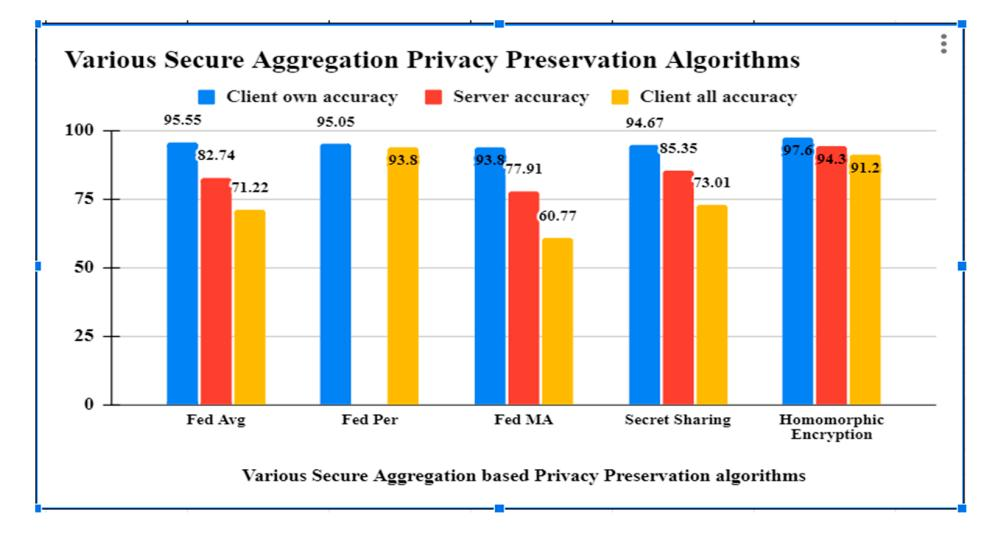

# *Proceeding Paper* **Federated Learning for Healthcare: A Comprehensive Review †**

**Pallavi Dhade 1,2,[\\*](https://orcid.org/0000-0002-1542-4055) and Prajakta Shirke 1**

- 1 Department of Computer Science & Engineering, Sandip University, Nashik 422213, Maharashtra, India; prajakta.shirke@sandipuniversity.edu.in
- 2 Department of CSE (AI & ML), Pimpri Chinchwad College of Engineering, Pune 411044, Maharashtra, India
- **\*** Correspondence: pallavi.dhade@pccoepune.org
- † Presented at the International Conference on Recent Advances in Science and Engineering, Dubai, United Arab Emirates, 4–5 October 2023.

**Abstract:** Recent advancements in deep learning for healthcare and computer-aided laboratory services have sparked a renewed interest in making medical data more accessible. Elevating the quality of healthcare services and delivering improved patient care necessitates a knowledge base rooted in data-driven insights. Deep learning models have proven to excel in this regard, as they are specifically designed to embrace a data-driven approach. These models thrive on exposure to larger datasets, which enables them to continuously improve their performance. However, as healthcare organizations strive to aggregate clinical records onto central servers to construct robust deep learning models, concerns surrounding privacy, data ownership, and legal restrictions have emerged. Safeguarding sensitive medical data while harnessing collective knowledge from multiple healthcare centers is a challenging balancing act. One promising approach to address these concerns is the use of privacy-preserving techniques that allow for the utilization of data from multiple centers without compromising security. Federated learning (FL) is a technique that has emerged to enable the deployment of large machine learning models trained across multiple data centers without the necessity of sharing sensitive information. In this article, we present the most recent findings derived from a systematic literature review focusing on the application of federated learning in healthcare settings. This review offers insights into the current state of research and practical implementations of FL within the healthcare domain. By leveraging federated learning, healthcare institutions can harness the collective power of their data while upholding privacy and data security standards, ultimately leading to more effective and data-driven healthcare solutions.

## **1. Introduction**

Data-driven deep learning models hold great promise in assisting with medical treatment and diagnosis, but they allow massive quantities of different data to be widely useful. For instance, deep learning is extremely useful for text identification in medical laboratory reports [\[1\]](#page-7-0), tumor segmentation and classification from MRI scans, and cancer diagnosis and forecasting. Machine learning applications actually require enormous quantities of data. Acquiring enough data to solve a particular problem with ML can be incredibly hard, time-consuming, and extremely expensive. In practical terms, data is frequently dispersed rather than centralized and must be gathered from multiple sources before being used. Furthermore, the knowledge gained by an organization might exhibit a peculiar distribution that does not assist the creation of systematic models. For example, hospitals in various areas or nations seem to have distinct patient profiles and pathologies and would benefit from collaborating together to design and develop ML applications that serve all of their patients equally. To promote robustness and generality, deep learning involves immense and varied training datasets. Multicenter research is extremely important when developing DL algorithms that are applicable to a wide range of situations in the real world.

**Citation:** Dhade, P.; Shirke, P. Federated Learning for Healthcare: A Comprehensive Review. *Eng. Proc.* **2023**, *59*, 230. [https://doi.org/](https://doi.org/10.3390/engproc2023059230) [10.3390/engproc2023059230](https://doi.org/10.3390/engproc2023059230)

Academic Editors: Nithesh Naik, Rajiv Selvam, Pavan Hiremath, Kowshik C.S. Suhas and Ritesh Ramakrishna Bhat

Published: 9 February 2024

**Copyright:** © 2024 by the authors. Licensee MDPI, Basel, Switzerland. This article is an open access article distributed under the terms and conditions of the Creative Commons Attribution (CC BY) license [\(https://](https://creativecommons.org/licenses/by/4.0/) [creativecommons.org/licenses/by/](https://creativecommons.org/licenses/by/4.0/) 4.0/).

The most popular approach for such collaborative multi-center efforts is currently described as "centralized learning", through which data from many places is shared and consolidated into a centralized place in line with multi contracts. So far, huge data collection and resource sharing may raise operational challenges, and overcoming privacy and ethical issues might take time. For instance, only a specific hospital or clinic might have access to a patient's medical records [\[1\]](#page-7-0). The significance of data security and privacy protection is increasingly being widely recognized [\[1\]](#page-7-0), particularly as the frequency of data breaches at health care organizations rises. Medical images of the patient may include private and sensitive data about patients that should not be shared with anyone except the institutions where they were produced, especially when complete de-identification is indeed not practicable [\[2\]](#page-7-1).

The Health Insurance Portability and Accountability legislation (HIPPA) and the General Data Protection Regulations (GDPR) legislation have prohibited stakeholders from exchanging electronic health records (EHRs) with healthcare providers or researchers without patient agreement [\[3\]](#page-7-2). Indeed, various countries throughout the world are developing stronger legislation to protect data security. The European Union, for example, implemented the General Data Protection Regulation (GDPR) in 2018 to protect its customers' privacy and confidentiality of their data. On the one hand, establishing these restrictions will result in a more civic society. However, the restrictions make it impossible. These regulations, however, make it more difficult for academics from many universities to share data and collaborate on a deep learning model. To avoid data leaking, the "distributed learning" model was designed to scatter data among various institutions rather than aggregating it into a single pool.

#### *1.1. Deep Learning Models Used in Healthcare Are as Follows*

#### 1.1.1. Deep Belief Networks

These are unsupervised algorithms in the field of generative graphical models. To tackle difficulties, they employ backpropagation and pre-training. This is equivalent to a stack of constrained Boltzmann machines.

#### 1.1.2. Convolutional Neural Networks

CNN is a deep learning system that can take an input image, assign priority to various elements in the image, and then discriminate and differentiate between the image and others. It is used to increase the classification accuracy of facial electromyography (FEMG) and speech signals.

#### 1.1.3. Recurrent Neural Networks

An RNN is one form of artificial neural network (ANN). It is the only form of neural network with internal memory, and it is both strong and robust. RNNs can recall vital information about the input they receive as a result of internal memory [\[4\]](#page-7-3).

#### 1.1.4. Adversarial Generative Networks

This describes generative adversarial networks (GANs): An adversarial approach for estimating generative models has been suggested. At the same time, two models are being trained: the generative model G and the discriminative model D. G is a generative model that captures data distribution, whereas D is a discriminative model that calculates the probability that a sample originated from G rather than G [\[4\]](#page-7-3).

#### *1.2. The Comparison of Deep Learning Models Is as Follows*

Backpropagation is a straightforward, supervised approach that is easy and quick to deploy. However, it takes a long time to train and is quite sensitive to noisy data. DBNs are unsupervised learning techniques that are also components of a generative graphical model. They uncover significant patterns in the data. DBNs can quickly learn an optimal set of parameters for models with a large number of parameters and nonlinear layers, but they are exceedingly slow and inefficient. CNNs are supervised learning algorithms that

employ many building blocks, including convolution layers, pooling layers, and fully connected layers, to learn the spatial hierarchies of data automatically using backpropagation. They are easy to train and implement, and they perform well in pre-training and feature extraction. They do, however, demand a lot of memory to preserve their intermediate results, and their main applications are in video and image recognition, natural language processing, picture categorization, and so on. RNN is a supervised learning system that can retrain from past data while new data is accumulated, making it helpful for time series. Because of the nature of RNNs, their calculations are slow. GANs have a wide range of applications, including image analysis, and do not need to use Markov chains. When the discriminator's cost function increases, the generator's cost function drops [\[5\]](#page-7-4). processing, picture categorization, and so on. RNN is a supervised learning system that can retrain from past data while new data is accumulated, making it helpful for time series. Because of the nature of RNNs, their calculations are slow. GANs have a wide range of applications, including image analysis, and do not need to use Markov chains. When the discriminator's cost function increases, the generator's cost function drops [5]. Federated learning (FL) [6] is a relatively new method for protecting patient privacy while training deep learning models on federated healthcare data. By avoiding the need for the transfer of medical data through a centralized aggregate server, this method allows for decentralized training of deep learning models [7]. Each hospital acts as a client node,

sults, and their main applications are in video and image recognition, natural language

Federated learning (FL) [\[6\]](#page-7-5) is a relatively new method for protecting patient privacy while training deep learning models on federated healthcare data. By avoiding the need for the transfer of medical data through a centralized aggregate server, this method allows for decentralized training of deep learning models [\[7\]](#page-7-6). Each hospital acts as a client node, training its own deep learning model locally and then uploading it to the global central server for a sum up. A global model is formed from the local models of all the nodes and is distributed to them by a centralized server that coordinates and aggregates them. During training, node-specific training data are never transmitted, so this is an important point to emphasize. They are instead kept locally at each node. The confidentiality of patients' medical records is maintained by transmitting only the model's weight and characteristics [\[8\]](#page-7-7). Since FL preserves private information while facilitating collaboration between numerous medical institutions, it greatly lessens many security concerns. FL shows great promise for healthcare applications that aim to enhance patient and institutional access to high-quality healthcare. Figure [1](#page-2-0) shows the working of federated learning. training its own deep learning model locally and then uploading it to the global central server for a sum up. A global model is formed from the local models of all the nodes and is distributed to them by a centralized server that coordinates and aggregates them. During training, node-specific training data are never transmitted, so this is an important point to emphasize. They are instead kept locally at each node. The confidentiality of patients' medical records is maintained by transmitting only the model's weight and characteristics [8]. Since FL preserves private information while facilitating collaboration between numerous medical institutions, it greatly lessens many security concerns. FL shows great promise for healthcare applications that aim to enhance patient and institutional access to high-quality healthcare. Figure 1 shows the working of federated learning.

**Figure 1.** Federated learning framework. **Figure 1.** Federated learning framework.

Using its own data, each client refines a model obtained from the server. The client initiates a local training session by requesting the model from a cloud server and notifying it of its readiness. After that, the client receives the most up-to-date global model available. After a model has been acquired, a training session can begin using the localized data and the model. Once the conduction of training is completed locally, the model is sent back to the central server, where the preferred changes have been accumulated. When one train-Using its own data, each client refines a model obtained from the server. The client initiates a local training session by requesting the model from a cloud server and notifying it of its readiness. After that, the client receives the most up-to-date global model available. After a model has been acquired, a training session can begin using the localized data and the model. Once the conduction of training is completed locally, the model is sent back to the central server, where the preferred changes have been accumulated. When one training round is over, the server alerts the client and updates the global model based on the model it received [\[9\]](#page-7-8). The federated learning process consists of the following three steps:

1. **Distribution:** The aggregation center distributes the global model details to all of the regional nodes by way of a secure network connection. regional nodes by way of a secure network connection. 2. **Train locally:** In order to train the global model, each regional center uses data col-

1. **Distribution:** The aggregation center distributes the global model details to all of the

- 2. **Train locally:** In order to train the global model, each regional center uses data collected locally in conjunction with the global model parameters [\[10\]](#page-7-9). lected locally in conjunction with the global model parameters [10]. 3. **Global aggregation:** Here, training outcomes are aggregated globally, meaning that
  - 3. **Global aggregation:** Here, training outcomes are aggregated globally, meaning that all participating local centers report back to an aggregation server. The server then applies the changes made at the regional nodes to the global model parameters. The term "global training" describes this method [\[11\]](#page-8-0). The flowchart of the federated learning framework is shown in Figure [2.](#page-3-0) all participating local centers report back to an aggregation server. The server then applies the changes made at the regional nodes to the global model parameters. The term "global training" describes this method [11]. The flowchart of the federated learning framework is shown in Figure 2.

**Figure 2.** Flowchart of the federated learning framework. **Figure 2.** Flowchart of the federated learning framework.

#### **2. Challenges Associated with Healthcare Data**

**2. Challenges Associated with Healthcare Data**  This section elaborates on the challenges associated with federated learning, espe-This section elaborates on the challenges associated with federated learning, especially with healthcare data.

#### cially with healthcare data. *2.1. Variations in the Quality of Data Due to Noise*

*2.1. Variations in the Quality of Data Due to Noise*  When it comes to data collection, healthcare businesses are in a vulnerable state. Collecting massive amounts of clinical data from EHRs, medical imaging, and radiology reports, etc. is labor intensive and time consuming. For acquiring high-resolution medical pictures, multishot MRI is a common technique [12,13]. Nevertheless, the technique can When it comes to data collection, healthcare businesses are in a vulnerable state. Collecting massive amounts of clinical data from EHRs, medical imaging, and radiology reports, etc. is labor intensive and time consuming. For acquiring high-resolution medical pictures, multishot MRI is a common technique [\[12,](#page-8-1)[13\]](#page-8-2). Nevertheless, the technique can introduce instrumental and environmental noise because of distortions in the final image. There are difficulties, consequences, and potential developments for any data format [\[14\]](#page-8-3).

#### introduce instrumental and environmental noise because of distortions in the final image. *2.2. Incorrect Data Annotation*

There are difficulties, consequences, and potential developments for any data format [14]. *2.2. Incorrect Data Annotation*  Annotating data samples is an important part of healthcare datasets. As a result, they Annotating data samples is an important part of healthcare datasets. As a result, they need to be carried out legally, bearing in mind privacy concerns, and according to established standards [\[15\]](#page-8-4). Improper annotations, such as a mismatched dataset, an unbalanced class distribution, or bias and data sparsity, result from improper labeling [\[16\]](#page-8-5).

#### need to be carried out legally, bearing in mind privacy concerns, and according to estab-*2.3. Data Heterogeneity*

lished standards [15]. Improper annotations, such as a mismatched dataset, an unbalanced class distribution, or bias and data sparsity, result from improper labeling [16]. *2.3. Data Heterogeneity:*  Many FL algorithms and strategies assume that the data is independently and identically distributed (IID) across the participants, which presents a challenge when the dis-Many FL algorithms and strategies assume that the data is independently and identically distributed (IID) across the participants, which presents a challenge when the distribution of the data is not uniform. FL may help address some potential biases through potentially increased diversity of data sources [\[10\]](#page-7-9). Strategies like FedAvg9 tend to fail under these conditions which might be seen as counterproductive to the goal of collaborative learning in general. Another difficulty is that local participants may not benefit from the global optimal solution if the data are heterogeneous

#### *2.4. Privacy and Security*

Sensitive information in the healthcare industry must be protected using strict methods of privacy [\[17\]](#page-8-6). As a result, it is important to think about the costs and benefits, possible solutions, and outstanding risks involved with FL's privacy-preserving functionality.

#### *2.5. Standard Medical Datasets*

These have been lacking in both quantity and quality, making it difficult to create a dependable answer to the FL algorithm's challenges. The dataset used in FL experiments may differ greatly depending on the research goals. Medical image classification and segmentation performance is a primary focus of some datasets, while network communication performance is a primary focus of others [\[18\]](#page-8-7). There is a lack of benchmark datasets, which is especially problematic in the medical field. To evaluate the efficacy of the FL, which integrates data from various medical databases, a trustworthy standard is needed.

#### *2.6. Data Partitions*

In order to train a trustworthy collaborative machine learning model, the FL strategy aims to pool information from multiple clients into a larger data set. Whether there is a small sample size, a lack of features in the sample, or both, FL relies heavily on the data partition (horizontal or vertical) you choose [\[19,](#page-8-8)[20\]](#page-8-9).

#### **3. Literature Review**

In this section, we continue our discussion of modern FL designs, proposed in different papers. This section provides an in-depth summary of previous studies and various research methods.

## *Related Work*

According to the study, many researchers have proposed federated learning for medical data analysis, medical imaging, medical image classification, and segmentation and most of them expressed privacy concerns. An in-depth analysis of the ideas behind federated learning and the current directions of medical imaging research is proposed [\[1\]](#page-7-0). The authors of [\[2\]](#page-7-1) discuss the technical challenges and practical considerations that come with putting federated learning algorithms for medical imaging into practice, as well as introduce federated learning algorithms for medical imaging and talk about their applications. The authors of the study [\[3\]](#page-7-2) propose combining the methodologies of the Internet of Medical Things (IoMT) and federated learning (FL) to predict COVID-19 through CT scans. This is done with the intention of achieving the research objective. The unique federated semi-supervised learning approach is presented in [\[21\]](#page-8-10) as a means of resolving the discrepancy that exists between datasets and human annotations. This approach can be used with or without annotations. Due to the fact that federated learning does not necessitate the exchange of personally identifiable information, it is an excellent option for institutions and nations that adhere to stringent privacy policies. Using repositories like The Cancer Genome Atlas (TCGA), analysis can be performed on the effects of IID and non-IID distributions, and the sizes of single datasets [\[22\]](#page-8-11). According to [\[22\]](#page-8-11), a framework that allows for the collaborative development of machine learning models for medical image analysis through differentially private federated learning is one that is both practicable and dependable.

The work will help researchers develop a practical federated learning environment for the healthcare industry by taking a novel approach based on modern machine learning methods. Rather than directly sharing datasets with one another, the results of training obtained from multiple centers are connected to make a consolidated overall model [\[23](#page-8-12)[,24\]](#page-8-13). In this way, sensitive patient data is protected as it is transferred between hospitals. An investigation was carried out to find out how FL context is made with multiple domains and tasks [\[25\]](#page-8-14), where the nodes may contain datasets that have been trained to deal with tasks from more than one domain [\[26\]](#page-8-15). This research delves into what is behind this issue,

what federated learning's (FL) potential benefits are for the future of digital health, and where it might go wrong [\[16\]](#page-8-5). Proportionally Fair Federated Learning (or Prop-FFL for short) is a new federated learning technique proposed in this study [\[27\]](#page-8-16) to improve model "fairness" across participating hospitals. Table [1](#page-5-0) shows the results of a comparison between the suggested research and the most recent survey in the field.

**Table 1.** The results of a comparison between the suggested research and the most recent survey in the field.

| Reference                                    | Contribution                                                                                                                                                 | RM | CS | FLA | Advantages                                                                                                                                         | Limitations                                                                                                           |
|----------------------------------------------|--------------------------------------------------------------------------------------------------------------------------------------------------------------|----|----|-----|----------------------------------------------------------------------------------------------------------------------------------------------------|-----------------------------------------------------------------------------------------------------------------------|
| Erfan Darzidehkalani et al., 2022 [1]     | A thorough examination of its concepts and current research trends in medical imaging.                                                                 | ✔  | -  | -   | Achieving success in circumventing privacy and data-sharing constraints.                                                                  | Limited to radiologists only.                                                                                      |
| MohammedAdnan et al., 2022 [2]            | Both bag-p reparation and Multiple-Instance Learning (MIL) are required for the proposed method which is client-side.                         | -  | ✔  | -   | Presented a privacy assessment of the method through the differential privacy framework                                                   | -                                                                                                                     |
| Suresh Dara et al., 2022 [3]              | To classify COVID19 in chest CT images, a scalable framework was proposed that incorporated federated learning, IoT, and big data architectures. | -  | ✔  | -   | Worked on the COVID-19 classification problem.                                                                                                  | The difficulty of transmitting parameters and accumulating weights.                                       |
| Mohammad Ghasemi-rad et al., 2022 [22] | Provides an overview of federated learning algorithms (FedAvg, CWT, etc.) for use in medical imaging                                                | ✔  | -  | ✔   | Data heterogeneity, communication load, and privacy all attained.                                                                            | Specific to radiology                                                                                                 |
| Micah J. Sheller et al., 2020 [28]        | Collaborative learning methods that protect individual data were discussed                                                                             | ✔  | -  | -   | Meeting the requirements of data protection regulations.                                                                                     | -                                                                                                                     |
| Naoual Mouhni et al., 2022 [5]            | A condensed, up-to-date introduction to federated learning for medical imaging techniques, written for academics and practitioners.              | ✔  | -  | -   | Privacy can be maintained through a combination of federated learning and other cutting-edge methods, such as the Blockchain chain. | Need to optimize the security of health data.                                                                   |
| Truong X. Nguyen et al., 2022 [29]        | Provided up-to-date FL ocular imaging evidence                                                                                                            | ✔  | -  | -   | In order to facilitate partnerships between multiple institutions, FL developed a robust and cooperative DL model.                     | Not overcoming privacy challenges.                                                                                 |
| Gurtaj Singh et al., 2023 [30]            | Emphasize the obvious discrepancy between the IID and non-IID instances of accuracy                                                                 | -  | ✔  | -   | Different FL methods, with varying scalability and dataset distribution, all achieve high-quality results.                             | Many hospitals lack GPU-capable computers, which are necessary for carrying out gradient calculations. |

RM: review method, CS: case study, FLA: FL Applications, ✔—shows that the parameter is present, and '-'—shows that the parameter is not present.

#### **4. Secure Aggregation Based Privacy Preservation Algorithms for Federated Learning**

We compared a centralized training approach with the real-world dataset and the performance of the FedAvg, FedPer, FedMa, Secret Sharing and Homomorphic encryption secure aggregation algorithms for human activity recognition.

#### *4.1. Federated Averaging (FedAvg)*

By averaging the weights of the individual local models, the server creates a fresh aggregated model using the FedAvg technique [\[31\]](#page-8-20). By applying the FedAvg algorithm to our CNN model, we obtain a centralized learning approach that achieves an accuracy of 82.74% on the global test-set while the client-side model, on average, achieves an accuracy of 71.22%.

## *4.2. Federated Personalization (FedPer)*

FedPer operates on the premise that the model should be partitioned into generic and specific parts. All of your custom layers will remain hidden from the server. In a federated server, transfer learning only aggregates the lowest levels. Clients were found to retain their individualized skills and perform well on local test-sets with an accuracy of 95.05% (just lagging behind the local learning accuracy of 95.41%).

#### *4.3. Federated Match Averaging (FedMA)*

Using a layer-based learning scheme, FedMA finds optimal solutions by combining and matching nodes with similar weights. Each layer's training is completed independently before being uploaded to the central server. Compared to the centralized learning method, the FedMA method improves the server model's accuracy to 77.91 percent. The client's model keeps some degree of customization (93.80% accuracy on local test-set) at the cost of performing well on the global test-set (60.77%) (Ek, 2020).

#### *4.4. Secret Sharing*

Secure aggregation with secret sharing is a technique used to safeguard the privacy and confidentiality of data during the aggregating process. It entails separating the data into shares and distributing them to other parties [\[4\]](#page-7-3). The cutting-edge secure aggregation method trial findings demonstrate that it is 99% quicker, while lowering client communication costs by 20%. Furthermore, the trained model has the same accuracy as FedAvg for balanced, unbalanced, IID, and non-IID data distributions.

#### *4.5. Homomorphic Encryption*

MPHE (multiparty homomorphic encryption) allows the central node to compute this aggregate while only receiving encrypted versions of each individual gradient. Threshold additively homomorphic cryptosystems can accommodate client dropouts, but they are either computationally costly or demand extra trust assumptions with the transmission, which is roughly 98% accurate. *Eng. Proc.* **2023**, *59*, x FOR PEER REVIEW 8 of 10

As per the results obtained from different secure aggregation privacy preservation algorithms, it has been observed that the accuracy of all the algorithms are good, but Table [2](#page-7-10) shows that Homomorphic encryption secure aggregation is preserving the privacy of the healthcare data by observing the Health Insurance Portability and Accountability Act (HIPPA) and General Data Protection rules (GDPR) standards with security, efficiency and reliability parameters. The related comparison is shown in Figure [3.](#page-6-0) The Blue bar in Figure 3 represents client own accuracy, red bar represents server accuracy and yellow bar represents client all accuracy. **Table 2.** Results of applying various secure aggregation federated algorithms. **Approaches Fed Avg Fed Per Fed MA Secret Sharing Homomorphic Encryption**  Client own accuracy (%) 95.55 95.05 93.80 94.67 97.6 Server accuracy (%) 82.74 NA 77.91 85.35 94.3 Client all accuracy (%) 71.22 93.80 60.77 73.01 91.2

**Figure 3.** Comparison of results of various federated learning algorithms. https://doi.org/10.3390/math11010151. **Figure 3.** Comparison of results of various federated learning algorithms.

| Approaches              | Fed Avg | Fed Per | Fed MA | Secret Sharing | Homomorphic Encryption |
|-------------------------|---------|---------|--------|-------------------|---------------------------|
| Client own accuracy (%) | 95.55   | 95.05   | 93.80  | 94.67             | 97.6                      |
| Server accuracy (%)     | 82.74   | NA      | 77.91  | 85.35             | 94.3                      |
| Client all accuracy (%) | 71.22   | 93.80   | 60.77  | 73.01             | 91.2                      |

**Table 2.** Results of applying various secure aggregation federated algorithms.

#### **5. Conclusions**

Federated learning has distinguished itself as a one-of-a-kind learning platform by allowing edge devices to train the model on a local level using their own data. This has helped the company gain a wider range. In this article, we discuss federated learning, which is a technique that makes it possible for experts in the field of artificial intelligence and healthcare centers to work together on the development of collaboration models for deep learning. Applying criteria like partitioning, distribution, privacy attacks and defenses, and benchmark datasets, we reviewed how federated learning has developed over the past two years in the service of healthcare applications. We envision this work serving as a foundation for further investigations of federated learning potential in health wellness programs and a standard for protecting personally identifiable medical data.

**Author Contributions:** Conceptualization, P.D.; survey, P.D.; implementation, P.D. and P.S.; comparative analysis, P.D. and P.S.; resources, P.D.; writing—original draft preparation, P.D.; writing—review and editing, P.D. and P.S.; supervision, P.S. All authors have read and agreed to the published version of the manuscript.

**Funding:** This research received no external funding.

**Institutional Review Board Statement:** Not applicable.

**Informed Consent Statement:** Not applicable.

**Data Availability Statement:** All the data used are made available in the present work.

**Conflicts of Interest:** The authors declare no conflicts of interest.

## **References**

- 1. Prasad, V.K.; Bhattacharya, P.; Maru, D.; Tanwar, S.; Verma, A.; Singh, A.; Tiwari, A.K.; Sharma, R.; Alkhayyat, A.; T, urcanu, F.-E.; et al. Federated Learning for the Internet-of-Medical-Things: A Survey. *Mathematics* **2022**, *11*, 151. [\[CrossRef\]](https://doi.org/10.3390/math11010151)
- 2. Sheller, M.J.; Edwards, B.; Reina, G.A.; Martin, J.; Pati, S.; Kotrotsou, A.; Milchenko, M.; Xu, W.; Marcus, D.; Colen, R.R.; et al. Federated learning in medicine: Facilitating multi-institutional collaborations without sharing patient data. *Sci. Rep.* **2020**, *10*, 12598. [\[CrossRef\]](https://doi.org/10.1038/s41598-020-69250-1) [\[PubMed\]](https://www.ncbi.nlm.nih.gov/pubmed/32724046)
- 3. Yang, D.; Xu, Z.; Li, W.; Myronenko, A.; Roth, H.R.; Harmon, S.; Xu, S.; Turkbey, B.; Turkbey, E.; Wang, X.; et al. Federated semi-supervised learning for COVID region segmentation in chest CT using multi-national data from China, Italy, Japan. *Med. Image Anal.* **2021**, *70*, 101992. [\[CrossRef\]](https://doi.org/10.1016/j.media.2021.101992) [\[PubMed\]](https://www.ncbi.nlm.nih.gov/pubmed/33601166)
- 4. Hameed, B.Z.; Shah, M.; Naik, N.; Singh Khanuja, H.; Paul, R.; Somani, B.K. Application of Artificial Intelligence-based classifiers to predict the outcome measures and stone-free status following percutaneous nephrolithotomy for staghorn calculi: Cross-validation of data and estimation of accuracy. *Eur. Urol.* **2021**, *79*, S1375. [\[CrossRef\]](https://doi.org/10.1016/s0302-2838(21)01348-8)
- 5. Nguyen, T.X.; Ran, A.R.; Hu, X.; Yang, D.; Jiang, M.; Dou, Q.; Cheung, C.Y. Federated Learning in Ocular Imaging: Current Progress and Future Direction. *Diagnostics* **2022**, *12*, 2835. [\[CrossRef\]](https://doi.org/10.3390/diagnostics12112835) [\[PubMed\]](https://www.ncbi.nlm.nih.gov/pubmed/36428895)
- 6. Darzidehkalani, E.; Ghasemi-Rad, M.; van Ooijen, P. Federated Learning in Medical Imaging: Part II: Methods, Challenges, and Considerations. *J. Am. Coll. Radiol.* **2022**, *19*, 975–982. [\[CrossRef\]](https://doi.org/10.1016/j.jacr.2022.03.016) [\[PubMed\]](https://www.ncbi.nlm.nih.gov/pubmed/35483437)
- 7. Singh, G.; Violi, V.; Fisichella, M. Federated Learning to Safeguard Patients Data: A Medical Image Retrieval Case. *Big Data Cogn. Comput.* **2023**, *7*, 18. [\[CrossRef\]](https://doi.org/10.3390/bdcc7010018)
- 8. Li, L.; Xie, N.; Yuan, S. A Federated Learning Framework for Breast Cancer Histopathological Image Classification. *Electronics* **2022**, *11*, 3767. [\[CrossRef\]](https://doi.org/10.3390/electronics11223767)
- 9. Parekh, V.S.; Lai, S.; Braverman, V.; Leal, J.; Rowe, S.; Pillai, J.J.; Jacobs, M.A. Cross-Domain Federated Learning in Medical Imaging. *arXiv* **2021**, arXiv:2112.10001.
- 10. Rieke, N.; Hancox, J.; Li, W.; Milletarì, F.; Roth, H.R.; Albarqouni, S.; Bakas, S.; Galtier, M.N.; Landman, B.A.; Maier-Hein, K.; et al. The future of digital health with federated learning. *NPJ Digit. Med.* **2020**, *3*, 119. [\[CrossRef\]](https://doi.org/10.1038/s41746-020-00323-1)

- 11. Rahman, A.; Hossain, S.; Muhammad, G.; Kundu, D.; Debnath, T.; Rahman, M.; Khan, S.I.; Tiwari, P.; Band, S.S. Federated learning-based AI approaches in smart healthcare: Concepts, taxonomies, challenges and open issues. *Clust. Comput.* **2022**, *26*, 2271–2311. [\[CrossRef\]](https://doi.org/10.1007/s10586-022-03658-4)
- 12. Yang, T.; Xu, J.; Zhu, M.; An, S.; Gong, M.; Zhu, H. FedZaCt: Federated Learning with Z Average and Cross-Teaching on Image Segmentation. *Electronics* **2022**, *11*, 3262. [\[CrossRef\]](https://doi.org/10.3390/electronics11203262)
- 13. Launet, L.; Wang, Y.; Colomer, A.; Igual, J.; Pulgarín-Ospina, C.; Koulouzis, S.; Bianchi, R.; Mosquera-Zamudio, A.; Monteagudo, C.; Naranjo, V.; et al. Federating Medical Deep Learning Models from Private Jupyter Notebooks to Distributed Institutions. *Appl. Sci.* **2023**, *13*, 919. [\[CrossRef\]](https://doi.org/10.3390/app13020919)
- 14. Shaheen, M.; Farooq, M.S.; Umer, T.; Kim, B.-S. Applications of Federated Learning; Taxonomy, Challenges, and Research Trends. *Electronics* **2022**, *11*, 670. [\[CrossRef\]](https://doi.org/10.3390/electronics11040670)
- 15. Halepmollası, R.; Zeybel, M.; Eyvaz, E.; Arkan, R.; Genc, A.; Bilgen, I.; Haklidir, M. Towards Federated Learning in Identification of Medical Images: A Case Study. In Proceedings of the Conference: II International Artificial Intelligence in Health Congress, Izmir, Turkey, 16–18 April 2021.
- 16. Cao, H.; Zhang, Y.; Baumbach, J.; Burton, P.R.; Dwyer, D.; Koutsouleris, N.; Matschinske, J.; Marcon, Y.; Rajan, S.; Rieg, T.; et al. dsMTL: A computational framework for privacy-preserving, distributed multi-task machine learning. *Bioinformatics* **2022**, *38*, 4919–4926. [\[CrossRef\]](https://doi.org/10.1093/bioinformatics/btac616) [\[PubMed\]](https://www.ncbi.nlm.nih.gov/pubmed/36073911)
- 17. Joshi, M.; Pal, A.; Sankarasubbu, M. Federated Learning for Healthcare Domain-Pipeline, Applications and Challenges. *ACM Trans. Comput. Health* **2022**, *3*, 40. [\[CrossRef\]](https://doi.org/10.1145/3533708)
- 18. Alessandro, C.; Spyridon, B. Brainlesion: Glioma, Multiple Sclerosis, Stroke and Traumatic Brain Injuries. In Proceedings of the 7th International Workshop, BrainLes 2021, Virtual Event, 27 September 2021; Lecture Notes in Computer Science. [\[CrossRef\]](https://doi.org/10.1007/978-3-031-08999-2)
- 19. Ek, S.; Portet, F.; Lalanda, P.; Vega, G. Evaluation of federated learning aggregation algorithms. HAL (Le Centre Pour La Communication Scientifique Directe). In Proceedings of the 2020 ACM International Joint Conference on Pervasive and Ubiquitous Computing and 2020 ACM International Symposium on Wearable Computers, New York, NY, USA, 12–17 September 2020. [\[CrossRef\]](https://doi.org/10.1145/3410530.3414321)
- 20. Abdel-Jaber, H.; Devassy, D.; Al Salam, A.; Hidaytallah, L.; El-Amir, M. A Review of Deep Learning Algorithms and Their Applications in Healthcare. *Algorithm* **2022**, *15*, 71. [\[CrossRef\]](https://doi.org/10.3390/a15020071)
- 21. Adnan, M.; Kalra, S.; Cresswell, J.C.; Taylor, G.W.; Tizhoosh, H.R. Federated learning and differential privacy for medical image analysis. *Sci. Rep.* **2022**, *12*, 1953. [\[CrossRef\]](https://doi.org/10.1038/s41598-022-05539-7) [\[PubMed\]](https://www.ncbi.nlm.nih.gov/pubmed/35121774)
- 22. Dara, S.; Kanapala, A.; Babu, A.R.; Dhamercherala, S.; Vidyarthi, A.; Agarwal, R. Scalable Federated-Learning and Internetof-Things enabled architecture for Chest Computer Tomography image classification. *Comput. Electr. Eng.* **2022**, *102*, 108266. [\[CrossRef\]](https://doi.org/10.1016/j.compeleceng.2022.108266)
- 23. Díaz, J.S.-P.; García, L. Study of the performance and scalability of federated learning for medical imaging with intermittent clients. *Neurocomputing* **2022**, *518*, 142–154. [\[CrossRef\]](https://doi.org/10.1016/j.neucom.2022.11.011)
- 24. Yoo, J.H.; Jeong, H.; Lee, J.; Chung, T.-M. Open problems in medical federated learning. *Int. J. Web Inf. Syst.* **2022**, *18*, 77–99. [\[CrossRef\]](https://doi.org/10.1108/IJWIS-04-2022-0080)
- 25. Ng, D.; Lan, X.; Yao, M.M.-S.; Chan, W.P.; Feng, M. Federated learning: A collaborative effort to achieve better medical imaging models for individual sites that have small labelled datasets. *Quant. Imaging Med. Surg.* **2021**, *11*, 852–857. [\[CrossRef\]](https://doi.org/10.21037/qims-20-595) [\[PubMed\]](https://www.ncbi.nlm.nih.gov/pubmed/33532283)
- 26. Elmas, G.; Dar, S.U.H.; Korkmaz, Y.; Ceyani, E.; Susam, B.; Ozbey, M.; Avestimehr, S.; Çukur, T. Federated Learning of Generative Image Priors for MRI Reconstruction. *IEEE Trans. Med. Imaging* **2022**, *42*, 1996–2009. [\[CrossRef\]](https://doi.org/10.1109/TMI.2022.3220757) [\[PubMed\]](https://www.ncbi.nlm.nih.gov/pubmed/36350868)
- 27. Veiga, R.; Both, C.B.; Medeiros, I.; Rosário, D.; Cerqueira, E. A Federated Learning Approach for Authentication and User Identification based on Behavioral Biometrics. In *Anais do XLI Simpósio Brasileiro de Redes de Computadores e Sistemas Distribuídos*; SBC: Brasília, Brazil, 2023; pp. 15–28.
- 28. Mouhni, N.; Elkalay, A.; Chakraoui, M.; Abdali, A.; Ammoumou, A.; Amalou, I. Federated Learning for Medical Imaging: An Updated State of the Art. *Ingénierie Des Systèmes D'information* **2022**, *27*, 143–150. [\[CrossRef\]](https://doi.org/10.18280/isi.270117)
- 29. Prayitno; Shyu, C.-R.; Putra, K.T.; Chen, H.-C.; Tsai, Y.-Y.; Hossain, K.S.M.T.; Jiang, W.; Shae, Z.-Y. A Systematic Review of Federated Learning in the Healthcare Area: From the Perspective of Data Properties and Applications. *Appl. Sci.* **2021**, *11*, 11191. [\[CrossRef\]](https://doi.org/10.3390/app112311191)
- 30. Florescu, L.M.; Streba, C.T.; ¸Serbănescu, M.-S.; Mămuleanu, M.; Florescu, D.N.; Teică, R.V.; Nica, R.E.; Gheonea, I.A. Federated Learning Approach with Pre-Trained Deep Learning Models for COVID-19 Detection from Unsegmented CT images. *Life* **2022**, *12*, 958. [\[CrossRef\]](https://doi.org/10.3390/life12070958) [\[PubMed\]](https://www.ncbi.nlm.nih.gov/pubmed/35888048)
- 31. Hameed, B.Z.; Naik, N.; Ibrahim, S.; Tatkar, N.S.; Shah, M.J.; Prasad, D.; Hegde, P.; Chlosta, P.; Rai, B.P.; Somani, B.K. Breaking Barriers: Unveiling Factors Influencing the Adoption of Artificial Intelligence by Healthcare Providers. *Big Data Cogn. Comput.* **2023**, *7*, 105. [\[CrossRef\]](https://doi.org/10.3390/bdcc7020105)

**Disclaimer/Publisher's Note:** The statements, opinions and data contained in all publications are solely those of the individual author(s) and contributor(s) and not of MDPI and/or the editor(s). MDPI and/or the editor(s) disclaim responsibility for any injury to people or property resulting from any ideas, methods, instructions or products referred to in the content.