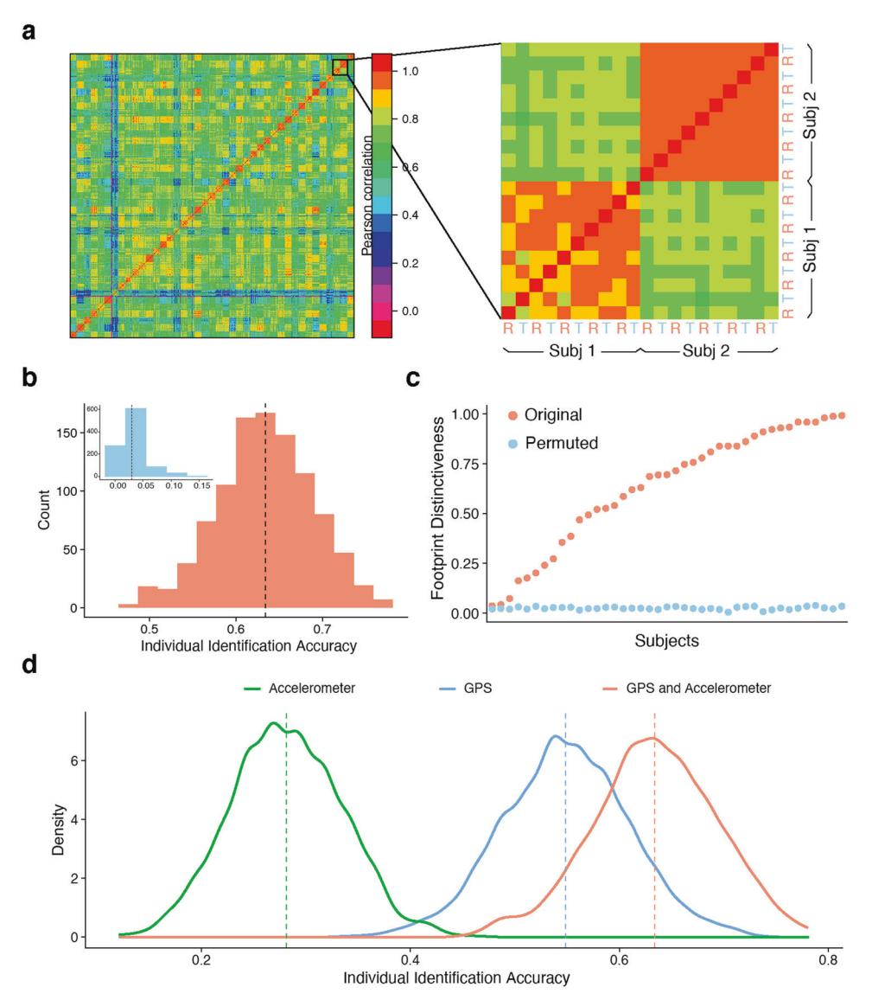
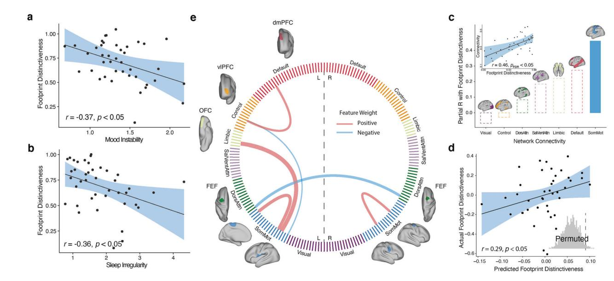

# ARTICLE Mobile footprinting: linking individual distinctiveness [i](http://crossmark.crossref.org/dialog/?doi=10.1038/s41386-022-01351-z&domain=pdf)n mobility patterns to mood, sleep, and brain functional connectivity

Cedric Huchuan Xia [1](http://orcid.org/0000-0002-9703-333X),2, Ian Barnett3 , Tinashe M. Tapera1,2, Azeez Adebimp[e](http://orcid.org/0000-0001-9049-0135) [1](http://orcid.org/0000-0001-9049-0135),2, Justin T. Bake[r](http://orcid.org/0000-0002-6629-2195) [4](http://orcid.org/0000-0002-6629-2195),5, Danielle S. Bassett [1](http://orcid.org/0000-0002-6183-4493),6,7,8,9,10, Melissa A. Brotman[11](http://orcid.org/0000-0002-9703-333X), Monica E. Calkins1,2, Zaixu Cui1,2, Ellen Leibenluft11, Sophia Linguiti1,2, David M. Lydon-Staley [6](http://orcid.org/0000-0001-8702-3923),1[2,13](http://orcid.org/0000-0002-6183-4493), Melissa Lynne Martin3 , Tyler M. Moore [1](http://orcid.org/0000-0002-1384-0151),2, Kristin Murtha1,2, Kayla Piiwaa1,2, Adam Pines1,2, David R. Roalf [1](http://orcid.org/0000-0002-1728-9782),2, Sage Rush-Goebel1,2, Daniel H. Wol[f](http://orcid.org/0000-0002-9731-8781) [1](http://orcid.org/0000-0002-9731-8781),2,14, Lyle H. Ungar15[,16,](http://orcid.org/0000-0002-1384-0151)17,18 and Theodore D. Satterthwait[e](http://orcid.org/0000-0001-7072-9399) [1](http://orcid.org/0000-0001-7072-9399),2,14,19✉

© The Author(s), under exclusive licence to American College of Neuropsychopharmacology 2022

Mapping individual differences in behavior is fundamental to personalized neuroscience, but quantifying complex behavior in real world settings remains a challenge. While mobility patterns captured by smartphones have increasingly been linked to a range of psychiatric symptoms, existing research has not specifically examined whether individuals have person-specific mobility patterns. We collected over 3000 days of mobility data from a sample of 41 adolescents and young adults (age 17–30 years, 28 female) with affective instability. We extracted summary mobility metrics from GPS and accelerometer data and used their covariance structures to identify individuals and calculated the individual identification accuracy—i.e., their "footprint distinctiveness". We found that statistical patterns of smartphone-based mobility features represented unique "footprints" that allow individual identification (p < 0.001). Critically, mobility footprints exhibited varying levels of person-specific distinctiveness (4–99%), which was associated with age and sex. Furthermore, reduced individual footprint distinctiveness was associated with instability in affect (p < 0.05) and circadian patterns (p < 0.05) as measured by environmental momentary assessment. Finally, brain functional connectivity, especially those in the somatomotor network, was linked to individual differences in mobility patterns (p < 0.05). Together, these results suggest that real-world mobility patterns may provide individual-specific signatures relevant for studies of development, sleep, and psychopathology.

Neuropsychopharmacology (2022) 47:1662–1671;<https://doi.org/10.1038/s41386-022-01351-z>

### INTRODUCTION

Linking individual differences in behavior to brain function is a central task of behavioral neuroscience [\[1\]](#page-8-0). However, quantifying complex human behavior in real world settings remains a challenge. One alternative to standard behavioral assessment is digital phenotyping, which uses mobility data from personal smartphones to quantify moment-by-moment human behavior [[2](#page-8-0)]. Prior work has associated geolocation features to important clinical outcomes in psychiatric disorders such as bipolar disorder and schizophrenia [\[3\]](#page-8-0), and has linked accelerometer metrics to post-surgical recovery [\[4,](#page-8-0) [5](#page-8-0)]. Furthermore, researchers have recently begun to capitalize on the substantial variability of behavior assessed with digital phenotyping to link individual differences in brain and behavior. For example, lower prefrontal activity during processing negative emotions has been associated with individual exposure to urban green space [\[6\]](#page-8-0), while greater functional coupling of the hippocampus and striatum has been linked to location variability [\[7](#page-8-0)].

While these studies suggest that digital phenotyping can be a powerful tool for studying individual differences, it remains unknown whether mobility patterns are in fact person specific. Recent high-impact work has established that individual humans

1 Penn Lifespan Informatics and Neuroimaging Center, Department of Psychiatry, Perelman School of Medicine, University of Pennsylvania, Philadelphia, PA 19104, USA. 2 Penn/ CHOP Lifespan Brain Institute, University of Pennsylvania, Philadelphia, PA 19104, USA. 3 Department of Biostatistics, Epidemiology and Informatics, Perelman School of Medicine, University of Pennsylvania, Philadelphia, PA 19104, USA. 4 McLean Institute for Technology in Psychiatry, McLean Hospital, Belmont, MA 02478, USA. 5 Department of Psychiatry, Harvard Medical School, Boston, MA 02115, USA. 6 Department of Bioengineering, School of Engineering and Applied Science, University of Pennsylvania, Philadelphia, PA 19104, USA. 7 Department of Physics and Astronomy, University of Pennsylvania, Philadelphia, PA 19104, USA. 8 Department of Electrical & Systems Engineering, University of Pennsylvania, Philadelphia, PA 19104, USA. 9 Department of Neurology, Perelman School of Medicine, University of Pennsylvania, Philadelphia, PA 19104, USA. 10Santa Fe Institute, Santa Fe, NM 87501, USA. 11National Institute of Mental Health, Intramural Research Program, Bethesda, MD 20892, USA. 12Annenberg School of Communication, University of Pennsylvania, Philadelphia, PA 19104, USA. 13Leonard Davis Institute for Health Economics, University of Pennsylvania, Philadelphia, PA 19104, USA. 14Center for Biomedical Image Computation and Analytics, University of Pennsylvania, Philadelphia, PA 19104, USA. 15Department of Computer and Information Science, School of Engineering and Applied Science, University of Pennsylvania, Philadelphia, PA 19104, USA. 16Department of Genomics and Computational Biology, Perelman School of Medicine, University of Pennsylvania, Philadelphia, PA 19104, USA. 17Department of Operations, Information and Decisions, Wharton School, Philadelphia, PA 19104, USA. 18Department of Psychology, School of Arts and Sciences, Philadelphia, PA 19104, USA. 19Penn Statistics in Imaging and Visualization Center, Department of Biostatistics, Epidemiology and Informatics, University of Pennsylvania, Philadelphia, PA 19104, USA. ✉email: [sattertt@pennmedicine.upenn.edu](mailto:sattertt@pennmedicine.upenn.edu)

Received: 14 October 2021 Revised: 18 May 2022 Accepted: 23 May 2022 Published online: 3 June 2022

have unique patterns of functional brain connectivity [[8,](#page-8-0) [9](#page-8-0)]. The uniqueness of such brain-based "fingerprints" [[10\]](#page-8-0) (also called "connectotypes") have been associated with development, cognition, and psychiatric conditions [\[11\]](#page-8-0). Interestingly, rather than the random walks as found in animal mobility trajectories, a classic study on individual mobility patterns using sparsely sampled locations inferred from cell phone towers (a pre-GPS technology) found that human movement follows reproducible patterns [\[12\]](#page-8-0). This suggests that human mobility patterns may encode characteristics that are unique to specific individuals. Establishing analogous person-specific mobility patterns—or mobility "footprints"—would constitute an important advance in behavioral neuroscience, and provide the foundation for targeted, individualspecific interventions.

Accordingly, in the current study, we seek to test the hypothesis that mobility patterns are person specific and can be used to accurately identify individuals. To do this, we capitalized on the ubiquity of personal smartphones and their capability to collect real-time geolocation and accelerometer data in naturalistic environment with no user input. As psychomotor disturbances are common in psychiatric disorders [\[13,](#page-8-0) [14](#page-8-0)], we collected data from a clinical sample of adolescents and young adults, enriched for affective instability. It should be noted that the approach of the current study to identify individuals is not based on raw GPS coordinates, which would allow trivial identification given a participant's exact location. In contrast, we aimed to use covariance structures of summary mobility metrics, such as time spent at home and total distance traveled, to abstract an overall statistical mobility pattern for each individual. Such an approach has been successfully applied in prior work on brain connectome fingerprints to map individual differences [\[10](#page-8-0), [11](#page-8-0)].

As described below, we establish that mobility patterns are person-specific and can be used to accurately identify individuals. Furthermore, we show that individual footprint distinctiveness, or the extent to which an individual's footprint can be accurately identified, varies by age and sex in youth. Notably, we find that higher degree of affective instability and circadian irregularity, as measured by environmental momentary assessment (EMA), are associated with reduced individual footprint distinctiveness. Finally, we found that a cross-validated multivariate machine learning model could predict footprint distinctiveness using brain functional connectivity patterns.

#### METHODS AND MATERIALS Participants

A sample of 41 adolescents and young adults (28 females; mean (s.d.) age = 23.4 (3.5) years, range 17–30 years) were enrolled as part of a study of affective instability in youth. Participants were recruited via the Penn/ CHOP Lifespan Brain Institute or through the Outpatient Psychiatry Clinic at the University of Pennsylvania. Of these 41 participants, 38 participants met criteria for Axis I psychiatric diagnosis based on a semi-structured clinical interview [\[15](#page-8-0)]; 33 met criteria for more than one disorder (Supplementary Table 1). Additionally, 16 of the 41 participants met criteria for a personality disorder (mainly borderline personality disorder) based on assessment with the SCID-II [\[15](#page-8-0)]. All participants provided informed consent to all study procedures; for minors, the parent or guardians provided informed consent and the minor assented as well. This study was approved by the University of Pennsylvania Institutional Review Board.

#### Mobility data acquisition

Global Positioning System (GPS) geolocation data were acquired via the Beiwe platform [\[16\]](#page-8-0). Participants were asked to download the Beiwe application on their personal smartphone. The application recorded the location of the participant's phone in latitude, longitude, and altitude, as well as the precision of that measure. To conserve battery and minimize degradation of the phone performance, Beiwe was designed to track a participant's geolocation in a periodic fashion [\[17](#page-8-0)]. Specifically, Beiwe

tracked GPS for 2 min at a fixed interval point every 20 min, resulting in 144 min of data recording and 1296 min of dormancy in a 24-h cycle (Fig. [1\)](#page-2-0). Due to user and device related factors in the naturalistic setting, such as the phone being powered off, no cell signal, or airplane mode, longer periods of recording dormancy were possible. Mobility data were automatically uploaded daily via WiFi to a cloud-based data management system.

The intended GPS tracking period was 3 months. However, participants were free to end the study early by uninstalling the Beiwe application. Conversely, they could volunteer to continue data collection beyond the 3-month period specified. Thus, in total, 3317 days of GPS data across all participants were collected (mean (s.d.) = 77 (26) days, range 14–132 days, see Supplementary Fig. 1). After removing the first and last days of each participant's study period when only partial data were recorded and days containing no data, the remaining data available for analysis had 3156 days.

Accelerometer data were also acquired via the Beiwe platform. The application recorded the participants' acceleration in three cardinal axes (x, y, and z) in m/s2 . In total, 2972 days of accelerometer data were obtained across all participants (mean (s.d.) = 74 (32) days, range 15–134 days). After removing the first and last days of each participant's study period when only partial data were recorded, the remaining data available for analysis had 2890 days.

#### Mobility data analysis

GPS data preprocessing. Raw GPS data were processed using the Smartphone Sensor Pipeline [\[17](#page-8-0)], a validated pipeline specifically designed to handle GPS data while accounting for data missingness (Fig. [1](#page-2-0)a). First, each subject's GPS longitude and latitude coordinates on the spherical Earth's surface were transformed to a standardized two-dimensional Cartesian plane, thus deidentifying subject's real-world locations. Second, the data were converted to a sequence of flights and pauses, where flights were defined as segments of linear movements and pauses were defined as periods of no movement (Fig. [1b](#page-2-0), c). Finally, missing flights and pauses were then imputed by the hot-deck method [[18\]](#page-8-0), which resamples from observed events over each missing interval.

Mobility metrics calculation. Using the constructed subject mobility traces and the Smartphone Sensor Pipeline, 15 GPS-based mobility metrics were calculated for each day of recording, defined as midnight to midnight (Fig. [1d](#page-2-0)). See Barnett et al. for details [\[17\]](#page-8-0). An additional seven accelerometer-based mobility metrics were calculated for each day of recording. These were implemented according to methods described in the RAPIDS pipeline [[19\]](#page-8-0). See Supplementary Table 2 for definitions of each metric.

Mobility footprint construction. Inspired by studies of person-specific connectome fingerprints [\[8](#page-8-0), [11\]](#page-8-0), we constructed a mobility footprint for each participant using the covariance matrix of mobility metrics (Fig. [1](#page-2-0)e). First, we extracted the mobility metric time series by concatenating the daily mobile metric output from the Smartphone Sensor Pipeline. Then we computed the pairwise Pearson correlation for all the mobility metrics to construct a covariance matrix. The nodes of the network were the mobility metrics, and the edges of the network were the Pearson correlation coefficients between metrics. We refer to the resulting covariance matrix as the "Mobility Footprint." This procedure was carried out separately for GPS- and accelerometer-based mobility data. For the main analysis, the upper triangle of the resulting covariance matrices from GPS and accelerometer metrics were concatenated and were used as input features for the individual identification procedure. We also repeated the identification procedure using GPS or accelerometer features alone. To compare the differences between GPS-alone and the combined GPSaccelerometer features, we performed a two-sample, two-tailed t-test on the identification distributions resulting from the two different feature sets.

As a sensitivity analysis to test performance of alternative features for individual identification, we also computed the mean and the stability of each measure and used these features to identify participants. Stability was defined as the root mean square of the successive differences (RMSSD) of each measure [\[20\]](#page-8-0) (Supplementary Fig. 7).

Individual identification procedure ("footprinting"). To test whether mobility footprints were individual-specific, we randomly partitioned each participant's data into two equally sized parts, named the "reference" and

1664

Fig. 1 Constructing personal mobility "footprints". a We collected 3317 days of mobility sensing data via personal smartphones from 41 adolescents and young adults. Geolocation data were recorded in cycles of 2 min on and 18 min off. Raw geolocation coordinates were deidentified via sphere-to-2D standard space projection and were further imputed for missing data. b For each individual, we constructed daily personal mobility trajectories, which consist of flights (movement) and pauses (stationary segments). Length of linear lines represents the duration of flights and size of circles represents the duration of pauses. Warm and cold colors indicate daytime and nighttime, respectively. c A representative week of trajectories is shown, which demonstrates rich characteristics of personal mobility patterns formed over time. d We extracted timeseries of mobility statistics (e.g., daily time spent at home) from geolocation and accelerometer data that parameterize movement characteristics over weeks to months. The example represented all 110 days of participants' geolocation metrics recorded. e For each individual, we constructed a covariance matrix from the mobility metric timeseries. Each cell of the matrix was populated by the Pearson correlation between a given pair of mobility metrics. Warm and cold colors indicate positive and negative correlations, respectively. f We randomly divided data into two equally sized parts, called the reference and target set. Subj X from the target set was matched to the subject in the reference that had the highest correlations between their footprints (argmax(r1, r2, ..rN)). The identification was considered correct when underlying data came from the same subject; otherwise, the identification was considered incorrect. We quantified individual identification accuracy as the proportion of correct identifications across the entire sample; this procedure was repeated 1000 times across different random partitions of the data.

the "target", respectively [[8\]](#page-8-0). The objective of the individual identification procedure was to match the participant from the target group (T) to the same one in the reference group (R) (Fig. 1f). For a given subject, S, we computed the Pearson correlation (r) between that subject's features in the target group, ST, and everyone's features in the reference group, SR 1, SR 2,..., SR N, where N was the total number of participants, which resulted in r1; r2; rN.

Individual identification was operationalized as a one-to-one match, defined as the maximum correlation between the reference and target groups. If the data in the target group and the reference group came from the same participant, a correct match was declared (M):

SM ¼ argmax rð Þ 1; r2; rN :

The individual identification accuracy was defined as the number of correct identifications divided by the total number of potential matches in the target group (N):

individual identification accuracy 
$$
= \frac{\sum_{i=1}^{N} \{1, if S_{\overline{1}} i = S_M i; 0, if S_{\overline{1}} i \neq S_M i\}}{N}.
$$

The above individual identification procedure was repeated 1000 times, each time with a new random data partition (P). We calculated the average individual identification accuracy across the 1000 runs, which yielded a distribution of sample-wise identification accuracy. Furthermore, we also calculated the accuracy for each participant, defined as the number of correct identifications for that specific participant divided by the number of data partitions (B). We refer to this participant-specific identification accuracy as the individual "footprint distinctiveness":

individual footprint disturbances 
$$
= \frac{\sum_{i=1}^{B} \{1, if P_{T}i = P_{M}i; 0, if P_{T}i \neq P_{M}i\}}{B},
$$

where PTi is target in a partition for subject i, and PMi is matched subject. We conducted the individual identification procedure using the covariance matrix of the GPS data, accelerometer data, as well as the combined feature set. Sensitivity analyses examined the mean and stability of each feature as above.

Similarity matrix construction. To visualize individual footprint distinctiveness, we constructed similarity matrices between participants' mobility covariance features [[21\]](#page-8-0). First, we concatenated the daily mobility metrics for a participant from multiple random data partitions. Next, a similarity matrix was constructed by computing the Pearson correlation coefficients between every pair of participants. The resulting matrix was a symmetric matrix, where the nodes were each participant, and the edges were the correlation coefficients between any two participant's mobility metrics. This grouping procedure was performed solely for visualization, highlighting the within-individual, across-partition block structures on the diagonal of the matrix. This grouping was not used in any statistical analysis.

Permutation testing. To assess the statistical significance of individual identification accuracy, we used a permutation testing procedure to create a null distribution of accuracy. Specifically, we randomly scrambled the identity of the daily mobility metrics, thus disrupting the linkage between the mobility data and the corresponding participant. We repeated the individual identification procedure for each random permutation. The empirical p-value was then calculated as the proportion of times when the permuted data yielded higher accuracy than the original data:

$$
P_{permutation} = \frac{\sum_{i=1}^{M} \{1, if A_i \geq A_{original} \ 0, if A_i < A_{original}}{M},
$$

where A is the individual identification accuracy, and M is the total permutations.

Sensitivity analysis of data missingness. To understand the effect of data missingness on our ability to identify participants' mobility footprint, we conducted sensitivity analyses that used data constructed using different thresholds for data missingness [\[17](#page-8-0), [22](#page-8-0)]. Specifically, we applied four thresholds with diminishing tolerance for the number of missing samples (i.e., minutes recorded) in a day's worth of data to be included in analysis (Supplementary Fig. 1). At the 100th percentile level, which corresponded to retaining all available days except for those with all data missing (or 1440 min), 79 recording days were removed, which resulted 3156 days remaining for analysis. At the 90th percentile, a further 216 days were removed, yielding 2940 days for analysis. At 80th percentile, a further 356 days were removed, resulting in 2584 days for analysis. Finally, at 75th percentile, a further 171 days were removed, resulting in 2413 days remaining for analysis. Using these four sub-samples constructed with different inclusion criteria, we then repeated the individual identification procedure and permutation testing as described above.

Feature lesion analysis. To further investigate the influence of any single feature's influence on the individual identification accuracy, we conducted a feature lesion analysis. We sequentially removed one metric (out of the total 15 geolocation mobility metrics available) and constructed a new covariance matrix which had one node (and 14 edges) less than the original feature covariance matrix. Using this reduced feature set, we repeated the individual identification and permutation testing procedures as described above (Supplementary Fig. 3).

#### Ecological momentary assessment

Using the Beiwe platform application on personal smartphones, participants completed daily questionnaires specifically designed to assess mood variability at three timepoints throughout the day [\[23](#page-8-0)]. The participants were sent questions within the same general windows, but they were allowed to choose the alert time within a range of time windows. The specific time windows were: 6 am-9 am, 3 pm-6 pm, and 7 pm-10 pm. In each survey, participants rated on a scale from 1 ("not at all") to 7 ("extremely") of their endorsement of six statements assessing mood, aggression, impulsivity, and self-esteem since the last time they had answered the survey to capture their mood (Supplementary Table 3). To quantify the variability of answers to the mood survey, we pooled responses to all six items and calculated the root mean square of successive differences (RMSSD) between concatenated answers. Prior research indicates that pooling responses to individual mood items and calculating a single variability score may allow for improved reliability measurement of mood variation [[24\]](#page-8-0). RMSSD has been the preferred index of affective instability, because it captures both variability and temporal dynamics of time series, particularly in borderline personality disorder and mood cycling disorders [[24](#page-8-0), [25](#page-8-0)]. Additionally, every morning, participants were also asked about their sleep patterns from the night before. Similarly, we also calculated the RMSSD of sleep duration as a measurement of its stability.

We built a generalized additive model (GAM) to investigate the association between footprint distinctiveness and demographic factors such as age and sex, as well both mood and sleep duration stability. Age was modeled using penalized splines within GAM using restricted maximum likelihood (REML) to estimate linear and nonlinear developmental effects without over-fitting the data [\[26](#page-8-0), [27\]](#page-8-0).

#### Brain functional connectivity analysis

Imaging acquisition. Brain images were acquired on the same day as the participants were given the instructions regarding the mobile data tracking. Since the participants downloaded the Beiwe app within the next few days, the mobility data collection commenced shortly after neuroimaging acquisition. As previously described [\[28](#page-8-0)], structural and functional MRI scans were acquired using in a single session on a clinicallyapproved 3 Tesla Siemens Prisma (Erlangen, Germany) quadrature bodycoil scanner and a Siemens receive-only 64-channel head coil at the Hospital of the University of Pennsylvania. Prior to functional MRI acquisitions, a 5-min magnetization-prepared, rapid acquisition gradientecho T1-weighted (MPRAGE) image (TR = 1810 ms; TE = 3.45 ms; TI = 1100 ms, FOV = 180 × 240 mm2 , matrix = 192 × 256, 160 slices, effective voxel resolution = 0.9375 × 0.9375 × 1 mm3 ) was acquired. All fMRI images were acquired with the same multi-band, interleaved multi-slice, gradient-echo, echo planar imaging (GE-EPI) sequence sensitive to BOLD contrast with the following parameters: TR = 500 ms; TE = 25 ms; multiband acceleration factor = 6, flip angle = 30°; FOV = 192 × 192 mm2 ; matrix = 64 × 64; 48 slices; slice thickness/gap = 3/0 mm, effective voxel resolution = 3.0 × 3.0 × 3.0 mm3 ; 1200 volumes were acquired.

Image processing. All preprocessing was performed using fMRIPrep 20.0.7 [\[29](#page-8-0)], which is based on Nipype 1.4.2 [\[30](#page-8-0)], and the eXtensible Connectivity Pipelines (XCP) [[31,](#page-8-0) [32](#page-8-0)] (PennBBL/xcpEngine: atlas in MNI2009 Version 1.2.3; Zenodo: [https://doi.org/10.5281/zenodo.4010846\)](https://doi.org/10.5281/zenodo.4010846). The T1-weighted (T1w) image was corrected for intensity non-uniformity (INU) with N4BiasFieldCorrection [\[33](#page-8-0)], distributed with ANTs 2.2.0 [\[34](#page-8-0)], and used as T1w-reference throughout the workflow. The T1w-reference was then skull-stripped with a Nipype implementation of the antsBrainExtraction.sh workflow (from ANTs), using OASIS30ANTs as target template. Brain tissue segmentation of cerebrospinal fluid (CSF), white-matter (WM) and graymatter (GM) was performed on the brain-extracted T1w using FAST in FSL 5.0.9 [\[35](#page-8-0)]. Volume-based spatial normalization to MNI2009c standard space was performed through nonlinear registration with antsRegistration (ANTs 2.2.0), using brain-extracted versions of both the T1w reference and the T1w template.

BOLD runs were first slice-time corrected using 3dTshift from AFNI 20160207 [\[36](#page-8-0)] and then motion corrected using mcflirt (FSL 5.0.9) [\[35\]](#page-8-0). A fieldmap was estimated based on a phase-difference map calculated with a dual-echo GRE sequence, processed with a custom workflow of SDCFlows inspired by the epidewarp.fsl script and further improvements in HCP Pipelines [[37\]](#page-8-0). The fieldmap was then co-registered to the target EPI reference run and converted to a displacement field map with FSL's fugue and other SDCflows tools. Based on the estimated susceptibility distortion, a corrected BOLD reference was calculated for a more accurate coregistration with the anatomical reference. The BOLD reference was then co-registered to the T1w reference using bbregister, which implements boundary-based registration [\[38\]](#page-8-0). Co-registration was configured with nine degrees of freedom to account for distortions remaining in the BOLD reference. Six head-motion parameters (corresponding rotation and translation parameters) were estimated before any spatiotemporal filtering using mcflirt. Finally, the motion correcting transformations, field distortion correcting warp, BOLD-to-T1w transformation and T1w-to-template (MNI) warp were concatenated and applied to the BOLD timeseries in a single step using antsApplyTransforms (ANTs) with Lanczos interpolation.

After pre-processing with fMRIPRep, confound regression was carried out in XCP. Preprocessed timeseries were despiked and then de-noised using a 36-parameter confound regression model that has been shown to

minimize the impact of motion artifact [[39\]](#page-8-0). Specifically, the confound regression model included the six framewise estimates of motion, the mean signal extracted from eroded white matter and cerebrospinal fluid compartments, the global signal, the derivatives of each of these nine parameters, and quadratic terms of each of the nine parameters as well as their derivatives. Both the BOLD-weighted time series and the confound regressor timeseries were temporally filtered simultaneously using a fistorder Butterworth filter with a passband between 0.01 and 0.08 Hz to avoid mismatch in the temporal domain [\[40](#page-8-0)]. Confound regression was performed using AFNI's 3dTproject. Note that in-scanner head motion was also included as a covariate in all statistical models (see below).

Functional network and community connectivity. Functional connectivity between each pair of brain regions was quantified as the Fisher‐ transformed Pearson correlation coefficient between the mean regional BOLD time series. For each participant, a 200 × 200 weighted adjacency matrix encoding the connectome was constructed based on the parcellation system defined by Schaefer and colleagues [\[41](#page-8-0)]. Each node was assigned to one of seven canonical functional brain modules or communities defined by Yeo et al. [[42\]](#page-8-0).

The within‐community connectivity was defined as

$$
\frac{\sum_{j,j'\in C_k}A_{jj'}^i}{|C_k|\times(|C_k|-1)},
$$

where Ai jj0 is the weighted edge strength between the node j and node j′, both of which belong to the same community Ck, for the i‐th subject. The cardinality of the community assignment vector, Ck, represents the number of nodes in the k‐th community [\[43\]](#page-8-0).

Mass-univariate analysis. For each of the seven canonical networks, we fit a generalized additive model (GAM) to investigate the relationship between within-network connectivity and footprint distinctiveness, while controlling for in-scanner motion, mobility data quantity, sex, and age. Specifically, we used penalized splines using restricted maximum likelihood (REML) within GAM to capture linear and nonlinear age-related changes [[26](#page-8-0), [27\]](#page-8-0). We controlled for multiple comparisons using the False Discovery Rate (Q < 0.05).

Predicting footprint distinctiveness using functional connectivity. As a final step, we fit a penalized regression model to predict footprint distinctiveness using the multivariate pattern of functional connectivity [[8](#page-8-0)]. In each iteration of leave-one-out cross-validation, one subject was left out as the testing set and the rest the training set. Using the training set, we computed residualized footprint distinctiveness from a GAM model with covariates as above (linear terms for in-scanner motion, data quantity, sex; age was modeled with as a penalized spline). Then we fit a lasso regression model to predict the residualized footprint distinctiveness using a sparse collection of functional connectivity edges. L1 lasso hyperparameter was similarly tuned within the training set in a nested leave-one-out fashion; at no time did hyper-parameter tuning include testing set data. Next, we calculated the predicted footprint distinctiveness for the unseen subject in the testing set. After all iterations, we obtained predicted footprint distinctiveness for all participants and then calculated the Pearson correlation between the actual footprint distinctiveness and predicted values.

#### RESULTS

## Individual mobility footprints are person-specific

When tracked over weeks to months, timeseries of mobility statistics captured rich characteristics of individual mobility patterns (Fig. [1](#page-2-0)a–c). One illustrative example of the sensitivity of the timeseries to track mobility patterns is when COVID-19 pandemic hit the Philadelphia area towards the end of the study period. Participants who were still engaged in active data collection (n = 3) exhibited dramatic shifts in mobility features (Supplementary Fig. 2). Of note, as the data points during COVID-19 represented merely 1.1% of all data, the findings reported below did not change significantly when these data were removed.

Drawing on prior work of brain connectome "fingerprinting," [[8](#page-8-0), [10](#page-8-0)] we created a covariance matrix using each participant's fifteen geolocation-based and seven accelerometer-based mobility features timeseries to identify individuals, akin to a personspecific mobility "footprint" (Fig. [1d](#page-2-0), e). Across the sample, the average positive correlation was 0.47, indicating a high degree of common variability among many mobility features (such as distance traveled and radius of gyration), and the average negative correlation was −0.10, indicating a moderate anticorrelated variability among a few variables (such as distance traveled and home time). Conceptually, one's temporal pattern in a single mobility dimension (e.g. distance traveled) can be similar to that of another person, but when combined with more dimensions of mobility features (e.g. possibility of pauses), the complex pattern of interplay between the dimensions as depicted in the covariance matrix (i.e. mobility "footprint") may help distinguish one person from another.

Data from each individual was partitioned into two groups: the target partition and the reference partition. For each individual, the data in the target partition was separately correlated with every individual's data in the reference partition; this procedure yielded 41 correlation values (Fig. [1](#page-2-0)f). A correct identification was declared only when the maximum correlation was from the data belonging to the same individual across the target and reference partitions. To ensure that the random partitioning of the data did not impact results, this matching procedure was then repeated for each individual 1000 times.

Initial inspection across random partitions of the data revealed that there was substantially greater correlation between mobility footprints within participants rather than between participants (Fig. [2a](#page-5-0)). Permutation testing on the entire sample revealed that individuals could be successfully identified using their mobility footprints (p < 0.001; Fig. [2](#page-5-0)b). Across 1000 random data partitions, the mean individual identification accuracy was 63%. Critically, this accuracy was far better than chance performance determined by a permuted null distribution (mean: 3% accuracy; see Fig. [2](#page-5-0)b inset).

Footprint distinctiveness exhibit developmental effects and sex differences. Moving beyond aggregate measures of accuracy across the group, we next investigated whether certain individuals could be consistently identified more accurately than others. Similar to prior studies of brain connectome fingerprinting [[8](#page-8-0), [10,](#page-8-0) [11](#page-8-0)], we refer to this measure as an individual's "footprint distinctiveness". Notably, individuals exhibited a wide distribution of footprint distinctiveness, ranging from 4% to 99% (Fig. [2c](#page-5-0)). In other words, certain participants had such distinct mobility patterns that they enabled correct identification nearly every single time; other participants were difficult to identify. Nonetheless, permutation testing showed that all participants had significant footprint distinctiveness compared to the null distribution.

As the group and individual level accuracy reported thus far were based on the combination of geolocation and accelerometer features, we next examined each feature set separately. Individual footprint distinctiveness derived from geolocation was not correlated with that from accelerometer (r = 0.18; p = 0.26). Interestingly, while accelerometer data alone yielded lower identification accuracy (28%) than geolocation data (55%), combining these features resulted in higher identification accuracy (63%, p < 2.2 × 10–16, Fig. [2](#page-5-0)d), suggesting that they encode complementary information. As a proxy to accounting for operating system differences in data collection [\[22\]](#page-8-0), we removed minutes-missing from the feature set and re-calculated the individual identification analysis. No significant changes in individual footprint identification were observed (Supplementary Fig. 3), suggesting the results were robust to data completeness that might be influenced by operating system differences. Importantly, individual identification accuracy was stable across different inclusion thresholds for data missingness and was robust to removal of individual mobility features (Supplementary Fig. 3).

Fig. 2 Identifying individuals using personal footprints. a As an initial step, we visualized the similarity of mobility features across multiple random reference and target partitions (R & T in inset). Mobility features were more correlated within participants (on-diagonal) across data partitions than between participants (off-diagonal). Note that this visualization was not used in statistical analysis or individual identification. b Across 1000 random partitions, mobility footprinting enabled successful individual identification (mean: 63%, S.D.: 6%). In contrast, the mean chance accuracy from 1000 permutation was 3% (inset, p < 0.001). The dotted line indicates the average individual identification accuracy across random data partitions. c For each individual, we calculated the footprint distinctiveness, or the percentage of correct identification across the 1000 random partitions of the data. Ranked in ascending order, participants' footprint distinctiveness exhibited a wide range, from 4% to 99%. However, even the participant with the lowest footprint distinctiveness was significantly higher than the null distribution (2%). d Individual identification based on geolocation alone had higher accuracy than accelerometer alone (p < 2.2 × 10−16). However, they appeared to encode complementary features, as performance was maximal when both measures were used in footprinting (p < 2.2 × 10−16). The dotted line indicates the average individual identification accuracy across random data partitions.

We next investigated participant factors that influenced footprint distinctiveness. We found that data quantity (i.e., number of days recorded per participant) was associated with footprint distinctiveness (Supplementary Fig. 4). In contrast, the amount of missing data within a given day was unrelated to footprint distinctiveness. To understand the range of distinctiveness after controlling for data quantity, we calculated the individual identification accuracy after thresholding subjects at varying levels of data quantity (Supplementary Fig. 5). We found that as subjects' minimum data quantity increased, the range of footprint distinctiveness narrowed, driven by increase of the lower bound while the upper bound remained the same. Based on these results, a practical recommendation for the minimum quantity of data to run mobility based individual identification analysis would

be at least 30 days. Based on this result, all subsequent analyses of footprint distinctiveness were controlled for number of days of data available.

As a next step, we evaluated whether footprint distinctiveness was related to age or sex in our sample of adolescents and young adults. We found that geolocation-based footprints became more distinct with age across the transition from adolescence to adulthood (partial r = 0.33, p < 0.05, Supplementary Fig. 6). Furthermore, female sex was associated with higher accelerometer-based footprint distinctiveness (Cohen's d = 1.27, p < 0.001, Supplementary Fig. 6). As a sensitivity analysis to test performance of alternative features for individual identification, we also computed the mean and the stability of each measure and used these features to identify participants (Supplementary Fig. 7). We found C.H. Xia et al.

Fig. 3 Individual footprint distinctiveness is associated with affective instability, sleep irregularity, and patterns of brain functional connectivity. a Greater affective instability, measured by root mean square of successive differences in mood measures from ecological momentary assessment performed three times a day, was associated with reduced footprint distinctiveness (r = −0.37, p < 0.05), after controlling for data quantity, age, sex, and mean level of mood ratings. b Similarly, we found that increased variability in sleep duration was associated with reduced footprint distinctiveness (r = −0.36, p < 0.05), after controlling for covariates. c Across functional brain networks, greater connectivity within the somatomotor network had a significant association with footprint distinctiveness (r = 0.46, p < 0.05, corrected for multiple comparisons with the false discovery rate). d Patterns of brain functional connectivity significantly predicted individual footprint distinctiveness using leave-one-out cross-validation (r = 0.29, inset: permutation-based p = 0.025). e Six network edges consistently contributed to the sparse regression model. These edges included greater connectivity within somatomotor network, reduced connectivity between left and right frontal eye fields (FEF), increased connectivity between the somatomotor network and the left orbital frontal cortex (OFC) in the limbic network, as well as increased connectivity between the ventrolateral prefrontal cortex (vlPFC) in the frontoparietal network and the dorsomedial prefrontal cortex (dmPFC) in the default mode network. Cord thickness reflects the weights in the model, reflecting each edge's contribution to the prediction; cord color indicates the sign of the weights.

that using mean, variability, or combined mean and variability features was able to identify individuals, albeit much less accurately than the covariance features.

#### Affective instability and circadian irregularity associated with reduced footprint distinctiveness

We next evaluated how footprint distinctiveness was related to a key domain of psychopathology: affective instability. Affective instability is defined in the DSM-5 as "marked reactivity of mood", for example, "intense episodic dysphoria, irritability, or anxiety lasting a few hours" [\[44](#page-8-0)]. It is particularly prominent in youth [[14](#page-8-0)], and is an important predictor of suicide [\[45](#page-8-0)]. However, affective instability is often challenging to quantify using standard tools as it is fundamentally a dynamic measure [[24](#page-8-0)]. Here, we capitalized on the participant ratings of six mood features collected three times a day for 2 weeks using ecological momentary assessment. To quantify a single score of affective instability, we then computed overall instability of concatenated responses of all six items for each participant using root mean square successive difference (RMSSD) [[46\]](#page-8-0). This approach has been successfully applied to capture both the variability and temporal dynamics of mood, especially in borderline personality disorder and mood cycling disorders [\[24](#page-8-0), [25\]](#page-8-0). We hypothesized that individuals who had less predictable patterns of mobility (i.e., reduced footprint distinctiveness) would have higher levels of affective instability. While controlling for data quantity, age, sex, and the mean of mood ratings, we found that affective instability was associated with reduced footprint distinctiveness (partial r = −0.37, p < 0.05, Fig. 3a). Furthermore, given well-established links between sleep disturbance and mood disorders [[47\]](#page-8-0), we also evaluated whether variability in sleep duration was also associated with footprint distinctiveness. While controlling for covariates as above, we found that variability in sleep duration was similarly associated with reduced footprint distinctiveness (partial r = −0.36, p < 0.05, Fig. 3b).

#### Functional brain connectivity predicts individual footprint distinctiveness

As a final step, we investigated whether footprint distinctiveness was related to patterns of functional connectivity. Initially, we examined associations with a simple summary measure of highdimensional functional connectivity data: the mean connectivity within each of seven canonical large-scale functional networks [[41\]](#page-8-0). While controlling for covariates as above (as well as inscanner motion) and correcting for multiple comparisons with the false discovery rate, we found that footprint distinctiveness was associated with greater connectivity within the somatomotor network (r = 0.46, pfdr = 0.03, Fig. 3c).

Lastly, we moved beyond the simple summary measure of mean network connectivity and investigated whether complex multivariate patterns of functional connectivity could predict footprint distinctiveness in unseen data. Given that there were far larger number of features than participants, we used regularized regression with leave-one-out cross-validation and nested parameter tuning, followed by permutation testing to determine significance. We found that multivariate patterns of functional connectivity could predict footprint distinctiveness in unseen data (r = 0.29, p = 0.025; Fig. 3d). The predictive model yielded results that aligned with the mass-univariate analyses (Fig. 3c), suggesting that the multivariate model was driven in part by features linked to somatomotor network (67% of edges selected by the model). Moreover, this model also revealed important features beyond the motor system, including increased connectivity between the frontoparietal and default mode system (Fig. 3e).

1668

#### DISCUSSION

Leveraging a sample of adolescents and young adults and recent advances in digital phenotyping, we demonstrated that anonymized mobility footprints, captured patterns unique to each person and enabled subject-specific identification. Notably, subjects exhibited individual differences in the extent to which their footprint patterns could be differentiated from others. Such footprint distinctiveness increased with age and was stronger in females. Furthermore, affective instability and circadian irregularity was associated with reduced footprint distinctiveness. Finally, functional brain connectivity, particularly within the somatomotor network, significantly predicted individual footprint distinctiveness. Taken together, these results suggest that person-specific mobility patterns embed individual biosignatures that are linked to development, sleep, mood, and brain networks.

Instead of measuring behavior that requires active participant engagement, we used passive sensor data to track behavior over an extended time period. Previous studies have demonstrated the utility of mobility metrics in predicting a wide range of health outcomes, as diverse as psychiatric symptom severity [\[3\]](#page-8-0), quality of life [[4\]](#page-8-0), and post-surgical recovery [[5\]](#page-8-0). However, most studies have principally examined group average data. In contrast, this study explicitly examined whether an individual's overall statistical mobility patterns tracked over weeks to months could distinguish from one person from another. Our approach was motivated by recent development in neuroimaging that focused on understanding inter-individual variability. Specifically, a series of high-impact papers have reported that person-specific brain connectivity fingerprints, which emerge with brain development, differ between sexes, and are altered in psychiatric conditions [\[8](#page-8-0), [10](#page-8-0), [11](#page-8-0)].

Here, instead of brain fingerprinting, we demonstrated the feasibility of mobile footprinting using rich digital phenotyping data. Specifically, we show that individual mobility footprints can reliably identify individuals in unseen and anonymized data, suggesting that personal mobility patterns embed specific behavioral information unique to each person. The accuracy of identification was robust to random data partitions, feature selection, and amount of data missing. This is consistent with prior reports that human mobility trajectories contain personspecific patterns, rather than random walks as previously hypothesized [[12\]](#page-8-0).

Our finding that footprint distinctiveness is related to data quantity recalls recent work demonstrating that the ability to delineate person-specific functional brain networks is dependent in large part on the quantity of data available [\[21](#page-8-0), [48](#page-8-0)]. However, while accruing large amounts of functional imaging data is often difficult and expensive, passive collection of long timeseries of mobility data is both tolerable for participants and inexpensive [\[49\]](#page-8-0). The high degree of scalability enabled by ubiquitous usage of personal smartphones will allow future studies to test the generalizability of these findings across different age groups and clinical samples.

Adding to a growing body of evidence [\[6](#page-8-0), [7\]](#page-8-0), we found that individual distinctiveness in mobility patterns has implications for mental health. Specifically, we found that affective instability and circadian irregularity were both associated with reduced individual footprint distinctiveness. Such observation concurs with the known clinical associations of psychomotor disturbances with mood and sleep disorders [\[50\]](#page-8-0). Since affective instability is a risk factor for the development of later psychopathology, including borderline personality disorder and bipolar disorder [[51\]](#page-8-0), mobility footprints may be used to identify individuals at risk.

Indeed, the dynamics of interacting with daily environmental experiences may shape individual personality [\[52](#page-8-0)] and the brain circuits that underlie individual differences in experiential processing are both plastic [\[53](#page-8-0)] and are altered in patients with affective instability [[54\]](#page-8-0). The current findings that footprint distinctiveness increases with age, appears stronger in females, and weakens in psychopathology mirror the results from studies investigating brain functional connectivity fingerprints quite closely [\[11\]](#page-8-0). In that paper, the authors reported that individual connectome distinctiveness was similarly lowered in psychopathology, increased with age, and was elevated in females—linking individual differences in brain to behavior.

Finally, we were interested in how individual differences in footprint distinctiveness were related to functional brain network connectivity, which has also been shown to be person-specific [\[8,](#page-8-0) [10](#page-8-0)]. Prior work has shown that the distinctiveness of such brain connectome fingerprints was related to both brain development and trans-diagnostic psychopathology [\[11\]](#page-8-0). Specifically, connectome distinctiveness exhibited slowed maturation in individuals with higher general psychopathology scores. Inspired by these individual brain distinctiveness studies, we set out to examine whether brain network connectivity was associated with individual differences in footprint distinctiveness. Using both univariate and multivariate analysis, we found that within-network connectivity in the somatomotor network was correlated with footprint distinctiveness, suggesting that the stronger functional connectivity within the somatomotor network might give rise to the distinctiveness of the footprint. Previous work has demonstrated that somatomotor network connectivity develops over the lifespan (years) [[55,](#page-8-0) [56\]](#page-9-0) and is altered acutely (days) during limb disuse [\[57\]](#page-9-0); our results further indicate that mobility patterns over a medium time-scale (weeks-months) can be predicted by somatomotor network connectivity. Furthermore, results from the multivariate analysis also suggest that functional integration of association networks beyond the motor system (e.g. prefrontal cortex of the control network) may relate to person-specific mobility patterns [[58](#page-9-0)].

Although this study benefited from a richly sampled cohort in a naturalistic environment, several limitations should be noted. First, while dense sampling per person enabled us to study behavior on the individual level, a modest sample size limited our ability to examine the generalizability of our findings. Thanks to ubiquitous smartphone and cloud-based technologies, collecting mobility data from a larger cohort should be easy to scale. Second, we successfully identified individuals with mobility metrics, but digital phenotyping provides many more options of behavioral readout. Incorporating additional types of mobile data may extract different sources of important individual differences, such as voice [[59\]](#page-9-0) and screen time [[60](#page-9-0)]. Finally, future research examining a broader set of correlates of footprint distinctiveness, such as substance use, gender identity, and socioeconomic status, may provide additional insights into factors that influence individual differences in mobility.

In summary, we established that statistical patterns in passively collected digital phenotyping data can be used to construct person-specific mobility footprints. Furthermore, the distinctiveness of mobility footprints was related to individual differences in multiple domains including development in youth, biological sex, circadian irregularity, affective instability, and functional connectivity, which mirrors findings in functional brain connectome fingerprints. Moving forward, mobility-based digital biomarkers that combine objective measurement and individual-specific analysis of behavior could accelerate the advances in personalized diagnostics for diverse psychiatric illnesses.

#### CODE AVAILABILITY

The code for GPS data preprocessing, mobility metric extraction, individual identification, additional analysis, and data visualization is available in R on github: <https://github.com/PennLINC/footprinting>. Code notebook is available at: [https://](https://pennlinc.github.io/footprinting/) [pennlinc.github.io/footprinting/](https://pennlinc.github.io/footprinting/).

# 1670

#### REFERENCES

- 1. Insel TR. Digital phenotyping: Technology for a new science of behavior. JAMA. 2017;318:1215–6.
- 2. Onnela JP. Opportunities and challenges in the collection and analysis of digital phenotyping data. Neuropsychopharmacology. 2021;46:45–54.
- 3. Fraccaro P, Beukenhorst A, Sperrin M, Harper S, Palmier-Claus J, Lewis S, et al. Digital biomarkers from geolocation data in bipolar disorder and schizophrenia: a systematic review. J Am Med Inform Assoc. 2019;26:1412–20.
- 4. Cote DJ, Barnett I, Onnela J-P, Smith TR. Digital Phenotyping in Patients with Spine Disease: A Novel Approach to Quantifying Mobility and Quality of Life. World Neurosurg. 2019;126:e241–e249.
- 5. Panda N, Solsky I, Huang EJ, Lipsitz S, Pradarelli JC, Delisle M, et al. Using Smartphones to Capture Novel Recovery Metrics After Cancer Surgery. JAMA Surg. 2020;155:123–9.
- 6. Tost H, Reichert M, Braun U, Reinhard I, Peters R, Lautenbach S, et al. Neural correlates of individual differences in affective benefit of real-life urban green space exposure. Nat Neurosci. 2019;22:1389–93.
- 7. Heller AS, Shi TC, Ezie CEC, Reneau TR, Baez LM, Gibbons CJ, et al. Association between real-world experiential diversity and positive affect relates to hippocampal–striatal functional connectivity. Nat Neurosci. 2020;23:800–4.
- 8. Finn ES, Shen X, Scheinost D, Rosenberg MD, Huang J, Chun MM, et al. Functional connectome fingerprinting: Identifying individuals based on patterns of brain connectivity HHS Public Access. Nat Neurosci. 2015;18:1664–71.
- 9. Horien C, Shen X, Scheinost D, Constable RT. The individual functional connectome is unique and stable over months to years. Neuroimage. 2019;189: 676–87.
- 10. Miranda-Dominguez O, Mills BD, Carpenter SD, Grant KA, Kroenke CD, Nigg JT, et al. Connectotyping: Model Based Fingerprinting of the Functional Connectome ((S. Hayasaka, editor)). PLoS One. 2014;9:e111048.
- 11. Kaufmann T, Alnæs D, Doan NT, Brandt CL, Andreassen OA, Westlye LT. Delayed stabilization and individualization in connectome development are related to psychiatric disorders. Nat Neurosci. 2017;20:513–5.
- 12. González MC, Hidalgo CA, Barabási AL. Understanding individual human mobility patterns. Nature. 2008;453:779–82.
- 13. Koenigsberg HW, Harvey PD, Mitropoulou V, Schmeidler J, New AS, Goodman M, et al. Characterizing affective instability in borderline personality disorder. Am J Psychiatry. 2002;159:784–8.
- 14. Tragesser SL, Solhan M, Schwartz-Mette R, Trull TJ. The Role of Affective Instability and Impulsivity in Predicting Future BPD Features. J Pers Disord. 2007;21:603–14.
- 15. Calkins ME, Moore TM, Satterthwaite TD, Wolf DH, Turetsky BI, Roalf DR, et al. Persistence of psychosis spectrum symptoms in the Philadelphia Neurodevelopmental Cohort: a prospective two-year follow-up. World Psychiatry. 2017;16: 62–76.
- 16. Torous J, Kiang MV, Lorme J, Onnela J-P. New Tools for New Research in Psychiatry: A Scalable and Customizable Platform to Empower Data Driven Smartphone. Res JMIR Ment Heal. 2016;3:e16.
- 17. Barnett I, Onnela J-P. Inferring mobility measures from GPS traces with missing data. Biostatistics. 2018;21:e98–e112.
- 18. Andridge RR, Little RJA. A Review of Hot Deck Imputation for Survey Nonresponse. Int Stat Rev. 2010;78:40–64.
- 19. Vega J, Li M, Aguillera K, Goel N, Joshi E, Durica KC, et al. (n.d.): RAPIDS: Reproducible Analysis Pipeline for Data Streams Collected with Mobile Devices. [https://](https://doi.org/10.2196/preprints.23246) [doi.org/10.2196/preprints.23246](https://doi.org/10.2196/preprints.23246)
- 20. Shaffer F, Ginsberg JP. An Overview of Heart Rate Variability Metrics and Norms. Front Public Heal. 2017;5:258.
- 21. Gratton C, Laumann TO, Nielsen AN, Greene DJ, Gordon EM, Gilmore AW, et al. Functional Brain Networks Are Dominated by Stable Group and Individual Factors, Not Cognitive or Daily Variation. Neuron. 2018;98:439–452.e5.
- 22. Kiang M V, Chen JT, Krieger N, Buckee CO, Alexander MJ, Baker JT, et al. (2021): Sociodemographic Characteristics of Missing Data in Digital Phenotyping. medRxiv 2020.12.29.20249002.
- 23. Shiffman S, Stone AA, Hufford MR. Ecological Momentary Assessment. Annu Rev Clin Psychol. 2008;4:1–32.
- 24. Trull TJ, Solhan MB, Tragesser SL, Jahng S, Wood PK, Piasecki TM, et al. Affective instability: measuring a core feature of borderline personality disorder with ecological momentary assessment. J Abnorm Psychol. 2008;117:647–61.
- 25. Jahng S, Wood PK, Trull TJ. Analysis of affective instability in ecological momentary assessment: Indices using successive difference and group comparison via multilevel modeling. Psychol Methods. 2008;13:354–75.
- 26. Wood SN. Fast stable restricted maximum likelihood and marginal likelihood estimation of semiparametric generalized linear models. J R Stat Soc Ser B (Statistical Methodol. 2011;73:3–36.
- 27. Wood SN. Stable and Efficient Multiple Smoothing Parameter Estimation for Generalized Additive Models. J Am Stat Assoc. 2004;99:673–86.

- 28. Jirsaraie RJ, Kaczkurkin AN, Rush S, Piiwia K, Adebimpe A, Bassett DS, et al. Accelerated cortical thinning within structural brain networks is associated with irritability in youth. Neuropsychopharmacology. 2019;44:2254–62.
- 29. Esteban O, Markiewicz CJ, Blair RW, Moodie CA, Isik AI, Erramuzpe A, et al. fMRIPrep: a robust preprocessing pipeline for functional MRI. Nat Methods. 2019;16:111–6.
- 30. Gorgolewski K, Burns CD, Madison C, Clark D, Halchenko YO, Waskom ML, et al. Nipype: A Flexible, Lightweight and Extensible Neuroimaging Data Processing Framework in Python. Front Neuroinform. 2011;5:13.
- 31. Ćirić R, Adebimpe A, Cieslak M, Rosen A, sattertt, Tooley U, et al. (2020): PennBBL/ xcpEngine: atlas in MNI2009. <https://doi.org/10.5281/ZENODO.4010846>
- 32. Ciric R, Rosen AFG, Erus G, Cieslak M, Adebimpe A, Cook PA, et al. Mitigating head motion artifact in functional connectivity MRI. Nat Protoc. 2018;13:2801–26.
- 33. Tustison NJ, Avants BB, Cook PA, Zheng Y, Egan A, Yushkevich PA, et al. N4ITK: improved N3 bias correction. IEEE Trans Med Imaging. 2010;29:1310–20.
- 34. Avants BB, Epstein CL, Grossman M, Gee JC. Symmetric diffeomorphic image registration with cross-correlation: evaluating automated labeling of elderly and neurodegenerative brain. Med Image Anal. 2008;12:26–41.
- 35. Jenkinson M, Bannister P, Brady M, Smith S (n.d.): Improved Optimization for the Robust and Accurate Linear Registration and Motion Correction of Brain Images. <https://doi.org/10.1006/nimg.2002.1132>
- 36. Cox RW. AFNI: software for analysis and visualization of functional magnetic resonance neuroimages. Comput Biomed Res. 1996;29:162–73.
- 37. Glasser MF, Sotiropoulos SN, Wilson JA, Coalson TS, Fischl B, Andersson JL, et al. The minimal preprocessing pipelines for the Human Connectome Project. Neuroimage. 2013;80:105–24.
- 38. Greve DN, Fischl B. Accurate and robust brain image alignment using boundarybased registration. Neuroimage. 2009;48:63–72.
- 39. Ciric R, Wolf DH, Power JD, Roalf DR, Baum GL, Ruparel K, et al. Benchmarking of participant-level confound regression strategies for the control of motion artifact in studies of functional connectivity. Neuroimage. 2017;154:174–87.
- 40. Hallquist MN, Hwang K, Luna B. The nuisance of nuisance regression: Spectral misspecification in a common approach to resting-state fMRI preprocessing reintroduces noise and obscures functional connectivity. Neuroimage. 2013;82:208–25.
- 41. Schaefer A, Kong R, Gordon EM, Laumann TO, Zuo X-N, Holmes AJ, et al. Local-Global Parcellation of the Human Cerebral Cortex from Intrinsic Functional Connectivity MRI. Cereb Cortex. 2018;28:3095–114.
- 42. Yeo BTT, Krienen FM, Sepulcre J, Sabuncu MR, Lashkari D, Hollinshead M, et al. The organization of the human cerebral cortex estimated by intrinsic functional connectivity. J Neurophysiol. 2011;106:1125–65.
- 43. Xia CH, Ma Z, Cui Z, Bzdok D, Thirion B, Bassett DS, et al. Multi‐scale network regression for brain‐phenotype associations. Hum Brain Mapp. 2020;41: 2553–66.
- 44. APA (2013): Diagnostic and Statistical Manual of Mental Disorders, 5th ed. Arlington, VA: American Psychiatric Publishing.
- 45. Yen S, Shea MT, Sanislow CA, Grilo CM, Skodol AE, Gunderson JG, et al. Borderline Personality Disorder Criteria Associated With Prospectively Observed Suicidal Behavior. Am J Psychiatry. 2004;161:1296–8.
- 46. Ebner-Priemer UW, Trull TJ. Ecological momentary assessment of mood disorders and mood dysregulation. Psychol Assess. 2009;21:463–75.
- 47. Harvey AG. Sleep and Circadian Rhythms in Bipolar Disorder: Seeking Synchrony, Harmony, and Regulation. Am J Psychiatry. 2008;165:820–9.
- 48. Elliott ML, Knodt AR, Cooke M, Kim MJ, Melzer TR, Keenan R, et al. General functional connectivity: Shared features of resting-state and task fMRI drive reliable and heritable individual differences in functional brain networks. Neuroimage. 2019;189:516–32.
- 49. Onnela J-P, Rauch SL. Harnessing Smartphone-Based Digital Phenotyping to Enhance Behavioral and Mental Health. Neuropsychopharmacology. 2016;41: 1691–6.
- 50. Sobin C, Sackeim H. Psychomotor symptoms of depression. Am J Psychiatry. 1997;154:4–17.
- 51. Reich DB, Zanarini MC, Fitzmaurice G. Affective lability in bipolar disorder and borderline personality disorder. Compr Psychiatry. 2012;53:230–7.
- 52. Davidson RJ. One of a kind: the neurobiology of individuality. Cerebrum. 2014;2014:8.
- 53. Davidson RJ, McEwen BS. Social influences on neuroplasticity: stress and interventions to promote well-being. Nat Neurosci. 2012;15:689–95.
- 54. Broome MR, He Z, Iftikhar M, Eyden J, Marwaha S. Neurobiological and behavioural studies of affective instability in clinical populations: A systematic review. Neurosci Biobehav Rev. 2015;51:243–54.
- 55. Pines AR, Larsen B, Cui Z, Sydnor VJ, Bertolero MA, Adebimpe A, et al. (2021): Dissociable Multi-scale Patterns of Development in Personalized Brain Networks. bioRxiv 2021.07.07.451458.

- 56. Power JD, Fair DA, Schlaggar BL, Petersen SE. The Development of Human Functional Brain Networks. Neuron. 2010;67:735–48.
- 57. Newbold DJ, Laumann TO, Hoyt CR, Hampton JM, Montez DF, Raut RV, et al. Plasticity and Spontaneous Activity Pulses in Disused Human Brain Circuits. Neuron. 2020;107:580–589.e6.
- 58. Schulze L, Domes G, Krüger A, Berger C, Fleischer M, Prehn K, et al. Neuronal correlates of cognitive reappraisal in borderline patients with affective instability. Biol Psychiatry. 2011;69:564–73.
- 59. Faurholt-Jepsen M, Busk J, Frost M, Vinberg M, Christensen EM, Winther O, et al. Voice analysis as an objective state marker in bipolar disorder. Transl Psychiatry. 2016;6:e856.
- 60. Boers E, Afzali MH, Conrod P. Temporal Associations of Screen Time and Anxiety Symptoms Among Adolescents. Can J Psychiatry. 2020;65:206–8.

#### AUTHOR CONTRIBUTIONS

CHX, IB, and TDS made substantial contributions to the conception or design of the work; CHX, IB, TMT, AA, JTB, DSB, MAB, MEC, ZC, EL, SL, DML, MLM, TMM, KM, KP, AP, DRR, SRG, DHW, LHU and TDS contributed substantially to the acquisition, analysis, or interpretation of data for the work. All authors contributed to drafting the work, revising it critically for important intellectual content, and gave final approval of the version to be published. All authors agreed to be accountable for all aspects of the work in ensuring that questions related to the accuracy or integrity of any part of the work are appropriately investigated and resolved.

#### FUNDING

This study was supported by the AE foundation, a Young Investigator Grant from the Brain & Behavior Research Foundation, as well as grants from National Institute of Health: R01MH107703, R01MH112847, R01MH113550, R37MH125829, R01EB022573, R01MH120482, RF1MH116920, R01MH116884, Intramural Research Program, and K01DA047417. The content is solely the responsibility of the authors and does not necessarily represent the official views of any of the funding agencies.

#### COMPETING INTERESTS

DHW currently serves as an Editorial Board Member for Neuropsychopharmacology. The other authors have no conflict of interest to disclose.

#### ADDITIONAL INFORMATION

Supplementary information The online version contains supplementary material available at <https://doi.org/10.1038/s41386-022-01351-z>.

Correspondence and requests for materials should be addressed to Theodore D. Satterthwaite.

Reprints and permission information is available at [http://www.nature.com/](http://www.nature.com/reprints) [reprints](http://www.nature.com/reprints)

Publisher's note Springer Nature remains neutral with regard to jurisdictional claims in published maps and institutional affiliations.