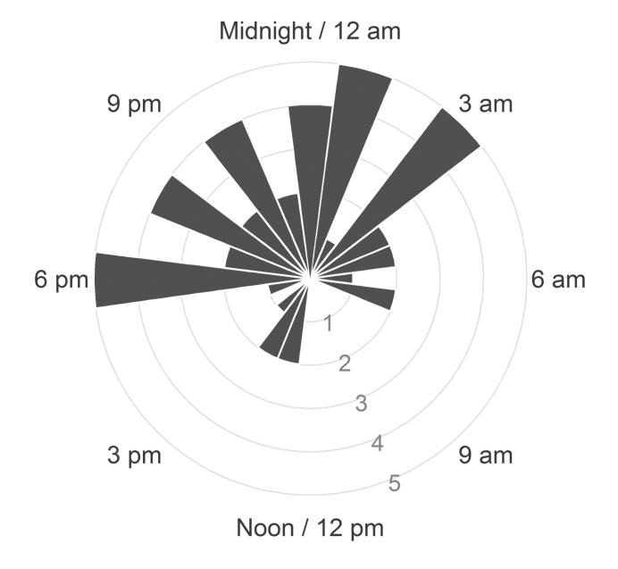

*SLEEPJ*, 2021, 1–8

**doi: 10.1093/sleep/zsaa180** Advance Access Publication Date: 11 September 2020 Original Article

## Original Article

# **Predicting circadian misalignment with wearable technology: validation of wrist-worn actigraphy and photometry in night shift workers**

Philip Chen[g1](#page-0-0), [\\*](#page-3-0), , Olivia Walch[2](#page-0-1) , Yitong Huan[g2](#page-0-1) , Caleb Maye[r2](#page-0-1) , Chaewon Sagon[g1](#page-0-0) , Andrea Cuamatzi Castela[n1](#page-0-0) , Helen J. Burges[s2](#page-0-1) , Thomas Roth[1](#page-0-0) , Daniel B. Forger[2](#page-0-1) and Christopher L. Drake[1,](#page-0-0)

1 Sleep Disorders and Research Center, Henry Ford Health System, Detroit, MI and 2 Department of Mathematics, University of Michigan, Ann Arbor, MI

\*Corresponding author. Philip Cheng, Sleep Disorders and Research Center, Henry Ford Health System, 39450 West 12 Mile Road, Novi, Detroit, MI 48377. Email: [pcheng1@hfhs.org.](mailto:pcheng1@hfhs.org?subject=)

## **Abstract**

**Study Objectives:** A critical barrier to successful treatment of circadian misalignment in shift workers is determining circadian phase in a clinical or field setting. Light and movement data collected passively from wrist actigraphy can generate predictions of circadian phase via mathematical models; however, these models have largely been tested in non-shift working adults. This study tested the feasibility and accuracy of actigraphy in predicting dim light melatonin onset (DLMO) in fixed night shift workers.

**Methods:** A sample of 45 night shift workers wore wrist actigraphs before completing DLMO in the laboratory (17.0 days ± 10.3 *SD*). DLMO was assessed via 24 hourly saliva samples in dim light (<10 lux). Data from actigraphy were provided as input to a mathematical model to generate predictions of circadian phase. Agreement was assessed and compared to average sleep timing on non-workdays as a proxy of DLMO. Model code and an open-source prototype assessment tool are available ([www.predictDLMO.com](http://www.predictDLMO.com)).

**Results:** Model predictions of DLMO showed good concordance with in-lab DLMO, with Lin's concordance coefficient of 0.70, which was twice as high as agreement using average sleep timing as a proxy of DLMO. The absolute mean error of the predictions was 2.88 h, with 76% and 91% of the predictions falling with 2 and 4 h, respectively.

**Conclusion:** This study is the first to demonstrate the use of wrist actigraphy-based estimates of circadian phase as a clinically useful and valid alternative to in-lab measurement of DLMO in fixed night shift workers. Future research should explore how additional predictors may impact accuracy.

## **Statement of Significance**

This study takes important steps in translating a mathematical model of the circadian clock for use as a clinical assessment for circadian medicine. Results indicate that data collected via wrist actigraphy can be used to generate estimates of circadian phase that show good concordance with gold standard dim light melatonin onset in fixed night shift workers with extreme circadian disruption. Because actigraphy is already a recommended practice for the assessment of sleep–wake disturbances in shift work, implementation of this tool would require minimal change to existing practices. Future directions for model improvement are discussed.

**Key words:** circadian rhythm; night shift work; actigraphy; mathematical model

**Submitted:** 21 January, 2020; **Revised:** 24 July, 2020

© Sleep Research Society 2020. Published by Oxford University Press on behalf of the Sleep Research Society.

## Introduction

As a contemporary society, we have leveraged technological innovations to surpass prior limitations of the natural light– dark cycle. Electrical lighting has allowed us to extend work far into the night, thus enabling the provision of around-theclock services including medical care (e.g. nurses), safety and security (e.g. police), and swift delivery of consumer goods (e.g. truck drivers). However, night shift work exposes employees to circadian misalignment, which significantly increases risk for adverse health and safety outcomes including shift work disorder [[1,](#page-7-0) [2](#page-7-1)], vehicular accidents [\[3\]](#page-7-2), cancer [[4\]](#page-7-3), obesity [\[5](#page-7-4)], and cardiovascular morbidity and mortality [\[6](#page-7-5), [7](#page-7-6)] ((for reviews, see [[8](#page-7-7), [9](#page-7-8)]). Moreover, night shift workers have very limited access to interventions that mitigate these risks.

One critical barrier to implementing interventions targeting circadian realignment (e.g. timed bright light exposure) is the lack of clinically feasible approaches that determine circadian phase in a given night worker. Without clinically feasible measures of circadian phase, health-care providers are unable to ascertain the necessary parameters to administer interventions with appropriate precision (e.g. the degree/severity of misalignment, appropriate timing, duration, and intensity of light therapy), or even to assess if such interventions are appropriate for a given patient. Standard laboratory measures of circadian phase (e.g. dim light melatonin onset [DLMO]) are time and resource intensive, even when adapted for home collection [\[10\]](#page-7-9). In particular, DLMO assessment in shift workers is especially difficult because it requires measurement over 24-h (i.e. three to four times longer than in non-shift workers) to ensure an adequate window to capture the full range of DLMO possible [[11,](#page-7-10) [12\]](#page-7-11). As such, there has been significant interest in the development of alternatives to DLMO [\[13](#page-7-12)[–16\]](#page-7-13). Many of the alternatives under development extract biomarkers of circadian phase from biological specimens. These procedures are often more invasive than DLMO (e.g. repeated blood samples and tissue biopsies), are currently cost-prohibitive, and carry additional limitations particularly with respect to obtaining circadian phase in night shift workers.

One promising approach to measuring circadian misalignment in the clinic or field is a novel method of processing data collected via wrist-worn actigraphs. There are important advantages to this approach. First, it leverages actigraphs as an existing technology that is familiar, readily available, and increasingly utilized in sleep disorders centers around the world. Critically, actigraphic measurement of sleep–wake activity (commonly supplemented with light data) is already indicated in the diagnostic criteria for Shift Work Disorder (see diagnostic criteria C) in the International Classification of Sleep Disorders—3rd edition [\[17\]](#page-7-14). Thus, the use of actigraphy would require minimal changes to recommended practice and would enhance the value of standard assessments already in-place. Wrist actigraphy is also a relatively passive and noninvasive method of data collection, which increases real-world feasibility and allows for tracking over long periods of time. Finally, sleep tracking using consumer wearables is already commonplace, further emphasizing the potential feasibility and scalability of this approach.

Estimating circadian phase with actigraphy and photometry (i.e. with light sensors) in this manner leverages laboratoryvalidated mathematical models of how the human circadian clock responds to light. Recent research has begun testing the validity of these models outside the laboratory. For example, Woelders et al. [[18](#page-7-15)] demonstrated that light and activity data from Actiwatches were able to predict DLMO with strong accuracy (R2 = 0.71, standard deviation in the predictions = 1.1 h) in healthy day workers with varied self-reported chronotype. Another study examined regular and irregular undergraduate sleepers, and found that 81% of the predicted DLMO using light activity from Actiwatches fell within ± 2 h of observed DLMO [\[19](#page-7-16)]. Finally, Stone et al. [\[20](#page-7-17)] followed 25 health-care workers wearing Actiwatches through a 3–5 day transition from the day shift to the night shift, with pre- and post-transition measurements of urinary 6-sulphatoxymelatonin (aMT6s) in the field. Results showed that 92% of model-predicted phase fell within ± 2 h (average error of 0.95 h) of the cosinor acrophase fitted to aMT6s values.

Importantly, these foundational studies have demonstrated that wrist actigraphy with photometry can estimate circadian phase; however, clinical translation for the most relevant populations require validation in samples with significantly greater irregularities in sleep–wake schedules and light exposure (e.g. significant circadian disruption due to routine displacement sleep into the daytime). Indeed, individuals in extant studies predominantly followed a diurnal sleep–wake schedule, resulting in a narrower range of circadian phase than fixed night shift workers. For example, though Stone et al. [[20](#page-7-17)] included rotating shift workers, the bedtimes at baseline (i.e. before rotating onto the night shift) all occurred nocturnally, clustering around a 2-h window (10:14 pm to 12:26 am). Melatonin acrophase at baseline also occurred within a 4 h range, which is comparable to the range of DLMOs found in healthy individuals not engaged in shift work [[21\]](#page-7-18). This is likely because night shifts were limited to one week per month, thus allowing a diurnal sleep–wake schedule 75% of the time. While the range of bedtimes and circadian phases was wider in the sample of irregular sleepers in Phillips et al. [[19\]](#page-7-16) (DLMO ranged approximately from 6:00 pm to 3:00 am), even the most irregular sleeper in that sample—albeit likely a late chronotype—slept predominantly at night (i.e. ~90% of sleep periods initiated between 12:00 am and 5:00 am).

One consequence of testing in samples with largely diurnal sleep–wake schedules is a restricted range in observed DLMOs, which may restrict the range of errors in the model predictions. For example, prediction errors within 1 or 2 h may be readily achieved if the range of DLMOs only clustered within 4 h. Moreover, healthy individuals with diurnal sleep–wake schedules are more likely to be entrained and regular, in which case a reasonable prediction of DLMO can be achieved with sleep diaries and does not require actigraphy and/or photometry. For example, Crowley et al. [[22](#page-7-19)] found that information collected via sleep diary in 208 adolescents accurately predicted DLMO within ± 1 h for 80% of the sample. In order to validate the use of actigraphy and photometry to predict circadian phase in shift workers, individuals with extreme circadian disruption due to irregular light exposure and sleep–wake schedules must be studied. In fact, quantifying the error in such conditions is key to translating circadian models for use in real-world clinical settings. Without this initial translational science, the feasibility, accuracy, and clinical utility of such an approach will remain unknown.

In this study, we tested the viability of wrist actigraphy and photometry to estimate circadian phase (i.e. DLMO) in a sample of fixed night shift workers. Because night shift workers often return to nighttime sleep on their days off, these individuals are exposed to highly irregular light schedules and experience some of the most extreme circadian disruption in the working population. Furthermore, validation under these conditions will also test the limits of this method and assess its ability to provide clinical information needed for therapeutic interventions in individuals with severe circadian disruption. Finally, to assess the unique contribution of this approach, we also compared how the model predictions performed against objective sleep timing on non-workdays as a currently accessible proxy of DLMO.

## Methods

#### **Participants**

Participants were recruited as part of a larger study examining the clinical impact of circadian misalignment in night shift workers. Recruitment was conducted primarily through flyers distributed in the community and as part of a health systemwide newsletter, which sampled across six major hospitals serving the greater Detroit metropolitan area. A total of 125 prospective participants completed an initial internet-based prescreening survey, and 47 eligible participants were invited for an in-person interview with a clinician with expertise in sleep medicine. The clinical assessment focused on sleep and mental health, including details about shift work and sleep–wake schedules, symptoms of insomnia and excessive sleepiness, and psychiatric disorders evaluated via the Structured Clinical Interview for DSM Disorders (SCID). Presence of sleep and circadian rhythm disorders beyond shift work disorder (e.g. obstructive sleep apnea, restless leg syndrome, and periodic limb movement disorder) were determined via both clinical interview and an 8-h polysomnography (PSG) at the sleep center.

Study inclusion required working a fixed night shift work schedule, which was operationalized as starting between 6:00 pm and 3:00 am, with shifts lasting between 6 and 12 h. Inclusion of 6:00 pm in the start time was targeted for individuals working 12-h shifts (e.g. 6:00 pm to 6:00 am). Schedules that were better characterized as the afternoon/evening shift (i.e. second shift) were excluded. Additionally, work shifts had to occur at least 3 nights per week for a minimum work duration of 1 year. Participants had to report a habitual time in bed between 6 and 9 h to preclude inadequate sleep opportunity as a confounding variable. Participants with a medical history of central nervous system disorders, sleep disorders, or an unstable major medical condition were excluded via either clinical interview, medical chart review, or PSG. Use of substances that may interfere with any outcome measures in the larger study (e.g. sleep, sleepiness, and circadian phase) also resulted in study exclusion; these included dependence on alcohol (≥ 4 beverages per day), heavy tobacco use (≥ 10 cigarettes per day), recreational drug use, medications impacting central nervous system functioning, and caffeine use in excess of 5–6 servings (~600 mg) per day.

A final sample of 45 individuals was included for analysis in this study following exclusion of one individual due to noncompliance with instructions for actigraphy collection and one individual due to the presence of obstructive sleep apnea diagnosed by PSG. The final sample comprised 82% females (*n* = 37) with an average age of 39.2 ± 10.3 *SD* (range = 21–64). All procedures were approved by the Institutional Review Board, and all participants provided informed consent prior to study participation.

#### **Procedures**

Following enrollment, participants were scheduled for a lab visit, and provided with an Actiwatch (Philips Respironics, USA) approximately 2 weeks before the lab visit. Participants were instructed to wear the Actiwatch at all times with the exception of circumstances involving immersion in water (showers, baths, swimming, etc.), and to avoid covering up the watch with long sleeves or jackets. Written instructions were also provided with the watch, and a reminder to begin wearing the watch was provided 2 weeks prior to their scheduled visit. Participants who rescheduled within two weeks of their laboratory visit were asked to continue wearing the watch until their rescheduled visit. Participants arrived at the lab in the morning following a night shift and were provided an 8 h in-lab PSG. Upon awakening, participants remained in the lab for 24 h under dim light (<10 lux), with hourly saliva samples assayed for melatonin (see Determining DLMO section).

#### *Determining DLMO*

 The daily rhythm of melatonin secretion is a reliable marker for circadian phase [[23](#page-7-20)], and was assessed via DLMO based on hourly salivary samples for a total period of 24 consecutive hours. Samples were collected in a private and sound-attenuated room under constant dim light (<10 lux). During saliva collection, all participants were asked to remain seated in a comfortable chair until an adequate collection of saliva was verified. No food or drinks were allowed 10 min prior to saliva sample collection, and food items that may interfere with melatonin assays were precluded from participants. Between hourly samples, subjects were allowed to partake in approved activities, such as reading or listening to music. The use of electronics was permitted if backlit screens were maintained at <10 lux (based on angle of gaze). DLMO was determined using a relative threshold based on 2 standard deviations above the mean of three samples during the biological day (samples were consecutive and the set with the lowest consecutive sum was selected). Linear interpolation was used to estimate the time at which melatonin concentration surpassed the threshold.

Saliva samples were collected using a Salivette tube (Sarstedt AG & Co., Nümbrecht, Germany) with a cotton insert. Participants were instructed to place the cotton insert in their mouth by the salivary glands underneath the tongue to saturate the cotton insert with saliva. Samples were submitted to SolidPhase, Inc. (Portland, OR) where melatonin levels were determined via a radioimmunoassay.

#### *DLMO prediction*

DLMO estimation was conducted using a mathematical model of the impact of light on the human circadian pacemaker. The model was originally created by Kronauer et al. [\[24\]](#page-7-21), and has since been adapted and refined [[25](#page-7-22)[–27\]](#page-7-23). We compared the performance of existing models across multiple populations and selected the model with the best accuracy for analysis in this study (i.e. the higher-order model with the non-photic component) [[28](#page-7-24)]. It is important to note that these models were developed based on empirical data using core body temperature minimum (CBTmin), and thus are designed to output predictions of CBTmin. DLMO predictions were extracted by subtracting 7 h from the model output in order to estimate DLMO from CBTmin [\[29,](#page-7-25) [30](#page-7-26)].

#### *Input choice*

Until recently, most models of circadian rhythms have solely used light data as input into the mathematical model. As others have argued [[31\]](#page-7-27), light measurement from wrist-worn devices may not accurately reflect the input of light into the central circadian pacemaker (i.e. the suprachiasmatic nucleus) via the retina. Additionally, light data collected from wrist actigraphs can easily be covered by apparel (e.g. long sleeves), and have variable sensitivity across the full range of visible light intensity. In contrast, activity data measured via tri-axial accelerometry are not prone to these disturbances. As such, some approaches have begun to supplement model predictions with activity data. The most recent approaches include producing initial model predictions using only light data, and then adjusting predictions with an additional statistical model covarying for phase markers of activity (e.g. activity acrophase) [[18\]](#page-7-15).

Critically, our recent work has demonstrated that activity data from wrist actigraphy can be used in existing models to produce robust estimates of circadian phase that may even outperform predictions using light data alone (see [Supplementary](http://academic.oup.com/sleep/article-lookup/doi/10.1093/sleep/zsaa180#supplementary-data)  [Table S1\)](http://academic.oup.com/sleep/article-lookup/doi/10.1093/sleep/zsaa180#supplementary-data). As light is known to be the strongest zeitgeber, this finding likely reflects the aforementioned limitations of using light from the wrist as a proxy for light to the circadian system via the retina. Secondly, activity may also serve as nonphotic entrainment (for a more in-depth discussion, see [[28\]](#page-7-24)). Based on this work, we opted for an approach that combined both light and activity history, with additional sensitivity analyses using only light and only activity data. In the combination approach, the default input to the model was light measurement (in lux); however, activity data was substituted when light appeared to be obstructed (i.e. presence of activity despite low light levels [activity count > 0 and lux < 100]). For the source code of this implementation, see [https://github.com/ojwalch/predicting\\_dlmo\)](https://github.com/ojwalch/predicting_dlmo). A more detailed description of model specifications is included in the [Supplementary Materials](http://academic.oup.com/sleep/article-lookup/doi/10.1093/sleep/zsaa180#supplementary-data).

#### *Initial conditions*

Choosing appropriate starting conditions is a critical step for simulating the circadian clock model with an individual's light/ activity history. We opted to use the estimated average DLMO in individuals entrained under normal living conditions (9:00 pm) [[21](#page-7-18)]. This allows for a standardized approach and increases the translational utility for clinical use.

#### *Sleep timing as a proxy of DLMO*

To evaluate the unique contribution of using model predictions of DLMO, we also compared results against the best proxy of DLMO that is currently accessible in the clinic. Given that (1) the ICSD-3 already recommends the use of actigraphy to document sleep–wake patterns for assessment of Shift Work Disorder [\[17](#page-7-14)] and (2) prior evidence that sleep timing is a significant indicator of circadian phase in those under normal living conditions [[22,](#page-7-19) [32–](#page-7-28)[34](#page-7-29)], we selected habitual timing of sleep as the best-available proxy of circadian phase in the clinic. We separated sleep timing on workdays and non-workdays to account for the fact that night shift workers often revert from daytime sleep (i.e. following night shifts) to nighttime sleep on non-workdays. Sleep timing specifically on non-workdays was of interest because it is not constrained by work schedules and thus may more likely reflect endogenous sleep–wake rhythms than sleep following night shifts. Operationally, a circular average of the timing of sleep derived via actigraphy was conducted by workdays and non-workdays for each participant, and DLMO was estimated at 2 h prior to average sleep time based on typical phase angle between DLMO and sleep time[1](#page-3-0) [[32](#page-7-28), [35](#page-7-30), [36\]](#page-7-31).

#### **Analytical approach**

Agreement between the observed and predicted DLMO was assessed using Lin's concordance coefficient, which is typically applied to evaluate the agreement between a new test and a gold standard test [[37](#page-7-32)]. This approach is more rigorous than deriving an R2 value from an ordinary least squares approach because it assesses deviation from perfect agreement (i.e. a line-of-slope-one) instead of deviation from a line-of-best-fit. To account for time as a circular variable (i.e. each timepoint repeats every 24 h), we shifted each point of observed DLMO by 24 h in chronological order and computed Lin's concordance coefficient for each iteration. The lowest Lin's concordance coefficient was selected to represent the point cluster with the most unbiased estimate of agreement. The absolute mean error was also calculated, along with the percentage of agreement within ± 2 h (4 h range) and ± 4 h (8 h range) as these cutoffs approximate inclusion of 50% and 100% of DLMOs in healthy adults not engaged in night shift work [\[21\]](#page-7-18).

A series of sensitivity analyses were also conducted. To examine if the concordance rate was generalizable to people with symptoms of shift work disorder, concordance was also tested in a subsample of shift workers with clinically significant symptoms (>10 on the Insomnia Severity Index, and/or >10 on the Epworth Sleepiness Scale; *n* = 29). To explore the potential for model refinement, we also examined if an error in the model predictions varied by age, sex, years of experience on the night shift, shift start time, and seasonality (indexed by day length on the day of data collection, i.e. duration from sunrise to sunset). These variables were tested as a predictor via linear regression with absolute error as the dependent variable. Finally, we also evaluated model performance when only activity data and only light data were used as inputs, as this may have implications for the use of activity trackers that do not include both light and activity sensors.

## Results

#### **Sample characteristics**

A total of 45 fixed night shift workers (37 females) were included in the final analysis, with a mean age of 39.2 (*SD* = 10.3, range = 21–64). Participants worked between 3 and 6 night

1 Post hoc analyses explored additional comparators. These included observed sleep onset, 2-h prior to sleep onset (representing typical phase angle from DLMO to sleep onset), and sleep midpoint averaged across all days, workdays only, and non-workdays only. A similar trend was found across comparators, with 2-h prior to sleep onset on non-workdays demonstrating the strongest concordance with DLMO.

shifts per week, and had been on the night shift for an average of 8.4 years (*SD* = 8.0 years). Shift start times ranged from 6:30 pm to 12:00 am, and shift end times ranged from 5:00 am to 8:00 am. Shift duration ranged from 8 to 13.5 h. Actiwatch collection period was on average 16 days ± 10.8 *SD* (range 4–42 days). The average DLMO in the laboratory was at 11:01 pm, with skewness (0.08) and excess kurtosis (1.54) values falling within the range of a normal distribution. There was a significant spread in the range of DLMO values (see [Figure 1](#page-4-0)). A total of 10 participants (22%) exhibited at least partial adjustment into a compromised phase position (DLMO between 3:00 am and 11:00 am) [[38](#page-7-33), [39\]](#page-7-34), which is consistent with the prior rate of 23.7% documented in an earlier review of circadian adjustment in night shift workers [[38](#page-7-33)].

#### **DLMO prediction**

#### *DLMO proxy using sleep timing*

First, we examined the accuracy of sleep timing on workdays (i.e. after the night shift) as a proxy of DLMO. Sleep timing clustered within an 8.5 h window between 7:00 am and 3:30 pm, resulting in the DLMO proxies ranging between 5:00 am and 1:30 pm. This range contained only 13% of the true observed DLMO values. Lin's coefficient of concordance was 0.17, indicating very poor agreement (see [Figure 2,](#page-5-0) [A](#page-5-0)). The average error was −3.89 h and the absolute mean error was 7.46 h, with 16% of predictions falling within ± 2 h, and 24% of predictions falling within ± 4 h.

In determining the accuracy of sleep timing on non-workdays as a proxy of DLMO, we found that sleep timing fell within a larger window of 13 h ranging from 6:30 pm to 7:30 am. This resulted in DLMO proxies ranging between 4:30 pm and 5:30 am, which contained 82% of the true observed DLMO values. Though this was significantly better than sleep timing on workdays, Lin's coefficient of concordance between sleep timing on nonworkdays and DLMO was 0.38, indicating poor agreement (see [Figure 2, B](#page-5-0)). The average error was 0.48 h and the absolute mean

**Figure 1.** Histogram showing the observed DLMO in night shift workers (plotted on a 24-h clock). The range of observed DLMOs spans nearly the entire 24-h day, though many are clustered around midnight.

error was 3.52 h, with 29% of predictions falling within ± 2 h, and 64% of the predictions falling within ± 4 h.

#### *DLMO prediction using activity and light*

Model predictions of DLMO using activity and light fell within a 18.5 h window, which contained 96% of the true observed DLMO values. The Lin's concordance coefficient using DLMO predicted from light and activity was almost twice as strong, with an estimate of 0.70 indicating moderately strong agreement (see [Figure 2](#page-5-0), [C\)](#page-5-0). The average difference between observed and predicted DLMO was −0.34 h, which was not significantly different from zero, *t*(44) = −0.60, *p* = 0.55, suggesting no bias in predictions. The absolute mean error in the prediction of DLMO fitted to a line-of-slope-one was 2.88 h. Whereas 76% of the predictions fell within ± 2 h, 91% of the predictions fell within ± 4 h. Examination of individual prediction errors revealed three outlier participants with errors above 7 h (absolute mean error sans outliers fell to 2.41 h).

A sensitivity analysis using a subsample of shift workers with clinically significant symptoms of sleep disturbance and/ or excessive sleepiness (*n* = 29) indicated that the strength of concordance was maintained (concordance coefficient of 0.67), suggesting generalizability of results to a clinical setting with predominantly symptomatic patients.

To better understand the independent contributions of light and activity, a sensitivity analysis evaluated performance when only light data and only activity data were used as inputs to the model. The use of activity data by itself is of particular interest given the potential for use of activity trackers without light sensors in predicting circadian phase. Consistent with our other work [\[28\]](#page-7-24), predictions generated with only light data did not perform as well as that generated with only activity data. The Lin's concordance coefficient for predictions using only light data was 0.63 with a mean absolute error of 3.72 h. In contrast, predictions generated solely from activity data showed stronger concordance with observed DLMO, with a Lin's concordance coefficient of 0.72 and a mean absolute error of 2.91 h.

#### *Variance in error*

Age, sex, years on the night shift, and start time of night shift were not significant predictors of error in model prediction. However, shorter day lengths (i.e. during winter months) appeared to be associated with higher error (see [Figure 3\)](#page-5-1). In fact, the data showed significant exponential decay (*p* < 0.001), suggesting that the error was substantially higher for shorter day lengths. Indeed, for day lengths shorter than 12 h, each hour of decrease in day length was associated with a 1.88 h increase in absolute mean error. As such, we conducted a post hoc adjustment of the model by doubling sensitivity to light during shorter days (day length < 12 h). This reduced the absolute mean error to 2.77 h, suggesting that accuracy in predictions can be improved with model refinement.

## Discussion

The major barrier to the implementation of behavioral interventions for circadian misalignment in night shift workers is the lack of clinically feasible and accurate assessments of circadian phase in this population. Laboratory-based measurement of DLMO—while being the gold standard measurement

**Figure 2.** Comparison of DLMO predictions using sleep timing versus activity and light. (A) Agreement with in-lab DLMO using timing of sleep onset on workdays as a proxy of DLMO (estimated at 2 h prior to sleep onset). (B) Agreement with in-lab DLMO using timing of sleep onset on non-workdays as a proxy of DLMO (estimated at 2 h prior to sleep onset). (C) Agreement with in-lab DLMO using predicted DLMO from activity and light data.

**Figure 3.** Average absolute error in model predictions by day length (duration of sunrise to sunset).

of circadian phase—is time and resource intensive even in day workers, and thus has limited feasibility in real-world clinical approaches. As such, this study tested the clinical translation of DLMO prediction using wrist actigraphy and photometry in a sample of fixed night shift workers.

Until recently, model predictions of DLMO have been predominantly tested in individuals living largely diurnal schedules and work conditions; however, the clinical application of DLMO prediction is most relevant for individuals with a 24-h range of circadian disruption. Night shift workers are among those with the most significant circadian disruption because they routinely experience extremely irregular light exposure and often have erratic sleep– wake schedules spanning the entire 24-h period. Consistent with this, we observed a much larger spread of DLMO in this sample compared to prior studies of DLMO prediction, thereby allowing us to test the performance of DLMO prediction under ecologically valid conditions for fixed night shift workers.

Importantly, this study is the first to demonstrate that predicted DLMO using combined activity and light collected passively via wrist actrigraphs exhibited good concordance with gold standard DLMO measured in the lab (concordance = 0.70). Furthermore, the model outperformed the use of average sleep timing as the next best proxy of DLMO (concordance = 0.38 and 0.17). Importantly, sleep timing generally performed poorly as a proxy of DLMO, thus reinforcing the need for more precise methods of estimating circadian phase in night shift workers. Additionally, the stability of circadian phase in night shift workers has not been well-established, so it may also be that sleep in the days leading up to the in-lab visit may lose predictive value over time. Together, these results point to the promise for validated wearable technologies as a time-sensitive, cost-effective, and clinically feasible tool to meet the demand for assessments of circadian phase. Indeed, sensitivity analyses suggested that the strength of concordance was maintained in a subsample of shift workers with clinically significant symptoms of insomnia and sleepiness, suggesting generalizability to a clinical setting.

Importantly, sensitivity analyses also indicated that using activity data alone as input into the mathematical model produced predictions that not only performed comparably to combining light and activity data, but also outperformed predictions using light data alone. This provided further evidence for the limitations of light measurement via wrist actigraphy, and lends additional support for the use of activity data in estimating circadian phase. This is critical because the overwhelming majority of activity trackers in the consumer market do not include light sensors; however, these findings suggest that validated consumer-based activity trackers may have potential for inferences beyond rest-activity patterns to include underlying circadian biology. Future research should extend testing of this tool using a range of devices in individuals working shifts varying by timing, duration, and rotation (speed and direction).

Results from this study have critical implications for the assessment and treatment of shift work disorder. First, the ICSD-3 currently states that "sleep logs and actrigraphy are recommended to demonstrate a disrupted sleep-wake pattern consistent with shift work disorder" [\[17\]](#page-7-14). Thus, the use of actigraphy and sleep diary represents best practice in the clinical management of night shift workers. However, unlike in entrained individuals under normal living conditions, our results indicate that the predictive value of sleep timing for DLMO is much more limited in night shift workers. Whereas the homeostatic (process S) and circadian processes (process C) are typically operating harmoniously in entrained individuals, the nocturnal work schedule decouples these processes, thus limiting the predictive validity of sleep timing as an indicator of circadian phase. Additionally, night shift workers may be incentivized to sleep at times that are mismatched with their endogenous rhythms even on non-workdays. For example, night shift workers often try to maximize time with family on rest days by matching their sleep-wake schedules with their partner/spouse rather than following their endogenous rhythms. However, our results suggest that the same actigraphic and photometric data used to estimate sleep can be processed in a novel and accessible method to provide more precise estimates of circadian phase. An open-source prototype of this tool is available via an internet-based portal where light and activity data from wristworn devices can be uploaded to produce DLMO estimates ([www.predictDLMO.com](http://www.predictDLMO.com)).

The availability of clinically feasible and increasingly accurate assessments of circadian phase is critical to the progress of circadian medicine. Currently, the paucity of clinically feasible assessments of circadian phase means that providers must either enact treatment plans for night shift workers without regard to circadian phase or resort to using inaccurate proxies of circadian phase (e.g. sleep timing). Using inaccurate proxies of circadian phase in treatments can increase the likelihood of adverse outcomes that exacerbate symptoms of shift work disorder. For example, when correcting circadian misalignment using bright light therapy designed to engender a phase delay, errors of accidental phase advances due to mistimed light exposure could further exacerbate nocturnal sleepiness and daytime insomnia. Overly large delays can also result in accidental misplacement of DLMO at inopportune times—such as during the afternoon—that can also cause nocturnal sleepiness (particularly during the first, and often busiest, portion of the night shift) and insomnia during the daytime. Aside from the phase shifting impact of light, prior research has shown that the alerting effect of light for night shift workers is also dependent on the accurate timing of light exposure [[40\]](#page-7-35).

Unsurprisingly, model predictions of DLMO were not as robust in night shift workers relative to healthy and entrained individuals, where the timing of DLMO is restricted to a very narrow range [\[21\]](#page-7-18). Prediction errors in this sample were also higher compared to workers following a 3–5 day transition from the day to the night shift in Stone et al. [[20\]](#page-7-17), suggesting more sources of error should be accounted for when workers are under more chronically irregular schedules of the kind seen in fixed night shift workers. Nevertheless, our results suggest the mean absolute error of model prediction is only 1–2 h higher compared to other samples. However, the addition of parameters to account for systematic errors, or to reduce outliers, will likely lead to improved accuracy of model predictions. Indeed, our results suggest that seasonal variations in how the mammalian circadian system responds to light (modulated by differences in the coupling of the ventral and dorsal regions of the suprachiasmatic nucleus [[41](#page-7-36)]) may be an important parameter to account for. There may also be significant physiological differences between individual circadian systems that could be accounted for in the model. For example, a recent article found remarkable individual variation in sensitivity to evening light as indexed by melatonin suppression [\[42\]](#page-7-37). When compounded by chronic exposure to irregular light-dark and sleep–wake schedules, individual differences in light sensitivity may contribute to a range of individual circadian responses to night shift work. Accounting for these sources of variance in the DLMO estimation model will lead to improved accuracy and enhanced clinical utility. Finally, because these mathematical models were trained predominantly on data in non-clinical populations, later model specifications may need to account for the impact of shift work chronicity on circadian parameters such as amplitude, period, and/or rhythmicity (e.g. bifurcation of melatonin rhythms). Thus, future refinements are likely to generate more accurate estimates of circadian phase in shift workers to produce models that are robust to variations in both external (e.g. rotation and direction of shifts, type of work, etc.) and internal sources (comorbid disorders, symptom presentations, medication effects, etc.)

## Conclusions

This study represents a first step in the clinical translation of modeling light and activity data from wrist-worn actigraphy to estimate circadian phase in fixed night shift workers. Results demonstrated the promise of this approach as the predictions show good concordance with in-lab DLMO, and outperformed the best proxy of circadian phase currently available in the clinic. Future research should include individual differences to increase the precision and thus utility of this method for clinical assessment and intervention of shift work disorder.

## Supplementary Material

Supplementary material is available at *SLEEP* online.

## Acknowledgments

We would also like to thank the Division of Sleep Medicine and the staff at the Thomas Roth Sleep Disorders and Research Center at the Henry Ford Health System for their continued support. P.C. had access to all data from the study, and also had complete freedom to direct analyses and reporting of results without influence from funders

## Funding

Support for this study was provided by the National Heart Lung and Blood Institute (K23HL138166).

## Disclosures statement

Financial disclosures: Olivia Walch is the CEO of Arcascope, a company that makes circadian rhythms software. She has done consulting for Unilever, MetroNaps, and Gideon Health.

Non-financial disclosures: none.

## Author contributions

Concept and Design by Cheng, Walch, and Forger. Acquisition, Analysis, or Interpretation of data by Cheng, Walch, Sagong, Cuamatzi Castelan, Mayer, Huang, and Drake. Drafting of manuscript: Cheng, Walch, and Drake. Critical revision of the manuscript for important intellectual content: Burgess, Roth, and Drake.

## References

- 1. Cheng P, *et al*. Shift work disorder. *Neurol Clin.* 2019;**37**:563–577.
- 2. Drake CL, *et al*. Shift work sleep disorder: prevalence and consequences beyond that of symptomatic day workers. *Sleep.* 2004;**27**:1453–1462.
- 3. Horne JA, *et al*. Sleep related vehicle accidents. *BMJ.* 1995;**310**:565–567.
- 4. Kamdar BB, *et al*. Night-shift work and risk of breast cancer: a systematic review and meta-analysis. *Breast Cancer Res Treat.* 2013;**138**:291–301.
- 5. Sun M, *et al*. Meta-analysis on shift work and risks of specific obesity types. *Obes Rev.* 2018;**19**:28–40.
- 6. Morris CJ, *et al*. The impact of the circadian timing system on cardiovascular and metabolic function. *Prog Brain Res.* 2012;**199**:337–358. [http://linkinghub.elsevier.com/retrieve/](http://linkinghub.elsevier.com/retrieve/pii/B9780444594273000198) [pii/B9780444594273000198.](http://linkinghub.elsevier.com/retrieve/pii/B9780444594273000198) Accessed July 30, 2015.
- 7. Scheer FAJL, *et al*. Adverse metabolic and cardiovascular consequences of circadian misalignment. *Proc Natl Acad Sci USA.* 2009;**106**:4453–4458.
- 8. Kecklund G, *et al*. Health consequences of shift work and insufficient sleep. *BMJ.* 2016;**355**:i5210.
- 9. Moreno CRC, *et al*. Working time society consensus statements: evidence-based effects of shift work on physical and mental health. *Ind Health.* 2019;**57**:139–157.
- 10. Burgess HJ, *et al*. Home circadian phase assessments with measures of compliance yield accurate dim light melatonin onsets. *Sleep.* 2015;**38**:889–897.
- 11. Gumenyuk V, *et al*. Sleep loss, circadian mismatch, and abnormalities in reorienting of attention in night workers with shift work disorder. *Sleep.* 2014;**37**:545–556.
- 12. Gumenyuk V, *et al*. Circadian phase, sleepiness, and light exposure assessment in night workers with and without shift work disorder. *Chronobiol Int.* 2012;**29**:928–936.
- 13. Laing EE, *et al*. Identifying and validating blood mRNA biomarkers for acute and chronic insufficient sleep in humans: a machine learning approach. *Sleep.* 2018;**42(1)**. doi: 10.1093/sleep/zsy186
- 14. Martinez-Lozano Sinues P, *et al*. Circadian variation of the human metabolome captured by real-time breath analysis. *PLoS One.* 2014;**9**:e114422.
- 15. Braun R, *et al*. Universal method for robust detection of circadian state from gene expression. *Proc Natl Acad Sci USA.* 2018;**115**:E9247–E9256.
- 16. Ruben MD, *et al*. A database of tissue-specific rhythmically expressed human genes has potential applications in circadian medicine. *Sci Transl Med.* 2018;**10**:eaat8806.
- 17. American Academy of Sleep Medicine. *The International Classification of Sleep Disorders: Diagnostic and Coding Manual,*  3rd ed. Darien, IL: American Academy for Sleep Medicine; 2014.
- 18. Woelders T, *et al*. Daily light exposure patterns reveal phase and period of the human circadian clock. *J Biol Rhythms.* 2017;**32**:274–286.
- 19. Phillips AJK, *et al*. Irregular sleep/wake patterns are associated with poorer academic performance and delayed circadian and sleep/wake timing. *Sci Rep.* 2017;**7**:3216.
- 20. Stone JE, *et al*. Application of a limit-cycle oscillator model for prediction of circadian phase in rotating night shift workers. *Sci Rep.* 2019;**9**:11032.
- 21. Burgess HJ, *et al*. Sleep and circadian variability in people with delayed sleep-wake phase disorder versus healthy controls. *Sleep Med.* 2017;**34**:33–39.

- 22. Crowley SJ, *et al*. Estimating dim light melatonin onset (DLMO) phase in adolescents using summer or school-year sleep/wake schedules. *Sleep.* 2006;**29**:1632–1641.
- 23. Lewy AJ, *et al*. The dim light melatonin onset as a marker for circadian phase position. *Chronobiol Int.* 1989;**6**:93–102.
- 24. Kronauer RE, *et al*. Quantifying human circadian pacemaker response to brief, extended, and repeated light stimuli over the phototopic range. *J Biol Rhythms.* 1999;**14**:500–515.
- 25. Forger DB, *et al*. A simpler model of the human circadian pacemaker. *J Biol Rhythms.* 1999;**14**:532–537.
- 26. Jewett ME, *et al*. Revised limit cycle oscillator model of human circadian pacemaker. *J Biol Rhythms.* 1999;**14**:493–499.
- 27. St Hilaire MA, *et al*. Addition of a non-photic component to a light-based mathematical model of the human circadian pacemaker. *J Theor Biol.* 2007;**247**:583–599.
- 28. Huang Y, *et al*. *Predicting Circadian Phase Across Populations: A Comparison of Mathematical Models and Wearable Devices.* under review.
- 29. Brown EN, *et al*. A mathematical model of diurnal variations in human plasma melatonin levels. *Am J Physiol.* 1997;**272**:E506–E516.
- 30. Benloucif S, *et al*. Stability of melatonin and temperature as circadian phase markers and their relation to sleep times in humans. *J Biol Rhythms.* 2005;**20**:178–188.
- 31. Danzig R, *et al*. The wrist is not the brain: Estimation of sleep by clinical and consumer wearable actigraphy devices is impacted by multiple patient- and device-specific factors. *J Sleep Res.* 2020;**29**:e12926.
- 32. Burgess HJ, *et al*. The dim light melatonin onset following fixed and free sleep schedules. *J Sleep Res.* 2005;**14**:229–237.
- 33. Kantermann T, *et al*. Comparing the morningness-eveningness questionnaire and Munich chronotype questionnaire to the dim light melatonin onset. *J Biol Rhythms.* 2015;**30**:449–453.
- 34. Lovato N, *et al*. Can the circadian phase be estimated from self-reported sleep timing in patients with delayed sleep wake phase disorder to guide timing of chronobiologic treatment? *Chronobiol Int.* 2016;**33**:1376–1390.
- 35. Burgess HJ, *et al*. The relationship between the dim light melatonin onset and sleep on a regular schedule in young healthy adults. *Behav Sleep Med.* 2003;**1**:102–114.
- 36. Van Reen E, *et al*. Sex of college students moderates associations among bedtime, time in bed, and circadian phase angle. *J Biol Rhythms.* 2013;**28**:425–431.
- 37. Lin LI-K. Assay validation using the concordance correlation coefficient. *Biometrics.* 1992;**48**:599–604.
- 38. Folkard S. Do permanent night workers show circadian adjustment? A review based on the endogenous melatonin rhythm. *Chronobiol Int.* 2008;**25**:215–224.
- 39. Smith MR, *et al*. A compromise circadian phase position for permanent night work improves mood, fatigue, and performance. *Sleep.* 2009;**32**:1481–1489.
- 40. Sletten TL, *et al*. Randomised controlled trial of the efficacy of a blue-enriched light intervention to improve alertness and performance in night shift workers. *Occup Environ Med.* 2017;**74**:792–801.
- 41. Hannay KM, *et al*. Seasonality and light phase-resetting in the mammalian circadian rhythm. *arXiv:191004844 [nlin, q-bio]*. 2019. <http://arxiv.org/abs/1910.04844>. Accessed January 17, 2020.
- 42. Phillips AJK, *et al*. High sensitivity and interindividual variability in the response of the human circadian system to evening light. *Proc Natl Acad Sci USA.* 2019;**116**:12019–12024.