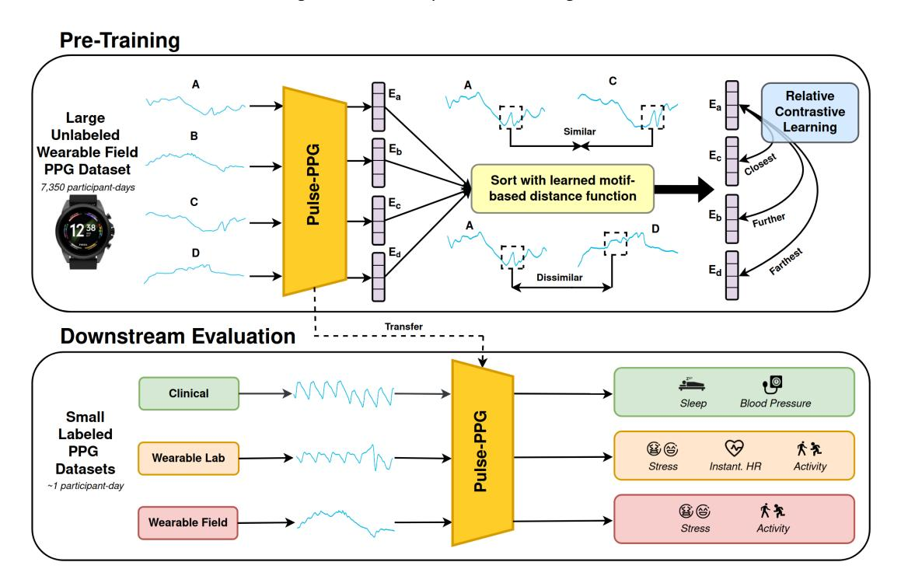
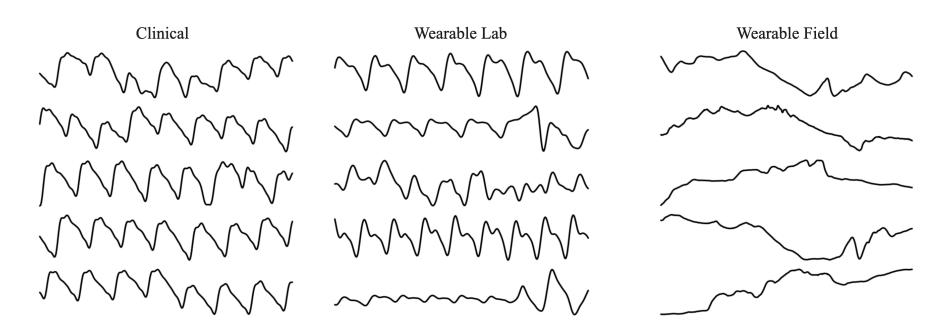
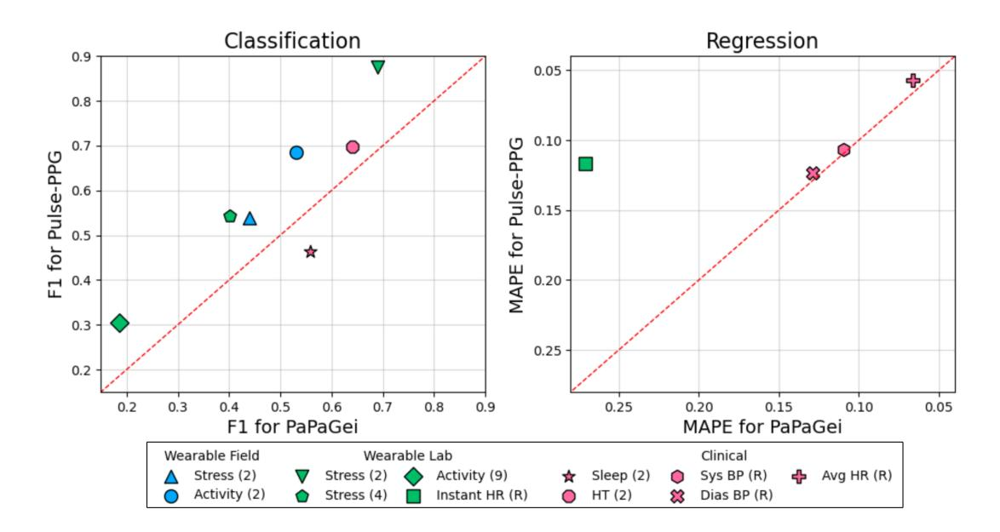
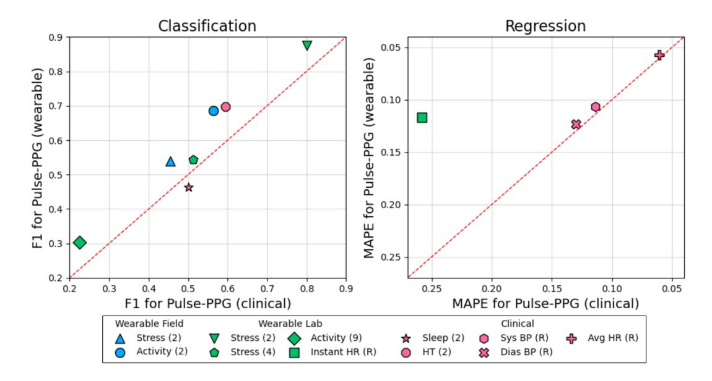

# Pulse-PPG: An Open-Source Field-Trained PPG Foundation Model for Wearable Applications Across Lab and Field Settings

MITHUN SAHA∗ , University of Memphis, USA

MAXWELL A. XU∗ , University of Illinois Urbana-Champaign, USA WANTING MAO, University of Illinois Urbana-Champaign, USA SAMEER NEUPANE, University of Memphis, USA JAMES M. REHG, University of Illinois Urbana-Champaign, USA SANTOSH KUMAR, University of Memphis, USA

Photoplethysmography (PPG)-based foundation models are gaining traction due to the widespread use of PPG in biosignal monitoring and their potential to generalize across diverse health applications. In this paper, we introduce Pulse-PPG, the first open-source[1](#page-2-0) PPG foundation model trained exclusively on raw PPG data collected over a 100-day field study with 120 participants. Existing PPG foundation models are either open-source but trained on clinical data or closed-source, limiting their applicability in real-world settings. We evaluate Pulse-PPG across multiple datasets and downstream tasks, comparing its performance against a state-of-the-art foundation model trained on clinical data. Our results demonstrate that Pulse-PPG, trained on uncurated field data, exhibits superior generalization across clinical and mobile health applications in both lab and field settings. This suggests that exposure to real-world variability enables the model to learn fine-grained representations, making it more adaptable across tasks. Furthermore, pre-training on field data surprisingly outperforms its pre-training on clinical data in many tasks, reinforcing the importance of training on real-world, diverse datasets. To encourage further advancements in robust foundation models leveraging field data, we plan to release Pulse-PPG, providing researchers with a powerful resource for developing more generalizable PPG-based models.

Additional Key Words and Phrases: Foundation models, Wearables, Health-wellbeing, Contrastive Learning

### ACM Reference Format:

Mithun Saha∗ , Maxwell A. Xu∗ , Wanting Mao, Sameer Neupane, James M. Rehg, and Santosh Kumar. 2025. Pulse-PPG: An Open-Source Field-Trained PPG Foundation Model for Wearable Applications Across Lab and Field Settings. 1, 1 (February 2025), [25](#page-24-0) pages. <https://doi.org/10.1145/nnnnnnn.nnnnnnn>

# 1 INTRODUCTION

Unobtrusive, ubiquitous, and cost-effective wearable sensors have demonstrated the potential to revolutionize real-time monitoring of health and wellness by enabling the detection of various physical and mental health states. Photoplethysmography (PPG) in smartwatches has emerged as a widely used modality due to its non-invasive assessment of physiology without the need for firm attachment. It is used for estimating physiological metrics such as heart rate, heart rate variability [\[68\]](#page-20-0), blood glucose [\[5\]](#page-17-0), oxygen saturation [\[61\]](#page-20-1), and blood pressure [\[22,](#page-18-0) [27\]](#page-18-1). For diagnosis, it can detect cardiovascular conditions [\[52\]](#page-19-0), including atrial fibrillation [\[56\]](#page-20-2) and detect hypoxia [\[39\]](#page-19-1). For mental health and wellness, it can track stress [\[94\]](#page-21-0), emotion [\[37\]](#page-19-2), focus [\[80\]](#page-21-1), and depression [\[37\]](#page-19-2).

However, PPG-based inference in real-world settings remains challenging due to its high susceptibility to noise from motion artifacts [\[57\]](#page-20-3), ambient light [\[14\]](#page-18-2), and skin conditions [\[4\]](#page-17-1). This has slowed the progress in realizing

### ∗Both authors contributed equally to this research.

Authors' addresses: Mithun Saha∗ , msaha1@memphis.edu, University of Memphis, USA; Maxwell A. Xu∗ , maxu@illinois.edu, University of Illinois Urbana-Champaign, USA; Wanting Mao, wmao8@illinois.edu, University of Illinois Urbana-Champaign, USA; Sameer Neupane, sameer.neupane@memphis.edu, University of Memphis, USA; James M. Rehg, jrehg@illinois.edu, University of Illinois Urbana-Champaign, USA; Santosh Kumar, skumar4@memphis.edu, University of Memphis, USA.

2025. XXXX-XXXX/2025/2-ART <https://doi.org/10.1145/nnnnnnn.nnnnnnn>

Vol. 1, No. 1, Article . Publication date: February 2025.

.

Fig. 1. Overview of our Pulse-PPG Foundation Model. Our model is trained on wearable field PPG with relative contrastive learning, based on the relative distances captured in our learned motif-based distance function. This model demonstrates strong performance on a wide variety of tasks across wearable field, wearable lab, and clinical settings.

the full potential of PPG in the natural environment. For example, high accuracies for stress classification has been reported on lab data [\[6,](#page-17-2) [13,](#page-18-3) [26,](#page-18-4) [48,](#page-19-3) [49\]](#page-19-4), but they do not generalize to the field settings [\[48\]](#page-19-3). Training models on lab data from the same participants and then applying it to their field data can lead to a better performance [\[76\]](#page-20-4), but it doesn't scale to unseen participants. Models trained using larger field datasets report low performance [\[7,](#page-17-3) [90\]](#page-21-2).

The emergence of Foundation Models (FM) offers a new opportunity to address these challenges and accelerate our progress. In other domains such as natural language processing and computer vision, the foundation model paradigm has transformed the development of machine learning solutions to real-world problems. The key property of an FM is that it is pre-trained on a large-scale dataset to ensure that the resulting feature representation encompasses all of the complexity of the data domain, which is then validated by demonstrating that the FM can solve multiple downstream tasks without additional representation learning. In computer vision, the field has moved away from collecting individual special-purpose datasets and training task-specific models to leveraging existing foundation model representations, such as DINOv2 [\[51\]](#page-19-5) in solving a variety of perceptual tasks. A key enabling property is that, while the training datasets are private and not publicly available, the model weights are released to the research community, enabling everyone to benefit from its powerful representation. This transition in utilizing publicly available FMs has not yet occurred for mHealth, and it is a crucial next step.

While there have been some exciting recent efforts to develop FMs for PPG [\[2,](#page-17-4) [54\]](#page-19-6), current approaches suffer from two important limitations: 1) Private models which define the SOTA but whose weights are not available to the research commmunity [\[2\]](#page-17-4), and 2) Models which demonstrate impressive performance on lab-collected data but have not been developed or evaluated for use in the field environment [\[54\]](#page-19-6). The growing availability of

field datasets has created tremendous opportunities for advancing PPG-based research. However, many of these datasets [\[69,](#page-20-5) [77,](#page-20-6) [78\]](#page-20-7) remain inaccessible or the computational resources required to fully exploit their potential are prohibitively expensive for many researchers and practitioners.

In this paper, we present the first open-source[1](#page-2-0) foundation model for wearable PPG signals, Pulse-PPG, which can be seen in Figure [1.](#page-1-0) We pre-train our model on the raw PPG signals from a large-scale wearable field dataset, composed of 21 billion data points collected from 120 participants, organized in 822,247 unique 4-minute PPG segments. We avoid filtering our signals because such real-world noise patterns offer meaningful contextual cues on a given individual's motion or environment, which we show, enables better performance on wearable field, lab and clinical downstream tasks, compared to training on cleaner clinical data. In order to use our foundation model for the field setting, we utilize a learnable motif-based distance function [\[84\]](#page-21-3), as well a relative contrastive learning loss [\[85\]](#page-21-4) in order to extract subtle but semantically meaningful patterns from the data. To this end, our model achieves state-of-the-art performance, substantially outperforming another state-of-the-art open sourced PPG foundation model on 10/11 of our downstream evaluation tasks that span 5 different datasets, across the wearable field, wearable lab, and clinical PPG domains.

With the weights publicly available, researchers will be able to build upon our work for their own specialized tasks and can bypass the costly and time-consuming process of training from scratch, significantly lowering the barrier to entry for those without access to extensive computational resources. Moreover, our model can serve as an embedding function, enabling researchers to extract meaningful physiological representations from raw PPG data. Beyond these, the availability of our model weights will encourage reproducibility and benchmarking across datasets and settings. Researchers can compare their methods against a common baseline, accelerating research progress.

The key contributions of this work are as follows:

- (1) Pulse-PPG is the first open-source[1](#page-2-0) PPG foundation model trained entirely on raw, uncurated PPG data collected from a longitudinal field study involving 120 subjects from diverse backgrounds over 100 days.
- (2) We achieve state-of-the-art performance across a wide set of downstream datasets and tasks for wearable applications within field and lab settings, as well as clinical applications.
- (3) We show that for two different foundation model approaches, training on field data achieves better performance than a lab-trained model on wearable lab downstream tasks, highlighting the field-to-lab generalizability of the models, with additional potential implications for clinical settings.

### 2 RELATED WORKS

### 2.1 Foundation Models for PPG signals

There have been some recent work on PPG-specific foundation models, but none of them are open and designed for wearable PPG signals (i.e., collected from a smartwatch). The closest work with open model availability is PaPaGei, an open-source PPG foundation model that improves classification and regression performance across 14 tasks [\[54\]](#page-19-6), including some wearable lab tasks. However, it is exclusively trained on clean clinical PPG signals, and was not evaluated on field data in [\[54\]](#page-19-6). We show (Section [5.2\)](#page-10-0) that training on this clinical data negatively impacted its generalization performance on wearable tasks involving field-collected data. The most relevant work for wearable PPGs is a foundation model pre-trained on a large-scale wearable field PPG dataset and presented in [\[2\]](#page-17-4). However, the model is closed-source and its training datasets are private, restricting accessibility for the research community. Similalry, SiamQuality is a foundation model pre-trained on clinical data that demonstrates generalizability on wearable lab and clinical datasets, but the model remains private [\[17\]](#page-18-5).

1Model weights and code will be released under the MIT license [\[67\]](#page-20-8) upon acceptance of our work.

Additional related works addressed tasks and goals which are adjacent to this paper. REGLE employs autoencoders to extract disentangled embeddings from clinical PPGs, focusing on their applicability to genetic and disease prediction tasks [\[89\]](#page-21-5). TS2TC introduces a generative self-supervised learning framework for clinical PPG data but does not provide pre-trained weights and has been evaluated exclusively on clinical PPG regression tasks [\[92\]](#page-21-6). PPG-PT demonstrates the utility of pre-training, but does not meet all of the requirements of a foundation model, as the model was only evaluated on one clinical PPG-specific downstream task [\[15\]](#page-18-6).

While these prior works have made significant strides in PPG representation learning, they either lack opensource accessibility, generalizability across tasks, or applicability to field-collected wearable data, highlighting a critical gap that our work aims to address. With the release of our foundation model's weights, ours will be the first open-source[1](#page-2-0) PPG model trained exclusively on field-collected data.

# 2.2 Foundation Models in General

Our work is inspired by prior successes in developing foundation models for other data modalities. These works have shown that models pre-trained on large-scale datasets can capture underlying data representations and are highly adaptable for various downstream applications [\[11\]](#page-18-7). These models have had substantial impact in fields like Natural Language Processing and Computer Vision. In the language domain, models such as BERT [\[16\]](#page-18-8) and the Generative Pretrained Transformer (GPT) [\[60\]](#page-20-9) have demonstrated remarkable generalizability across a diverse range of natural language processing tasks, catalyzing the development of large language models (i.e. ChatGPT [\[93\]](#page-21-7)). The vision domain has seen similar breakthroughs with models like CLIP [\[59\]](#page-20-10) and the Segment Anything Model [\[36\]](#page-19-7) that are trained on large-scale data and exhibit strong performance on a broad set of downstream tasks. These works have demonstrated that pre-training on large-scale data can yield effective feature representations and serve as the motivation for this work.

# 3 DESIGNING PULSE-PPG METHODOLOGY

Our goal is to develop a foundation model capable of learning a generalizable embedding space that can be effectively applied to a diverse set of datasets (ranging from clinical PPG to mHealth field PPG) and downstream tasks (ranging from blood pressure prediction to stress detection). In Section [3.1,](#page-3-0) we detail our rationale for pre-training the foundation model on noisy field PPG data, as opposed to the traditional approach of pre-training on clean, lab-study-based PPG data. Then, in Section [3.2,](#page-4-0) we outline the key challenges involved in learning a robust foundation model in this setting and describe how our methodology addresses each of these challenges.

### 3.1 Motivation for Pre-training on Field PPG data

Traditionally, prior work has focused on training models using clean, lab-collected PPG data and evaluating them on mHealth datasets [\[54\]](#page-19-6). This approach is largely due to the significant challenges associated with utilizing realworld field data, which is inherently noisy and variable. However, we hypothesize that by designing a methodology capable of effectively learning patterns from field data, we can develop representations that are more robust, generalize better, and achieve superior performance on downstream mHealth tasks, such as instantaneous heart rate prediction or activity recognition. In this way, the noise present from the wearable field sensor becomes a benefit, as it could introduce additional contextual information of a person's current state and environment. Importantly, pre-training on mHealth data and evaluating on mHealth data reduces domain shift, as the model is exposed to the same types of noise, variability, and environmental factors during both training and evaluation.

Clinical datasets, while less noisy and more consistent due to their controlled collection processes administered by professionals, lack the dynamic variability and environmental factors present in real-world settings. For example, clinical datasets often involve participants with specific health conditions and are collected under static, controlled conditions, which fail to capture the wide range of physiological and environmental variability encountered in the wild. In contrast, field data includes participants with and without specific conditions, as well as a diverse array of physiological patterns influenced by real-world factors, such as poor sensor contact from loose bands and daily motion. This richness and diversity make field data a more comprehensive source for pre-training a foundation model.

By pre-training on field data, we aim to create a foundation model that better reflects the complexity of real-world scenarios and generalizes more effectively across diverse applications.

### 3.2 Designing the Pre-training Task for the Pulse-PPG Foundation Model

To build a robust foundation model, we must design a pre-training task that not only captures high-level, obvious semantic features—such as heart rate changes—but also uncovers subtle, latent patterns in the data, such as variations in pulse waveform morphology or transient physiological responses. PPG signals, which measure blood volume changes, encode a wealth of physiological information. However, this information is often obscured by noise, particularly in mHealth settings. Traditional approaches address noise by normalizing or aggregating data into statistical features and training models on these features. While this reduces the impact of noise, it often discards fine-grained details that are critical for accurate inference or discovering hidden clusters and trends in the data.

To overcome these challenges, we introduce Pulse-PPG, a method specifically designed to address three key issues: 1) the development of a domain-specific pre-training task that leverages PPG-specific domain knowledge; 2) exploiting the inherent noise of real-world, mHealth PPG data; and 3) the ability to capture subtle, yet meaningful, patterns in the data that are essential for ensuring robustness and generalizability across diverse and dynamic real-world settings.

### 3.2.1 PPG-Specific Pre-training Task:

A classic self-supervised objective for time-series foundation models is contrastive learning, where augmentations (e.g., cropping, scaling, jittering, shuffling) create distinct but semantically similar positive pairs [\[18,](#page-18-9) [40,](#page-19-8) [46,](#page-19-9) [53,](#page-19-10) [82,](#page-21-8) [86–](#page-21-9)[88,](#page-21-10) [91\]](#page-21-11). However, PPG signals face unique challenges: (1) time-series lack image-like invariances (e.g., rotation), and (2) augmentations can distort PPG semantics. For example, scaling alters amplitude (critical for blood volume inference) and shuffling disrupts temporal dependencies (key for heart rate variability). Alternatively, subject-aware contrastive learning avoids augmentations by leveraging long-term recordings from individual subjects [\[1\]](#page-17-5). While especially effective for biosignals [\[31\]](#page-18-10), existing methods rely on naive temporal sampling [\[75\]](#page-20-11) or supplemental context (e.g. event labels) [\[30\]](#page-18-11). To address this, we propose directly exploiting raw PPG semantics in our large-scale unlabeled dataset, eliminating reliance on augmentations or auxiliary data. To unlock the potential of our large-scale unlabeled wearable field PPG dataset, we need to design a methodology that utilizes semantic information from only the raw PPG signals.

A critical characteristic of raw PPG signals lies in their origins in the cardiopulmonary system. PPG signals are pulsative: quasiperiodic and composed of repeating motifs that correspond to individual cardiac cycles. We define motifs abstractly as the short temporal shapes within the overall PPG morphology that reflect specific semantic information, such as the first upward slope in a specific PPG beat that represents systolic rise time. These motifs encode critical physiological information, such as heart rate variability, blood pressure changes, and vascular dynamics.

Therefore, we design our pre-training task to learn differences between PPG instances, based upon the differences in their motifs. In this way, we utilize a distance function, (Xanchor, Xcand) that compares two PPG sequences, Xanchor ∈ R and Xcand ∈ R by finding the motif in Xcand that best matches a given motif Xanchor.

Fig. 2. Random 5s Snippets of PPG signals from Clinical, Wearable Lab, and Wearable Field Settings. Signal quality declines gradually but manageably when moving from clinical-grade PPG in hospital settings to wearable PPG in controlled lab conditions. However, a marked deterioration occurs in the uncontrolled real-world environment of the wearable field setting, driven by daily wear factors, such as motion artifacts [\[57\]](#page-20-3), ambient light [\[14\]](#page-18-2), and poor sensor contact [\[44\]](#page-19-11).

This idea can be seen below in Equation [1,](#page-5-0) with the "matching" function given by a distance function .

$$
d(\mathbf{X}_{\text{anchor}}, \mathbf{X}_{\text{cand}}) \approx \sum_{i=0}^{T} \underset{j \in [0, \cdots, T]}{\operatorname{argmin}} \left\{ d_m \Big( \text{Motif} \big( \mathbf{X}_{\text{anchor}}[i] \big), \text{Motif} \big( \mathbf{X}_{\text{cand}}[j] \big) \Big) \right\} \tag{1}
$$

This distance function would enable semantically aware comparisons between PPG sequences, learning an embedding space that captures physiologically meaningful relationships.

### 3.2.2 Exploiting the Noise of Real-World, mHealth PPG data:

Many prior works that utilize morphology information from raw PPG signals for their task-specific application, such as for blood pressure prediction [\[65,](#page-20-12) [72\]](#page-20-13) or stress detection [\[3,](#page-17-6) [64\]](#page-20-14), will first utilize a peak detection algorithm to segment out individual PPG beats that correspond to as single cardiac cycle [\[21,](#page-18-12) [24,](#page-18-13) [34\]](#page-19-12). After segmentation, specific temporal features within the beat can be investigated, such as the dicrotic notch or the systolic rise time. However, these methods are evaluated exclusively on clinical or lab-collected PPG data, where signal quality is controlled and high.

Exploiting PPG morphological information is significantly more challenging in real-world wearable field PPG data, where persistent noise and motion artifacts, make beat-to-beat segmentation and morphological feature extraction infeasible. As shown in Figure [2,](#page-5-1) the sharp decline in PPG signal quality—ubiquitous in mobile health settings—severely undermines the reliability of traditional segmentation and feature isolation methods.

To address this challenge, we utilize a learnable motif-based distance function (Equation [2\)](#page-6-0) trained directly on noisy wearable field PPG data. Unlike traditional approaches that depend on predefined morphological features or clean beat segmentation, our method learns to identify motifs from raw, uncurated signals. By training under real-world noise conditions, we leverage the inherent diversity of field data motifs. Crucially, noise patterns are not discarded but instead leveraged as meaningful contextual cues: non-random artifacts (e.g., from motion or environment) correlate with specific activities, states, or conditions, enhancing motif uniqueness. This enables the model to identify semantic clusters and learn robust representations generalizable

to diverse real-world scenarios.

$$
d(\mathbf{X}_{\text{anc}}, \mathbf{X}_{\text{cand}}) \coloneqq \sum_{\mathbf{x}_{\text{anc}} \in \mathbf{X}_{\text{anc}}} \left( \left( \sum_{\mathbf{x}_{\text{cand}} \in \mathbf{X}_{\text{cand}}} \text{softmax}_{\mathbf{x}_{\text{cand}}} \left( \text{sim}(f_q(\mathbf{x}_{\text{anc}}), f_k(\mathbf{x}_{\text{cand}}) \right) f_v(\mathbf{x}_{\text{cand}}) \right) - \mathbf{x}_{\text{anc}} \right)^2 \tag{2}
$$

$$
f_{\{q/k/v\}}(\mathbf{X}) = \text{DilatedConvNet}_{\{q/k/v\}}(\mathbf{X})
$$
\n(3)

where X ∈ R × and x ∈ R with as the time length, and () is a dot product. This function is implemented with a standard cross-attention block [\[79\]](#page-21-12) with projection and normalizations layers been omitted for brevity.

This trainable function closely matches our idea presented in Equation [1.](#page-5-0) is modeled as a reconstruction error, where the motifs of Xcand that best matches a given motif xanchor are used to reconstruct xanchor, in a kernel regression. Motifs are captured with the dilated convolutions of {//} , as seen in Equation [3.](#page-6-1) The weights in the kernel regression found in ( Í Xcand softmax) serve the purpose of the original argmin, where the function is learned to find the weights that minimize the reconstruction error.

This work builds on [\[84\]](#page-21-3), who proposed a proof-of-concept motif-based distance for physiological signals in controlled, small-scale settings. However, their approach was limited to pre-training and evaluation on the same small labeled dataset, lacking the scalability and generalizability required for real-world foundation models. In contrast, our foundation model is pre-trained on a large, unlabeled field dataset and evaluated across diverse downstream tasks and datasets. Critically, we address noisy field conditions—a gap in prior work—by refining the methodology to handle real-world PPG variability, demonstrating robustness in dynamic, noisy environments.

### 3.2.3 Capturing Subtle Yet Meaningful Patterns:

Given our motif-based distance function, we can identify positive and negative pairs to draw together and push apart in the embedding space, respectively. Traditionally, contrastive approaches will utilize the Normalized-Temperature Cross-Entropy Loss (NT-Xent) function (Equation [4\)](#page-6-2), in which the positive pair is pulled towards the anchor, and all negatives are pushed away, equally.

$$
\ell(\mathbf{X}_{\text{anc}}, \mathbf{X}_{\text{pos}}, \mathcal{S}_{\text{neg}}) = -\log \frac{\exp(\text{sim}(\mathbf{X}_{\text{anc}}, \mathbf{X}_{\text{pos}})/\tau)}{\sum_{\mathbf{X}_{\text{neg}} \in \mathcal{S}_{\text{neg}} \exp(\text{sim}(\mathbf{X}_{\text{anc}}, \mathbf{X}_{\text{neg}})/\tau) + \exp(\text{sim}(\mathbf{X}_{\text{anc}}, \mathbf{X}_{\text{pos}})/\tau)}
$$
(4)

The standard NT-Xent approach's reliance on rigid positive/negative assignments makes it prone to false positives (misclassifying dissimilar instances as positives) and false negatives (overlooking valid positives in the candidate pool). For example, in stress assessment, being stressed due to bad traffic differs from the experience of being tailgated, but the two are more similar compared to being engaged in a verbal conflict. Treating all negatives equally ignores such nuances, resulting in overly coarse clusters that fail to capture subtle semantic relationships.

An alternative idea to address this is utilizing a metric learning loss function [\[28,](#page-18-14) [32,](#page-18-15) [35\]](#page-19-13), in which our self-supervised learning encoder learns to embed the PPG instances exactly as described by our motif-based distance function. However, although our learned motif-based distance function will be able to capture semantic information, it was trained without labels and is not expected to always, perfectly identify the correct semantic relationships.

A "goldilocks" approach between these two ideas would be using a relative contrastive learning framework that models the relative positions of the distances. As such, we utilize the concept of relative dissimilarity via multiple negative sets [\[85\]](#page-21-4). For each positive pairing, a negative set is created by selecting samples whose distance from the anchor exceeds the distance of the positive pair. Each candidate in the dataset is iteratively used to form a positive pair, while the remaining candidates contribute to the negative set:

$$
f_{\text{neg}}(X_{\text{anc}}, X_{\text{pos}}, \mathcal{S}) = \{ X \in \mathcal{S} \mid d(X_{\text{anc}}, X) > d(X_{\text{anc}}, X_{\text{pos}}) \}
$$

This concept is incorporated into the Relative Contrastive Loss function, which builds representation spaces that are aware of relative distances and semantic nuances:

$$
\mathcal{L}_{\text{RelCon}} = \sum_{X_i \in \mathcal{S}_{\text{cand}}} \ell(X_{\text{anc}}, X_{\text{pos}} := X_i, \ \mathcal{S}_{\text{neg}} := f_{\text{neg}}(X_{\text{anc}}, X_i, \mathcal{S}_{\text{cand}})) \tag{5}
$$

By integrating relative dissimilarity into contrastive learning, the model forms tight clusters in a representation space reflecting fine-grained relationships. This improves generalization to unseen users by capturing within- and between-class nuances, ensuring robustness to intra-user variability and adaptability to new users' physiological patterns. The resulting representations reliably handle field data variability for users unseen during training.

### 4 PRE-TRAINING PROCEDURE AND IMPLEMENTATION FOR PULSE-PPG

In this section, we provide the technical details of our foundation model's implementation and pre-training. Section [4.1](#page-7-0) outlines how we employ our learnable motif-based distance function and relative contrastive loss to train the Pulse-PPG foundation model. Section [4.2](#page-8-0) describes the composition and characteristics of our pretraining dataset, detailing how we process the wearable field PPG data to align with our pre-training task, as well as highlighting the dataset's inherent properties that make it well-suited for learning robust representations in noisy, real-world conditions. Finally, Section [4.3](#page-8-1) describes specific implementation details, such as specific architecture and total GPU compute used. Please refer to Appendix for specific hyperparameter details.

### 4.1 Model Pre-training Details

4.1.1 Training the Learnable Motif-based Distance Function. As mentioned previously in Section [3.2.2,](#page-5-2) making our distance function learnable is a key strength of our approach, as it enables motif-comparisons between PPG sequences, even when such PPGs are afflicted with noise. Therefore, before utilizing our relative contrastive loss, we learn our distance function in an unsupervised fashion.

In our initial label-free pre-training setting, we do not know if a random pair of PPG sequences share class labels, and thus we do not know if reconstruction error should be minimized to learn a motif-matching similarity function between them. Therefore, during training, we set X and X to be the same value and apply a missingness mask on X. This mask has a contiguous segment of missingness that stretches 2 seconds. In this way, our distance function will learn to retrieve the regions from the key X that match the missing 2 second motif from the query, X¯ , for reconstruction. Then, after training, we can utilize this distance as a static function for the RelCon loss to identify relative distances between X and X , where X and X are different instances with different values.

4.1.2 Training the Pulse-PPG Foundation Model. Now, once we have our trained motif-based distance function, we can use it to identify relative distances of a candidate set of PPG sequences from an anchor PPG sequence. This candidate set of PPG sequences is sampled from two sources: within-subject and between-subject.

- Sampling within-subject, across-time, draws candidate PPG sequences from the same subject, but at a different time-window from the anchor. This allows us to model how an individual's behavioral patterns throughout their day affects their PPG signal, for example via exercise.
- Sampling between-subject draws candidate PPG sequences from other persons within a batch. This allows us to model how the similarities and differences in an individual's specific physiology and routines affects their PPG signal.

Given this candidate set, we can sort the candidates with our motif-based distance function found in Equation [2](#page-6-0) and then apply our RelCon loss function in Equation [5](#page-7-1) based on their relative distances from the anchor. As such, our Pulse-PPG foundation model will be able to capture both within-subject and between-subject semantic information within the embedding space.

### 4.2 Pre-training on a Field Wearable PPG Dataset

4.2.1 Dataset Description: Our pre-training dataset is composed of 822,247 unique 4-minute 50 Hz PPG segments, with 120 participants who wore a smartwatch a day for up to 100 days. This is from the Mobile Open Observation of Daily Stressors (MOODS) study dataset. The study was conducted using a WearOS app for smartwatches, a cross-platform smartphone app, and cloud services. Detailed descriptions of the System and Study Design of the MOODS Study are available in [\[50\]](#page-19-14).

4.2.2 Minimal Preprocessing: To pre-train the physiological model, we utilize raw photoplethysmography (PPG) data collected from the participants. Out of 122 participants, the dataset recorded PPG data from 120 participants, which we use for pre-training. PPG data collected in the field is noisy, however, avoiding signal specific filtering can provide certain advantages for generalized, robust representations e.g., adapting to dataset diversity, preserving subtle meaningful variations, and transferability. Hence, we refrain from applying any particular filtering technique, but focus on addressing between person variability through a global person-specific z-normalization.

4.2.3 Subject-wise Train/Val/Test Splits: To pre-train a model capable of handling the substantial within- and between-subject variability, we randomly shuffled participants and created a train/val/test split of 84/18/18. This split was consistently applied across all downstream tasks. We deliberately adopted a subject-based splitting strategy to pose a more challenging task for the model: making inferences on data from entirely unseen individuals, a common scenario in real-world applications.

4.2.4 PPG Sequence Inputs for Pre-Training Model. In our modeling approach, we use 4-minute-long windows as sequence inputs for the Pulse-PPG Foundation Model. This choice is grounded in research highlighting the cyclical nature of physiological responses to stress. Studies have shown that stress-induced patterns in heart rate and heart rate variability (HRV) follow cyclical behaviors, with durations typically ranging from 3.5 to 4.2 minutes [\[8,](#page-17-7) [38,](#page-19-15) [81\]](#page-21-13). For example, heart rate increases during stress and remains elevated until the stressor ends, after which it returns to baseline, forming a cyclical pattern. Field studies, such as those involving stressful conversations or work-related stress, have further validated these patterns, with median cycle durations around 4 minutes [\[8\]](#page-17-7).

By segmenting PPG signals into non-overlapping 4-minute windows, we aim to capture both micro-level perturbations (e.g., transient changes in pulse waveform morphology) and macro-level cyclical patterns (e.g., sustained heart rate elevation during stress). This approach allows our model to learn representations that are sensitive to the temporal dynamics of stress, which are critical for accurate stress detection. The 4-minute window size strikes a balance between capturing meaningful cyclical patterns and retaining fine-grained temporal details.

It is important to note that, although our initial pre-training inputs are 4 minutes long, our model incorporates a temporal pooling mechanism that enables it to generalize to inputs of varying lengths. This flexibility ensures that the model can be applied to diverse downstream tasks, where input durations may differ.

# 4.3 Pulse-PPG Model Implementation Details

4.3.1 Encoder Details: We utilize a 1D ResNet-26 network from the <https://github.com/hsd1503/resnet1d> code repository as our encoder backbone, with a total of 28.5m trainable parameters. There is instance normalization placed at the start of the ResNet, in order to account for PPG distribution shifts across users and across datasets. Our ResNet implementation utilizes an initial filter size of 128, a kernel size of 11, and a stride of 2, with 12 residual blocks that linearly increase the filter size every 4 blocks. There is a global average temporal pooling at the end of the network in order for our model to generalize across different time scales. As a result of this, our encoder embeds variable-length PPG signals into a single 1D 512-dimensional embedding vector.

4.3.2 Distance Function Details: We utilize the code from the <https://github.com/maxxu05/rebar> code repository in order to implement the distance function. This is a lightweight model, used as a static function to identify relative distances for the RelCon loss function and only has 127k trainable parameters. The dilated convolution network is a series of a dilated convolution blocks, made up of a dilated convolution layer with residual connection skip, followed by a ReLU and instance norm. There are 5 blocks, with an initial dilation of 1 that doubles after each layer. The filter size is set to 64, the kernel size is set to 15, and stride is set to 10. The input convolution layer to the DilatedConvNet is set to be a partial convolution [\[43\]](#page-19-16) in order to handle missingness in our pre-training and application procedures. The reconstruction error used as our distance function is a standard MSE loss.

4.3.3 Compute Details: Our Pulse-PPG foundation model was trained for 5 days for 6 epochs, where each epoch is composed of 606,833 unique 4-minute PPG segments or about 5,424 unique participant days. The distance function was trained over 10 hours for 20 epochs. We utilized NVIDIA L40S GPUs for our experiments, and models were constructed with the Pytorch python package.

# 5 RESULTS

The power of a foundation model lies in its ability to generalize across a broad range of tasks and datasets. This makes them especially valuable to the research community, providing pre-trained, general-purpose representations that can be easily adapted to new tasks, streamlining research efforts without the need for extensive task-specific data collection or manual feature engineering. Therefore, we design our experiments to validate this by evaluating our Pulse-PPG Foundation Model on 11 different downstream tasks, across 5 datasets, spanning typical wearable PPG tasks (i.e., stress classification) and typical hospital PPG tasks (i.e., systolic blood pressure regression). We evaluate this through a series of 3 experiments, 1) Pulse-PPG vs. A Prior PPG Foundation Model, 2) Assessing Field-to-Lab Generalizability, 3) Evaluation of Pulse-PPG Use-cases.

In the following sections we will describe our experimental design and results. In Section [5.1,](#page-9-0) we describe our downstream tasks and datasets. Then in Section [5.2,](#page-10-0) [5.3,](#page-12-0) and [5.4,](#page-13-0) we describe the design for each of our experiments and their results.

# 5.1 Downstream Datasets and Tasks

In order to evaluate the generalizability of our Pulse-PPG foundation model, we evaluate our 5 downstream datasets and 11 tasks, which can be seen in Table [1.](#page-10-1) Our datasets have a range of different PPG settings.

- Wearable Field PPGs reflect the real-world setting for wearable applications with low signal quality.
- Wearable Lab PPGs originate from controlled lab studies, in which subjects are given a wearable PPG sensor and asked to do a set of scripted activities under supervision. Generally, signal quality is higher.
- Clinical PPGs originate from a hospital or another heavily monitored environment, in which PPG signals are collected from a finger sensor on stationary patients. Generally, signal quality is high.

Additionally, with each of PPG type, there are a set of canonical downstream tasks associated with them. For wearables, that includes stress classification [\[50,](#page-19-14) [70\]](#page-20-15), activity classification [\[50,](#page-19-14) [62\]](#page-20-16), and instantaneous HR regression [\[62\]](#page-20-16). For clinical settings, this includes sleep disturbance classification [\[23\]](#page-18-16), blood pressure regression [\[19\]](#page-18-17), and hypertension [\[19\]](#page-18-17). While activity classification is traditionally performed using IMU sensors or motion signals, we include it as a downstream task to showcase the versatility of our model in learning meaningful representations solely from PPG data. Each of these canonical tasks are captured in our downstream datasets. Please see Appendix [A.1](#page-21-14) for further dataset details and [A.2](#page-23-0) for evaluation implementation details.

5.1.1 Metrics. For evaluating our models across diverse downstream tasks, we utilize task-specific metrics for both regression and classification problems. For regression tasks, we report standard Mean Absolute Error (MAE)

|                  | MOODS [50]                 | PPG-DaLiA [62]                 | WESAD [70]               | SDB [23]                 | PPG-BP [19]                                                            |
|------------------|----------------------------|--------------------------------|--------------------------|--------------------------|------------------------------------------------------------------------|
| PPG Type         | Wearable                   | Wearable                       | Wearable                 | Clinical                 | Clinical                                                               |
| Quality Type     | Field                      | Clean                          | Clean                    | Clean                    | Clean                                                                  |
| Num of Subjects  | 120                        | 15                             | 15                       | 146                      | 219                                                                    |
| Time per Subject | 100 Days                   | 103 Minutes                    | 60 Minutes               | 360 Minutes              | 10 Seconds                                                             |
| Tasks Available  | Stress (2) Activity (2) | Instant HR (R) Activity (9) | Stress (4) Stress (2) | Sleep Disturbance (2) | Systolic BP (R) Diastolic BP (R) Avg. HR (R) Hypertension (2) |

Table 1. Downstream Datasets and Tasks. (·) designates either a regression task or # of classes for a classification task.

and Mean Squared Error (MSE). Additionally, we use Mean Absolute Percentage Error (MAPE) to assess relative errors across different scales.

For classification tasks, we report macro F1 score, Accuracy, Precision, and Recall to evaluate overall model performance and the trade-offs between false positives and false negatives. To provide a more comprehensive assessment, particularly for imbalanced datasets, we compute Area Under the Precision-Recall Curve (AUPRC) and Area Under the Receiver Operating Characteristic Curve (AUROC), which measure the model's ability to distinguish between classes.

### 5.2 Experiment 1: Pulse-PPG vs. A Prior PPG foundation model

5.2.1 Background. In order to evaluate the effectiveness of our Pulse-PPG foundation model, we benchmark against the current state-of-the-art open PPG foundation model, PaPaGei [\[54\]](#page-19-6). Their PaPaGei-S model uses a 1D ResNet backbone and leverages a novel self-supervised objective with PPG-morphology-specific metrics, like the Inflection Point Area ratio, achieving top performance on primarily, clinically focused downstream tasks. Crucially, they release their model weights and code to the public (<https://zenodo.org/records/13983110>), which we utilize for our experiments.

However, their pre-training dataset was composed solely of pre-processed, clean clinical PPG signals, and they do not demonstrate generalizability to wearable field PPG settings. As previously discussed in Section [3.2.2,](#page-5-2) we hypothesize that their PPG-morphology-specific metrics will be unable to generalize well in the much noisier, field setting. This is unlike our learned distance metric, which can potentially learn to do motif-similarity comparisons, even in noisy settings.

We also note that while PaPaGei demonstrated strong performance across various datasets in their work, their evaluation methodology involved using a different version of the foundation model for each task. Thus, while PaPaGei sets a critical stepping stone for PPG foundation modeling, our goal is to build a single open-source[1](#page-2-0) PPG foundation model that can generalize across many tasks, without re-training the network from scratch.

5.2.2 Experimental Design. To ensure a fair comparison, we utilize a linear probing evaluation for each downstream task for both the Pulse-PPG and PaPaGei-S model. Linear probing is a widely accepted evaluation method for foundation models because it isolates the quality of each foundation model's learned representations by freezing the model's embeddings and training only a simple logistic classifier or linear regression. Both PaPaGei and Pulse-PPG embed PPG sequences into a single 1D 512-dimensional vector, making their linear probe results directly comparable. By using linear probing—training a simple classifier on frozen embeddings—we isolate the quality of the learned representations, avoiding biases from architectural differences.

Fig. 3. Comparison of Pulse-PPG vs. PaPaGei, another PPG foundation model [\[54\]](#page-19-6). The two plots shows relative performance of a linear probe evaluation for each model, with the left for classification via F1 score and the right for regression via Mean Average Percentage Error. 10/11 of the task data points reside above the slope, demonstrating how Pulse-PPG consistently outperforms PaPaGei, with particularly substantial improvements for the Wearable Field and Lab PPG tasks. See further discussion in Section [5.2.3.](#page-11-0)

To re-emphasize, this linear probing evaluation is not intended to achieve maximum task-specific performance, instead serving as a controlled experiment to enable a fair comparison between foundation models.

5.2.3 Results. Figure [3](#page-11-1) visualizes the difference in performance between our Pulse-PPG foundation model versus the publicly released pre-trained PaPaGei. Full results, can be found in the 1st and 4th data columns (i.e. Wearable Field Pulse-PPG and Clinical PaPaGei) in Table [3](#page-24-1) in the Appendix. Our Pulse-PPG achieves much stronger performance, outperforming PaPaGei on 10/11 of our downstream tasks, consistently across the many reported metrics.

On the Wearable PPG tasks, our Pulse-PPG achieves a consistently large >.10 increase to F1 scores in the classification tasks (Stress - MOODS: 0.10 / Activity - MOODS: 0.15 / Activity - PPG-DaLiA: 0.12 / Stress (2) - WESAD: 0.15 / Stress (4) - WESAD: 0.14). Then on the instantaneous HR regression task, our Pulse-PPG model has large 10.24 improvement in MAE. These heart rate estimates are conducted on unfiltered wearable PPG data, which is significant due to the widely recognized challenge of noise-induced degradation in heart rate estimation. On the Clinical PPG tasks, our Pulse-PPG model continues to outperform PaPaGei, with ∼ 0.5 improvement to MAE for Systolic BP, Diastolic BP, and average HR regression, as well as a .05 improvement to F1 score on hypertension classification. While clinical evaluation tasks show smaller improvements compared to wearable ones, the consistent gains highlight the model's cross-domain generalizability.

The only task on which Pulse-PPG underperforms is the Sleep Disturbance task. This can be attributed to the nature of Pulse-PPG's pre-training dataset, MOODS. During the MOODS study, participants were instructed to wear the smartwatch during waking hours [\[50\]](#page-19-14). Consequently, Pulse-PPG was not exposed to PPG signals during sleep in its pre-training phase, limiting its ability to learn sleep-related patterns, since human physiology during

### PPG Foundation Model • 13

Fig. 4. Comparison of pre-training Pulse-PPG on Wearable Field data vs. Clinical Data. The two plots shows relative performance of a linear probe evaluation for each model, with the left for classification via F1 score and the right for regression via Mean Average Percentage Error. 10/11 of the task data points reside above the slope, demonstrating how pre-training on wearable field data is highly generalizable, demonstrating strong field-to-lab generalizability and even field-to-clinical generalizability. This is contrary to the current standard line of research, which tends to focus on lab-to-field methods. See further discussion in Section [5.3.3.](#page-13-1)

sleep is significantly different than that of waking hours due to natural biological processes [\[73\]](#page-20-17). In contrast, PaPaGei was pre-trained on the MESA dataset [\[12\]](#page-18-18), which is a sleep study dataset.

### 5.3 Experiment 2: Assessing Field-to-Lab Generalizability

5.3.1 Background: Traditionally, mHealth models were built and tested in controlled lab settings due to a lack of diverse field datasets. As more real-world data became available, researchers began applying these lab-trained models to field data. However, we hypothesize that pre-training foundation models directly on diverse field data will yield better generalizability and performance.

5.3.2 Experimental Design. In these experiments, we assess how pre-training on wearable field PPG compares to pre-training on clean PPG. Similar to the prior experiments in Section [5.2,](#page-10-0) we utilize a linear probe for evaluation, to ensure fair comparisons. From the prior experiments, we already have our Pulse-PPG pre-trained on field PPGs and PaPaGei pre-trained on the clinical PPGs.

In order to construct a large clean clinical PPG pre-training dataset for re-training Pulse-PPG, we utilize the curated MIMIC-III PPG waveform dataset from [\[83\]](#page-21-15). This dataset is composed of 151,738 100 Hz 5-minute-long clean clinical PPGs from 18,210 patients.[2](#page-12-1) We then use this clean clinical PPG dataset to pre-train our Pulse-PPG model, following the same training procedures and hyperparameters that we used when we were pre-training on the MOODS field PPG dataset.

2Unfortunately, PaPaGei did not release their full curation code for constructing their clinical pre-training dataset, making it impossible for us to train on the same clinical data. However, MIMIC-III waveform did form a portion of their dataset.

Next, we pre-train PaPaGei from scratch with our MOODS field dataset, using its original training procedure from their codebase located here: <https://github.com/Nokia-Bell-Labs/PaPaGei-foundation-model>.

5.3.3 Results. Figure [4](#page-12-2) visualizes the difference in performance between Pulse-PPG pre-trained on the wearable field PPGs vs. pre-trained on clinical PPGs. Full results, including comparisons of PaPaGei pre-training with wearable field vs. clinical data can be found in Table [3](#page-24-1) in the Appendix, while referencing the second row named "Pre-Train Data".

Pulse-PPG consistently exhibits stronger performance on 10 out of 11 tasks when pre-trained on the Field Wearable PPG data versus when pre-trained on the Clean Clinical PPG. For all other tasks except for sleep disturbance, the field wearable pre-training yielded consistently stronger results, sometimes substantially so. For example, for Field Wearable datasets, F1 score for stress improved by .0848 and F1 score for activity improved by .1218. Even for the clinical tasks, we see that pre-training on the wearable PPGs achieves much stronger performance (i.e., .10 F1 improvement in hypertension prediction and ∼ 1 MAE improvement in systolic and diastolic BP regression). In some cases, such as in the WESAD evaluation datasets, one metric was worse, but all of the remaining metrics were stronger.

Pre-training on field wearable data appears to yield a more robust and generalizable representation, outperforming clinical pre-training—even on clinical tasks. Although performance gains in clinical tasks are modest, the consistency demonstrates that pre-training on field wearable data performs as well as, and sometimes better than, pre-training on clinical data. As discussed earlier in Section [5.2.3,](#page-11-0) relatively poor results on sleep can be explained by lack of sleep data present in the MOODS dataset. This trend is also observed in PaPaGei, though to a lesser extent. When pre-trained on wearable data, PaPaGei outperforms clinical pre-training in 6 out of 11 tasks, including five wearable PPG evaluation datasets (Activity - MOODS, Instant HR - PPG-DaLiA, Activity - PPG-DaLiA, Stress (2) - WESAD, and Stress (4) - WESAD). This aligns with the idea that pre-training and evaluating on wearable data introduces less domain shift. The difference in performances across pre-training settings between Pulse-PPG and PaPaGei can be attributed to their pre-training strategies. PaPaGei relies on PPG-specific morphologies, which may not generalize well across domains with varying PPG patterns (e.g. wearable vs. clinical). In contrast, Pulse-PPG leverages a learnable motif-similarity distance, enabling it to capture more general PPG patterns, which are applicable across different settings.

### 5.4 Experiment 3: Evaluation of Pulse-PPG Use-cases

5.4.1 Background. In this section we quantitatively measure the effectiveness of Pulse-PPG for 11 downstream tasks, to provide further insight into its utility to the research community.

5.4.2 Experimental Design. We evaluate downstream performance using two standard evaluation methodologies:

- Linear Probe: The model's embeddings are frozen, and a logistic classifier or linear regression is trained on the embedding vectors. This is a simple evaluation designed to evaluate the quality of the learned representations to generalize to new tasks. By requiring minimal computational resources, it also enables a broader range of researchers to utilize the model's learned representations.
- Fine Tune: This evaluation is designed to boost task-specific performance by training the entire network end-to-end to adapt to a specific task. This highlights the adaptability of the foundation model, showing its potential to serve as a strong starting point for specialized tasks.

In addition to this, we include a naive baseline for clear comparison. The naive classifier always predicts the majority class, and the naive regressor predicts the training mean. Though simple, this benchmark contextualizes our model's performance, highlighting the value of learned representations and ensuring transparent evaluation.

5.4.3 Results. Table [2](#page-14-0) shows the full set of results.

### PPG Foundation Model • 15

Table 2. Performance metrics for the Pulse-PPG foundation model across diverse wearable and clinical datasets. There are three evaluation approaches: (1) Naive methods, which serve as a baseline; (2) Linear Probing, where the model's embeddings are frozen and a simple classifier or regressor is trained, enabling a fair assessment of the general-purpose representations; and (3) Fine-Tuning, which adapts the entire network end-to-end for improved task-specific performance.

|                |                              |                                                                       |                                                          | PPG RelCon                                               |                                                          |  |
|----------------|------------------------------|-----------------------------------------------------------------------|----------------------------------------------------------|----------------------------------------------------------|----------------------------------------------------------|--|
|                |                              | Pre-Train Data:                                                       | -                                                        | Wearable Field                                           |                                                          |  |
|                |                              | Eval Method:                                                          | Naive                                                    | Linear Probe                                             | Fine-Tune                                                |  |
| Wearable Lab   | Instant HR (R) PPG-DaLiA  | MAE −→ MSE MAPE                                              | 19.34 522.7 0.2742                                 | 8.936 149.3 0.1166                                 | 3.705 59.81 0.0484                                 |  |
|                | Activity (9) PPG-DaLiA    | F1 Score Accuracy −−−→ Precision Recall AUPRC AUROC | 0.0455 0.2572 0.0286 0.1111 0.0728 0.5000 | 0.3039 0.4104 0.3882 0.3107 0.3504 0.8051 | 0.3648 0.4234 0.4398 0.3663 0.4056 0.8246 |  |
|                | Stress (2) WESAD          | F1 Score Accuracy −−−→ Precision Recall AUPRC AUROC | 0.4065 0.6849 0.3425 0.5000 0.3151 0.5000 | 0.8759 0.8904 0.8688 0.8848 0.9410 0.9687 | 0.9392 0.9452 0.9259 0.9600 0.9790 0.9852 |  |
|                | Stress (4) WESAD          | F1 Score Accuracy −−−→ Precision Recall AUPRC AUROC | 0.1496 0.4270 0.1067 0.2500 0.2584 0.5000 | 0.5431 0.6517 0.6003 0.5716 0.5671 0.7807 | 0.5582 0.7079 0.5515 0.5812 0.5898 0.7630 |  |
| Wearable Field | Stress (2) MOODS          | F1 Score Accuracy Precision −−−→ Recall AUPRC AUROC | 0.3859 0.6285 0.3143 0.5000 0.3715 0.5000 | 0.5398 0.6156 0.5606 0.5460 0.4275 0.5691 | 0.5872 0.6247 0.5911 0.5859 0.5729 0.5909 |  |
|                | Activity (2) MOODS        | F1 Score Accuracy Precision −−−→ Recall AUPRC AUROC | 0.4574 0.8430 0.4215 0.5000 0.1570 0.5000 | 0.6859 0.8705 0.7835 0.6509 0.5835 0.8722 | 0.7992 0.8930 0.7974 0.801 0.8596 0.9196  |  |
| Clinical       | Sleep Disturbance (2) SDB | F1 Score Accuracy −−−→ Precision Recall AUPRC AUROC | 0.3945 0.6515 0.3258 0.5000 0.3485 0.5000 | 0.4630 0.5364 0.4633 0.4673 0.3085 0.4437 | 0.5782 0.6428 0.5911 0.5772 0.5904 0.6243 |  |
|                | Systolic BP (R) PPG-BP    | MAE −→ MSE MAPE                                              | 17.21 455.9 0.1345                                 | 13.62 286.5 0.1065                                 | 12.33 280.7 0.0939                                 |  |
|                | Diastolic BP (R) PPG-BP   | MAE −→ MSE MAPE                                              | 10.12 147.9 0.1407                                 | 8.878 118.2 0.1232                                 | 8.695 119.8 0.1209                                 |  |
|                | Average HR (R) PPG-BP     | MAE −→ MSE MAPE                                              | 7.965 98.08 0.1176                                 | 4.003 27.02 0.0573                                 | 3.697 23.26 0.0531                                 |  |
|                | Hypertension (2) PPG-BP   | F1 Score Accuracy Precision −−−→ Recall AUPRC AUROC | 0.4459 0.8049 0.4024 0.5000 0.1951 0.5000 | 0.6975 0.8130 0.7009 0.6944 0.4266 0.7971 | 0.7213 0.7967 0.7031 0.7633 0.7408 0.8258 |  |

Overall, the results demonstrate that Pulse-PPG consistently outperforms the naive baseline across all tasks. When evaluated with a linear probe, the model's frozen embeddings already yield competitive performance, highlighting the strength of the learned representations. For example, in the wearable field stress detection task, a traditionally difficult task, especially in the field setting, where noise and variability are inherent, a simple linear probe is able to achieve an F1 score of 0.5398, compared to the naive method achieving an F1 of 0.3859. Additionally, in the binary stress classification for the WESAD dataset, the simple logistic regression on our learned feature can achieve an F1 of 0.8759, more than doubling the naive model's F1 score of 0.4065.

Fine-tuning further enhances performance by adapting the entire network to the specific task. This is evident across all tasks, where fine-tuning yields the best results. Although occasionally, linear probing may outperform fine-tuning for one metric, for the remaining metrics, the fine-tuned results are stronger. This underscores the model's adaptability and its potential to serve as a robust starting point for researchers to adapt for their specialized applications.

The linear probe evaluation offers a computationally efficient means to leverage powerful representations, while fine-tuning maximizes task-specific performance. Together, they highlight the versatility and practical utility of foundation models in both exploratory and application-focused research settings.

### 6 DISCUSSIONS

### 6.1 Shifting the Paradigm: From Task Specific Models to Foundation Models

Early mHealth research was limited by the lack of large-scale field datasets, prompting researchers to collect data in controlled lab environments. A common approach involved recruiting a group of participants, collecting physiological data in a lab setting, training a model on this clean data with clean labels, and then deploying the model on field data from the same participants [\[20,](#page-18-19) [55\]](#page-19-17). This systematic approach minimizes variability between training and deployment and generally results in better performance as shown in recent works [\[76\]](#page-20-4). For greater between-person generalizability, researchers trained the model on one group of lab participants and tested on a separate group of lap participants [\[29\]](#page-18-20). For lab-to-field generalizability, the model was tested on a third group of participants who collected data in field settings [\[29\]](#page-18-20). A further step toward real-world applicability involved training AI models directly on growing volumes of field data and testing them on the same participants using 10-fold cross-validation or cross-subject validation [\[47,](#page-19-18) [90\]](#page-21-2). This approach posed significant challenges due to the inherent noise and variability in real-world data, making model development more complex. The majority of these works [\[47,](#page-19-18) [90\]](#page-21-2) report F1 scores of around 0.5 for stress classification when using PPG only data.

Further, a key limitation of task-specific models is their inflexibility—adapting to even a slightly different task (e.g., transitioning from binary to multi-class classification) often requires substantial retraining and modifications to the modeling pipeline. To overcome these challenges, a more recent paradigm has emerged: foundation models that are task-agnostic and general-purpose. These models leverage large-scale datasets to learn generalizable representations, enabling adaptation to diverse downstream tasks without requiring task-specific redesigns. Our results show that this approach has a high potential to improve performance on a wide variety of mHealth tasks in the field environment.

### 6.2 Field-to-Lab Generalizability

Cleaner data has been a major advantage of lab data. For detecting psychological states such as stress, another major advantage of lab data is clean labels. In the field conditions, the labels are usually self-reported. They do not temporally align with the physiological data due to a large time lag between how quickly physiology recovers versus the perception of stress. Further, unlike lab data where an entire block of data corresponds to a stress or non-stress task, blocks of data receiving the same label can consist of a mixture of stress and non-stress

segments, due to lack of control over the experiences of a participant. These label impurities make it difficult to train task-specific models that use the labels together with the data.

Unlike traditional task-specific models [\[6,](#page-17-2) [13,](#page-18-3) [26,](#page-18-4) [48,](#page-19-3) [49\]](#page-19-4), self-supervised learning-based models are designed to reduce or eliminate the dependency on such explicit labels [\[25,](#page-18-21) [58,](#page-20-18) [74\]](#page-20-19). This is achieved through their inherent structure, where the pre-training process derives labels directly from the data itself, without needing humanprovided annotations. This self-supervised approach represents a significant departure from conventional methods, as it taps into the underlying patterns of the data rather than relying on predefined labels. This shift in model design has paved the way for an exploration of field-to-lab generalizability. Results from our pre-trained foundation model on field data suggest that this approach not only enhances performance on field-based mobile health tasks but also demonstrates unexpected success in clinical and laboratory settings, which are typically more controlled and structured.

To our knowledge, this is the first work that demonstrates the benefits of pre-training a foundation model on field data for improving performance not just in real-world, field-based mHealth tasks but also in more traditional clinical and lab environments. The success of the model across such diverse task domains—ranging from clinical and mHealth lab settings to field tasks involving PPG data—challenges the conventional belief that models must be trained on clean, highly curated datasets to perform well in clinical and lab settings. This finding opens up new avenues for leveraging field data to develop more robust, generalized models capable of performing across a wide range of environments.

### 6.3 Optimizing Task Specific Performance

Previous research primarily focused on task-specific performances. The foundation models, on the other hand, are general-purpose. But, an added benefit of foundation models is that they can also be optimized for enhancing the performance of specific tasks. When the focus is more on enhancing task-specific performance with pre-trained models, instead of using a linear probe approach used to test generalizability, which keeps the pre-trained model weights frozen and simply adds a linear layer on top for training, fine-tuning is the more appropriate approach that involves training the model end-to-end, using the pre-trained model weights as a starting point. This allows the model to adapt to the task-specific characteristics of the data more closely, which enables it to perform better for that task. Additionally, future work can explore integrating additional data modalities, such as accelerometer data, to more effectively identify when the PPG is affected explicitly by motion artifacts. This could enable our model to learn a representation that can better isolate physical activities and mental stressors. Beyond motion data, contextual features—such as activity level, time of day, or environmental conditions—can enable more comprehensive and informative feature extractions [\[47,](#page-19-18) [76\]](#page-20-4). Finally, selectively incorporating demographic factors, while ensuring fairness and minimizing bias, may provide valuable insights into individual differences in physiological responses. Our work provides a new starting point, enabling the community to build more comprehensive multimodal representations for more accurate task-specific results.

### 7 LIMITATIONS

### 7.1 Stress Downstream Task in Field Conditions

One limitation of this study is that the stress episodes used for the field downstream task of stress vs. non-stress classification were obtained from a dataset [\[50\]](#page-19-14) that used a commercial pre-trained model to obtain self-reported stress ratings. Other datasets have employed different approaches to obtain stress ratings [\[76,](#page-20-4) [90\]](#page-21-2). Although the competing foundation model was also tested on the same dataset, testing the model performance on multiple large field datasets can demonstrate greater generalizability for stress detection in the field.

# 7.2 Expanding Pre-training Data for Broader Generalization

The wearable field dataset used to pre-train the foundation models in this study originated from a single field study involving a diverse and general population from throughout the U.S. [\[50\]](#page-19-14). While this approach demonstrated the model's utility, relying on data from one study inherently limits the diversity of field conditions, stress episodes, and physiological responses. To be more inclusive and more robust to field conditions, future work should incorporate data from multiple studies across varied populations, geographic regions, and contexts, to enhance generalizability. Expanding the diversity of training data can improve the model's adaptability to new environments, mitigate biases from a single study, and ensure more robust and equitable performance across broader applications.

# 8 CONCLUSION

Our work presents Pulse-PPG, the first open-source[1](#page-2-0) PPG foundation model pre-trained on field-collected data, underscoring the crucial role of real-world variability in enhancing model robustness and applicability. By outperforming state-of-the-art foundation models trained on wearable lab or clinical data across multiple downstream tasks, Pulse-PPG establishes the necessity of incorporating real-world variability into model training. Additionally, our findings indicate that field-trained models can perform competitively even in controlled lab datasets, challenging conventional assumptions about the superiority of lab-trained models. The opensource[1](#page-2-0) release of Pulse-PPG will allow for further advancements in PPG-based health monitoring, enabling the research community to build upon a model that is inherently designed for real-world deployment. This work highlights the importance of shifting towards field-data-driven AI models to bridge the gap between controlled research settings and practical healthcare applications. Future research should explore ways to refine field-trained models, investigate hybrid training approaches, and expand the applicability of foundation models across diverse physiological signals.

# REFERENCES

- [1] Salar Abbaspourazad, Oussama Elachqar, Andrew Miller, Saba Emrani, Udhyakumar Nallasamy, and Ian Shapiro. 2024. Large-scale Training of Foundation Models for Wearable Biosignals. In The Twelfth International Conference on Learning Representations. [https:](https://openreview.net/forum?id=pC3WJHf51j) [//openreview.net/forum?id=pC3WJHf51j](https://openreview.net/forum?id=pC3WJHf51j)
- [2] Salar Abbaspourazad, Oussama Elachqar, Andrew C Miller, Saba Emrani, Udhyakumar Nallasamy, and Ian Shapiro. 2023. Large-scale training of foundation models for wearable biosignals. arXiv preprint arXiv:2312.05409 (2023).
- [3] Solaiman Ahmed, Tanveer Ahmed Bhuiyan, and Manabu Nii. 2022. PPG signal morphology-based method for distinguishing stress and non-stress conditions. Journal of Advanced Computational Intelligence and Intelligent Informatics 26, 1 (2022), 58–66.
- [4] Ajmal, Tananant Boonya-Ananta, Andres J Rodriguez, VN Du Le, and Jessica C Ramella-Roman. 2021. Monte Carlo analysis of optical heart rate sensors in commercial wearables: the effect of skin tone and obesity on the photoplethysmography (PPG) signal. Biomedical optics express 12, 12 (2021), 7445–7457.
- [5] Haider Ali, Imran Khan Niazi, David White, Malik Naveed Akhter, and Samaneh Madanian. 2024. Comparison of Machine Learning Models for Predicting Interstitial Glucose Using Smart Watch and Food Log. Electronics 13, 16 (2024), 3192.
- [6] Moudy Sharaf Alshareef, Badraddin Alturki, and Mona Jaber. 2022. A transformer-based model for effective and exportable IoMT-based stress detection. In GLOBECOM 2022-2022 IEEE Global Communications Conference. IEEE, 1158–1163.
- [7] Seyed Amir Hossein Aqajari, Ziyu Wang, Ali Tazarv, Sina Labbaf, Salar Jafarlou, Brenda Nguyen, Nikil Dutt, Marco Levorato, and Amir M Rahmani. 2024. Enhancing performance and user engagement in everyday stress monitoring: A context-aware active reinforcement learning approach. arXiv preprint arXiv:2407.08215 (2024).
- [8] Rummana Bari, Md Mahbubur Rahman, Nazir Saleheen, Megan Battles Parsons, Eugene H Buder, and Santosh Kumar. 2020. Automated detection of stressful conversations using wearable physiological and inertial sensors. Proceedings of the ACM on interactive, mobile, wearable and ubiquitous technologies 4, 4 (2020), 1–23.
- [9] Gabriel Bénédict, Vincent Koops, Daan Odijk, and Maarten de Rijke. 2021. SigmoidF1: A smooth F1 score surrogate loss for multilabel classification. arXiv preprint arXiv:2108.10566 (2021).
- [10] biosignalsplux. 2019. [https://bio-medical.com/media/support/biosignalsplux\\_explorer\\_user\\_manual\\_v.1.0.pdf](https://bio-medical.com/media/support/biosignalsplux_explorer_user_manual_v.1.0.pdf)
- Vol. 1, No. 1, Article . Publication date: February 2025.

- [11] Rishi Bommasani, Drew A Hudson, Ehsan Adeli, Russ Altman, Simran Arora, Sydney von Arx, Michael S Bernstein, Jeannette Bohg, Antoine Bosselut, Emma Brunskill, et al. 2021. On the opportunities and risks of foundation models. arXiv preprint arXiv:2108.07258 (2021).
- [12] Xiaoli Chen, Rui Wang, Phyllis Zee, Pamela L Lutsey, Sogol Javaheri, Carmela Alcántara, Chandra L Jackson, Michelle A Williams, and Susan Redline. 2015. Racial/ethnic differences in sleep disturbances: the Multi-Ethnic Study of Atherosclerosis (MESA). Sleep 38, 6 (2015), 877–888.
- [13] Jiho Choi, Jun Seong Lee, Moonwook Ryu, Gyutae Hwang, Gyeongyeon Hwang, and Sang Jun Lee. 2022. Attention-lrcn: long-term recurrent convolutional network for stress detection from photoplethysmography. In 2022 IEEE International Symposium on Medical Measurements and Applications (MeMeA). IEEE, 1–6.
- [14] Percy Cubas and Sixto Prado. 2023. Design of a PPG Signal Acquisition Platform Robust to Ambient Light. In Brazilian Technology Symposium. Springer, 206–216.
- [15] Harry J Davies, James Monsen, and Danilo P Mandic. 2024. Interpretable Pre-Trained Transformers for Heart Time-Series Data. arXiv preprint arXiv:2407.20775 (2024).
- [16] Jacob Devlin, Ming-Wei Chang, Kenton Lee, and Kristina Toutanova. 2018. Bert: Pre-training of deep bidirectional transformers for language understanding. arXiv preprint arXiv:1810.04805 (2018).
- [17] Cheng Ding, Zhicheng Guo, Zhaoliang Chen, Randall J Lee, Cynthia Rudin, and Xiao Hu. 2024. SiamQuality: a ConvNet-based foundation model for photoplethysmography signals. Physiological Measurement 45, 8 (2024), 085004.
- [18] Emadeldeen Eldele, Mohamed Ragab, Zhenghua Chen, Min Wu, Chee-Keong Kwoh, Xiaoli Li, and Cuntai Guan. 2023. Self-supervised contrastive representation learning for semi-supervised time-series classification. IEEE Transactions on Pattern Analysis and Machine Intelligence (2023).
- [19] Mohamed Elgendi, Valeria Galli, Chakaveh Ahmadizadeh, and Carlo Menon. 2022. Dataset of psychological scales and physiological signals collected for anxiety assessment using a portable device. Data 7, 9 (2022), 132.
- [20] Emre Ertin, Nathan Stohs, Santosh Kumar, Andrew Raij, Mustafa Al'Absi, and Siddharth Shah. 2011. AutoSense: unobtrusively wearable sensor suite for inferring the onset, causality, and consequences of stress in the field. In Proceedings of the 9th ACM Conference on Embedded Networked Sensor Systems. 274–287.
- [21] Christoph Fischer, Benno Dömer, Thomas Wibmer, and Thomas Penzel. 2016. An algorithm for real-time pulse waveform segmentation and artifact detection in photoplethysmograms. IEEE journal of biomedical and health informatics 21, 2 (2016), 372–381.
- [22] Giancarlo Fortino and Valerio Giampà. 2010. PPG-based methods for non invasive and continuous blood pressure measurement: An overview and development issues in body sensor networks. In 2010 IEEE International Workshop on Medical Measurements and Applications. IEEE, 10–13.
- [23] Ainara Garde, Parastoo Dehkordi, Walter Karlen, David Wensley, J Mark Ansermino, and Guy A Dumont. 2014. Development of a screening tool for sleep disordered breathing in children using the phone Oximeter™. PloS one 9, 11 (2014), e112959.
- [24] Serj Haddad, Assim Boukhayma, and Antonino Caizzone. 2020. Beat-to-beat detection accuracy using the ultra low power senbiosys PPG sensor. In European Medical and Biological Engineering Conference. Springer, 178–188.
- [25] Harish Haresamudram, Irfan Essa, and Thomas Plötz. 2022. Assessing the State of Self-Supervised Human Activity Recognition Using Wearables. Proc. ACM Interact. Mob. Wearable Ubiquitous Technol. 6, 3, Article 116 (sep 2022), 47 pages. [https://doi.org/10.1145/](https://doi.org/10.1145/3550299) [3550299](https://doi.org/10.1145/3550299)
- [26] Yasin Hasanpoor, Bahram Tarvirdizadeh, Khalil Alipour, and Mohammad Ghamari. 2022. Stress Assessment with Convolutional Neural Network Using PPG Signals. In 2022 10th RSI International Conference on Robotics and Mechatronics (ICRoM). IEEE, 472–477.
- [27] Jiayu He, Jianlin Ou, An He, Lin Shu, Tao Liu, Ruowen Qu, Xiangmin Xu, Zhuoming Chen, and Yifeng Yan. 2022. A new approach for daily life Blood-Pressure estimation using smart watch. Biomedical Signal Processing and Control 75 (2022), 103616.
- [28] David T Hoffmann, Nadine Behrmann, Juergen Gall, Thomas Brox, and Mehdi Noroozi. 2022. Ranking info noise contrastive estimation: Boosting contrastive learning via ranked positives. In Proceedings of the AAAI Conference on Artificial Intelligence, Vol. 36. 897–905.
- [29] Karen Hovsepian, Mustafa Al'Absi, Emre Ertin, Thomas Kamarck, Motohiro Nakajima, and Santosh Kumar. 2015. cStress: towards a gold standard for continuous stress assessment in the mobile environment. Proceedings of the 2015 ACM International Joint Conference on Pervasive and Ubiquitous Computing (2015).
- [30] Hyewon Jeong, Nassim Oufattole, Aparna Balagopalan, Matthew Mcdermott, Payal Chandak, Marzyeh Ghassemi, and Collin Stultz. 2023. Event-Based Contrastive Learning for Medical Time Series. arXiv preprint arXiv:2312.10308 (2023).
- [31] Hyewon Jeong, Suyeol Yun, and Hammaad Adam. 2024. Finding" Good Views" of Electrocardiogram Signals for Inferring Abnormalities in Cardiac Condition. arXiv preprint arXiv:2411.17702 (2024).
- [32] Shichao Kan, Yigang Cen, Yang Li, Vladimir Mladenovic, and Zhihai He. 2021. Relative order analysis and optimization for unsupervised deep metric learning. In Proceedings of the IEEE/CVF conference on computer vision and pattern recognition. 13999–14008.
- [33] Walter Karlen, Guy Dumont, Chris Petersen, Jennifer Gow, Joanne Lim, Jules Sleiman, and J Mark Ansermino. 2011. HUMAN-CENTERED PHONE OXIMETER INTERFACE DESIGN FOR THE OPERATING ROOM-Pulse Oximeter Interfaced to a Mobile Device for Anesthesia Monitoring in the Developing World. In International Conference on Health Informatics, Vol. 2. SciTePress, 433–438.

- 20 Mithun Saha∗ , Maxwell A. Xu∗ , Wanting Mao, Sameer Neupane, James M. Rehg, and Santosh Kumar
- [34] Ahmet Reşit Kavsaoğlu, Kemal Polat, and Mehmet Recep Bozkurt. 2016. An innovative peak detection algorithm for photoplethysmography signals: an adaptive segmentation method. Turkish Journal of Electrical Engineering and Computer Sciences 24, 3 (2016), 1782–1796.
- [35] Sungyeon Kim, Minkyo Seo, Ivan Laptev, Minsu Cho, and Suha Kwak. 2019. Deep metric learning beyond binary supervision. In Proceedings of the IEEE/CVF Conference on Computer Vision and Pattern Recognition. 2288–2297.
- [36] Alexander Kirillov, Eric Mintun, Nikhila Ravi, Hanzi Mao, Chloe Rolland, Laura Gustafson, Tete Xiao, Spencer Whitehead, Alexander C Berg, Wan-Yen Lo, et al. 2023. Segment anything. In Proceedings of the IEEE/CVF International Conference on Computer Vision. 4015–4026.
- [37] Spyridon Kontaxis, Eduardo Gil, Vaidotas Marozas, Jesus Lazaro, Esther Garcia, Mar Posadas-de Miguel, Sara Siddi, Maria Luisa Bernal, Jordi Aguilo, Josep Maria Haro, et al. 2020. Photoplethysmographic waveform analysis for autonomic reactivity assessment in depression. IEEE Transactions on Biomedical Engineering 68, 4 (2020), 1273–1281.
- [38] Bishal Lamichhane, Ulf Großekathöfer, Giuseppina Schiavone, and Pierluigi Casale. 2017. Towards stress detection in real-life scenarios using wearable sensors: normalization factor to reduce variability in stress physiology. In eHealth 360°: International Summit on eHealth, Budapest, Hungary, June 14-16, 2016, Revised Selected Papers. Springer, 259–270.
- [39] Remo Lazazzera, Margot Deviaene, Carolina Varon, Bertien Buyse, Dries Testelmans, Pablo Laguna, Eduardo Gil, and Guy Carrault. 2020. Detection and classification of sleep apnea and hypopnea using PPG and SpO \_2 signals. IEEE Transactions on Biomedical Engineering 68, 5 (2020), 1496–1506.
- [40] Harim Lee, Eunseon Seong, and Dong-Kyu Chae. 2022. Self-supervised learning with attention-based latent signal augmentation for sleep staging with limited labeled data. In Proceedings of the Thirty-First International Joint Conference on Artificial Intelligence, IJCAI-22, LD Raedt, Ed. International Joint Conferences on Artificial Intelligence Organization, Vol. 7. 3868–3876.
- [41] Xiaoya Li, Xiaofei Sun, Yuxian Meng, Junjun Liang, Fei Wu, and Jiwei Li. 2019. Dice loss for data-imbalanced NLP tasks. arXiv preprint arXiv:1911.02855 (2019).
- [42] Yongbo Liang, Zhencheng Chen, Guiyong Liu, and Mohamed Elgendi. 2018. A new, short-recorded photoplethysmogram dataset for blood pressure monitoring in China. Scientific data 5, 1 (2018), 1–7.
- [43] Guilin Liu, Fitsum A Reda, Kevin J Shih, Ting-Chun Wang, Andrew Tao, and Bryan Catanzaro. 2018. Image inpainting for irregular holes using partial convolutions. In Proceedings of the European conference on computer vision (ECCV). 85–100.
- [44] Anna Lo Grasso, Pamela Zontone, Roberto Rinaldo, and Antonio Affanni. 2024. Advanced Necklace for Real-Time PPG Monitoring in Drivers. Sensors 24, 18 (2024), 5908.
- [45] Cameron McCarthy, Nikhilesh Pradhan, Calum Redpath, and Andy Adler. 2016. Validation of the Empatica E4 wristband. In 2016 IEEE EMBS international student conference (ISC). IEEE, 1–4.
- [46] Qianwen Meng, Hangwei Qian, Yong Liu, Yonghui Xu, Zhiqi Shen, and Lizhen Cui. 2023. Unsupervised representation learning for time series: A review. arXiv preprint arXiv:2308.01578 (2023).
- [47] Varun Mishra, Tian Hao, Si Sun, Kimberly N Walter, Marion J Ball, Ching-Hua Chen, and Xinxin Zhu. 2018. Investigating the role of context in perceived stress detection in the wild. In Proceedings of the 2018 ACM International Joint Conference and 2018 International Symposium on Pervasive and Ubiquitous Computing and Wearable Computers. 1708–1716.
- [48] Nikos Mitro, Katerina Argyri, Lampros Pavlopoulos, Dimitrios Kosyvas, Lazaros Karagiannidis, Margarita Kostovasili, Fay Misichroni, Eleftherios Ouzounoglou, and Angelos Amditis. 2023. AI-Enabled Smart Wristband Providing Real-Time Vital Signs and Stress Monitoring. Sensors 23, 5 (2023), 2821.
- [49] Koorosh Motaman, Khalil Alipour, Bahram Tarvirdizadeh, and Mohammad Ghamari. 2022. A Stress Detection Model Based on LSTM Network Using Solely Raw PPG Signals. In 2022 10th RSI International Conference on Robotics and Mechatronics (ICRoM). IEEE, 485–490.
- [50] Sameer Neupane, Mithun Saha, Nasir Ali, Timothy Hnat, Shahin Alan Samiei, Anandatirtha Nandugudi, David M Almeida, and Santosh Kumar. 2024. Momentary Stressor Logging and Reflective Visualizations: Implications for Stress Management with Wearables. arXiv preprint arXiv:2401.16307 (2024).
- [51] Maxime Oquab, Timothée Darcet, Théo Moutakanni, Huy Vo, Marc Szafraniec, Vasil Khalidov, Pierre Fernandez, Daniel Haziza, Francisco Massa, Alaaeldin El-Nouby, et al. 2023. Dinov2: Learning robust visual features without supervision. Transactions on Machine Learning Research (2023).
- [52] Han Ouyang, Jingjing Tian, Guanglong Sun, Yang Zou, Zhuo Liu, Hu Li, Luming Zhao, Bojing Shi, Yubo Fan, Yifan Fan, et al. 2017. Self-powered pulse sensor for antidiastole of cardiovascular disease. Advanced Materials 29, 40 (2017), 1703456.
- [53] Yilmazcan Ozyurt, Stefan Feuerriegel, and Ce Zhang. 2022. Contrastive learning for unsupervised domain adaptation of time series. arXiv preprint arXiv:2206.06243 (2022).
- [54] Arvind Pillai, Dimitris Spathis, Fahim Kawsar, and Mohammad Malekzadeh. 2024. PaPaGei: Open Foundation Models for Optical Physiological Signals. arXiv preprint arXiv:2410.20542 (2024).
- [55] Kurt Plarre, Andrew Raij, Syed Monowar Hossain, Amin Ahsan Ali, Motohiro Nakajima, Mustafa Al'Absi, Emre Ertin, Thomas Kamarck, Santosh Kumar, Marcia Scott, et al. 2011. Continuous inference of psychological stress from sensory measurements collected in the natural environment. In Proceedings of the 10th ACM/IEEE international conference on information processing in sensor networks. IEEE, 97–108.
- Vol. 1, No. 1, Article . Publication date: February 2025.

- [56] Ming-Zher Poh, Yukkee Cheung Poh, Pak-Hei Chan, Chun-Ka Wong, Louise Pun, Wangie Wan-Chiu Leung, Yu-Fai Wong, Michelle Man-Ying Wong, Daniel Wai-Sing Chu, and Chung-Wah Siu. 2018. Diagnostic assessment of a deep learning system for detecting atrial fibrillation in pulse waveforms. Heart 104, 23 (2018), 1921–1928.
- [57] David Pollreisz and Nima TaheriNejad. 2022. Detection and removal of motion artifacts in PPG signals. Mobile Networks and Applications 27, 2 (2022), 728–738.
- [58] Suha Rabbani and Naimul Khan. 2022. Contrastive self-supervised learning for stress detection from ecg data. Bioengineering 9, 8 (2022), 374.
- [59] Alec Radford, Jong Wook Kim, Chris Hallacy, Aditya Ramesh, Gabriel Goh, Sandhini Agarwal, Girish Sastry, Amanda Askell, Pamela Mishkin, Jack Clark, et al. 2021. Learning transferable visual models from natural language supervision. In International conference on machine learning. PMLR, 8748–8763.
- [60] Alec Radford, Karthik Narasimhan, Tim Salimans, and Ilya Sutskever. 2018. Improving Language Understanding by Generative Pre-Training. Technical Report. OpenAI. Technical Report.
- [61] Kevin Rajakariar, Paul Buntine, Andrew Ghaly, Zheng Cheng Zhu, Vihangi Abeygunawardana, Sarah Visakhamoorthy, Patrick J Owen, Shaun Tham, Liam Hackett, Louise Roberts, et al. 2024. Accuracy of Smartwatch Pulse Oximetry Measurements in Hospitalized Patients With Coronavirus Disease 2019. Mayo Clinic Proceedings: Digital Health 2, 1 (2024), 152–158.
- [62] Attila Reiss, Ina Indlekofer, Philip Schmidt, and Kristof Van Laerhoven. 2019. Deep PPG: Large-scale heart rate estimation with convolutional neural networks. Sensors 19, 14 (2019), 3079.
- [63] Attila Reiss, Ina Indlekofer, Philip Schmidt, and Kristof Van Laerhoven. 2019. Deep PPG: Large-scale heart rate estimation with convolutional neural networks. Sensors 19, 14 (2019), 3079.
- [64] Mantas Rinkevičius, Spyridon Kontaxis, Eduardo Gil, Raquel Bailón, Jesús Lázaro, Pablo Laguna, and Vaidotas Marozas. 2019. Photoplethysmogram signal morphology-based stress assessment. In 2019 Computing in Cardiology (CinC). IEEE, Page–1.
- [65] Mostafa Salah, Osama A Omer, Loay Hassan, Mohamed Ragab, Ammar Mostafa Hassan, and Ahmed Abdelreheem. 2022. Beat-based PPG-ABP cleaning technique for blood pressure estimation. IEEE Access 10 (2022), 55616–55626.
- [66] Nazir Saleheen, Md Azim Ullah, Supriyo Chakraborty, Deniz S Ones, Mani Srivastava, and Santosh Kumar. 2021. Wristprint: Characterizing user re-identification risks from wrist-worn accelerometry data. In Proceedings of the 2021 ACM SIGSAC Conference on Computer and Communications Security. 2807–2823.
- [67] Jerome H Saltzer. 2020. The origin of the "MIT license". IEEE Annals of the History of Computing 42, 4 (2020), 94–98.
- [68] Fatemeh Sarhaddi, Kianoosh Kazemi, Iman Azimi, Rui Cao, Hannakaisa Niela-Vilén, Anna Axelin, Pasi Liljeberg, and Amir M Rahmani. 2022. A comprehensive accuracy assessment of Samsung smartwatch heart rate and heart rate variability. PloS one 17, 12 (2022), e0268361.
- [69] Philip Schmidt, Robert Dürichen, Attila Reiss, Kristof Van Laerhoven, and Thomas Plötz. 2019. Multi-target affect detection in the wild: an exploratory study. In Proceedings of the 2019 ACM International Symposium on Wearable Computers. 211–219.
- [70] Philip Schmidt, Attila Reiss, Robert Duerichen, Claus Marberger, and Kristof Van Laerhoven. 2018. Introducing wesad, a multimodal dataset for wearable stress and affect detection. In Proceedings of the 20th ACM international conference on multimodal interaction. 400–408.
- [71] Philip Schmidt, Attila Reiss, Robert Duerichen, Claus Marberger, and Kristof Van Laerhoven. 2018. Introducing wesad, a multimodal dataset for wearable stress and affect detection. In Proceedings of the 20th ACM international conference on multimodal interaction. 400–408.
- [72] Hangsik Shin and Se Dong Min. 2017. Feasibility study for the non-invasive blood pressure estimation based on ppg morphology: Normotensive subject study. Biomedical engineering online 16 (2017), 1–14.
- [73] Elena Smets, Emmanuel Rios Velazquez, Giuseppina Schiavone, Imen Chakroun, Ellie D'Hondt, Walter De Raedt, Jan Cornelis, Olivier Janssens, Sofie Van Hoecke, Stephan Claes, et al. 2018. Large-scale wearable data reveal digital phenotypes for daily-life stress detection. NPJ digital medicine 1, 1 (2018), 67.
- [74] Dimitris Spathis, Ignacio Perez-Pozuelo, Laia Marques-Fernandez, and Cecilia Mascolo. 2022. Breaking away from labels: The promise of self-supervised machine learning in intelligent health. Patterns 3, 2 (2022).
- [75] Sana Tonekaboni, Danny Eytan, and Anna Goldenberg. 2021. Unsupervised representation learning for time series with temporal neighborhood coding. International Conference of Learning Representations (2021).
- [76] Kobiljon Toshnazarov, Uichin Lee, Byung Hyung Kim, Varun Mishra, Lismer Andres Caceres Najarro, and Youngtae Noh. 2024. SOSW: Stress Sensing with Off-the-shelf Smartwatches in the Wild. IEEE Internet of Things Journal (2024).
- [77] James Truslow, Angela Spillane, Huiming Lin, Katherine Cyr, Adeeti Ullal, Edith Arnold, Ron Huang, Laura Rhodes, Jennifer Block, Jamie Stark, et al. 2024. Understanding activity and physiology at scale: The Apple Heart & Movement Study. npj Digital Medicine 7, 1 (2024), 242.
- [78] Merel M van Gilst, Johannes P van Dijk, Roy Krijn, Bertram Hoondert, Pedro Fonseca, Ruud JG van Sloun, Bruno Arsenali, Nele Vandenbussche, Sigrid Pillen, Henning Maass, et al. 2019. Protocol of the SOMNIA project: an observational study to create a neurophysiological database for advanced clinical sleep monitoring. BMJ open 9, 11 (2019), e030996.

- 22 Mithun Saha∗ , Maxwell A. Xu∗ , Wanting Mao, Sameer Neupane, James M. Rehg, and Santosh Kumar
- [79] Ashish Vaswani, Noam Shazeer, Niki Parmar, Jakob Uszkoreit, Llion Jones, Aidan N Gomez, Łukasz Kaiser, and Illia Polosukhin. 2017. Attention is all you need. Advances in neural information processing systems 30 (2017).
- [80] Jie Wang, Tuantuan Lu, Ruogu Huang, and Yongxiang Zhao. 2024. Classifying engagement in E-learning through GRU-TCN model using photoplethysmography signals. Biomedical Signal Processing and Control 90 (2024), 105903.
- [81] Stephanie J Wilson, Brittney E Bailey, Lisa M Jaremka, Christopher P Fagundes, Rebecca Andridge, William B Malarkey, Kathleen M Gates, and Janice K Kiecolt-Glaser. 2018. When couples' hearts beat together: Synchrony in heart rate variability during conflict predicts heightened inflammation throughout the day. Psychoneuroendocrinology 93 (2018), 107–116.
- [82] Gerald Woo, Chenghao Liu, Doyen Sahoo, Akshat Kumar, and Steven Hoi. 2022. CoST: Contrastive learning of disentangled seasonal-trend representations for time series forecasting. arXiv preprint arXiv:2202.01575 (2022).
- [83] Maxwell Xu, Alexander Moreno, Supriya Nagesh, Varol Aydemir, David Wetter, Santosh Kumar, and James M Rehg. 2022. PulseImpute: A Novel Benchmark Task for Pulsative Physiological Signal Imputation. Advances in Neural Information Processing Systems Dataset and Benchmarks Track 35 (2022), 26874–26888.
- [84] Maxwell Xu, Alexander Moreno, Hui Wei, Benjamin Marlin, and James Matthew Rehg. 2024. REBAR: Retrieval-Based Reconstruction for Time-series Contrastive Learning. In The Twelfth International Conference on Learning Representations.
- [85] Maxwell A Xu, Jaya Narain, Gregory Darnell, Haraldur Hallgrimsson, Hyewon Jeong, Darren Forde, Richard Fineman, Karthik J Raghuram, James M Rehg, and Shirley Ren. 2024. RelCon: Relative Contrastive Learning for a Motion Foundation Model for Wearable Data. arXiv preprint arXiv:2411.18822 (2024).
- [86] Ling Yang and Shenda Hong. 2022. Unsupervised time-series representation learning with iterative bilinear temporal-spectral fusion. In International Conference on Machine Learning. PMLR, 25038–25054.
- [87] Xinyu Yang, Zhenguo Zhang, and Rongyi Cui. 2022. Timeclr: A self-supervised contrastive learning framework for univariate time series representation. Knowledge-Based Systems 245 (2022), 108606.
- [88] Zhihan Yue, Yujing Wang, Juanyong Duan, Tianmeng Yang, Congrui Huang, Yunhai Tong, and Bixiong Xu. 2022. Ts2vec: Towards universal representation of time series. In Proceedings of the AAAI Conference on Artificial Intelligence, Vol. 36. 8980–8987.
- [89] Taedong Yun, Justin Cosentino, Babak Behsaz, Zachary R McCaw, Davin Hill, Robert Luben, Dongbing Lai, John Bates, Howard Yang, Tae-Hwi Schwantes-An, et al. 2024. Unsupervised representation learning on high-dimensional clinical data improves genomic discovery and prediction. Nature Genetics 56, 8 (2024), 1604–1613.
- [90] Panyu Zhang, Gyuwon Jung, Jumabek Alikhanov, Uzair Ahmed, and Uichin Lee. 2024. A Reproducible Stress Prediction Pipeline with Mobile Sensor Data. Proceedings of the ACM on interactive, mobile, wearable and ubiquitous technologies 8, 3 (2024), 1–35.
- [91] Xiang Zhang, Ziyuan Zhao, Theodoros Tsiligkaridis, and Marinka Zitnik. 2022. Self-supervised contrastive pre-training for time series via time-frequency consistency. Advances in Neural Information Processing Systems 35 (2022), 3988–4003.
- [92] Zexing Zhang, Huimin Lu, Songzhe Ma, Jianzhong Peng, Chenglin Lin, Niya Li, and Bingwang Dong. 2024. A general framework for generative self-supervised learning in non-invasive estimation of physiological parameters using photoplethysmography. Biomedical Signal Processing and Control 98 (2024), 106788.
- [93] Ce Zhou, Qian Li, Chen Li, Jun Yu, Yixin Liu, Guangjing Wang, Kai Zhang, Cheng Ji, Qiben Yan, Lifang He, et al. 2024. A comprehensive survey on pretrained foundation models: A history from bert to chatgpt. International Journal of Machine Learning and Cybernetics (2024), 1–65.
- [94] Lili Zhu, Petros Spachos, Pai Chet Ng, Yuanhao Yu, Yang Wang, Konstantinos Plataniotis, and Dimitrios Hatzinakos. 2023. Stress detection through wrist-based electrodermal activity monitoring and machine learning. IEEE Journal of Biomedical and Health Informatics 27, 5 (2023), 2155–2165.

# A APPENDIX

### A.1 Evaluation Dataset Details

Cardiovascular health is a key area of focus, with biomarkers such as systolic blood pressure, diastolic blood pressure, and heart rate serving as vital indicators. The PPG-BP dataset includes short PPG recordings from 219 participants to acquire information on basic physiology of individuals. As part of the data collection process participants were asked to relax for about 10 minutes. After that, both blood pressure and finger PPG was collected within the next 3 minutes with 3 short PPG recording of 2.1 seconds each per participant. , most of whom have hypertension, along with corresponding blood pressure and heart rate measurements [\[42\]](#page-19-19). Using this dataset, we estimate these biomarkers and predict hypertension.

Stress and affective states, which significantly impact physical and mental health, are evaluated using the WESAD dataset [\[71\]](#page-20-20). The WESAD dataset collected physiological signals from 15 participants (12 males, 3 females) using RespiBAN Professional [\[10\]](#page-17-8) on the chest and an Empatica E4 [\[45\]](#page-19-20) on the wrist. The dataset includes ECG, Blood Volume Pulse (BVP), Electrodermal Activity (EDA), and Skin Temperature (TEMP) collected at 700 Hz, 64 Hz, 4 Hz, and 4 Hz, respectively. The study protocol had five sessions: Baseline, Stress, Amusement, Meditation and Rest. In the baseline session, participants engaging in neutral activities for 20 minutes. Stress was induced using the Trier Social Stress for about 10 minutes. During the session, participants had to give a public speech and complete a mental arithmetic task for 5 minutes each. For the amusement session, participants watched funny video clips for 6.5 minutes. To facilitate recovery, a meditation session followed both the stress and amusement sessions, along with an additional 10-minute rest period after the stress session. As part of the downstream evaluation tasks, we perform both binary and multi-class classification using only PPG data collected during the sessions. For binary classification, we combined baseline and amusement sessions to form non-stress class while stress class was the original stress session. For multi-class classification, we use Stress, Baseline, Amusement and Mediation sessions. For both types of classifications, each session was divided into non-overlapping 1-minute windows. Hence, stress vs. non-stress class had approximately 10 vs. 26 windows for the binary classification, while for the multi-class classification, window distribution was 20, 10, 6, and 7 for Baseline, Stress, Amusement and Mediation respectively.

Physical activity, which is a key indicator of one's healthy lifestyle, is assessed using the PPG-DaLiA dataset [\[63\]](#page-20-21). This publicly available multimodal dataset comprises physiological and motion data collected from wrist- and chest-worn wearable devices. It includes recordings from 15 participants (seven males and eight females) aged 21 to 55 years, performing eight distinct activities (sitting still, ascending/descending stairs, playing table soccer, cycling, driving, taking lunch breaks, walking, and working). Additionally, transition periods between activities were labeled as a separate 'zero' activity. All activities were conducted in conditions closely resembling real-life scenarios, with each participant's recorded session lasting approximately 2.5 hours. Data were collected using the RespiBAN Professional and Empatica E4 wearable devices. The dataset includes PPG recordings and heart rate measurements during various activities. We utilize this dataset for two key tasks: activity classification (9 classes) and instantaneous heart rate estimation.

Sleep-disordered breathing (SDB) can lead to significant health complications in both adults and children. In children, SDB is associated with issues ranging from daytime sleepiness to severe conditions like developmental delays and growth failure. To examine its impact, the SDB dataset [\[23\]](#page-18-16) collected physiological data from 146 children using a Phone Oximeter [\[33\]](#page-18-22), which recorded PPG at 62.5 Hz and SpO2 at 1 Hz during six hours of overnight sleep. Participants were categorized into SDB-positive and SDB-negative groups based on their Apnea-Hypopnea Index (AHI) scores, which quantify the severity of obstructive sleep apnea. Following the approach in [\[54\]](#page-19-6), we utilize these AHI ratings to frame SDB prediction as a binary classification task.

Field Dataset: Stress Detection and Motion Detection In the field study, participants received 5.2 prompts on average per day for annotation from which they responded to 3.9, yielding a response ratio of 75% using a Likert scale with response items ('Not stressed,' 'Probably not stressed,' 'Unsure,' 'Probably Stressed,' 'Stressed'). If the annotation was either 'Stressed,' 'Probably Stressed,' or 'Unsure', the app prompted them to provide the semantic location and the likely stressor. From a total of 128,006 physiological events detected by an AI model running on the smartwatch, 35,785 events were presented to participants for annotation, of which participants annotated 26,682 events. Following prior research [\[47,](#page-19-18) [76\]](#page-20-4), we use 1-minute windows for the downstream stress vs. non-stress detection task in the field. Additionally, to address label noise, we remove participants who exhibit no variation in their stress ratings or those with a low compliance rate in submitting stress reports. Specifically, we exclude three participants due to no variation in their ratings and 16 participants with low compliance compared to the rest. This filtering results in a revised train/validation/test split of 74/14/13 participants. For classification, we group 'Stressed,' 'Probably Stressed,''Unsure' into the Stress class, as participants provided stressor information for these ratings. Meanwhile, 'Not stressed,' 'Probably not stressed' are categorized under Non-Stress. The final

distribution of Stress vs. Non-Stress classes is approximately 58% and 42%, respectively, across a total of 206,088 one-minute labeled stress and non-stress windows.

For the other field task we chose stationary vs. motion as the downstream task. To do so, we use the first 10 days of each participant's data, assuming this duration provides enough representation of an individual's stationary and motion behavior. Since the field dataset lacks explicit activity labels, we employ a pre-trained activity recognition model [\[66\]](#page-20-22) to classify 20-second segments of accelerometry data into five activity categories: 'Stationary,' 'Walking', 'Stairs', 'Sports', and 'Exercise'. We then group 'Walking,' 'Stairs,' 'Sports,' and 'Exercise' into the Non-stationary class. From these 10 days of data, we obtain a total of 3,559,429 stationary and nonstationary windows, with a class distribution of 15% stationary and 85% non-stationary. We extract raw PPG data corresponding to these labeled 20-second intervals for each participant. To maintain consistency with prior experiments, we use the same original split of 84/18/18 to partition the total 3,559,429 stationary and non-stationary windows for the downstream task.

This benchmarking approach will demonstrate the versatility of our PPG foundation model, showcasing its ability to adapt to the domain shift of various datasets, and generalize well across diverse health-related tasks, notably after learning from noisy PPG data from a field dataset.

### A.2 Evaluation Methodology Details

All PPG signals were re-sampled to match the 50 Hz sampling frequency present in our pre-training MOODS dataset [\[50\]](#page-19-14). For our evaluations using PaPaGei, we made sure to resample the signals to 125 Hz in order to match the sampling frequency that they trained on [\[54\]](#page-19-6).

In order to train and evaluate our linear probes, we combined the train and validation splits and used a cross validation hyperparameter grid search with the Scikit Learn package. For the regression tasks, we utilized a linear regression with an L2 regularization and conducted a grid search over the following parameters: ['alpha':]( ) [\[0.1,1.0,10.0,100.0\],'solver':\['auto','cholesky','sparse\\_cg'\]]( ) with the scoring function as macro F1. For the classification tasks, we utilized a logistic regression with an L2 regularization and lbfgs solver and conducted a grid search over the following parameters 'C':\[0.01,0.1,1,10,100\],'solver':\['lbfgs'\], 'max\\_iter':\[1000,10\\_000\] with the scoring function as negative MSE. Inputs into the probes were normalized with the Scikit Learn StandardScaler module.

In order to train and evaluate our fine-tuning results, we fit a classification or regression head ontop of the existing network, then train the entire network end-to-end. For classification, the head was made up of a layer normalization layer, followed by a linear layer, with the loss function being a linear combination of Cross Entropy loss, a soft F1 loss [\[9\]](#page-17-9), and Dice loss [\[41\]](#page-19-21). For regression, the head was an MLP layer, with an initial layer with an output dimensionality of 128, followed by the GeLU activation, followed by a final linear layer. The loss function used was the MSE loss function. For both evaluations, we utilize an Adam optimizer. The checkpoint with the highest macro F1 score and the lowest MAE on the validation split were selected for inference on the test set.

For more specific implementation details, please check our public[1](#page-2-0) codebase.

### A.3 Additional Results

The full results for comparing Pulse-PPG vs. PaPaGei and comparing Pulse-PPG pre-trained on Wearable Field vs. Clinical and comparing PaPaGei pre-trained on Wearable Field vs. Clinical can be found in Table [3](#page-24-1) below.

|                |                              |                                                                       | PPG RelCon                                               |                                                          | PaPaGei                                                  |                                                          |
|----------------|------------------------------|-----------------------------------------------------------------------|----------------------------------------------------------|----------------------------------------------------------|----------------------------------------------------------|----------------------------------------------------------|
|                |                              | Pre-Train Data:                                                       | Wearable Field                                           | Clinical                                                 | Wearable Field                                           | Clinical                                                 |
|                |                              | Eval Method:                                                          |                                                          | Linear Probe                                             |                                                          |                                                          |
| Wearable Lab   | Instant HR (R) PPG-DaLiA  | MAE −→ MSE                                                      | 8.936 149.3                                           | 18.60 498.2                                           | 11.37 212.9                                           | 19.18 525.7                                           |
|                | Activity (9) PPG-DaLiA    | MAPE F1 Score Accuracy                                          | 0.1166 0.3039 0.4104                               | 0.2581 0.2250 0.3276                               | 0.1522 0.2884 0.3862                               | 0.2708 0.1861 0.3020                               |
|                |                              | −−−→ Precision Recall AUPRC AUROC                         | 0.3882 0.3107 0.3504 0.8051                     | 0.2631 0.2457 0.2527 0.7741                     | 0.3519 0.3016 0.3313 0.7964                     | 0.2142 0.2041 0.2149 0.7438                     |
|                | Stress (2) WESAD          | F1 Score Accuracy Precision −−−→ Recall                   | 0.8759 0.8904 0.8688 0.8848                     | 0.8009 0.8493 0.8795 0.7726                     | 0.8237 0.8356 0.8149 0.8565                     | 0.6896 0.7260 0.6863 0.6943                     |
|                |                              | AUPRC AUROC F1 Score                                            | 0.9410 0.9687 0.5431                               | 0.8724 0.9374 0.5126                               | 0.7518 0.9130 0.4976                               | 0.6465 0.8043 0.4010                               |
|                | Stress (4) WESAD          | Accuracy Precision −−−→ Recall AUPRC AUROC             | 0.6517 0.6003 0.5716 0.5671 0.7807           | 0.6629 0.5124 0.5387 0.6931 0.8456           | 0.5393 0.4976 0.5258 0.4813 0.7257           | 0.5169 0.3947 0.4079 0.5202 0.7684           |
| Wearable Field | Stress (2) MOODS          | F1 Score Accuracy −−−→ Precision Recall AUPRC AUROC | 0.5398 0.6156 0.5606 0.5460 0.4275 0.5691 | 0.4550 0.6135 0.5244 0.5085 0.3960 0.5382 | 0.4141 0.6251 0.5355 0.5042 0.3923 0.5275 | 0.4398 0.6257 0.5538 0.5114 0.4030 0.5246 |
|                | Activity (2) MOODS        | F1 Score Accuracy −−−→ Precision Recall AUPRC AUROC | 0.6859 0.8705 0.7835 0.6509 0.5835 0.8722 | 0.5641 0.8508 0.7401 0.5562 0.3916 0.7205 | 0.5375 0.8483 0.7349 0.5401 0.3673 0.7302 | 0.5318 0.8458 0.7058 0.5365 0.3410 0.6941 |
|                | Sleep Disturbance (2) SDB | F1 Score Accuracy Precision −−−→ Recall AUPRC AUROC | 0.4630 0.5364 0.4633 0.4673 0.3085 0.4437 | 0.5005 0.5898 0.5108 0.5084 0.3636 0.5122 | 0.5012 0.5808 0.5075 0.5062 0.3577 0.5088 | 0.5588 0.6609 0.6079 0.5672 0.4236 0.5528 |
|                | Systolic BP (R) PPG-BP    | MAE −→ MSE MAPE                                              | 13.62 286.5 0.1065                                 | 14.60 339.0 0.1138                                 | 14.49 338.2 0.1131                                 | 13.99 321.1 0.1096                                 |
| Clinical       | Diastolic BP (R) PPG-BP   | MAE −→ MSE MAPE                                              | 8.878 118.2 0.1232                                 | 9.415 136.7 0.1299                                 | 9.848 135.3 0.1374                                 | 9.246 127.0 0.1290                                 |
|                | Average HR (R) PPG-BP     | MAE −→ MSE MAPE                                              | 4.003 27.02 0.0573                                 | 4.258 27.60 0.0607                                 | 3.971 25.74 0.0575                                 | 4.549 32.59 0.0662                                 |
|                | Hypertension (2) PPG-BP   | F1 Score Accuracy Precision −−−→ Recall AUPRC AUROC | 0.6975 0.8130 0.7009 0.6944 0.4266 0.7971 | 0.5939 0.7073 0.5887 0.6130 0.3051 0.6936 | 0.5839 0.6829 0.5824 0.6136 0.3413 0.7100 | 0.6403 0.7317 0.6311 0.6755 0.3214 0.7201 |

Table 3. Comparing Pulse-PPG vs. PaPaGei and Wearable Field PPG vs. Clinical Clean PPG pre-training data.